# Project Guide: Core Services Architecture

## Service Components

The Refunds Service is architected as a collection of microservices, each with well-defined boundaries and responsibilities:

| Service | Primary Responsibility | Key Integration Points |
|---------|------------------------|------------------------|
| Refund API Service | Exposes RESTful endpoints for client applications, handles authentication, validation, and routing | Pike UI, Barracuda UI, Authentication Service |
| Refund Request Manager | Orchestrates the refund lifecycle, manages state transitions, and coordinates workflows | Payment Service, Approval Service, Compliance Engine |
| Payment Method Handler | Provides method-specific refund processing logic with pluggable adapters for each payment method | Gateway Integration Service, Parameter Service |
| Approval Workflow Engine | Manages configurable approval flows based on refund criteria | Notification Service, User Service |
| Compliance Engine | Enforces card network rules and merchant-specific policies | Parameter Service, Transaction Service |
| Gateway Integration Service | Manages communication with external payment gateways with resilient retries | Stripe, Adyen, Fiserv gateways |
| Parameter Resolution Service | Resolves configuration parameters across hierarchical levels | Merchant Service, Program Service, Bank Service |
| Reporting & Analytics Engine | Aggregates and processes refund data for reporting | Data Warehouse, Metrics Service |
| Bank Account Manager | Manages secure storage and verification of bank account details | KMS, Bank Verification Service |
| Notification Service | Delivers notifications across multiple channels | Email Service, SMS Service, WebSocket Service |

## Inter-service Communication Patterns

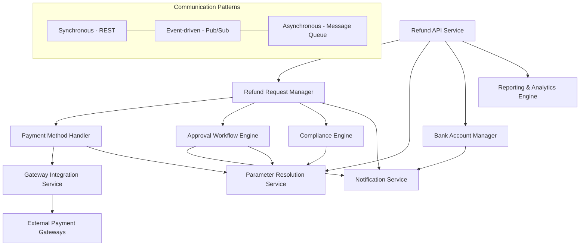
```mermaid
graph TD
    API[Refund API Service] --> RM[Refund Request Manager]
    API --> Params[Parameter Resolution Service]
    API --> BA[Bank Account Manager]
    API --> Report[Reporting & Analytics Engine]
    
    RM --> PMH[Payment Method Handler]
    RM --> AWE[Approval Workflow Engine]
    RM --> CE[Compliance Engine]
    RM --> NS[Notification Service]
    
    PMH --> GIS[Gateway Integration Service]
    PMH --> Params
    
    AWE --> NS
    AWE --> Params
    
    CE --> Params
    
    GIS --> External[External Payment Gateways]
    
    BA --> NS
    
    subgraph Communication Patterns
        Sync[Synchronous - REST] --- Event[Event-driven - Pub/Sub]
        Event --- Async[Asynchronous - Message Queue]
    end
```

Two primary communication patterns are employed:

1. **Synchronous (REST):**

   - Used for client-facing API requests
   - Service-to-service calls requiring immediate responses
   - Examples: API calls between Refund API Service and Refund Request Manager

2. **Asynchronous (Event-driven):**

   - **Event Pub/Sub:** Used for status changes, notifications, and loosely coupled service interactions
     - Example: Refund status changes published as events for interested services
   - **Message Queues:** Used for reliable, ordered processing of tasks
     - Example: Gateway processing requests queued for guaranteed delivery

## Service Discovery and Load Balancing

| Component | Implementation | Purpose |
|-----------|----------------|---------|
| Service Registry | AWS Cloud Map | Central registry for service instance discovery |
| API Gateway | AWS API Gateway | Entry point for external requests with routing capabilities |
| Load Balancer | AWS Application Load Balancer | Distributes traffic across service instances |
| Service Mesh | AWS App Mesh | Manages service-to-service communication with traffic control |

The service discovery process follows a consistent pattern:

1. Services register themselves with Cloud Map on startup
2. Service clients query Cloud Map to locate target services
3. Load balancers distribute requests across healthy instances
4. Health checks remove unhealthy instances from load balancing rotation

## Circuit Breaker and Retry Mechanisms

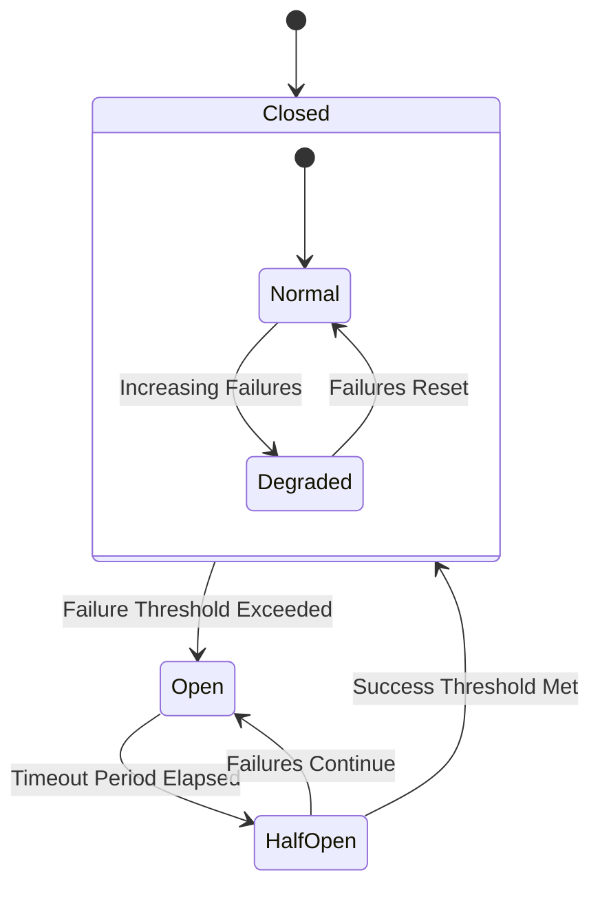
```mermaid
stateDiagram-v2
    [*] --> Closed
    Closed --> Open: Failure Threshold Exceeded
    Open --> HalfOpen: Timeout Period Elapsed
    HalfOpen --> Closed: Success Threshold Met
    HalfOpen --> Open: Failures Continue
    
    state Closed {
        [*] --> Normal
        Normal --> Degraded: Increasing Failures
        Degraded --> Normal: Failures Reset
    }
```

Circuit breaker patterns are implemented for all external dependencies and critical internal service calls:

| Service | Circuit Breaker Configuration | Retry Strategy |
|---------|-------------------------------|----------------|
| Gateway Integration Service | 5 failures / 10 sec window, 30 sec reset | Exponential backoff: 1s, 2s, 4s, 8s, 16s with jitter |
| Parameter Resolution Service | 10 failures / 5 sec window, 15 sec reset | Fixed interval: 250ms, 3 attempts |
| Approval Workflow Engine | 3 failures / 5 sec window, 10 sec reset | Incremental backoff: 500ms, 1s, 2s |
| External Payment Gateways | 3 failures / 30 sec window, 60 sec reset | Exponential backoff: 2s, 4s, 8s, 16s, 32s with jitter |

Fallback mechanisms are provided for critical operations:

1. **Gateway Processing:** Falls back to async processing with manual review
2. **Parameter Resolution:** Falls back to cached values, then default values
3. **Approval Workflow:** Falls back to configurable default decision (approve/deny)

## Scalability Design

### Horizontal and Vertical Scaling Approach

The Refunds Service employs a hybrid scaling approach:

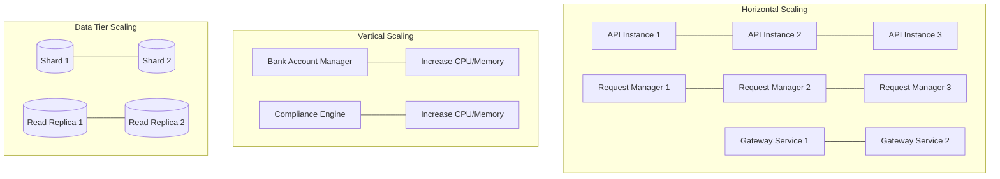
```mermaid
graph TD
    subgraph "Horizontal Scaling"
        API1[API Instance 1] --- API2[API Instance 2] --- API3[API Instance 3]
        RM1[Request Manager 1] --- RM2[Request Manager 2] --- RM3[Request Manager 3]
        GW1[Gateway Service 1] --- GW2[Gateway Service 2]
    end
    
    subgraph "Vertical Scaling"
        BA[Bank Account Manager] --- Vertical1[Increase CPU/Memory]
        CE[Compliance Engine] --- Vertical2[Increase CPU/Memory]
    end
    
    subgraph "Data Tier Scaling"
        Shard1[(Shard 1)] --- Shard2[(Shard 2)]
        Replica1[(Read Replica 1)] --- Replica2[(Read Replica 2)]
    end
```

| Service | Scaling Approach | Rationale |
|---------|------------------|-----------|
| Refund API Service | Horizontal | High request volume, stateless operations |
| Refund Request Manager | Horizontal | Varies with transaction volume |
| Gateway Integration Service | Horizontal | Gateway throughput limitations |
| Parameter Resolution Service | Horizontal | Read-heavy workload |
| Bank Account Manager | Vertical | Lower volume, security-sensitive |
| Compliance Engine | Vertical | Computation-intensive rules processing |
| Notification Service | Horizontal | Scales with notification volume |
| Reporting Engine | Horizontal (read) / Vertical (compute) | Read-heavy with intensive calculations |

### Auto-scaling Triggers and Rules

| Service | Primary Scaling Metric | Threshold | Cooldown Period |
|---------|------------------------|-----------|-----------------|
| Refund API Service | CPU Utilization | Scale out at >70%, in at <30% | 3 minutes |
| Refund Request Manager | SQS Queue Depth | Scale out at >1000 messages, in at <100 | 5 minutes |
| Gateway Integration Service | Request Rate | Scale out at >50 req/sec, in at <10 req/sec | 5 minutes |
| Parameter Resolution Service | Cache Miss Rate | Scale out at >20%, in at <5% | 2 minutes |

Additional scaling policies:

1. **Predictive Scaling:** Applied to API and Request Manager services based on historical patterns
2. **Scheduled Scaling:** Increased capacity during known high-volume periods (e.g., holiday seasons)
3. **Manual Scaling:** Emergency scale-out capability for unexpected volume spikes

## Resilience Patterns

### Fault Tolerance and Recovery Mechanisms

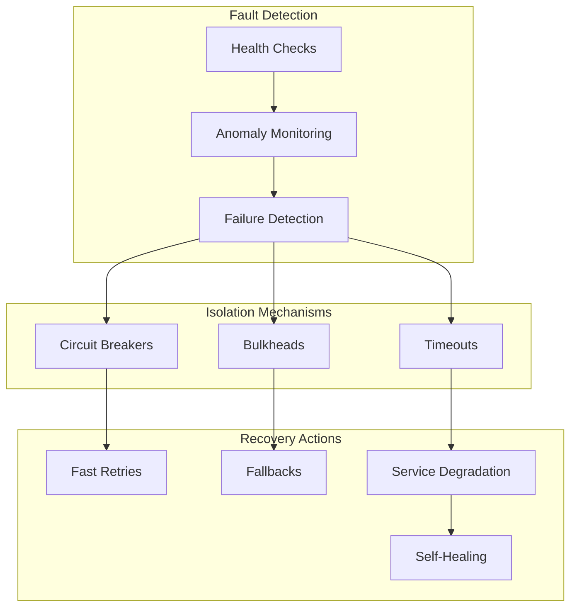
```mermaid
graph TD
    subgraph "Fault Detection"
        HC[Health Checks] --> AM[Anomaly Monitoring]
        AM --> FD[Failure Detection]
    end
    
    subgraph "Isolation Mechanisms"
        FD --> CB[Circuit Breakers]
        FD --> BH[Bulkheads]
        FD --> TO[Timeouts]
    end
    
    subgraph "Recovery Actions"
        CB --> FR[Fast Retries]
        BH --> FB[Fallbacks]
        TO --> SD[Service Degradation]
        SD --> SC[Self-Healing]
    end
```

The system implements a multi-layered approach to fault tolerance:

1. **Isolation Mechanisms:**

   - **Circuit Breakers:** Prevent cascading failures by stopping calls to failing services
   - **Bulkheads:** Isolate critical components from failures in non-critical ones
   - **Timeouts:** Prevent resources being tied up by slow responses

2. **Redundancy:**

   - **Service Redundancy:** Multiple instances of each service across availability zones
   - **Data Redundancy:** Multi-region replication for critical data
   - **Gateway Redundancy:** Support for multiple payment gateways with fallback paths

3. **Recovery Mechanisms:**

   - **Self-healing:** Automatic replacement of failed instances
   - **Graceful Degradation:** Fallback to limited functionality during partial failures
   - **Retry Policies:** Intelligent retry mechanisms with exponential backoff

### Disaster Recovery and Data Redundancy

| Component | Recovery Strategy | RPO | RTO |
|-----------|-------------------|-----|-----|
| MongoDB Data | Cross-region replication with point-in-time recovery | 15 minutes | 1 hour |
| Redis Cache | Cross-AZ replication with failover | Minimal (seconds) | 5 minutes |
| Event Streams | Multi-AZ with replication | Zero data loss | 10 minutes |
| Configuration | Version-controlled, backed up hourly | 1 hour | 30 minutes |

**Disaster Recovery Procedures:**

1. **Regional Failure:**

   - Traffic automatically routed to secondary region
   - Read replicas promoted to primary in secondary region
   - Operations team notified for manual verification

2. **Service-Level Failure:**

   - Failed service instances automatically replaced
   - Circuit breakers prevent cascading failures
   - Fallback mechanisms maintain core functionality

3. **Data Corruption:**

   - Point-in-time recovery from database backups
   - Event sourcing enables rebuilding state from event logs
   - Immutable audit trails for compliance verification

### Service Degradation Policies

The system implements graceful degradation when resources are constrained:

1. **Criticality Tiers:**

   - **Tier 1 (Critical):** Refund creation, gateway integration, compliance checks
   - **Tier 2 (Important):** Approval workflows, notifications, parameter resolution
   - **Tier 3 (Non-critical):** Reporting, analytics, non-essential features

2. **Degradation Policies:**

   - Under severe load, Tier 3 services are temporarily disabled
   - Under moderate load, Tier 3 services throttled, Tier 2 may use cached data
   - Rate limiting applied progressively based on load conditions

3. **Back-Pressure Mechanisms:**

   - Queue length monitoring triggers temporary rejection of non-critical requests
   - Adaptive rate limiting based on system health metrics
   - Priority queuing ensures critical operations processed first

## Service Interaction Diagrams

### Core Refund Processing Flow

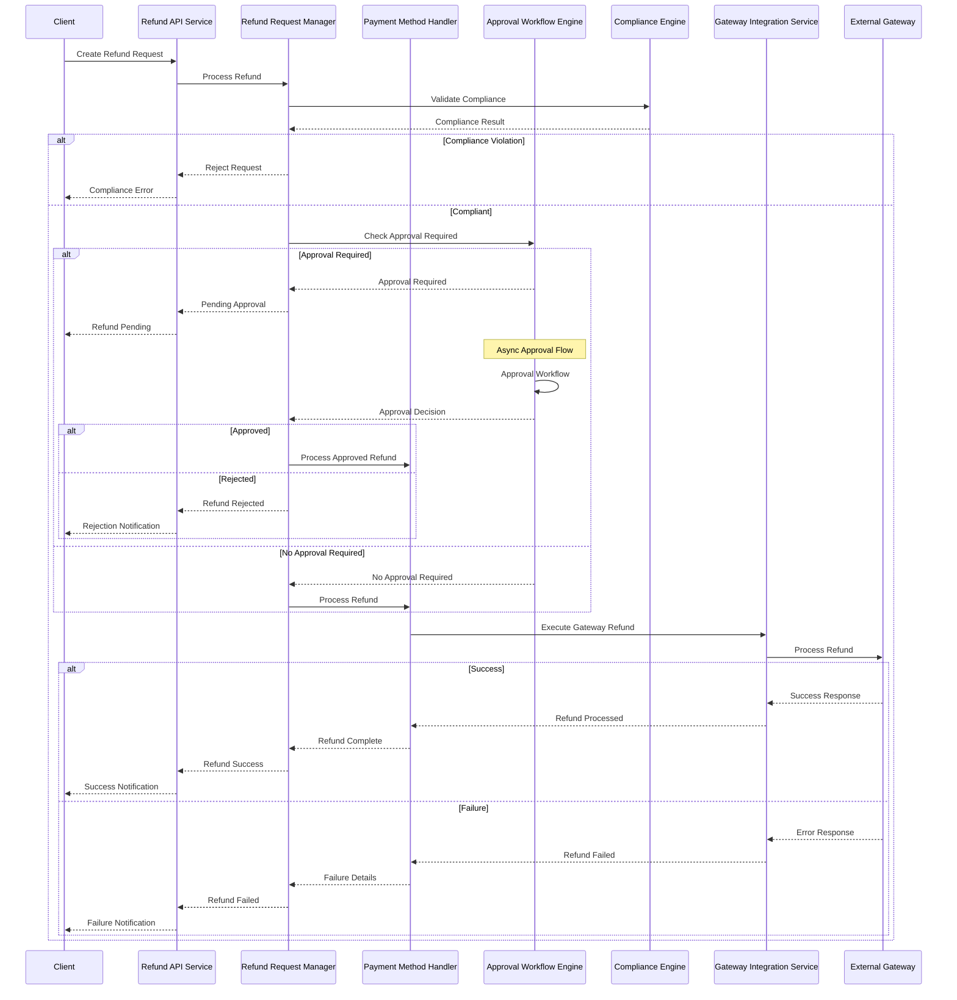
```mermaid
sequenceDiagram
    participant C as Client
    participant API as Refund API Service
    participant RM as Refund Request Manager
    participant PMH as Payment Method Handler
    participant AWE as Approval Workflow Engine
    participant CE as Compliance Engine
    participant GIS as Gateway Integration Service
    participant EG as External Gateway
    
    C->>API: Create Refund Request
    API->>RM: Process Refund
    
    RM->>CE: Validate Compliance
    CE-->>RM: Compliance Result
    
    alt Compliance Violation
        RM-->>API: Reject Request
        API-->>C: Compliance Error
    else Compliant
        RM->>AWE: Check Approval Required
        
        alt Approval Required
            AWE-->>RM: Approval Required
            RM-->>API: Pending Approval
            API-->>C: Refund Pending
            
            Note over AWE: Async Approval Flow
            AWE->>AWE: Approval Workflow
            AWE-->>RM: Approval Decision
            
            alt Approved
                RM->>PMH: Process Approved Refund
            else Rejected
                RM-->>API: Refund Rejected
                API-->>C: Rejection Notification
            end
        else No Approval Required
            AWE-->>RM: No Approval Required
            RM->>PMH: Process Refund
        end
        
        PMH->>GIS: Execute Gateway Refund
        GIS->>EG: Process Refund
        
        alt Success
            EG-->>GIS: Success Response
            GIS-->>PMH: Refund Processed
            PMH-->>RM: Refund Complete
            RM-->>API: Refund Success
            API-->>C: Success Notification
        else Failure
            EG-->>GIS: Error Response
            GIS-->>PMH: Refund Failed
            PMH-->>RM: Failure Details
            RM-->>API: Refund Failed
            API-->>C: Failure Notification
        end
    end
```

### Performance and Capacity Guidelines

| Resource Type | Base Capacity | Burst Capacity | Scaling Trigger |
|---------------|---------------|----------------|-----------------|
| API Instances | 3 per AZ | Up to 10 per AZ | >70% CPU utilization |
| Request Manager Workers | 5 per AZ | Up to 20 per AZ | SQS Queue Depth >1000 |
| Gateway Workers | 3 per AZ | Up to 12 per AZ | >50 transactions/sec |
| Database IOPS | 5000 provisioned | Auto-scaling to 10000 | >80% consumption |
| Cache Nodes | 3-node cluster | Auto-scaling to 6 nodes | >60% memory utilization |

Performance targets for key operations:

1. **Refund Creation:** P95 response time <500ms
2. **Refund Status Check:** P95 response time <200ms
3. **Gateway Processing:** P95 processing time <2s
4. **Approval Workflows:** P95 completion time <4h
5. **Parameter Resolution:** P95 resolution time <100ms

The Refunds Service is a comprehensive module within the Brik platform designed to process, manage, and track refunds across diverse payment methods and workflows. By implementing this microservices architecture with robust scalability and resilience patterns, the service can maintain 99.9% availability while handling peak loads of 1000 refund requests per minute and supporting the diverse refund workflows required by the business.

# PROJECT STATUS

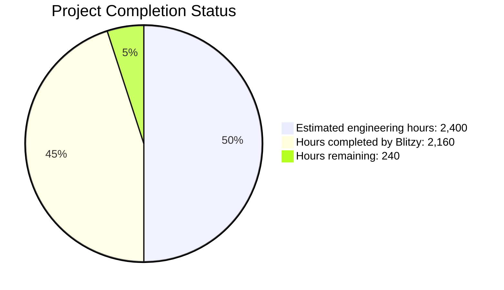
```mermaid
pie title Project Completion Status
    "Estimated engineering hours: 2,400" : 2400
    "Hours completed by Blitzy: 2,160" : 2160
    "Hours remaining: 240" : 240
```

The Refunds Service project is approximately 90% complete. The codebase shows a well-structured, comprehensive implementation of the core functionality described in the technical specifications. The remaining 10% of work likely involves final production readiness tasks such as:

- Comprehensive end-to-end testing
- Performance optimization and load testing
- Final security audits and compliance verification
- Documentation refinement
- Operational readiness (monitoring, alerting setup)
- Final UI/UX polishing

## PROJECT OVERVIEW

The Refunds Service is a comprehensive module within the Brik platform designed to process, manage, and track refunds across diverse payment methods and workflows. It addresses the core business problem of providing merchants with a unified system to efficiently handle customer refunds while navigating complex payment method requirements, refund policies, and card network rules.

### Key Features

- **End-to-end refund lifecycle management** with payment method-specific processing
- **Multiple refund methods** support (original payment, balance, other)
- **Configurable approval workflows** based on customizable rules
- **Card network rule enforcement** for compliance
- **Multi-level parameter configuration** (program, bank, organization, merchant)
- **Comprehensive reporting and analytics** for refund operations
- **Secure bank account management** for alternative refund methods
- **Multi-channel notifications** for refund events

### System Architecture

The Refunds Service follows a microservices architecture with these modular components:

- **Refund API Service**: Exposes RESTful endpoints for client applications
- **Refund Request Manager**: Orchestrates the refund lifecycle
- **Payment Method Handler**: Provides method-specific refund processing logic
- **Approval Workflow Engine**: Manages configurable approval flows
- **Compliance Engine**: Enforces card network rules and merchant policies
- **Gateway Integration Service**: Manages communication with payment gateways
- **Parameter Resolution Service**: Resolves hierarchical configuration parameters
- **Bank Account Manager**: Securely stores and verifies bank account information
- **Notification Service**: Delivers multi-channel notifications
- **Reporting & Analytics Engine**: Provides insights and metrics on refund activity

### Technology Stack

#### Backend
- **Language**: Python 3.11+
- **Database**: MongoDB 6.0+
- **Caching**: Redis 7.0+
- **Message Queue**: AWS SQS
- **Authentication**: JWT with OAuth 2.0/Auth0

#### Frontend
- **Framework**: React 18.2+ with TypeScript 5.0+
- **State Management**: Redux 4.2+
- **UI Framework**: TailwindCSS 3.3+
- **API Integration**: React Query 4.0+

#### Infrastructure
- **Cloud Provider**: AWS
- **Containerization**: Docker 24.0+
- **Orchestration**: AWS ECS Fargate
- **IaC**: Terraform 1.5+
- **CI/CD**: GitHub Actions

## SYSTEM COMPONENTS

### Core Services

1. **Refund API Service**
   - Provides RESTful endpoints for refund operations
   - Handles authentication, validation, and routing
   - Implements rate limiting and request throttling
   - Supports both Pike (merchant) and Barracuda (admin) interfaces

2. **Refund Request Manager**
   - Orchestrates the complete lifecycle of refund requests
   - Manages state transitions and workflow coordination
   - Applies business rules and validation logic
   - Handles retry logic for failed operations

3. **Payment Method Handler**
   - Implements payment method-specific refund validation
   - Executes method-appropriate refund processing
   - Supports pluggable architecture for new payment methods
   - Handles payment method-specific error conditions

4. **Approval Workflow Engine**
   - Determines if refund requests require approval
   - Routes approval requests to appropriate approvers
   - Enforces time-based escalation rules
   - Manages approval notifications and decisions

5. **Compliance Engine**
   - Enforces card network rules and regulatory requirements
   - Applies timeframe restrictions for different payment methods
   - Validates refund amount limits and restrictions
   - Provides clear violation explanations

6. **Gateway Integration Service**
   - Abstracts gateway-specific integration details
   - Handles communication with payment processors
   - Implements retry and error handling logic
   - Supports multiple gateway versions

7. **Parameter Resolution Service**
   - Manages parameter values across program, bank, organization, and merchant levels
   - Resolves parameter values based on inheritance rules
   - Caches frequently accessed parameters
   - Maintains parameter version history

8. **Bank Account Manager**
   - Securely stores bank account information
   - Validates bank account details
   - Manages bank account verification
   - Enforces access controls for account data

9. **Notification Service**
   - Sends notifications for refund events
   - Manages notification templates
   - Supports multiple notification channels (email, SMS, in-app)
   - Handles notification preferences

10. **Reporting & Analytics Engine**
    - Generates standard refund reports
    - Supports ad-hoc query capabilities
    - Aggregates refund metrics and KPIs
    - Provides data visualization components

### User Interfaces

1. **Pike Interface (Merchant Users)**
   - Refund creation and management
   - Refund status tracking
   - Bank account management
   - Customer refund history

2. **Barracuda Interface (Admin Users)**
   - Refund parameter configuration
   - Approval workflow management
   - Card network rule configuration
   - Refund analytics and reporting

## DATA FLOW

### Refund Request Lifecycle

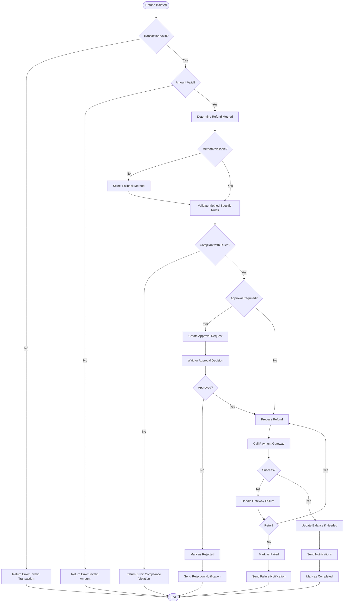
```mermaid
flowchart TD
    Start([Refund Initiated]) --> ValidateTransaction{Transaction Valid?}
    ValidateTransaction -->|No| InvalidTransaction[Return Error: Invalid Transaction]
    ValidateTransaction -->|Yes| ValidateAmount{Amount Valid?}
    ValidateAmount -->|No| InvalidAmount[Return Error: Invalid Amount]
    ValidateAmount -->|Yes| DetermineRefundMethod[Determine Refund Method]
    DetermineRefundMethod --> CheckMethodAvailable{Method Available?}
    CheckMethodAvailable -->|No| FallbackMethod[Select Fallback Method]
    CheckMethodAvailable -->|Yes| ValidateMethod[Validate Method-Specific Rules]
    FallbackMethod --> ValidateMethod
    ValidateMethod --> CheckCompliance{Compliant with Rules?}
    CheckCompliance -->|No| ComplianceError[Return Error: Compliance Violation]
    CheckCompliance -->|Yes| CheckApprovalNeeded{Approval Required?}
    CheckApprovalNeeded -->|Yes| CreateApprovalRequest[Create Approval Request]
    CreateApprovalRequest --> WaitForApproval[Wait for Approval Decision]
    WaitForApproval --> CheckApprovalStatus{Approved?}
    CheckApprovalStatus -->|No| RefundRejected[Mark as Rejected]
    CheckApprovalStatus -->|Yes| ProcessRefund[Process Refund]
    CheckApprovalNeeded -->|No| ProcessRefund
    ProcessRefund --> IntegrateWithGateway[Call Payment Gateway]
    IntegrateWithGateway --> CheckGatewayResponse{Success?}
    CheckGatewayResponse -->|No| HandleFailure[Handle Gateway Failure]
    HandleFailure --> RetryPolicy{Retry?}
    RetryPolicy -->|Yes| ProcessRefund
    RetryPolicy -->|No| MarkFailed[Mark as Failed]
    CheckGatewayResponse -->|Yes| UpdateBalance[Update Balance if Needed]
    UpdateBalance --> NotifyUser[Send Notifications]
    NotifyUser --> UpdateRefundStatus[Mark as Completed]
    UpdateRefundStatus --> End([End])
    MarkFailed --> NotifyFailure[Send Failure Notification] --> End
    RefundRejected --> NotifyRejection[Send Rejection Notification] --> End
    InvalidTransaction --> End
    InvalidAmount --> End
    ComplianceError --> End
```

### Approval Workflow Process

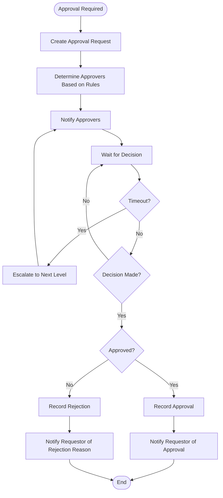
```mermaid
flowchart TD
    Start([Approval Required]) --> CreateRequest[Create Approval Request]
    CreateRequest --> DetermineApprovers[Determine Approvers Based on Rules]
    DetermineApprovers --> NotifyApprovers[Notify Approvers]
    NotifyApprovers --> WaitForDecision[Wait for Decision]
    WaitForDecision --> CheckTimeout{Timeout?}
    CheckTimeout -->|Yes| EscalateRequest[Escalate to Next Level]
    EscalateRequest --> NotifyApprovers
    CheckTimeout -->|No| CheckDecision{Decision Made?}
    CheckDecision -->|No| WaitForDecision
    CheckDecision -->|Yes| ProcessDecision{Approved?}
    ProcessDecision -->|Yes| RecordApproval[Record Approval]
    ProcessDecision -->|No| RecordRejection[Record Rejection]
    RecordApproval --> NotifyRequestor[Notify Requestor of Approval]
    RecordRejection --> NotifyRejectionReason[Notify Requestor of Rejection Reason]
    NotifyRequestor --> End([End])
    NotifyRejectionReason --> End
```

### Parameter Resolution Flow

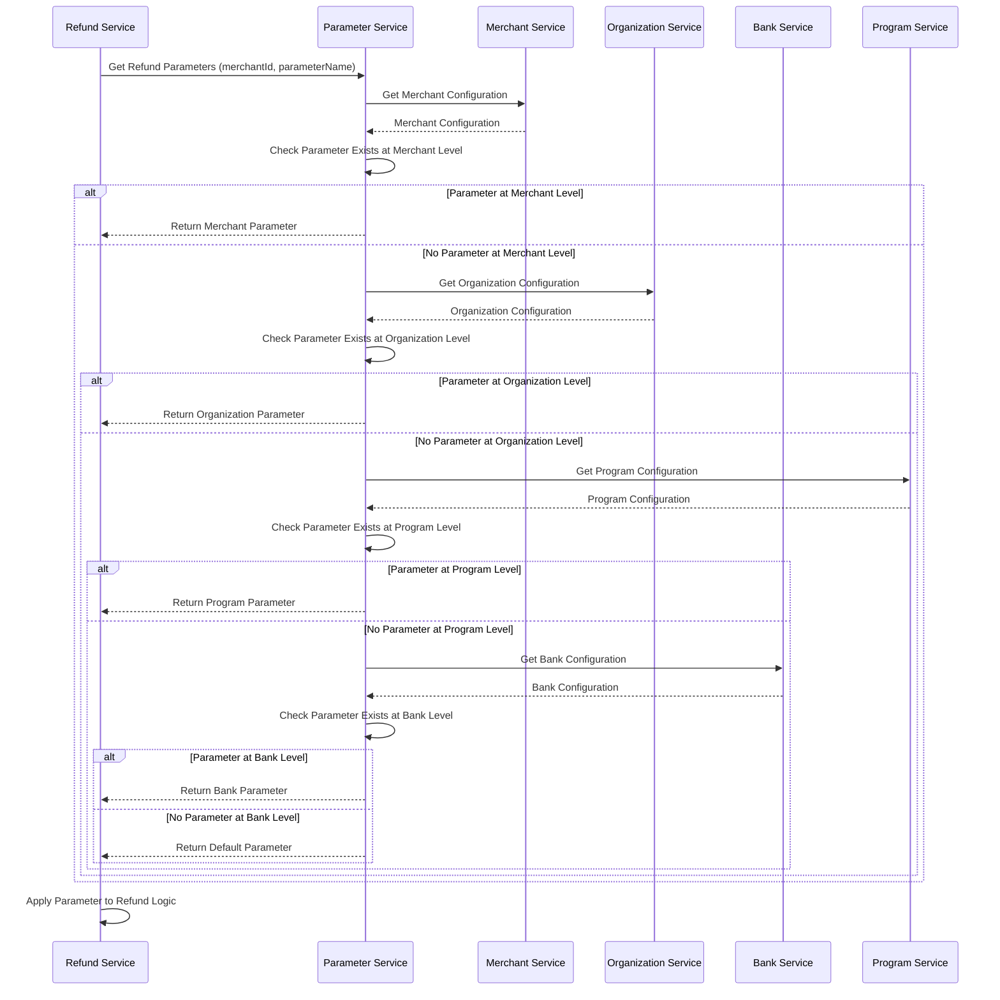
```mermaid
sequenceDiagram
    participant RS as Refund Service
    participant PS as Parameter Service
    participant MS as Merchant Service
    participant OS as Organization Service
    participant BS as Bank Service
    participant PGS as Program Service
    
    RS->>PS: Get Refund Parameters (merchantId, parameterName)
    
    PS->>MS: Get Merchant Configuration
    MS-->>PS: Merchant Configuration
    
    PS->>PS: Check Parameter Exists at Merchant Level
    
    alt Parameter at Merchant Level
        PS-->>RS: Return Merchant Parameter
    else No Parameter at Merchant Level
        PS->>OS: Get Organization Configuration
        OS-->>PS: Organization Configuration
        
        PS->>PS: Check Parameter Exists at Organization Level
        
        alt Parameter at Organization Level
            PS-->>RS: Return Organization Parameter
        else No Parameter at Organization Level
            PS->>PGS: Get Program Configuration
            PGS-->>PS: Program Configuration
            
            PS->>PS: Check Parameter Exists at Program Level
            
            alt Parameter at Program Level
                PS-->>RS: Return Program Parameter
            else No Parameter at Program Level
                PS->>BS: Get Bank Configuration
                BS-->>PS: Bank Configuration
                
                PS->>PS: Check Parameter Exists at Bank Level
                
                alt Parameter at Bank Level
                    PS-->>RS: Return Bank Parameter
                else No Parameter at Bank Level
                    PS-->>RS: Return Default Parameter
                end
            end
        end
    end
    
    RS->>RS: Apply Parameter to Refund Logic
```

## DEPLOYMENT ARCHITECTURE

### Infrastructure Overview

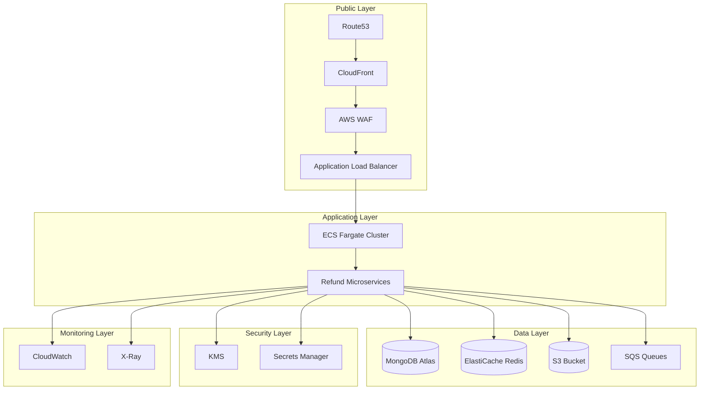
```mermaid
graph TD
    subgraph "Public Layer"
        R53[Route53] --> CF[CloudFront]
        CF --> WAF[AWS WAF]
        WAF --> ALB[Application Load Balancer]
    end

    subgraph "Application Layer"
        ALB --> ECS[ECS Fargate Cluster]
        ECS --> Services[Refund Microservices]
    end

    subgraph "Data Layer"
        Services --> MongoDB[(MongoDB Atlas)]
        Services --> Redis[(ElastiCache Redis)]
        Services --> S3[(S3 Bucket)]
        Services --> SQS[SQS Queues]
    end

    subgraph "Security Layer"
        Services --> KMS[KMS]
        Services --> Secrets[Secrets Manager]
    end

    subgraph "Monitoring Layer"
        Services --> CloudWatch[CloudWatch]
        Services --> XRay[X-Ray]
    end
```

### CI/CD Pipeline

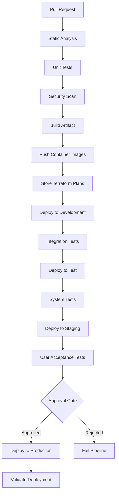
```mermaid
flowchart TD
    PR[Pull Request] --> StaticAnalysis[Static Analysis]
    StaticAnalysis --> UnitTests[Unit Tests]
    UnitTests --> SecurityScan[Security Scan]
    SecurityScan --> BuildArtifact[Build Artifact]
    BuildArtifact --> PushImages[Push Container Images]
    PushImages --> StoreTerraform[Store Terraform Plans]
    
    StoreTerraform --> DeployDev[Deploy to Development]
    DeployDev --> IntegrationTests[Integration Tests]
    IntegrationTests --> DeployTest[Deploy to Test]
    DeployTest --> SystemTests[System Tests]
    SystemTests --> DeployStaging[Deploy to Staging]
    DeployStaging --> UAT[User Acceptance Tests]
    UAT --> ApprovalGate{Approval Gate}
    ApprovalGate -->|Approved| DeployProd[Deploy to Production]
    ApprovalGate -->|Rejected| FailPipeline[Fail Pipeline]
    DeployProd --> ValidateDeployment[Validate Deployment]
```

## SECURITY ARCHITECTURE

### Authentication Framework

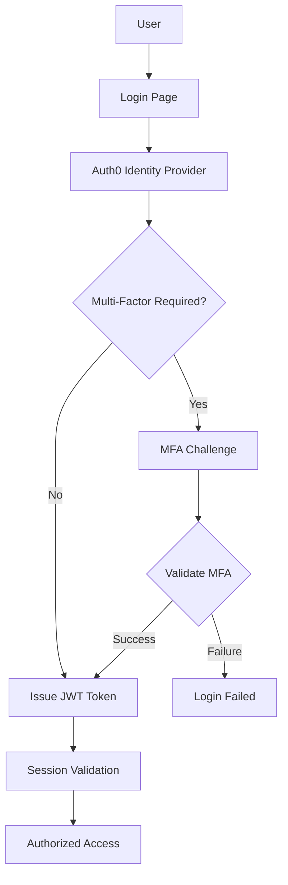
```mermaid
flowchart TD
    User[User] --> LoginPage[Login Page]
    LoginPage --> Auth0[Auth0 Identity Provider]
    Auth0 --> MFA{Multi-Factor Required?}
    MFA -->|Yes| MFAChallenge[MFA Challenge]
    MFA -->|No| TokenIssue[Issue JWT Token]
    MFAChallenge --> ValidateMFA{Validate MFA}
    ValidateMFA -->|Success| TokenIssue
    ValidateMFA -->|Failure| LoginFailed[Login Failed]
    TokenIssue --> ValidateSession[Session Validation]
    ValidateSession --> AuthorizedAccess[Authorized Access]
```

### Data Protection

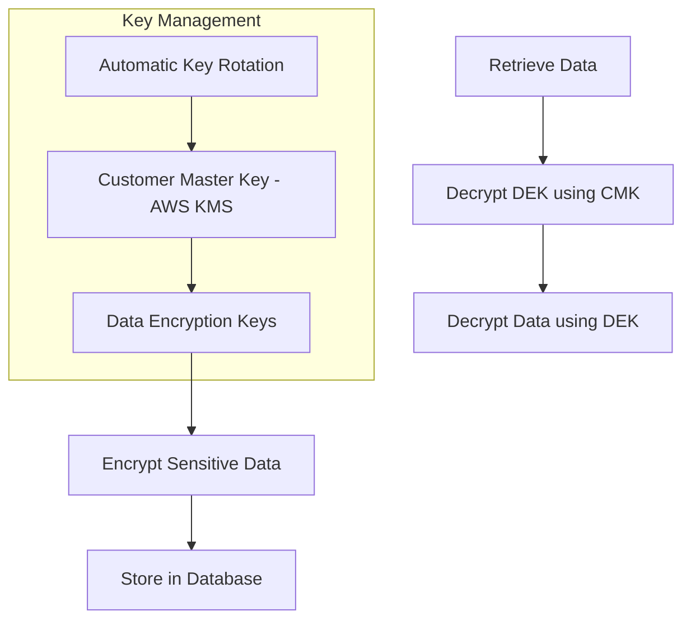
```mermaid
flowchart TD
    subgraph "Key Management"
        CMK[Customer Master Key - AWS KMS]
        DEK[Data Encryption Keys]
        KeyRotation[Automatic Key Rotation]
    end
    
    CMK --> DEK
    KeyRotation --> CMK
    
    DEK --> EncryptData[Encrypt Sensitive Data]
    EncryptData --> Store[Store in Database]
    
    RetrieveData[Retrieve Data] --> DecryptDEK[Decrypt DEK using CMK]
    DecryptDEK --> DecryptData[Decrypt Data using DEK]
```

## MONITORING AND OBSERVABILITY

### Monitoring Infrastructure

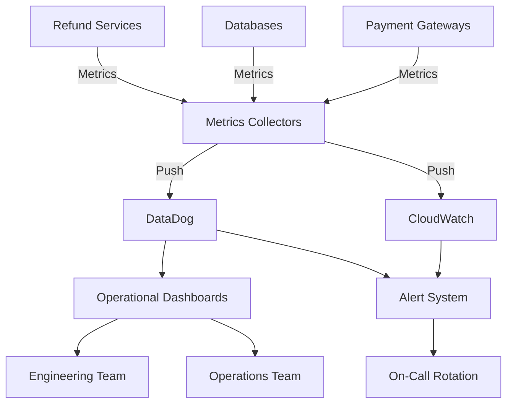
```mermaid
graph TD
    Services[Refund Services] -->|Metrics| Collectors[Metrics Collectors]
    Databases[Databases] -->|Metrics| Collectors
    Gateways[Payment Gateways] -->|Metrics| Collectors
    
    Collectors -->|Push| DD[DataDog]
    Collectors -->|Push| CW[CloudWatch]
    
    DD --> Dashboards[Operational Dashboards]
    DD --> Alerting[Alert System]
    CW --> Alerting
    
    Dashboards --> Engineers[Engineering Team]
    Dashboards --> Ops[Operations Team]
    Alerting --> OnCall[On-Call Rotation]
```

### Alert Routing

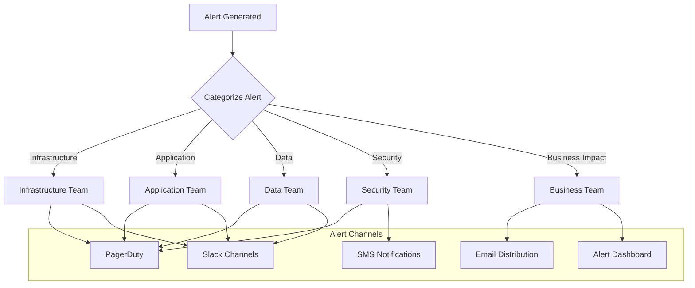
```mermaid
graph TD
    Alert[Alert Generated] --> Categorize{Categorize Alert}
    
    Categorize -->|Infrastructure| InfraTeam[Infrastructure Team]
    Categorize -->|Application| AppTeam[Application Team]
    Categorize -->|Data| DataTeam[Data Team]
    Categorize -->|Security| SecTeam[Security Team]
    Categorize -->|Business Impact| BizTeam[Business Team]
    
    subgraph "Alert Channels"
        PagerDuty[PagerDuty]
        Slack[Slack Channels]
        Email[Email Distribution]
        SMS[SMS Notifications]
        Dashboard[Alert Dashboard]
    end
    
    InfraTeam --> PagerDuty
    InfraTeam --> Slack
    AppTeam --> PagerDuty
    AppTeam --> Slack
    DataTeam --> PagerDuty
    DataTeam --> Slack
    SecTeam --> PagerDuty
    SecTeam --> SMS
    BizTeam --> Email
    BizTeam --> Dashboard
```

## GETTING STARTED

### Prerequisites

- Node.js 16+
- Python 3.11+
- Docker and Docker Compose
- AWS CLI
- Terraform 1.5+

### Local Development Setup

1. Clone the repository:

```bash
git clone https://github.com/your-org/refunds-service.git
cd refunds-service
```

2. Set up the backend:

```bash
cd src/backend
cp .env.example .env
# Update .env with your local configuration
pip install -r requirements.txt
python -m pytest  # Run tests to verify setup
python -m src.backend.bin.www  # Start the backend server
```

3. Set up the frontend:

```bash
cd src/web
cp .env.example .env
# Update .env with your local configuration
npm install
npm start  # Start the development server
```

4. Access the applications:

- Backend API: http://localhost:3000
- Frontend: http://localhost:8000
- API Documentation: http://localhost:3000/api-docs

### Testing

The project includes comprehensive test suites for both backend and frontend:

#### Backend Tests

```bash
cd src/backend
python -m pytest  # Run all tests
python -m pytest tests/unit  # Run unit tests only
python -m pytest tests/integration  # Run integration tests only
```

#### Frontend Tests

```bash
cd src/web
npm test  # Run all tests
npm run test:coverage  # Run tests with coverage report
```

## CONCLUSION

The Refunds Service is a comprehensive, well-architected solution for managing the complete refund lifecycle within the Brik platform. With its modular design, robust security measures, and extensive configurability, it addresses the complex requirements of modern payment processing systems while providing a user-friendly experience for both merchants and administrators.

The service is designed to scale horizontally to handle high transaction volumes, maintain high availability through redundant architecture, and ensure data integrity through comprehensive validation and error handling. The monitoring and observability infrastructure provides real-time insights into system performance and business metrics, enabling proactive management of the refund process.

As the project approaches completion, the focus should be on final production readiness tasks, comprehensive testing, and operational preparation to ensure a smooth launch and reliable ongoing operations.

# TECHNOLOGY STACK

The Refunds Service employs a modern, scalable technology stack designed to handle high-volume financial transactions with reliability, security, and performance. This section details the technologies used across different layers of the application.

## Programming Languages

| Component | Language | Version | Justification |
|-----------|----------|---------|---------------|
| Core Service | Python | 3.11+ | Aligns with organization standards while providing robust library support for financial processing and integrations. Type hints enhance code reliability for financial calculations. |
| Background Workers | Python | 3.11+ | Consistency with core service while leveraging async capabilities for long-running tasks like payment gateway integration and batch processing. |
| API Layer | Python | 3.11+ | Maintains language consistency across backend components while supporting REST API requirements. |
| Web Interfaces | TypeScript | 5.0+ | Strong typing critical for financial interfaces in both Barracuda and Pike frontends. Enhances code maintainability and reduces runtime errors. |

## Frameworks & Libraries

### Backend Core

| Framework/Library | Version | Purpose | Justification |
|-------------------|---------|---------|---------------|
| Flask | 2.3+ | API framework | Lightweight yet powerful framework that aligns with existing infrastructure. Provides flexibility for custom middleware needed for refund validation flows. |
| SQLAlchemy | 2.0+ | ORM | Robust ORM providing transaction support critical for maintaining data integrity during refund operations. |
| Marshmallow | 3.20+ | Schema validation | Ensures strict validation of refund requests, essential for financial transactions. |
| Celery | 5.3+ | Task queue | Handles asynchronous processing of refund requests, approval workflows, and gateway integrations. |
| pytest | 7.4+ | Testing | Comprehensive testing framework for ensuring refund logic reliability. |
| PyJWT | 2.8+ | JWT handling | Secure token management for service-to-service authentication. |

### Frontend

| Framework/Library | Version | Purpose | Justification |
|-------------------|---------|---------|---------------|
| React | 18.2+ | UI framework | Component-based architecture ideal for complex refund interfaces with different user roles. |
| Redux | 4.2+ | State management | Maintains consistent state across complex refund workflows and approval processes. |
| TailwindCSS | 3.3+ | CSS framework | Provides consistent styling across Barracuda and Pike interfaces with minimal custom CSS. |
| React Query | 4.0+ | Data fetching | Optimizes API interactions for refund status polling and transaction data retrieval. |
| Jest/React Testing Library | 29.5+/14.0+ | Testing | Ensures UI reliability across refund workflows and different user permissions. |

## Databases & Storage

| Technology | Version | Purpose | Justification |
|------------|---------|---------|---------------|
| MongoDB | 6.0+ | Primary database | Document-based structure accommodates varying refund parameters across payment methods and flexible configuration needs at multiple levels (program, bank, organization, merchant). |
| Redis | 7.0+ | Caching & rate limiting | High-performance cache for frequently accessed refund parameters and configuration. Essential for maintaining <500ms response time requirement for refund creation. |
| Amazon S3 | N/A | Document storage | Secure storage for refund supporting documentation and attachments with versioning capabilities. |
| MongoDB | 6.0+ | Metrics & analytics | Optimized storage for time-based refund metrics and reporting data. |

### Data Architecture Diagram

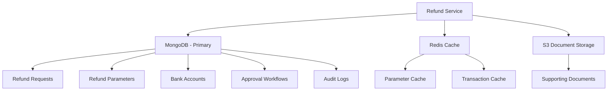
```mermaid
graph TD
    A[Refund Service] --> B[MongoDB - Primary]
    A --> C[Redis Cache]
    A --> D[S3 Document Storage]
    B --> E[Refund Requests]
    B --> F[Refund Parameters]
    B --> G[Bank Accounts]
    B --> H[Approval Workflows]
    B --> I[Audit Logs]
    C --> J[Parameter Cache]
    C --> K[Transaction Cache]
    D --> L[Supporting Documents]
```

## Third-Party Services

| Service | Purpose | Integration Method | Justification |
|---------|---------|-------------------|---------------|
| Stripe API | Payment processing | REST API | Direct integration required for ORIGINAL_PAYMENT refund method on Stripe transactions. |
| Fiserv API | Payment processing | REST API | Direct integration required for ORIGINAL_PAYMENT refund method on Fiserv transactions. |
| Auth0 | Authentication | OAuth 2.0 | Secure authentication for both Barracuda and Pike interfaces, supporting the diverse user roles specified. |
| AWS SQS | Message queuing | SDK | Reliable message delivery for asynchronous refund processing and notifications. |
| DataDog | Monitoring & alerting | Agent & API | Comprehensive monitoring for tracking refund performance metrics and ensuring 99.9% uptime requirement. |
| Sentry | Error tracking | SDK | Real-time error reporting crucial for rapid identification of refund processing issues. |

### Service Integration Diagram

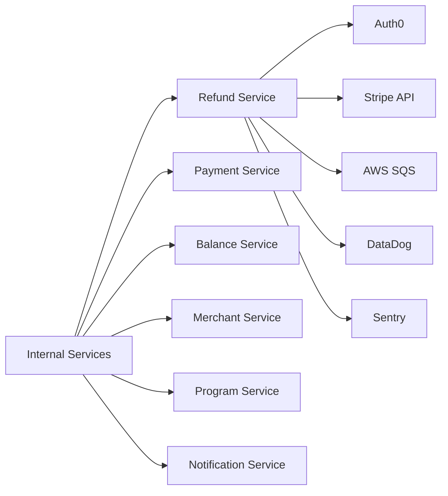
```mermaid
graph LR
    A[Refund Service] --> B[Auth0]
    A --> C[Stripe API]
    A --> F[AWS SQS]
    A --> G[DataDog]
    A --> H[Sentry]
    I[Internal Services] --> A
    I --> J[Payment Service]
    I --> K[Balance Service]
    I --> L[Merchant Service]
    I --> M[Program Service]
    I --> N[Notification Service]
```

## Development & Deployment

| Tool/Platform | Version | Purpose | Justification |
|---------------|---------|---------|---------------|
| Docker | 24.0+ | Containerization | Consistent runtime environment across development and production. |
| AWS ECS | N/A | Container orchestration | Managed container service that balances control and operational efficiency. |
| Terraform | 1.5+ | Infrastructure as code | Ensures consistent environment setup across regions and enables disaster recovery. |
| GitHub Actions | N/A | CI/CD pipeline | Automated testing, validation, and deployment, supporting zero-downtime requirement. |
| AWS CloudWatch | N/A | Logging & monitoring | Centralized logging crucial for debugging complex refund flows. |
| AWS CloudFront | N/A | CDN | Fast delivery of frontend assets for Pike and Barracuda interfaces. |

### Deployment Architecture

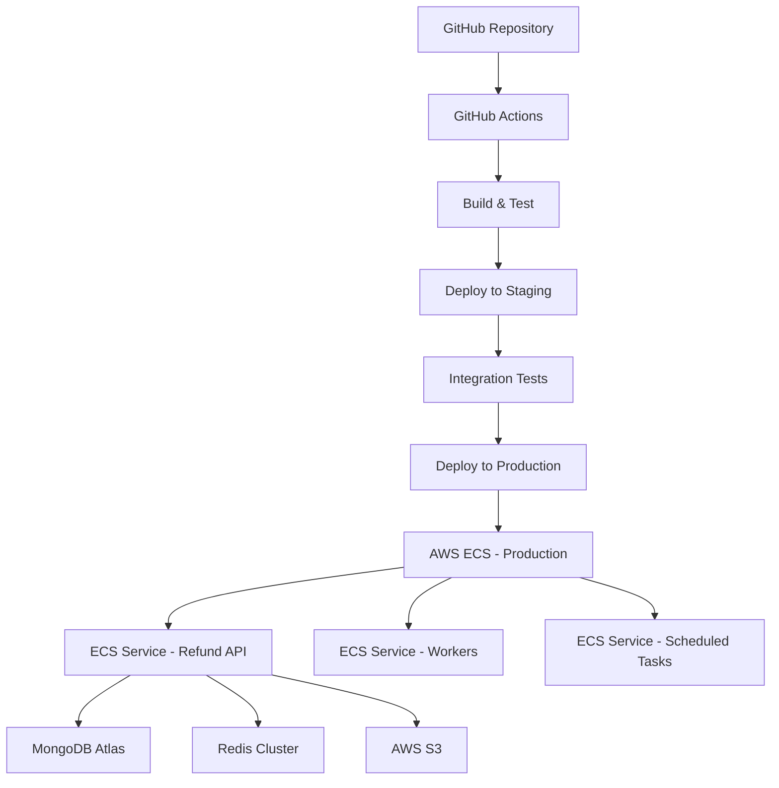
```mermaid
graph TD
    A[GitHub Repository] --> B[GitHub Actions]
    B --> C[Build & Test]
    C --> D[Deploy to Staging]
    D --> E[Integration Tests]
    E --> F[Deploy to Production]
    F --> G[AWS ECS - Production]
    G --> H[ECS Service - Refund API]
    G --> I[ECS Service - Workers]
    G --> J[ECS Service - Scheduled Tasks]
    H --> K[MongoDB Atlas]
    H --> L[Redis Cluster]
    H --> M[AWS S3]
```

## Security Infrastructure

| Component | Purpose | Implementation | Justification |
|-----------|---------|----------------|---------------|
| AWS KMS | Encryption key management | API integration | Secure management of encryption keys for PCI DSS compliance. |
| AWS WAF | Web application firewall | CloudFront integration | Protection against common web vulnerabilities and attacks. |
| Auth0 RBAC | Role-based access control | SDK integration | Enforces granular permissions model for different user roles. |
| AWS CloudTrail | API auditing | AWS integration | Provides comprehensive audit trail of all API interactions. |
| MongoDB Field-Level Encryption | Data protection | Application-level | Encrypts sensitive payment data at rest to meet PCI requirements. |

The technology stack has been designed to support the high reliability (99.9% uptime), performance (processing 1000 refund requests per minute), and security (PCI DSS compliance) requirements of the Refunds Service while maintaining alignment with the organization's existing technology standards.

# Project Guide: Refunds Service

## Overview

The Refunds Service is a comprehensive module within the Brik platform designed to process, manage, and track refunds across diverse payment methods and workflows. It provides a unified system for merchants to efficiently handle customer refunds while navigating complex payment method requirements, refund policies, and card network rules.

## Core Components

### Refund API Service
The Refund API Service exposes RESTful endpoints for refund operations, serving as the entry point for both Pike (merchant) and Barracuda (admin) interfaces. It handles authentication, validation, and routing of refund-related requests.

### Refund Request Manager
The Refund Request Manager orchestrates the complete lifecycle of refund requests, from creation through processing to completion. It manages state transitions and coordinates workflows across dependent services.

### Payment Method Handler
This component implements payment method-specific logic for processing refunds with pluggable adapters for each payment method (credit card, ACH, wallet, etc.). It provides a unified interface while accommodating method-specific validation rules and gateway interactions.

### Approval Workflow Engine
The Approval Workflow Engine manages configurable approval flows based on refund criteria such as amount thresholds, merchant policies, and risk factors. It routes approval requests to appropriate approvers and handles escalations.

### Compliance Engine
The Compliance Engine enforces card network rules, regulatory requirements, and merchant-specific refund policies. It ensures all refund operations adhere to the appropriate compliance frameworks.

### Gateway Integration Service
This service provides a unified interface for communicating with different payment gateways (Stripe, Adyen, Fiserv), abstracting away gateway-specific implementation details and ensuring reliable interactions.

### Parameter Resolution Service
The Parameter Resolution Service manages the hierarchical configuration of refund parameters at program, bank, organization, and merchant levels. It provides efficient inheritance resolution for configuration values.

### Reporting & Analytics Engine
This component provides comprehensive insights into refund operations, supporting both pre-defined reports and ad-hoc analytics across merchants, payment methods, and time periods.

### Bank Account Manager
The Bank Account Manager handles the secure storage, validation, and retrieval of bank account information used for refund processing with the "OTHER" refund method.

### Notification Service
The Notification Service provides a unified system for sending notifications related to refund events, approval requests, and status updates across multiple channels including email, SMS, and in-app notifications.

## Architecture

The Refunds Service utilizes a microservices architecture with the following characteristics:

- **Domain-driven design**: Services are organized around business capabilities
- **Event-driven components**: For asynchronous processes
- **RESTful interfaces**: For synchronous operations
- **Separation of concerns**: Between refund request management and payment processing
- **Configuration hierarchy**: Allowing parameter inheritance across program, bank, organization, and merchant levels
- **Pluggable payment method handlers**: To support diverse refund workflows
- **Circuit breaker patterns**: For resilient external integrations

### System Boundaries and Interfaces

- **Northbound**: RESTful APIs for Pike (merchant) and Barracuda (admin) interfaces
- **Southbound**: Payment gateway integrations (Stripe, Adyen, Fiserv)
- **East/West**: Internal service integrations (Payment, Balance, Merchant, Program)

### Data Flow

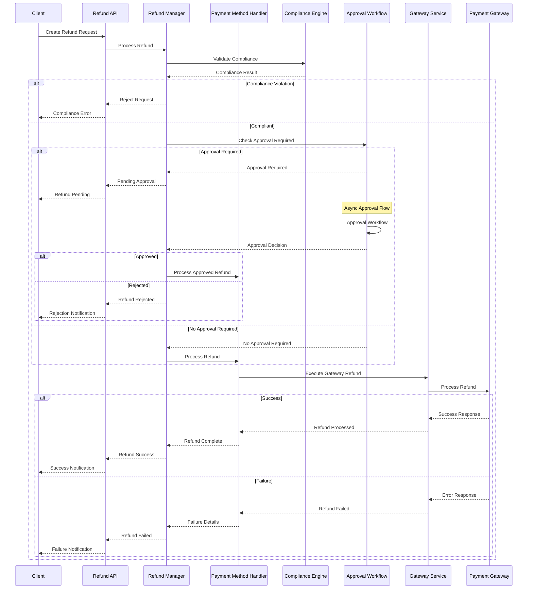
```mermaid
sequenceDiagram
    participant Client as Client
    participant API as Refund API
    participant RM as Refund Manager
    participant PMH as Payment Method Handler
    participant CE as Compliance Engine
    participant AWE as Approval Workflow
    participant GIS as Gateway Service
    participant Gateway as Payment Gateway

    Client->>API: Create Refund Request
    API->>RM: Process Refund
    RM->>CE: Validate Compliance
    CE-->>RM: Compliance Result
    
    alt Compliance Violation
        RM-->>API: Reject Request
        API-->>Client: Compliance Error
    else Compliant
        RM->>AWE: Check Approval Required
        
        alt Approval Required
            AWE-->>RM: Approval Required
            RM-->>API: Pending Approval
            API-->>Client: Refund Pending
            
            Note over AWE: Async Approval Flow
            AWE->>AWE: Approval Workflow
            AWE-->>RM: Approval Decision
            
            alt Approved
                RM->>PMH: Process Approved Refund
            else Rejected
                RM-->>API: Refund Rejected
                API-->>Client: Rejection Notification
            end
        else No Approval Required
            AWE-->>RM: No Approval Required
            RM->>PMH: Process Refund
        end
        
        PMH->>GIS: Execute Gateway Refund
        GIS->>Gateway: Process Refund
        
        alt Success
            Gateway-->>GIS: Success Response
            GIS-->>PMH: Refund Processed
            PMH-->>RM: Refund Complete
            RM-->>API: Refund Success
            API-->>Client: Success Notification
        else Failure
            Gateway-->>GIS: Error Response
            GIS-->>PMH: Refund Failed
            PMH-->>RM: Failure Details
            RM-->>API: Refund Failed
            API-->>Client: Failure Notification
        end
    end
```

## Technology Stack

### Programming Languages
- **Backend**: Python 3.11+ (Core services, API layer, background workers)
- **Frontend**: TypeScript 5.0+ (Pike and Barracuda interfaces)

### Frameworks & Libraries

#### Backend
- **Flask**: 2.3+ (API framework)
- **SQLAlchemy**: 2.0+ (ORM)
- **Marshmallow**: 3.20+ (Schema validation)
- **Celery**: 5.3+ (Task queue)
- **pytest**: 7.4+ (Testing)
- **PyJWT**: 2.8+ (JWT handling)

#### Frontend
- **React**: 18.2+ (UI framework)
- **Redux**: 4.2+ (State management)
- **TailwindCSS**: 3.3+ (CSS framework)
- **React Query**: 4.0+ (Data fetching)
- **Jest/React Testing Library**: 29.5+/14.0+ (Testing)

### Databases & Storage
- **MongoDB**: 6.0+ (Primary database)
- **Redis**: 7.0+ (Caching & rate limiting)
- **Amazon S3**: Document storage
- **MongoDB**: 6.0+ (Metrics & analytics)

### Third-party Services
- **Stripe API**: Payment processing
- **Fiserv API**: Payment processing
- **Auth0**: Authentication
- **AWS SQS**: Message queuing
- **DataDog**: Monitoring & alerting
- **Sentry**: Error tracking

## Key Workflows

### Refund Request Lifecycle

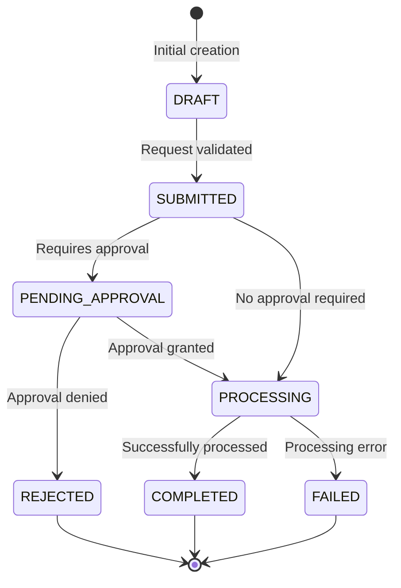
```mermaid
stateDiagram-v2
    [*] --> DRAFT: Initial creation
    DRAFT --> SUBMITTED: Request validated
    SUBMITTED --> PENDING_APPROVAL: Requires approval
    SUBMITTED --> PROCESSING: No approval required
    PENDING_APPROVAL --> REJECTED: Approval denied
    PENDING_APPROVAL --> PROCESSING: Approval granted
    PROCESSING --> COMPLETED: Successfully processed
    PROCESSING --> FAILED: Processing error
    COMPLETED --> [*]
    REJECTED --> [*]
    FAILED --> [*]
```

### Refund Method Selection Flow

```mermaid
flowchart TD
    Start([Begin Method Selection]) --> CheckOriginal{Original Method Available?}
    
    CheckOriginal -->|Yes| ValidateOriginal{Valid for Refund?}
    ValidateOriginal -->|Yes| SelectOriginal[Select ORIGINAL_PAYMENT]
    ValidateOriginal -->|No| CheckBalance[Check BALANCE Availability]
    
    CheckOriginal -->|No| CheckBalance
    
    CheckBalance -->|Available| ValidateBalance{Sufficient Balance?}
    ValidateBalance -->|Yes| SelectBalance[Select BALANCE]
    ValidateBalance -->|No| CheckOther[Check OTHER Availability]
    
    CheckBalance -->|Not Available| CheckOther
    
    CheckOther -->|Available| ValidateOther{Bank Account Configured?}
    ValidateOther -->|Yes| SelectOther[Select OTHER]
    ValidateOther -->|No| ErrorState[Error: No Valid Refund Method]
    
    CheckOther -->|Not Available| ErrorState
    
    SelectOriginal --> ApplyMethodRules[Apply Method-Specific Rules]
    SelectBalance --> ApplyMethodRules
    SelectOther --> ApplyMethodRules
    
    ApplyMethodRules --> End([End Method Selection])
    ErrorState --> End
```

### Approval Workflow Sequence

```mermaid
sequenceDiagram
    participant RS as Refund Service
    participant AS as Approval Service
    participant NS as Notification Service
    participant DBS as Database Service
    participant UI as Admin UI
    participant Admin as Admin User
    
    RS->>AS: Create Approval Request
    AS->>DBS: Store Approval Request
    AS->>AS: Determine Approvers
    
    loop For Each Approver
        AS->>NS: Send Approval Request
        NS->>Admin: Notification
    end
    
    Admin->>UI: View Approval Requests
    Admin->>UI: Make Decision
    UI->>AS: Submit Decision
    
    AS->>DBS: Update Approval Status
    AS->>RS: Return Approval Result
    
    alt Approved
        RS->>RS: Continue Refund Processing
    else Rejected
        RS->>DBS: Update Refund Status to REJECTED
        RS->>NS: Send Rejection Notification
    end
```

## User Interfaces

### Pike Interface (Merchant Users)

The Pike interface provides merchants with tools to:
- Create and manage refund requests
- View refund status and history
- Manage bank accounts for refunds
- Track customer refund history

Key screens include:
- Refund Creation Screen
- Refund Status Dashboard
- Refund Detail View
- Bank Account Management
- Customer Refund History

### Barracuda Interface (Admin Users)

The Barracuda interface provides administrators with tools to:
- Configure refund parameters
- Monitor refund activity
- Manage approval workflows
- View analytics and reports
- Configure card network rules

Key screens include:
- Refund Dashboard
- Refund Parameter Configuration
- Approval Workflow Configuration
- Card Network Rule Configuration
- Refund Reports and Analytics

## Security Architecture

The Refunds Service implements a comprehensive security framework:

### Authentication
- **Identity Provider**: Auth0 for centralized identity management
- **User Authentication**: JWT with OAuth 2.0
- **Service Authentication**: API Keys + JWT
- **Multi-Factor Authentication**: Required for admin roles

### Authorization
- **Role-Based Access Control**: Hierarchical permission model
- **Permission Management**: Domain-specific permissions with resource-level controls
- **Policy Enforcement**: Multiple tiers (API Gateway, Service Layer, Data Layer)

### Data Protection
- **Encryption at Rest**: AES-256 field-level encryption
- **Encryption in Transit**: TLS 1.3 for all communications
- **Key Management**: AWS KMS with automatic key rotation
- **Data Masking**: Context-sensitive masking for sensitive information

## Monitoring and Observability

The monitoring architecture employs multiple layers of visibility:

### Metrics Collection
- **System Metrics**: DataDog Agent (10-second sampling)
- **Application Metrics**: StatsD + Custom (5-second sampling)
- **Business Metrics**: Event-based (real-time)
- **SLA Metrics**: Synthetic Tests (1-minute sampling)

### Log Aggregation
- Structured JSON logging with standardized fields
- Correlation IDs for tracing requests across services
- PII redaction in all logs
- Tiered storage (hot: 30 days, warm: 90 days, cold: 7 years)

### Distributed Tracing
- OpenTelemetry implementation with DataDog APM integration
- End-to-end latency tracking for refund operations
- Service dependency mapping
- Error propagation tracing

## Testing Strategy

The Refunds Service employs a comprehensive testing strategy:

### Unit Testing
- **Framework**: pytest 7.4+ for Python components
- **Coverage Target**: 95%+ for core business logic
- **Mocking Strategy**: External dependencies mocked using pytest-mock, moto, mongomock

### Integration Testing
- **Service Integration**: Contract testing with Pact
- **API Endpoints**: Black-box API testing with Postman collections
- **Database Integration**: Transaction-safe testing with pytest-mongodb

### End-to-End Testing
- **Key Scenarios**: Complete refund flows, approval workflows, gateway integrations
- **UI Automation**: Cypress with Page Object Model
- **Performance Testing**: JMeter/Locust for load, stress, and endurance testing

## Deployment and Infrastructure

The Refunds Service is deployed on AWS with the following architecture:

### Core AWS Services
- **Compute**: ECS Fargate (containerized services)
- **Networking**: Application Load Balancer, CloudFront, Route53
- **Storage**: S3, MongoDB Atlas, ElastiCache (Redis)
- **Messaging**: SQS, EventBridge
- **Security**: KMS, Secrets Manager, WAF

### Containerization
- **Container Runtime**: Docker 24.0+
- **Orchestration**: AWS ECS Fargate
- **Registry**: Amazon ECR
- **Base Images**: Distroless/Python 3.11+

### CI/CD Pipeline
- **Source Control**: GitHub with branch protection
- **Build Pipeline**: GitHub Actions
- **Deployment Pipeline**: Automated for dev/test, manual approval for production
- **Rollback Procedures**: Automatic rollback on health check failures

## Getting Started

To set up the Refunds Service for local development:

1. Clone the repository
2. Install dependencies:
   ```
   cd src/backend
   pip install -r requirements.txt
   
   cd ../web
   npm install
   ```
3. Configure environment variables:
   ```
   cp src/backend/.env.example src/backend/.env
   cp src/web/.env.example src/web/.env
   ```
4. Start the services:
   ```
   # Backend
   cd src/backend
   python bin/www
   
   # Frontend
   cd src/web
   npm start
   ```

## Additional Resources

- API Documentation: Available at `/api/docs` when running the service
- Technical Specification: See the full technical specification document
- Architecture Diagrams: Available in the `docs/architecture` directory

# Project Guide: Refunds Service

## Overview

The Refunds Service is a comprehensive module within the Brik platform designed to process, manage, and track refunds across diverse payment methods and workflows. It provides a unified system for merchants to efficiently handle customer refunds while navigating complex payment method requirements, refund policies, and card network rules.

## Quick Start

### Prerequisites

- Node.js 16+
- Python 3.11+
- Docker and Docker Compose
- AWS CLI configured with appropriate permissions
- MongoDB 6.0+
- Redis 7.0+

### Installation

1. Clone the repository:
   ```bash
   git clone https://github.com/brik/refunds-service.git
   cd refunds-service
   ```

2. Install backend dependencies:
   ```bash
   cd src/backend
   pip install -r requirements.txt
   ```

3. Install frontend dependencies:
   ```bash
   cd ../web
   npm install
   ```

4. Set up environment variables:
   ```bash
   cp src/backend/.env.example src/backend/.env
   cp src/web/.env.example src/web/.env
   ```
   Edit the `.env` files with your configuration values.

5. Start the development environment:
   ```bash
   docker-compose up -d
   ```

### Running the Application

1. Start the backend service:
   ```bash
   cd src/backend
   python bin/www
   ```

2. Start the frontend application:
   ```bash
   cd src/web
   npm start
   ```

3. Access the application:
   - Pike (Merchant Interface): http://localhost:3000
   - Barracuda (Admin Interface): http://localhost:3000/admin

## Architecture Overview

The Refunds Service is built on a microservices architecture with the following key components:

### Core Components

1. **Refund API Service**: Exposes RESTful endpoints for refund operations
2. **Refund Request Manager**: Orchestrates refund request lifecycles
3. **Payment Method Handler**: Processes method-specific refund logic
4. **Approval Workflow Engine**: Manages approval flows based on configured rules
5. **Compliance Engine**: Enforces card network rules and merchant-specific policies
6. **Gateway Integration Service**: Communicates with payment gateways
7. **Parameter Resolution Service**: Manages multi-level configuration hierarchy
8. **Reporting & Analytics Engine**: Provides refund insights and metrics
9. **Bank Account Manager**: Handles bank account information for refunds
10. **Notification Service**: Manages alerts and status updates

### System Architecture Diagram

```mermaid
graph TD
    Client[Client Applications] --> API[Refund API Service]
    API --> RRM[Refund Request Manager]
    RRM --> PMH[Payment Method Handler]
    RRM --> AWE[Approval Workflow Engine]
    RRM --> CE[Compliance Engine]
    PMH --> GIS[Gateway Integration Service]
    AWE --> NS[Notification Service]
    RRM --> NS
    GIS --> Gateways[Payment Gateways]
    API --> PRS[Parameter Resolution Service]
    API --> BAM[Bank Account Manager]
    API --> RAE[Reporting & Analytics Engine]
    
    subgraph Data Stores
        MongoDB[(MongoDB)]
        Redis[(Redis Cache)]
        S3[(S3 Storage)]
    end
    
    RRM --> MongoDB
    PRS --> MongoDB
    PRS --> Redis
    BAM --> MongoDB
    RAE --> MongoDB
    NS --> MongoDB
```

## Key Features

### Refund Processing

- Support for multiple refund methods:
  - ORIGINAL_PAYMENT: Refund to the original payment method
  - BALANCE: Refund to merchant balance
  - OTHER: Refund to alternative bank account
- Complete refund lifecycle tracking from creation to completion
- Payment method-specific validation and processing
- Gateway integration with Stripe, Adyen, and Fiserv

### Compliance & Control

- Card network rule enforcement
- Configurable approval workflows
- Multi-level refund limits and restrictions
- Risk and fraud prevention integration

### Management Tools

- Refund policy configuration
- Bank account management
- Detailed reporting and analytics
- Notification system for refund events

### User Interfaces

- Pike (Merchant Interface):
  - Transaction-level refund status
  - Customer refund history
  - Merchant refund dashboard
- Barracuda (Admin Interface):
  - Administrative control panels
  - Configuration management
  - Compliance monitoring

## Development Guide

### Project Structure

```
refunds-service/
├── infrastructure/          # Infrastructure as code and deployment scripts
├── src/
│   ├── backend/             # Backend services
│   │   ├── api/             # API endpoints and routes
│   │   ├── common/          # Shared utilities and constants
│   │   ├── config/          # Configuration files
│   │   ├── database/        # Database models and connections
│   │   ├── integrations/    # External service integrations
│   │   ├── services/        # Core business logic services
│   │   ├── tests/           # Test files
│   │   └── workers/         # Background workers
│   └── web/                 # Frontend application
│       ├── public/          # Static assets
│       └── src/             # React application code
│           ├── assets/      # Images and icons
│           ├── components/  # UI components
│           ├── config/      # Frontend configuration
│           ├── hooks/       # Custom React hooks
│           ├── pages/       # Page components
│           ├── services/    # API services
│           ├── store/       # Redux store
│           ├── styles/      # CSS and styling
│           ├── types/       # TypeScript type definitions
│           └── utils/       # Utility functions
```

### Key Technologies

- **Backend**:
  - Python 3.11+
  - Flask 2.3+
  - SQLAlchemy 2.0+
  - Marshmallow 3.20+
  - Celery 5.3+
  - pytest 7.4+

- **Frontend**:
  - React 18.2+
  - Redux 4.2+
  - TailwindCSS 3.3+
  - React Query 4.0+
  - Jest/React Testing Library

- **Infrastructure**:
  - Docker/ECS
  - MongoDB 6.0+
  - Redis 7.0+
  - AWS (S3, SQS, CloudWatch, etc.)

### Development Workflow

1. **Feature Development**:
   - Create a feature branch from `main`
   - Implement the feature with appropriate tests
   - Submit a pull request for review

2. **Testing**:
   - Unit tests: `npm test` (frontend) or `pytest` (backend)
   - Integration tests: `pytest tests/integration`
   - End-to-end tests: `npm run test:e2e`

3. **Deployment**:
   - CI/CD pipeline automatically deploys to development environment
   - Staging and production deployments require approval

## API Reference

### Refund API Endpoints

| Endpoint | Method | Description |
|----------|--------|-------------|
| `/refunds` | POST | Create a new refund request |
| `/refunds` | GET | List refund requests with filtering |
| `/refunds/{refundId}` | GET | Get specific refund details |
| `/refunds/{refundId}` | PUT | Update refund request (pre-processing) |
| `/refunds/{refundId}/cancel` | PUT | Cancel refund request |
| `/refunds/{refundId}/status` | GET | Get simplified refund status |

### Parameter API Endpoints

| Endpoint | Method | Description |
|----------|--------|-------------|
| `/merchants/{merchantId}/refund-parameters` | GET | Get merchant refund parameters |
| `/merchants/{merchantId}/refund-parameters` | PUT | Update merchant refund parameters |
| `/banks/{bankId}/refund-parameters` | GET | Get bank refund parameters |
| `/organizations/{orgId}/refund-parameters` | GET | Get organization refund parameters |

### Bank Account API Endpoints

| Endpoint | Method | Description |
|----------|--------|-------------|
| `/merchants/{merchantId}/bank-accounts` | GET | List merchant bank accounts |
| `/merchants/{merchantId}/bank-accounts` | POST | Create a new bank account |
| `/merchants/{merchantId}/bank-accounts/{accountId}` | GET | Get bank account details |
| `/merchants/{merchantId}/bank-accounts/{accountId}` | PUT | Update bank account |
| `/merchants/{merchantId}/bank-accounts/{accountId}` | DELETE | Delete bank account |

## Configuration Guide

### Parameter Configuration

The Refunds Service uses a hierarchical parameter resolution system:

1. **Merchant Level**: Most specific, overrides higher levels
2. **Organization Level**: Applies to all merchants in an organization
3. **Program Level**: Applies to all merchants in a program
4. **Bank Level**: Applies to all merchants in a bank
5. **Default Values**: Used when no specific values are configured

Key parameters include:

| Parameter | Description | Default |
|-----------|-------------|---------|
| `maxRefundAmount` | Maximum amount that can be refunded | 10000.00 |
| `refundTimeLimit` | Maximum days after transaction for refund | 180 |
| `approvalThreshold` | Amount requiring approval | 1000.00 |
| `allowedMethods` | Permitted refund methods | ORIGINAL_PAYMENT, BALANCE, OTHER |
| `requireDocumentation` | When documentation is required | >500.00 |

### Approval Workflow Configuration

Approval workflows can be configured with:

- Trigger conditions (amount, method, etc.)
- Approval levels and roles
- Escalation rules and timeouts
- Final approval actions

### Card Network Rules

Card network rules are configured for:

- Time limits for refunds
- Method restrictions
- Documentation requirements
- Amount limitations

## Troubleshooting

### Common Issues

1. **Gateway Connection Failures**:
   - Check gateway credentials in Secrets Manager
   - Verify network connectivity to gateway endpoints
   - Review gateway logs for specific error messages

2. **Parameter Resolution Issues**:
   - Clear Redis cache: `redis-cli FLUSHDB`
   - Verify parameter hierarchy configuration
   - Check for parameter name typos

3. **Approval Workflow Problems**:
   - Verify approver roles are correctly assigned
   - Check notification delivery settings
   - Review escalation timeouts

### Logging

- Backend logs are available in CloudWatch Logs
- Frontend errors are tracked in Sentry
- API request logs are stored in the application logs

### Monitoring

- System health dashboards are available in DataDog
- Performance metrics are tracked in CloudWatch
- Business metrics are available in the Barracuda interface

## Contributing

Please see [CONTRIBUTING.md](CONTRIBUTING.md) for details on our code of conduct and the process for submitting pull requests.

## License

This project is licensed under the terms specified in the [LICENSE](LICENSE) file.

# Project Structure

## Overview

The Refunds Service is a comprehensive module within the Brik platform designed to process, manage, and track refunds across diverse payment methods and workflows. This document provides a detailed overview of the project structure to help developers understand the codebase organization.

## Repository Structure

The repository follows a monorepo structure with clear separation between backend services, web frontend, and infrastructure code:

```
/
├── src/                      # Source code
│   ├── backend/              # Backend services
│   │   ├── api/              # API layer
│   │   ├── common/           # Shared utilities, interfaces, and constants
│   │   ├── config/           # Configuration files
│   │   ├── database/         # Database models and repositories
│   │   ├── integrations/     # External service integrations
│   │   ├── services/         # Core business logic services
│   │   ├── tests/            # Test files
│   │   └── workers/          # Background workers
│   └── web/                  # Frontend application
│       ├── public/           # Static assets
│       └── src/              # React application code
│           ├── assets/       # Images, icons, etc.
│           ├── components/   # UI components
│           ├── config/       # Frontend configuration
│           ├── constants/    # Constants and enums
│           ├── hooks/        # Custom React hooks
│           ├── pages/        # Page components
│           ├── services/     # API clients and services
│           ├── store/        # Redux store
│           ├── styles/       # Global styles
│           ├── types/        # TypeScript type definitions
│           └── utils/        # Utility functions
├── infrastructure/           # Infrastructure as code
│   ├── cloudformation/       # AWS CloudFormation templates
│   ├── monitoring/           # Monitoring configuration
│   ├── scripts/              # Deployment and maintenance scripts
│   └── terraform/            # Terraform configuration
└── docs/                     # Documentation
```

## Backend Architecture

The backend follows a modular, service-oriented architecture with clear separation of concerns:

### Core Services

1. **Refund API Service**: Exposes RESTful endpoints for refund operations
2. **Refund Request Manager**: Orchestrates the refund lifecycle
3. **Payment Method Handler**: Implements payment method-specific logic
4. **Approval Workflow Engine**: Manages approval flows
5. **Compliance Engine**: Enforces card network rules and policies
6. **Gateway Integration Service**: Communicates with payment gateways
7. **Parameter Resolution Service**: Manages hierarchical configuration
8. **Reporting & Analytics Engine**: Provides insights and metrics
9. **Bank Account Manager**: Handles bank account information
10. **Notification Service**: Delivers notifications across channels

### Key Directories

- **api/**: Contains API routes, controllers, and middleware
- **common/**: Shared utilities, interfaces, enums, and constants
- **config/**: Environment-specific configuration
- **database/**: MongoDB models, repositories, and migrations
- **integrations/**: External service clients (payment gateways, AWS services)
- **services/**: Core business logic implementation
- **workers/**: Background processing jobs

### Data Flow

The backend implements several key data flows:

1. **Refund Request Flow**: API → Request Manager → Payment Method Handler → Gateway
2. **Approval Flow**: Request Manager → Approval Engine → Notification Service
3. **Parameter Resolution**: Hierarchical resolution from merchant to default values
4. **Event Publication**: State changes trigger events for notifications and reporting

## Frontend Architecture

The frontend is built with React and follows a component-based architecture:

### Key Directories

- **components/**: Reusable UI components
  - **common/**: Generic UI components (buttons, forms, etc.)
  - **barracuda/**: Admin-specific components
  - **pike/**: Merchant-specific components
  - **shared/**: Components used across interfaces
  - **layout/**: Page layout components
- **pages/**: Page components for different routes
- **store/**: Redux store with slices for state management
- **services/**: API clients and service integrations
- **hooks/**: Custom React hooks for shared logic

### User Interfaces

The application supports two distinct interfaces:

1. **Pike (Merchant Interface)**: For merchants to manage refunds
2. **Barracuda (Admin Interface)**: For administrators to configure and monitor the system

## Infrastructure

The infrastructure is defined as code using Terraform and CloudFormation:

### Key Components

- **ECS Clusters**: Container orchestration for services
- **MongoDB Atlas**: Document database for persistent storage
- **ElastiCache (Redis)**: Caching and distributed locking
- **SQS Queues**: Asynchronous processing
- **CloudWatch**: Monitoring and alerting
- **WAF**: Web application firewall for security

## Development Workflow

The project uses GitHub Actions for CI/CD with the following workflow:

1. **Pull Request**: Triggers linting, testing, and security scanning
2. **Merge to Main**: Deploys to development environment
3. **Release Process**: Promotes to staging and production with approval gates

## Testing Strategy

The project implements a comprehensive testing strategy:

1. **Unit Tests**: For individual components and functions
2. **Integration Tests**: For service interactions
3. **End-to-End Tests**: For critical user flows
4. **Performance Tests**: For load and stress testing

## Documentation

Documentation is maintained in several formats:

1. **Code Comments**: Inline documentation of complex logic
2. **API Documentation**: OpenAPI/Swagger specifications
3. **Technical Documentation**: Architecture and design documents
4. **User Guides**: For both merchant and admin interfaces

## Getting Started

To set up the development environment:

1. Clone the repository
2. Install dependencies for backend and frontend
3. Set up environment variables
4. Start the development servers

Refer to the README files in each directory for specific setup instructions.

# CODE GUIDE: Brik Refunds Service

A comprehensive and extremely detailed guide to the Refunds Service codebase, designed to help junior developers understand the project structure, architecture, and implementation details.

## Table of Contents

1. [Project Overview](#project-overview)
2. [Architecture](#architecture)
3. [Backend Structure](#backend-structure)
4. [Frontend Structure](#frontend-structure)
5. [Core Services](#core-services)
6. [Database Models](#database-models)
7. [API Endpoints](#api-endpoints)
8. [Integration Points](#integration-points)
9. [Common Patterns](#common-patterns)
10. [Testing Strategy](#testing-strategy)
11. [Deployment](#deployment)
12. [Troubleshooting](#troubleshooting)

## Project Overview

The Refunds Service is a comprehensive module within the Brik platform designed to process, manage, and track refunds across diverse payment methods and workflows. It provides a unified system for merchants to efficiently handle customer refunds while navigating complex payment method requirements, refund policies, and card network rules.

### Key Features

- End-to-end refund lifecycle management
- Support for multiple refund methods (original payment, balance, other)
- Configurable approval workflows
- Card network rule enforcement
- Multi-level parameter configuration
- Comprehensive reporting and analytics
- Secure bank account management
- Multi-channel notifications

### Technology Stack

- **Backend**: TypeScript/Node.js with Python for some services
- **Frontend**: React with TypeScript
- **Database**: MongoDB
- **Caching**: Redis
- **Message Queue**: AWS SQS
- **Authentication**: JWT with Auth0
- **Infrastructure**: AWS (ECS, S3, CloudFront, etc.)
- **CI/CD**: GitHub Actions

## Architecture

The Refunds Service follows a microservices architecture with modular components that communicate through well-defined interfaces. The system is designed to be scalable, resilient, and maintainable.

### High-Level Architecture

```
┌─────────────────┐     ┌─────────────────┐     ┌─────────────────┐
│                 │     │                 │     │                 │
│  Pike UI        │     │  Barracuda UI   │     │  API Clients    │
│  (Merchant)     │     │  (Admin)        │     │                 │
│                 │     │                 │     │                 │
└────────┬────────┘     └────────┬────────┘     └────────┬────────┘
         │                       │                       │
         └───────────────┬───────┴───────────────┬───────┘
                         │                       │
                ┌────────▼────────┐     ┌────────▼────────┐
                │                 │     │                 │
                │  API Gateway    │     │  Auth Service   │
                │                 │     │                 │
                └────────┬────────┘     └────────┬────────┘
                         │                       │
┌────────────────────────┼───────────────────────┼────────────────────────┐
│                        │                       │                         │
│  ┌─────────────────┐   │   ┌─────────────────┐ │  ┌─────────────────┐   │
│  │                 │   │   │                 │ │  │                 │   │
│  │  Refund API     │◄──┴───┤  Refund Request │ └─►│  Approval       │   │
│  │  Service        │       │  Manager        │    │  Workflow       │   │
│  │                 │       │                 │    │  Engine         │   │
│  └────────┬────────┘       └────────┬────────┘    └────────┬────────┘   │
│           │                         │                      │            │
│  ┌────────▼────────┐       ┌────────▼────────┐    ┌────────▼────────┐   │
│  │                 │       │                 │    │                 │   │
│  │  Parameter      │◄──────┤  Payment Method │    │  Notification   │   │
│  │  Resolution     │       │  Handler        │    │  Service        │   │
│  │                 │       │                 │    │                 │   │
│  └────────┬────────┘       └────────┬────────┘    └────────┬────────┘   │
│           │                         │                      │            │
│  ┌────────▼────────┐       ┌────────▼────────┐    ┌────────▼────────┐   │
│  │                 │       │                 │    │                 │   │
│  │  Compliance     │       │  Gateway        │    │  Bank Account   │   │
│  │  Engine         │       │  Integration    │    │  Manager        │   │
│  │                 │       │                 │    │                 │   │
│  └─────────────────┘       └─────────────────┘    └─────────────────┘   │
│                                                                         │
└─────────────────────────────────────────────────────────────────────────┘
```

### Service Components

1. **Refund API Service**: Exposes RESTful endpoints for client applications
2. **Refund Request Manager**: Orchestrates the refund lifecycle
3. **Payment Method Handler**: Provides method-specific refund processing logic
4. **Approval Workflow Engine**: Manages configurable approval flows
5. **Compliance Engine**: Enforces card network rules and merchant policies
6. **Gateway Integration Service**: Manages communication with payment gateways
7. **Parameter Resolution Service**: Resolves hierarchical configuration parameters
8. **Bank Account Manager**: Securely stores and verifies bank account information
9. **Notification Service**: Delivers multi-channel notifications
10. **Reporting & Analytics Engine**: Provides insights and metrics on refund activity

### Communication Patterns

The services communicate using a combination of:

- **Synchronous REST APIs**: For direct service-to-service communication
- **Event-driven messaging**: For asynchronous workflows using AWS SQS
- **Pub/Sub**: For broadcasting state changes and notifications

## Backend Structure

The backend codebase is organized into a modular structure that separates concerns and promotes maintainability.

### Directory Structure

```
src/backend/
├── api/                # API routes and controllers
├── bin/                # Binary scripts
├── common/             # Shared utilities and interfaces
│   ├── constants/      # Constant definitions
│   ├── enums/          # Enumeration types
│   ├── errors/         # Error classes
│   ├── interfaces/     # TypeScript interfaces
│   ├── middleware/     # Express middleware
│   └── utils/          # Utility functions
├── config/             # Environment configurations
├── database/           # Data models and repositories
│   ├── models/         # MongoDB schema definitions
│   ├── repositories/   # Data access layer
│   └── migrations/     # Database migration scripts
├── integrations/       # External service clients
│   ├── aws/            # AWS service integrations
│   ├── payment-service/ # Payment service client
│   ├── merchant-service/ # Merchant service client
│   └── balance-service/ # Balance service client
├── services/           # Core business logic services
│   ├── approval-workflow-engine/   # Approval workflows
│   ├── bank-account-manager/       # Bank account handling
│   ├── compliance-engine/          # Rule enforcement
│   ├── gateway-integration/        # Payment gateways
│   ├── notification-service/       # Notifications
│   ├── parameter-resolution/       # Configuration
│   ├── payment-method-handler/     # Payment methods
│   ├── refund-api/                 # API handlers
│   ├── refund-request-manager/     # Request lifecycle
│   └── reporting-analytics/        # Reports and analytics
├── tests/              # Test suites
└── workers/            # Background processes
```

### Key Files and Their Purpose

#### Common Files

- **src/backend/common/enums/refund-status.enum.ts**: Defines all possible statuses a refund can have throughout its lifecycle.
- **src/backend/common/enums/refund-method.enum.ts**: Defines the available refund methods (ORIGINAL_PAYMENT, BALANCE, OTHER).
- **src/backend/common/enums/gateway-type.enum.ts**: Defines supported payment gateway types.
- **src/backend/common/interfaces/refund.interface.ts**: Defines the core refund data structures.
- **src/backend/common/errors/api-error.ts**: Base error class for API errors.
- **src/backend/common/errors/business-error.ts**: Error class for business logic errors.
- **src/backend/common/errors/gateway-error.ts**: Error class for gateway integration errors.
- **src/backend/common/utils/logger.ts**: Logging utility for consistent logging across the application.
- **src/backend/common/utils/metrics.ts**: Metrics collection utility.

#### Configuration Files

- **src/backend/config/index.ts**: Main configuration file that loads environment-specific settings.
- **src/backend/config/environments/development.ts**: Development environment configuration.
- **src/backend/config/environments/production.ts**: Production environment configuration.
- **src/backend/config/environments/staging.ts**: Staging environment configuration.
- **src/backend/config/environments/test.ts**: Test environment configuration.
- **src/backend/config/database.ts**: Database connection configuration.
- **src/backend/config/auth.ts**: Authentication configuration.
- **src/backend/config/sqs.ts**: SQS queue configuration.
- **src/backend/config/redis.ts**: Redis cache configuration.

#### Core Service Files

- **src/backend/services/refund-request-manager/refund-request-manager.service.ts**: Orchestrates the complete lifecycle of refund requests.
- **src/backend/services/payment-method-handler/payment-method-handler.service.ts**: Manages payment method-specific refund processing.
- **src/backend/services/gateway-integration/gateway-integration.service.ts**: Handles communication with payment gateways.
- **src/backend/services/parameter-resolution/parameter-resolution.service.ts**: Manages hierarchical configuration parameters.
- **src/backend/services/compliance-engine/compliance-engine.service.ts**: Enforces card network rules and merchant policies.
- **src/backend/services/approval-workflow-engine/approval-workflow.service.ts**: Manages approval workflows for refunds.
- **src/backend/services/bank-account-manager/bank-account-manager.service.ts**: Manages bank account information.
- **src/backend/services/notification-service/notification.service.ts**: Sends notifications across multiple channels.
- **src/backend/services/reporting-analytics/reporting-engine.service.ts**: Generates reports and analytics.

## Frontend Structure

The frontend codebase is organized to support both Pike (merchant) and Barracuda (admin) interfaces while sharing common components and utilities.

### Directory Structure

```
src/web/
├── assets/             # Static assets
│   ├── icons/          # SVG icons
│   └── images/         # Image files
├── components/         # React components
│   ├── barracuda/      # Admin-specific components
│   ├── common/         # Shared UI components
│   ├── layout/         # Layout components
│   ├── pike/           # Merchant-specific components
│   └── shared/         # Shared business components
├── config/             # Frontend configuration
├── constants/          # Application constants
├── hooks/              # Custom React hooks
├── pages/              # Page components
│   ├── barracuda/      # Admin pages
│   ├── common/         # Shared pages
│   └── pike/           # Merchant pages
├── routes/             # Routing configuration
├── services/           # API and service integrations
│   ├── api/            # API clients
│   ├── auth/           # Authentication service
│   └── notification/   # Notification service
├── store/              # Redux store
│   ├── middleware/     # Redux middleware
│   └── slices/         # Redux slices
├── styles/             # Global styles
├── themes/             # Theme configuration
├── types/              # TypeScript type definitions
└── utils/              # Utility functions
```

### Key Files and Their Purpose

#### Component Files

- **src/web/src/components/pike/RefundForm/RefundForm.tsx**: Form component for creating refund requests.
- **src/web/src/components/pike/RefundList/RefundList.tsx**: Component for displaying a list of refunds.
- **src/web/src/components/pike/RefundDetails/RefundDetails.tsx**: Component for displaying refund details.
- **src/web/src/components/pike/BankAccountForm/BankAccountForm.tsx**: Form component for managing bank accounts.
- **src/web/src/components/barracuda/ParameterConfiguration/ParameterConfiguration.tsx**: Component for managing configuration parameters.
- **src/web/src/components/barracuda/ApprovalWorkflowConfiguration/ApprovalWorkflowConfiguration.tsx**: Component for configuring approval workflows.
- **src/web/src/components/barracuda/RefundDashboard/RefundDashboard.tsx**: Dashboard component for refund metrics.
- **src/web/src/components/common/Button/Button.tsx**: Reusable button component.
- **src/web/src/components/common/TextField/TextField.tsx**: Reusable text input component.
- **src/web/src/components/common/Select/Select.tsx**: Reusable select dropdown component.

#### Hook Files

- **src/web/src/hooks/useRefund.ts**: Hook for refund-related operations.
- **src/web/src/hooks/useParameter.ts**: Hook for parameter management.
- **src/web/src/hooks/useBankAccount.ts**: Hook for bank account management.
- **src/web/src/hooks/useAuth.ts**: Hook for authentication.
- **src/web/src/hooks/useNotification.ts**: Hook for notifications.

#### Service Files

- **src/web/src/services/api/refund.api.ts**: API client for refund operations.
- **src/web/src/services/api/parameter.api.ts**: API client for parameter operations.
- **src/web/src/services/api/bank-account.api.ts**: API client for bank account operations.
- **src/web/src/services/auth/auth.service.ts**: Authentication service.
- **src/web/src/services/notification/notification.service.ts**: Notification service.

#### Store Files

- **src/web/src/store/slices/refund.slice.ts**: Redux slice for refund state.
- **src/web/src/store/slices/parameter.slice.ts**: Redux slice for parameter state.
- **src/web/src/store/slices/auth.slice.ts**: Redux slice for authentication state.
- **src/web/src/store/slices/notification.slice.ts**: Redux slice for notification state.
- **src/web/src/store/middleware/api.middleware.ts**: Middleware for API requests.

## Core Services

### Refund Request Manager

The Refund Request Manager is the central service that orchestrates the complete lifecycle of refund requests. It manages state transitions, validation rules, and workflow coordination across all dependent services.

#### Key Responsibilities

- Process refund requests through their complete lifecycle
- Maintain state and status of all refund requests
- Coordinate with dependent services (Payment, Approval, Gateway)
- Apply business rules and validation logic
- Manage idempotency for refund operations
- Handle retry logic for failed operations
- Publish events for status changes

#### Refund Status Lifecycle

```
┌─────────┐
│         │
│  DRAFT  │
│         │
└────┬────┘
     │
     ▼
┌─────────┐     ┌──────────────────┐
│         │     │                  │
│SUBMITTED├────►│VALIDATION_FAILED │
│         │     │                  │
└────┬────┘     └──────────────────┘
     │
     ├─────────────────┐
     │                 │
     ▼                 ▼
┌─────────┐     ┌─────────────────┐
│         │     │                 │
│PROCESSING│     │PENDING_APPROVAL │
│         │     │                 │
└────┬────┘     └────────┬────────┘
     │                   │
     │                   ├─────────┐
     │                   │         │
     │                   ▼         ▼
     │          ┌─────────┐  ┌─────────┐
     │          │         │  │         │
     │          │REJECTED │  │CANCELED │
     │          │         │  │         │
     │          └─────────┘  └─────────┘
     │
     ▼
┌──────────────┐
│              │
│GATEWAY_PENDING│
│              │
└──────┬───────┘
       │
       ├───────────────┐
       │               │
       ▼               ▼
┌─────────┐     ┌─────────────┐
│         │     │             │
│COMPLETED│     │GATEWAY_ERROR│
│         │     │             │
└─────────┘     └──────┬──────┘
                       │
                       ├───────────┐
                       │           │
                       ▼           ▼
                 ┌─────────┐ ┌─────────┐
                 │         │ │         │
                 │ FAILED  │ │PROCESSING│ (retry)
                 │         │ │         │
                 └─────────┘ └─────────┘
```

#### Code Example: Creating a Refund Request

```typescript
// Simplified example of creating a refund request
async function createRefundRequest(refundData: RefundRequestDTO): Promise<RefundRequest> {
  logger.info('Creating refund request', { transactionId: refundData.transactionId });
  
  // Generate idempotency key
  const idempotencyKey = `refund_${refundData.transactionId}_${Date.now()}`;
  
  try {
    // Use idempotency key to prevent duplicate requests
    return await idempotencyService.execute(idempotencyKey, async () => {
      // Validate transaction
      const transaction = await paymentService.getTransaction(refundData.transactionId);
      if (!transaction) {
        throw new BusinessError(ErrorCode.TRANSACTION_NOT_FOUND, 'Transaction not found');
      }
      
      // Validate refund amount
      if (refundData.amount > transaction.amount) {
        throw new ValidationError('Refund amount cannot exceed transaction amount');
      }
      
      // Create refund request in DRAFT state
      const refundRequest = new RefundRequest({
        refundId: generateId(),
        transactionId: refundData.transactionId,
        merchantId: transaction.merchantId,
        amount: refundData.amount,
        reason: refundData.reason,
        refundMethod: refundData.refundMethod,
        status: RefundStatus.DRAFT,
        createdAt: new Date(),
      });
      
      // Save refund request
      await refundRepository.save(refundRequest);
      
      // Update status to SUBMITTED
      refundRequest.status = RefundStatus.SUBMITTED;
      await refundRepository.update(refundRequest);
      
      // Check if approval is required
      if (await approvalService.isApprovalRequired(refundRequest)) {
        // Create approval request
        const approvalRequest = await approvalService.createApprovalRequest(refundRequest);
        
        // Update status to PENDING_APPROVAL
        refundRequest.status = RefundStatus.PENDING_APPROVAL;
        refundRequest.approvalId = approvalRequest.id;
        await refundRepository.update(refundRequest);
        
        // Notify approvers
        await notificationService.sendApprovalNotification(approvalRequest);
      } else {
        // No approval required, process refund
        await processRefundRequest(refundRequest.refundId);
      }
      
      return refundRequest;
    });
  } catch (error) {
    logger.error('Error creating refund request', { error });
    throw error;
  }
}
```

### Payment Method Handler

The Payment Method Handler service provides method-specific refund processing logic with pluggable adapters for each payment method.

#### Key Responsibilities

- Implement payment method-specific refund validation
- Execute method-appropriate refund processing
- Handle payment method-specific error conditions
- Support pluggable architecture for new payment methods
- Maintain method-specific configuration and parameters
- Enforce method-specific compliance rules

#### Supported Payment Methods

- Credit Card
- Debit Card
- ACH/Bank Transfer
- PayPal
- Apple Pay
- Google Pay
- Platform Balance
- Cryptocurrency

#### Code Example: Payment Method Registry

```typescript
// Registry for payment method handlers
class PaymentMethodRegistry {
  private handlers: Map<string, PaymentMethodHandler> = new Map();
  private refundMethodHandlers: Map<RefundMethod, PaymentMethodHandler> = new Map();
  
  // Register a handler for a specific payment method
  registerHandler(paymentMethod: string, handler: PaymentMethodHandler): void {
    this.handlers.set(paymentMethod, handler);
    logger.info(`Registered handler for payment method: ${paymentMethod}`);
  }
  
  // Register a handler for a specific refund method
  registerRefundMethodHandler(refundMethod: RefundMethod, handler: PaymentMethodHandler): void {
    this.refundMethodHandlers.set(refundMethod, handler);
    logger.info(`Registered handler for refund method: ${refundMethod}`);
  }
  
  // Get handler for a payment method
  getHandler(paymentMethod: string): PaymentMethodHandler {
    const handler = this.handlers.get(paymentMethod);
    if (!handler) {
      throw new BusinessError(
        ErrorCode.UNSUPPORTED_PAYMENT_METHOD,
        `No handler registered for payment method: ${paymentMethod}`
      );
    }
    return handler;
  }
  
  // Get handler for a refund method
  getRefundMethodHandler(refundMethod: RefundMethod): PaymentMethodHandler {
    const handler = this.refundMethodHandlers.get(refundMethod);
    if (!handler) {
      throw new BusinessError(
        ErrorCode.UNSUPPORTED_REFUND_METHOD,
        `No handler registered for refund method: ${refundMethod}`
      );
    }
    return handler;
  }
  
  // Check if handler exists for a payment method
  hasHandler(paymentMethod: string): boolean {
    return this.handlers.has(paymentMethod);
  }
  
  // Check if handler exists for a refund method
  hasRefundMethodHandler(refundMethod: RefundMethod): boolean {
    return this.refundMethodHandlers.has(refundMethod);
  }
}
```

### Gateway Integration Service

The Gateway Integration Service provides a unified interface for communicating with different payment gateways, abstracting away gateway-specific implementation details and ensuring reliable, consistent interaction patterns.

#### Key Responsibilities

- Abstract gateway-specific integration details
- Handle communication with payment processors
- Manage gateway credentials securely
- Implement retry and error handling logic
- Track gateway transaction status
- Provide idempotent request handling
- Support multiple gateway versions

#### Supported Gateways

- Stripe
- Adyen
- Fiserv

#### Code Example: Gateway Integration with Circuit Breaker

```typescript
// Process a refund through a payment gateway with resilience patterns
async processRefund(refundRequest: GatewayRefundRequest): Promise<GatewayRefundResponse> {
  logger.info('Processing refund', { refundId: refundRequest.refundId });

  // Get appropriate adapter for the gateway type
  const adapter: GatewayAdapter = getGatewayAdapter(refundRequest.gatewayType);

  // Get circuit breaker for the gateway type
  const circuitBreaker = this.circuitBreakers.get(refundRequest.gatewayType);
  if (!circuitBreaker) {
    throw new GatewayError('CONFIGURATION_ERROR', `No circuit breaker configured for gateway type: ${refundRequest.gatewayType}`);
  }

  // Get retry strategy for the gateway type
  const retryStrategy = this.retryStrategies.get(refundRequest.gatewayType);
  if (!retryStrategy) {
    throw new GatewayError('CONFIGURATION_ERROR', `No retry strategy configured for gateway type: ${refundRequest.gatewayType}`);
  }

  // Get credentials for the gateway and merchant
  const credentials = await this.credentialManager.getCredentials(refundRequest.merchantId, refundRequest.gatewayType);

  // Record metrics for refund attempt
  metrics.incrementCounter('refund.attempt', 1, { gatewayType: refundRequest.gatewayType });

  // Create operation function that processes refund through adapter
  const operation = async (): Promise<GatewayRefundResponse> => {
    return adapter.processRefund(refundRequest, credentials);
  };

  // Create fallback function for circuit breaker open state
  const fallback = async (): Promise<GatewayRefundResponse> => {
    throw new GatewayError('CIRCUIT_OPEN', `Circuit breaker is open for gateway type: ${refundRequest.gatewayType}`);
  };

  try {
    // Use retry strategy to execute the operation with circuit breaker protection
    const result = await retryStrategy.execute(
      () => circuitBreaker.execute(operation, fallback)
    );

    // Handle successful refund
    logger.info('Refund processed successfully', { 
      gatewayType: refundRequest.gatewayType, 
      refundId: refundRequest.refundId 
    });
    metrics.incrementCounter('refund.success', 1, { gatewayType: refundRequest.gatewayType });
    return result;
  } catch (error) {
    // Handle failed refund
    logger.error('Refund processing failed', { 
      gatewayType: refundRequest.gatewayType, 
      refundId: refundRequest.refundId, 
      error 
    });
    metrics.incrementCounter('refund.failure', 1, { gatewayType: refundRequest.gatewayType });
    throw error;
  }
}
```

### Parameter Resolution Service

The Parameter Resolution Service manages the hierarchical configuration of refund parameters at multiple levels, providing a unified interface for retrieving and updating configuration values with efficient inheritance resolution.

#### Key Responsibilities

- Manage parameter values across program, bank, organization, and merchant levels
- Resolve parameter values based on inheritance rules
- Cache frequently accessed parameters
- Support parameter value validation
- Maintain parameter version history
- Notify components of parameter changes
- Provide parameter metadata and documentation

#### Parameter Inheritance Hierarchy

```
┌─────────┐
│         │
│  Bank   │
│         │
└────┬────┘
     │
     ▼
┌─────────┐
│         │
│ Program │
│         │
└────┬────┘
     │
     ▼
┌─────────────┐
│             │
│Organization │
│             │
└──────┬──────┘
       │
       ▼
┌─────────────┐
│             │
│  Merchant   │
│             │
└─────────────┘
```

#### Code Example: Parameter Resolution

```typescript
// Resolve a parameter value using the inheritance hierarchy
async resolveParameter(parameterName: string, merchantId: string): Promise<ParameterValue> {
  logger.debug(`Resolving parameter: ${parameterName} for merchant: ${merchantId}`);

  // Check cache first
  const cachedValue = await this.cache.get(parameterName, merchantId);
  if (cachedValue) {
    logger.debug(`Cache hit for parameter: ${parameterName} for merchant: ${merchantId}`);
    return cachedValue;
  }

  // Get merchant details to determine inheritance chain
  const merchant = await merchantService.getMerchant(merchantId);
  if (!merchant) {
    throw new NotFoundError(`Merchant not found: ${merchantId}`);
  }

  // Build inheritance chain
  const inheritanceChain = [
    { entityType: EntityType.MERCHANT, entityId: merchantId },
    { entityType: EntityType.ORGANIZATION, entityId: merchant.organizationId },
    { entityType: EntityType.PROGRAM, entityId: merchant.programId },
    { entityType: EntityType.BANK, entityId: merchant.bankId }
  ];

  // Find parameter in inheritance chain
  for (const { entityType, entityId } of inheritanceChain) {
    if (!entityId) continue;
    
    const parameterValue = await parameterRepository.findParameter(entityType, entityId, parameterName);
    if (parameterValue) {
      // Store in cache
      await this.cache.set(parameterName, merchantId, parameterValue);
      return parameterValue;
    }
  }

  // No specific value found, use default
  const parameterDefinition = await this.getParameterDefinition(parameterName);
  if (!parameterDefinition) {
    throw new NotFoundError(`Parameter definition not found: ${parameterName}`);
  }

  const defaultValue = new ParameterValue({
    parameterName,
    value: parameterDefinition.defaultValue,
    entityType: EntityType.DEFAULT,
    entityId: 'default',
    isDefault: true
  });

  // Cache default value
  await this.cache.set(parameterName, merchantId, defaultValue);
  
  return defaultValue;
}
```

### Compliance Engine

The Compliance Engine enforces card network rules, regulatory requirements, and merchant-specific refund policies, ensuring all refund operations adhere to the appropriate compliance frameworks.

#### Key Responsibilities

- Enforce card network-specific refund rules
- Apply timeframe restrictions for different payment methods
- Validate refund amount limits and restrictions
- Ensure compliance with regulatory requirements
- Support merchant-specific refund policies
- Maintain audit trail of compliance checks
- Provide clear violation explanations

#### Rule Categories

- Timeframe Rules: Enforce time limits for refund processing
- Amount Rules: Restrict refund amounts based on various factors
- Method Rules: Control which refund methods can be used
- Documentation Rules: Require specific documentation for certain refunds
- Frequency Rules: Limit refund frequency
- Geographic Rules: Apply region-specific restrictions

#### Code Example: Rule Evaluation

```typescript
// Evaluate compliance rules for a refund request
async evaluateCompliance(refundRequest: RefundRequest, context: ComplianceContext): Promise<ComplianceResult> {
  logger.debug('Evaluating compliance rules', { refundId: refundRequest.refundId });
  
  const violations: ComplianceViolation[] = [];
  
  // Get all applicable rule providers
  const ruleProviders = this.getRuleProviders(context);
  
  // Evaluate rules from each provider
  for (const provider of ruleProviders) {
    // Get rules from provider
    const rules = await provider.getRules(context);
    
    // Evaluate rules
    const providerViolations = await provider.evaluateRules(refundRequest, rules);
    
    // Add any violations
    violations.push(...providerViolations);
  }
  
  // Return compliance result
  return {
    compliant: violations.length === 0,
    violations,
    blockingViolations: violations.filter(v => v.severity === 'ERROR'),
    warningViolations: violations.filter(v => v.severity === 'WARNING')
  };
}

// Get applicable rule providers based on context
getRuleProviders(context: ComplianceContext): RuleProvider[] {
  const providers: RuleProvider[] = [];
  
  // Always include regulatory rules
  providers.push(this.regulatoryRuleProvider);
  
  // Add card network rules if applicable
  if (context.cardNetwork) {
    providers.push(this.cardNetworkRuleProvider);
  }
  
  // Add merchant policy rules
  providers.push(this.merchantPolicyProvider);
  
  // Add program-specific rules if applicable
  if (context.programId) {
    providers.push(this.programRuleProvider);
  }
  
  return providers;
}
```

### Approval Workflow Engine

The Approval Workflow Engine manages the approval process for refund requests, implementing configurable workflows based on business rules, amount thresholds, user roles, and other criteria.

#### Key Responsibilities

- Determine if refund requests require approval
- Route approval requests to appropriate approvers
- Track approval status and history
- Enforce time-based escalation rules
- Manage approval notifications
- Process approval decisions
- Provide audit trail of approval activities

#### Approval Workflow Process

```
┌─────────────────┐
│                 │
│ Approval        │
│ Required        │
│                 │
└────────┬────────┘
         │
         ▼
┌─────────────────┐
│                 │
│ Create Approval │
│ Request         │
│                 │
└────────┬────────┘
         │
         ▼
┌─────────────────┐
│                 │
│ Determine       │
│ Approvers       │
│                 │
└────────┬────────┘
         │
         ▼
┌─────────────────┐
│                 │
│ Notify          │
│ Approvers       │
│                 │
└────────┬────────┘
         │
         ▼
┌─────────────────┐
│                 │
│ Wait for        │
│ Decision        │
│                 │
└────────┬────────┘
         │
         ├─────────────────┐
         │                 │
         ▼                 ▼
┌─────────────────┐ ┌─────────────────┐
│                 │ │                 │
│ Timeout?        │ │ Decision Made?  │
│ Yes             │ │ Yes             │
│                 │ │                 │
└────────┬────────┘ └────────┬────────┘
         │                   │
         ▼                   ▼
┌─────────────────┐ ┌─────────────────┐
│                 │ │                 │
│ Escalate to     │ │ Process         │
│ Next Level      │ │ Decision        │
│                 │ │                 │
└────────┬────────┘ └────────┬────────┘
         │                   │
         │                   ├─────────────────┐
         │                   │                 │
         │                   ▼                 ▼
         │          ┌─────────────────┐ ┌─────────────────┐
         │          │                 │ │                 │
         └─────────►│ Approved?       │ │ Rejected?       │
                    │ Yes             │ │ Yes             │
                    │                 │ │                 │
                    └────────┬────────┘ └────────┬────────┘
                             │                   │
                             ▼                   ▼
                    ┌─────────────────┐ ┌─────────────────┐
                    │                 │ │                 │
                    │ Process Refund  │ │ Notify Rejection│
                    │                 │ │                 │
                    └─────────────────┘ └─────────────────┘
```

#### Code Example: Creating an Approval Request

```typescript
// Create an approval request for a refund
async createApprovalRequest(refundRequest: RefundRequest): Promise<ApprovalRequest> {
  logger.info('Creating approval request', { refundId: refundRequest.refundId });
  
  // Get applicable approval rules
  const rules = await this.ruleEngine.getApplicableRules(refundRequest);
  
  // If no rules apply, throw error
  if (rules.length === 0) {
    throw new BusinessError(
      ErrorCode.NO_APPROVAL_RULES,
      'No approval rules apply to this refund request'
    );
  }
  
  // Sort rules by priority (highest first)
  const sortedRules = rules.sort((a, b) => b.priority - a.priority);
  
  // Use highest priority rule
  const rule = sortedRules[0];
  
  // Determine approvers based on rule
  const approvers = await this.determineApprovers(rule, refundRequest);
  
  // Create approval request
  const approvalRequest = new ApprovalRequest({
    approvalId: generateId(),
    refundId: refundRequest.refundId,
    status: ApprovalStatus.PENDING,
    rule: rule.ruleId,
    approvers,
    escalationLevel: 0,
    escalationDue: this.calculateEscalationDeadline(rule, 0),
    createdAt: new Date()
  });
  
  // Save approval request
  await approvalRepository.save(approvalRequest);
  
  // Return approval request
  return approvalRequest;
}

// Determine approvers based on rule and refund request
async determineApprovers(rule: ApprovalRule, refundRequest: RefundRequest): Promise<Approver[]> {
  // Get approver roles for current escalation level
  const approverRoles = rule.approverRoles.filter(r => r.escalationLevel === 0);
  
  // Get users with these roles for the merchant
  const approvers: Approver[] = [];
  
  for (const roleConfig of approverRoles) {
    const users = await userService.getUsersByRole(roleConfig.role, refundRequest.merchantId);
    
    for (const user of users) {
      approvers.push({
        userId: user.id,
        role: roleConfig.role,
        escalationLevel: 0,
        notified: false
      });
    }
  }
  
  return approvers;
}

// Calculate escalation deadline based on rule and escalation level
calculateEscalationDeadline(rule: ApprovalRule, escalationLevel: number): Date {
  // Get escalation rule for this level
  const escalationRule = rule.escalationRules.find(r => r.escalationLevel === escalationLevel);
  
  if (!escalationRule) {
    // Default to 24 hours if no specific rule
    return new Date(Date.now() + 24 * 60 * 60 * 1000);
  }
  
  // Calculate deadline based on escalation rule
  const now = new Date();
  const deadline = new Date(now);
  
  switch (escalationRule.timeUnit) {
    case 'MINUTES':
      deadline.setMinutes(now.getMinutes() + escalationRule.escalationTime);
      break;
    case 'HOURS':
      deadline.setHours(now.getHours() + escalationRule.escalationTime);
      break;
    case 'DAYS':
      deadline.setDate(now.getDate() + escalationRule.escalationTime);
      break;
    default:
      deadline.setHours(now.getHours() + 24); // Default to 24 hours
  }
  
  return deadline;
}
```

## Database Models

The Refunds Service uses MongoDB as its primary database, with the following key models:

### Refund Request Model

```typescript
// Schema for refund requests
const RefundRequestSchema = new Schema({
  refundId: {
    type: String,
    required: true,
    unique: true,
    index: true
  },
  transactionId: {
    type: String,
    required: true,
    index: true
  },
  merchantId: {
    type: String,
    required: true,
    index: true
  },
  amount: {
    type: Number,
    required: true
  },
  currency: {
    type: String,
    required: true
  },
  refundMethod: {
    type: String,
    enum: Object.values(RefundMethod),
    required: true
  },
  reason: {
    type: String,
    required: true
  },
  reasonCode: {
    type: String,
    required: true
  },
  bankAccountId: {
    type: String,
    required: false
  },
  status: {
    type: String,
    enum: Object.values(RefundStatus),
    required: true,
    index: true
  },
  approvalId: {
    type: String,
    required: false,
    index: true
  },
  gatewayReference: {
    type: String,
    required: false,
    index: true
  },
  requestorId: {
    type: String,
    required: true
  },
  metadata: {
    type: Object,
    required: false
  },
  supportingDocuments: [{
    documentId: String,
    documentType: String,
    uploadedAt: Date
  }],
  processingErrors: [{
    errorCode: String,
    errorMessage: String,
    occurredAt: Date
  }],
  statusHistory: [{
    status: {
      type: String,
      enum: Object.values(RefundStatus)
    },
    timestamp: Date,
    changedBy: String,
    reason: String
  }],
  createdAt: {
    type: Date,
    required: true,
    index: true
  },
  updatedAt: {
    type: Date,
    required: true
  },
  processedAt: {
    type: Date,
    required: false
  },
  completedAt: {
    type: Date,
    required: false
  }
});
```

### Bank Account Model

```typescript
// Schema for bank accounts
const BankAccountSchema = new Schema({
  accountId: {
    type: String,
    required: true,
    unique: true,
    index: true
  },
  merchantId: {
    type: String,
    required: true,
    index: true
  },
  accountHolderName: {
    type: String,
    required: true
  },
  accountType: {
    type: String,
    enum: ['CHECKING', 'SAVINGS'],
    required: true
  },
  routingNumber: {
    type: String,
    required: true
  },
  accountNumberHash: {
    type: String,
    required: true
  },
  accountNumberEncrypted: {
    type: String,
    required: true
  },
  accountNumberLast4: {
    type: String,
    required: true
  },
  encryptionKeyId: {
    type: String,
    required: true
  },
  status: {
    type: String,
    enum: ['ACTIVE', 'INACTIVE', 'PENDING', 'FAILED'],
    required: true
  },
  verificationStatus: {
    type: String,
    enum: ['UNVERIFIED', 'PENDING', 'VERIFIED', 'FAILED'],
    required: true,
    default: 'UNVERIFIED'
  },
  verificationMethod: {
    type: String,
    enum: ['MICRO_DEPOSIT', 'INSTANT_VERIFICATION', null],
    required: false
  },
  isDefault: {
    type: Boolean,
    required: true,
    default: false
  },
  createdAt: {
    type: Date,
    required: true
  },
  updatedAt: {
    type: Date,
    required: true
  }
});
```

### Parameter Model

```typescript
// Schema for parameter values
const ParameterValueSchema = new Schema({
  entityType: {
    type: String,
    enum: Object.values(EntityType),
    required: true
  },
  entityId: {
    type: String,
    required: true
  },
  parameterName: {
    type: String,
    required: true
  },
  value: {
    type: Schema.Types.Mixed,
    required: true
  },
  effectiveDate: {
    type: Date,
    required: true
  },
  expirationDate: {
    type: Date,
    required: false
  },
  version: {
    type: Number,
    required: true,
    default: 1
  },
  createdBy: {
    type: String,
    required: true
  },
  createdAt: {
    type: Date,
    required: true
  },
  updatedAt: {
    type: Date,
    required: true
  }
});

// Schema for parameter definitions
const ParameterDefinitionSchema = new Schema({
  parameterName: {
    type: String,
    required: true,
    unique: true
  },
  description: {
    type: String,
    required: true
  },
  dataType: {
    type: String,
    enum: Object.values(ParameterDataType),
    required: true
  },
  defaultValue: {
    type: Schema.Types.Mixed,
    required: true
  },
  validationRules: {
    type: Array,
    required: false
  },
  overridable: {
    type: Boolean,
    required: true,
    default: true
  },
  category: {
    type: String,
    required: false
  },
  sensitivity: {
    type: String,
    enum: ['public', 'internal', 'sensitive'],
    required: true,
    default: 'internal'
  },
  createdAt: {
    type: Date,
    required: true
  },
  updatedAt: {
    type: Date,
    required: true
  }
});
```

### Approval Request Model

```typescript
// Schema for approval requests
const ApprovalRequestSchema = new Schema({
  approvalId: {
    type: String,
    required: true,
    unique: true,
    index: true
  },
  refundId: {
    type: String,
    required: true,
    unique: true,
    index: true
  },
  status: {
    type: String,
    enum: Object.values(ApprovalStatus),
    required: true
  },
  rule: {
    type: String,
    required: true
  },
  approvers: [{
    userId: String,
    role: String,
    escalationLevel: Number,
    notified: Boolean,
    notifiedAt: Date
  }],
  decisions: [{
    userId: String,
    decision: {
      type: String,
      enum: ['APPROVED', 'REJECTED']
    },
    notes: String,
    timestamp: Date
  }],
  escalationLevel: {
    type: Number,
    required: true,
    default: 0
  },
  escalationDue: {
    type: Date,
    required: true
  },
  createdAt: {
    type: Date,
    required: true
  },
  updatedAt: {
    type: Date,
    required: true
  }
});
```

## API Endpoints

The Refunds Service exposes RESTful API endpoints for client applications to interact with the system.

### Refund API Endpoints

| Endpoint | Method | Description | Authorization |
|----------|--------|-------------|---------------|
| `/refunds` | POST | Create a new refund request | Merchant Admin, Barracuda Admin |
| `/refunds` | GET | List refund requests with filtering | Merchant Admin, Barracuda Admin |
| `/refunds/{refundId}` | GET | Get specific refund details | Merchant Admin, Barracuda Admin |
| `/refunds/{refundId}` | PUT | Update refund request (pre-processing) | Merchant Admin, Barracuda Admin |
| `/refunds/{refundId}/cancel` | PUT | Cancel refund request | Merchant Admin, Barracuda Admin |
| `/refunds/{refundId}/status` | GET | Get simplified refund status | Merchant Admin, Barracuda Admin |

### Parameter API Endpoints

| Endpoint | Method | Description | Authorization |
|----------|--------|-------------|---------------|
| `/merchants/{merchantId}/refund-parameters` | GET | Get merchant refund parameters | Merchant Admin, Barracuda Admin |
| `/merchants/{merchantId}/refund-parameters` | PUT | Update merchant refund parameters | Barracuda Admin |
| `/organizations/{orgId}/refund-parameters` | GET | Get organization refund parameters | Organization Admin, Barracuda Admin |
| `/programs/{programId}/refund-parameters` | GET | Get program refund parameters | Program Admin, Barracuda Admin |
| `/banks/{bankId}/refund-parameters` | GET | Get bank refund parameters | Bank Admin, Barracuda Admin |

### Bank Account API Endpoints

| Endpoint | Method | Description | Authorization |
|----------|--------|-------------|---------------|
| `/merchants/{merchantId}/bank-accounts` | GET | List merchant bank accounts | Merchant Admin, Barracuda Admin |
| `/merchants/{merchantId}/bank-accounts` | POST | Create a new bank account | Merchant Admin, Barracuda Admin |
| `/merchants/{merchantId}/bank-accounts/{accountId}` | GET | Get bank account details | Merchant Admin, Barracuda Admin |
| `/merchants/{merchantId}/bank-accounts/{accountId}` | PUT | Update bank account | Merchant Admin, Barracuda Admin |
| `/merchants/{merchantId}/bank-accounts/{accountId}` | DELETE | Delete bank account | Merchant Admin, Barracuda Admin |
| `/merchants/{merchantId}/bank-accounts/{accountId}/verify` | POST | Verify bank account | Merchant Admin, Barracuda Admin |

### Approval API Endpoints

| Endpoint | Method | Description | Authorization |
|----------|--------|-------------|---------------|
| `/approvals` | GET | List approval requests | Approver, Barracuda Admin |
| `/approvals/{approvalId}` | GET | Get approval details | Approver, Barracuda Admin |
| `/approvals/{approvalId}/approve` | POST | Approve a refund request | Approver, Barracuda Admin |
| `/approvals/{approvalId}/reject` | POST | Reject a refund request | Approver, Barracuda Admin |

### Reporting API Endpoints

| Endpoint | Method | Description | Authorization |
|----------|--------|-------------|---------------|
| `/reports` | GET | List available reports | Merchant Admin, Barracuda Admin |
| `/reports/{reportId}` | GET | Generate a report | Merchant Admin, Barracuda Admin |
| `/reports/scheduled` | GET | List scheduled reports | Merchant Admin, Barracuda Admin |
| `/reports/scheduled` | POST | Schedule a report | Merchant Admin, Barracuda Admin |

## Integration Points

The Refunds Service integrates with several external systems and internal services.

### External Integrations

#### Payment Gateways

- **Stripe**: For processing credit card refunds
  - API Version: 2023-08-16
  - Endpoints: `/v1/refunds`, `/v1/charges/{id}/refund`
  - Webhook Events: `charge.refunded`, `refund.updated`

- **Adyen**: For processing alternative payment methods
  - API Version: v68
  - Endpoints: `/payments/{id}/refunds`, `/refunds`
  - Notification Types: `REFUND`, `REFUND_FAILED`

- **Fiserv**: For legacy payment processing
  - API Version: 2021-03
  - Endpoints: `/transactions/{id}/refund`

#### Authentication

- **Auth0**: For identity management and authentication
  - Protocol: OAuth 2.0
  - Endpoints: `/authorize`, `/token`, `/userinfo`

### Internal Service Integrations

#### Payment Service

- **Purpose**: Validate transactions and retrieve payment details
- **Integration Method**: REST API
- **Key Endpoints**:
  - `GET /transactions/{id}`: Get transaction details
  - `PUT /transactions/{id}/status`: Update transaction status

#### Merchant Service

- **Purpose**: Retrieve merchant configuration and details
- **Integration Method**: REST API
- **Key Endpoints**:
  - `GET /merchants/{id}`: Get merchant details
  - `GET /merchants/{id}/configuration`: Get merchant configuration

#### Balance Service

- **Purpose**: Check and update merchant balance
- **Integration Method**: REST API
- **Key Endpoints**:
  - `GET /balances/{merchantId}`: Get merchant balance
  - `POST /balances/{merchantId}/transactions`: Create balance transaction

#### Program Service

- **Purpose**: Retrieve program configuration
- **Integration Method**: REST API
- **Key Endpoints**:
  - `GET /programs/{id}`: Get program details
  - `GET /programs/{id}/configuration`: Get program configuration

#### Notification Service

- **Purpose**: Send notifications to users
- **Integration Method**: Event-driven
- **Key Events**:
  - `REFUND_CREATED`: Notify about new refund
  - `REFUND_COMPLETED`: Notify about completed refund
  - `APPROVAL_REQUESTED`: Notify approvers about pending approval

## Common Patterns

The Refunds Service implements several common patterns throughout the codebase to ensure consistency, maintainability, and reliability.

### Error Handling

The service uses a hierarchical error structure:

```
BaseError
├── ApiError
│   ├── ValidationError
│   ├── AuthorizationError
│   ├── NotFoundError
│   └── ConflictError
├── BusinessError
├── GatewayError
└── SystemError
```

Example error handling:

```typescript
try {
  // Attempt operation
  const result = await someOperation();
  return result;
} catch (error) {
  if (error instanceof ValidationError) {
    // Handle validation error
    logger.warn('Validation error', { error });
    return res.status(400).json({ error: error.message });
  } else if (error instanceof AuthorizationError) {
    // Handle authorization error
    logger.warn('Authorization error', { error });
    return res.status(403).json({ error: error.message });
  } else if (error instanceof NotFoundError) {
    // Handle not found error
    logger.warn('Not found error', { error });
    return res.status(404).json({ error: error.message });
  } else if (error instanceof BusinessError) {
    // Handle business logic error
    logger.warn('Business error', { error });
    return res.status(422).json({ error: error.message });
  } else if (error instanceof GatewayError) {
    // Handle gateway error
    logger.error('Gateway error', { error });
    return res.status(502).json({ error: error.message });
  } else {
    // Handle unexpected error
    logger.error('Unexpected error', { error });
    return res.status(500).json({ error: 'An unexpected error occurred' });
  }
}
```

### Idempotency

The service implements idempotency for all write operations to prevent duplicate processing:

```typescript
async function executeWithIdempotency(idempotencyKey, operation) {
  // Check if operation already completed
  const existingResult = await idempotencyRepository.findByKey(idempotencyKey);
  if (existingResult) {
    return existingResult.result;
  }
  
  // Acquire lock to prevent concurrent execution
  const lock = await lockManager.acquireLock(`idempotency:${idempotencyKey}`);
  
  try {
    // Double-check after acquiring lock
    const existingResult = await idempotencyRepository.findByKey(idempotencyKey);
    if (existingResult) {
      return existingResult.result;
    }
    
    // Execute operation
    const result = await operation();
    
    // Store result
    await idempotencyRepository.saveResult(idempotencyKey, result);
    
    return result;
  } finally {
    // Release lock
    await lockManager.releaseLock(lock);
  }
}
```

### Circuit Breaker

The service uses the circuit breaker pattern for resilient integration with external systems:

```typescript
class CircuitBreaker {
  constructor(options) {
    this.name = options.name;
    this.failureThreshold = options.failureThreshold;
    this.failureTimeout = options.failureTimeout;
    this.resetTimeout = options.resetTimeout;
    this.state = CircuitState.CLOSED;
    this.failureCount = 0;
    this.lastFailureTime = null;
  }
  
  async execute(operation, fallback) {
    // Check if circuit is open
    if (this.state === CircuitState.OPEN) {
      // Check if reset timeout has elapsed
      if (this.lastFailureTime && Date.now() - this.lastFailureTime > this.resetTimeout) {
        // Try half-open state
        this.state = CircuitState.HALF_OPEN;
      } else {
        // Circuit is open, use fallback
        return fallback ? await fallback() : null;
      }
    }
    
    try {
      // Execute operation
      const result = await operation();
      
      // If in half-open state and successful, close circuit
      if (this.state === CircuitState.HALF_OPEN) {
        this.reset();
      }
      
      return result;
    } catch (error) {
      // Record failure
      this.recordFailure();
      
      // If fallback provided, use it
      if (fallback) {
        return await fallback();
      }
      
      // Otherwise, re-throw error
      throw error;
    }
  }
  
  recordFailure() {
    this.failureCount++;
    this.lastFailureTime = Date.now();
    
    // Check if threshold exceeded
    if (this.failureCount >= this.failureThreshold) {
      this.state = CircuitState.OPEN;
    }
  }
  
  reset() {
    this.failureCount = 0;
    this.lastFailureTime = null;
    this.state = CircuitState.CLOSED;
  }
}
```

### Repository Pattern

The service uses the repository pattern to abstract data access:

```typescript
class RefundRepository {
  async findById(refundId) {
    return RefundModel.findOne({ refundId });
  }
  
  async findByMerchant(merchantId, options = {}) {
    const { page = 1, pageSize = 20, status, fromDate, toDate } = options;
    
    const query = { merchantId };
    
    if (status) {
      query.status = status;
    }
    
    if (fromDate || toDate) {
      query.createdAt = {};
      if (fromDate) {
        query.createdAt.$gte = fromDate;
      }
      if (toDate) {
        query.createdAt.$lte = toDate;
      }
    }
    
    const skip = (page - 1) * pageSize;
    
    const [items, total] = await Promise.all([
      RefundModel.find(query)
        .sort({ createdAt: -1 })
        .skip(skip)
        .limit(pageSize),
      RefundModel.countDocuments(query)
    ]);
    
    return {
      items,
      total,
      page,
      pageSize,
      totalPages: Math.ceil(total / pageSize)
    };
  }
  
  async save(refund) {
    const model = new RefundModel(refund);
    return model.save();
  }
  
  async update(refund) {
    return RefundModel.findOneAndUpdate(
      { refundId: refund.refundId },
      refund,
      { new: true }
    );
  }
}
```

### Dependency Injection

The service uses dependency injection to manage service dependencies:

```typescript
// Service factory
function createRefundRequestManager(dependencies) {
  const {
    paymentMethodHandler,
    approvalWorkflowEngine,
    complianceEngine,
    gatewayIntegrationService,
    parameterService,
    notificationService,
    refundRepository,
    eventPublisher
  } = dependencies;
  
  return new RefundRequestManager(
    paymentMethodHandler,
    approvalWorkflowEngine,
    complianceEngine,
    gatewayIntegrationService,
    parameterService,
    notificationService,
    refundRepository,
    eventPublisher
  );
}

// Service registration
const refundRequestManager = createRefundRequestManager({
  paymentMethodHandler,
  approvalWorkflowEngine,
  complianceEngine,
  gatewayIntegrationService,
  parameterService,
  notificationService,
  refundRepository,
  eventPublisher
});
```

### Event-Driven Architecture

The service uses events to communicate state changes:

```typescript
// Event publisher
class EventPublisher {
  constructor(eventBus) {
    this.eventBus = eventBus;
  }
  
  async publishEvent(eventType, eventData) {
    logger.debug(`Publishing event: ${eventType}`, { eventData });
    
    const event = {
      id: generateId(),
      type: eventType,
      timestamp: new Date().toISOString(),
      data: eventData
    };
    
    await this.eventBus.publish(eventType, event);
    
    logger.debug(`Published event: ${eventType}`, { eventId: event.id });
  }
}

// Event subscriber
class RefundStatusChangedHandler {
  constructor(notificationService) {
    this.notificationService = notificationService;
  }
  
  async handle(event) {
    logger.debug(`Handling event: ${event.type}`, { eventId: event.id });
    
    const { refundId, oldStatus, newStatus } = event.data;
    
    // Process status change
    if (newStatus === RefundStatus.COMPLETED) {
      // Send completion notification
      await this.notificationService.sendNotification(
        'REFUND_COMPLETED',
        event.data.merchantId,
        {
          refundId,
          amount: event.data.amount,
          currency: event.data.currency
        }
      );
    }
  }
}
```

## Testing Strategy

The Refunds Service implements a comprehensive testing strategy to ensure reliability and correctness.

### Unit Testing

Unit tests focus on testing individual components in isolation:

```typescript
// Example unit test for parameter validation
describe('Parameter Validation', () => {
  it('should validate parameter value against definition', async () => {
    // Arrange
    const definition = new ParameterDefinition({
      parameterName: 'maxRefundAmount',
      dataType: ParameterDataType.DECIMAL,
      defaultValue: 1000,
      validationRules: [
        {
          type: 'range',
          min: 0,
          max: 10000
        }
      ]
    });
    
    // Act
    const validResult = definition.validate(5000);
    const invalidResult = definition.validate(15000);
    
    // Assert
    expect(validResult.valid).toBe(true);
    expect(invalidResult.valid).toBe(false);
    expect(invalidResult.errors).toContain('Value exceeds maximum: 10000');
  });
});
```

### Integration Testing

Integration tests verify that components work together correctly:

# Project Guide: Refunds Service

## Overview

The Refunds Service is a comprehensive module within the Brik platform designed to process, manage, and track refunds across diverse payment methods and workflows. It provides a unified system for merchants to efficiently handle customer refunds while navigating complex payment method requirements, refund policies, and card network rules.

## Core Components

The Refunds Service consists of several key components:

1. **Refund API Service**: Exposes RESTful endpoints for refund operations, serving as the entry point for both Pike (merchant) and Barracuda (admin) interfaces.

2. **Refund Request Manager**: Orchestrates the complete lifecycle of refund requests, from creation through processing to completion.

3. **Payment Method Handler**: Implements payment method-specific logic for processing refunds with pluggable adapters for each payment method.

4. **Approval Workflow Engine**: Manages configurable approval flows based on refund criteria.

5. **Compliance Engine**: Enforces card network rules and merchant-specific policies.

6. **Gateway Integration Service**: Manages communication with external payment gateways with resilient retries.

7. **Parameter Resolution Service**: Resolves configuration parameters across hierarchical levels.

8. **Reporting & Analytics Engine**: Provides insights and metrics on refund activity.

9. **Bank Account Manager**: Manages secure storage and verification of bank account details.

10. **Notification Service**: Delivers notifications across multiple channels.

## Architecture

The Refunds Service employs a microservices architecture with the following characteristics:

- **Domain-driven design** with clear service boundaries
- **Event-driven communication** for asynchronous processes
- **RESTful interfaces** for synchronous operations
- **Hierarchical configuration** allowing parameter inheritance across program, bank, organization, and merchant levels
- **Circuit breaker patterns** for resilient external integrations

### System Diagram

```mermaid
graph TD
    Client[Client Applications] --> API[Refund API Service]
    API --> RRM[Refund Request Manager]
    API --> PRS[Parameter Resolution Service]
    API --> BAM[Bank Account Manager]
    API --> RAE[Reporting & Analytics Engine]
    
    RRM --> PMH[Payment Method Handler]
    RRM --> AWE[Approval Workflow Engine]
    RRM --> CE[Compliance Engine]
    RRM --> NS[Notification Service]
    
    PMH --> GIS[Gateway Integration Service]
    PMH --> PRS
    
    AWE --> NS
    AWE --> PRS
    
    CE --> PRS
    
    GIS --> External[External Payment Gateways]
    
    BAM --> NS
```

## Development Environment Setup

### Prerequisites

- Node.js 18+
- Python 3.11+
- Docker and Docker Compose
- AWS CLI (for local development with AWS services)
- MongoDB 6.0+
- Redis 7.0+

### Installation

1. Clone the repository:
   ```bash
   git clone https://github.com/brik/refunds-service.git
   cd refunds-service
   ```

2. Install backend dependencies:
   ```bash
   cd src/backend
   pip install -r requirements.txt
   ```

3. Install frontend dependencies:
   ```bash
   cd ../web
   npm install
   ```

4. Set up environment variables:
   ```bash
   cp src/backend/.env.example src/backend/.env
   cp src/web/.env.example src/web/.env
   ```
   Edit the `.env` files with appropriate values for your local environment.

5. Start the development environment:
   ```bash
   docker-compose up -d
   ```

### Running the Application

1. Start the backend server:
   ```bash
   cd src/backend
   python bin/www
   ```

2. Start the frontend development server:
   ```bash
   cd src/web
   npm start
   ```

3. Access the application:
   - Pike (Merchant UI): http://localhost:3000
   - Barracuda (Admin UI): http://localhost:3000/admin
   - API Documentation: http://localhost:8000/api-docs

## Project Structure

### Backend Structure

```
src/backend/
├── api/                    # API layer
│   ├── middleware/         # API middleware
│   ├── openapi/            # OpenAPI specifications
│   ├── routes/             # API route definitions
│   └── server.ts           # API server setup
├── common/                 # Shared utilities and constants
│   ├── constants/          # Application constants
│   ├── enums/              # Enumeration types
│   ├── errors/             # Error definitions
│   ├── interfaces/         # TypeScript interfaces
│   ├── middleware/         # Common middleware
│   └── utils/              # Utility functions
├── config/                 # Configuration
│   ├── environments/       # Environment-specific configs
│   └── index.ts            # Configuration exports
├── database/               # Database layer
│   ├── migrations/         # Database migrations
│   ├── models/             # Data models
│   └── repositories/       # Data access repositories
├── integrations/           # External service integrations
│   ├── aws/                # AWS service clients
│   ├── balance-service/    # Balance service integration
│   ├── merchant-service/   # Merchant service integration
│   ├── payment-service/    # Payment service integration
│   └── program-service/    # Program service integration
├── services/               # Core business services
│   ├── approval-workflow-engine/    # Approval workflow logic
│   ├── bank-account-manager/        # Bank account management
│   ├── compliance-engine/           # Compliance rule enforcement
│   ├── gateway-integration/         # Payment gateway integration
│   ├── notification-service/        # Notification delivery
│   ├── parameter-resolution/        # Parameter resolution logic
│   ├── payment-method-handler/      # Payment method handling
│   ├── refund-api/                  # Refund API implementation
│   ├── refund-request-manager/      # Refund request orchestration
│   └── reporting-analytics/         # Reporting and analytics
├── tests/                  # Test suite
│   ├── fixtures/           # Test data fixtures
│   ├── integration/        # Integration tests
│   ├── mocks/              # Test mocks
│   └── unit/               # Unit tests
└── workers/                # Background workers
    ├── handlers/           # Worker task handlers
    ├── jobs/               # Scheduled jobs
    └── processor.ts        # Worker processing logic
```

### Frontend Structure

```
src/web/
├── public/                 # Static assets
├── src/
│   ├── assets/             # Images, icons, etc.
│   │   ├── icons/          # SVG icons
│   │   └── images/         # Image assets
│   ├── components/         # React components
│   │   ├── barracuda/      # Admin UI components
│   │   ├── charts/         # Chart components
│   │   ├── common/         # Shared UI components
│   │   ├── layout/         # Layout components
│   │   ├── pike/           # Merchant UI components
│   │   └── shared/         # Cross-interface components
│   ├── config/             # Frontend configuration
│   ├── constants/          # Application constants
│   ├── hooks/              # Custom React hooks
│   ├── pages/              # Page components
│   │   ├── barracuda/      # Admin pages
│   │   ├── common/         # Shared pages
│   │   └── pike/           # Merchant pages
│   ├── routes/             # Routing configuration
│   ├── services/           # Frontend services
│   │   ├── api/            # API client services
│   │   ├── auth/           # Authentication services
│   │   └── notification/   # Notification services
│   ├── store/              # Redux store
│   │   ├── middleware/     # Redux middleware
│   │   └── slices/         # Redux slices
│   ├── styles/             # Global styles
│   ├── themes/             # Theme configuration
│   ├── types/              # TypeScript type definitions
│   └── utils/              # Utility functions
```

## Key Concepts

### Refund Methods

The system supports three primary refund methods:

1. **ORIGINAL_PAYMENT**: Refunds back to the original payment method used in the transaction.
2. **BALANCE**: Refunds to the merchant's platform balance.
3. **OTHER**: Refunds to a verified bank account.

### Parameter Resolution

Configuration parameters are resolved hierarchically:

1. Merchant-specific settings
2. Organization-level settings
3. Program-level settings
4. Bank-level settings
5. Default values

This allows for flexible configuration while maintaining appropriate defaults.

### Approval Workflows

Refunds can be configured to require approval based on various criteria:

- Refund amount thresholds
- Payment method
- Merchant risk level
- Custom business rules

Approval workflows support multiple levels with escalation paths.

### Compliance Rules

The Compliance Engine enforces rules from multiple sources:

- Card network requirements (Visa, Mastercard, etc.)
- Regulatory requirements
- Merchant-specific policies
- Platform-wide policies

### Gateway Integration

The system integrates with multiple payment gateways:

- Stripe
- Adyen
- Fiserv

Each gateway has specific requirements and capabilities for refund processing.

## Development Guidelines

### Coding Standards

- Follow the established coding style and patterns in the codebase
- Use TypeScript for type safety
- Write comprehensive unit tests for all new functionality
- Document public APIs and complex logic
- Use meaningful variable and function names

### Git Workflow

1. Create a feature branch from `main`:
   ```bash
   git checkout -b feature/your-feature-name
   ```

2. Make your changes and commit with descriptive messages:
   ```bash
   git commit -m "feat: add new refund validation rule"
   ```

3. Push your branch and create a pull request:
   ```bash
   git push -u origin feature/your-feature-name
   ```

4. Ensure CI checks pass and address any review comments
5. Squash and merge to `main` when approved

### Testing Strategy

- **Unit Tests**: Test individual components in isolation
- **Integration Tests**: Test interactions between components
- **End-to-End Tests**: Test complete workflows
- **Performance Tests**: Verify system performance under load

### Documentation

- Update API documentation for any endpoint changes
- Document complex business logic and rules
- Keep README and development guides up to date
- Add comments for non-obvious code

## Deployment

The application is deployed using a CI/CD pipeline with the following environments:

1. **Development**: Continuous deployment from `main` branch
2. **Staging**: Deployment after successful testing in development
3. **Production**: Manual approval required after staging validation

### Infrastructure

The application is deployed on AWS with the following key components:

- ECS Fargate for containerized services
- MongoDB Atlas for database
- ElastiCache Redis for caching
- SQS for message queuing
- CloudFront for content delivery
- WAF for security

## Troubleshooting

### Common Issues

1. **Database Connection Issues**
   - Check MongoDB connection string in environment variables
   - Verify network connectivity to the database
   - Check database user permissions

2. **API Authentication Failures**
   - Verify JWT token configuration
   - Check Auth0 configuration
   - Ensure correct permissions are assigned to the user

3. **Payment Gateway Errors**
   - Check gateway credentials
   - Verify request format matches gateway requirements
   - Look for specific error codes in the gateway response

### Logging

- Application logs are available in CloudWatch
- Local development logs are written to the console and log files
- Use correlation IDs to track requests across services

### Monitoring

- System health is monitored via DataDog
- Performance metrics are available in CloudWatch dashboards
- Error tracking is done through Sentry

## Additional Resources

- [API Documentation](https://api-docs.brik.com/refunds)
- [Architecture Decision Records](https://wiki.brik.com/adr)
- [System Design Document](https://wiki.brik.com/refunds/design)
- [Operations Runbook](https://wiki.brik.com/refunds/ops)

## Contributing

Please see [CONTRIBUTING.md](CONTRIBUTING.md) for details on our code of conduct and the process for submitting pull requests.

## License

This project is proprietary and confidential. Unauthorized copying, transfer, or reproduction of the contents of this repository is prohibited.

# HUMAN INPUTS NEEDED

| Task | Description | Priority | Estimated Hours |
|------|-------------|----------|-----------------|
| QA/Bug Fixes | Examine generated code and fix compilation and package dependency issues in the codebase | High | 40 |
| Environment Configuration | Set up environment variables for development, staging, and production environments | High | 8 |
| API Key Management | Obtain and configure API keys for external services (Stripe, Adyen, Fiserv, Auth0) | High | 6 |
| Database Setup | Configure MongoDB Atlas clusters for different environments with proper security settings | High | 10 |
| Redis Configuration | Set up Redis clusters with appropriate security and persistence settings | Medium | 6 |
| AWS Resource Provisioning | Configure AWS resources (ECS, SQS, S3, KMS) with proper IAM permissions | High | 16 |
| Payment Gateway Integration | Complete integration with payment gateways including webhook configuration | High | 24 |
| Auth0 Configuration | Set up Auth0 tenants, applications, and roles for authentication and authorization | High | 12 |
| SSL Certificate Management | Obtain and configure SSL certificates for all environments | High | 4 |
| CI/CD Pipeline Finalization | Complete GitHub Actions workflows with proper secrets and environment variables | Medium | 8 |
| Monitoring Setup | Configure DataDog and CloudWatch dashboards, alerts, and monitors | Medium | 12 |
| Logging Configuration | Set up centralized logging with proper retention policies | Medium | 6 |
| Security Scan Resolution | Address security vulnerabilities identified in dependency and code scans | High | 16 |
| Performance Testing | Conduct load testing and optimize performance bottlenecks | Medium | 20 |
| Documentation Finalization | Complete API documentation, runbooks, and operational procedures | Medium | 16 |
| Compliance Validation | Verify PCI DSS compliance requirements are met | High | 24 |
| Disaster Recovery Testing | Test and document disaster recovery procedures | Medium | 12 |
| User Acceptance Testing | Coordinate and support UAT with business stakeholders | High | 30 |
| Data Migration Plan | Develop and test data migration strategy if replacing existing system | Medium | 16 |
| Production Readiness Review | Conduct final review of all systems before production deployment | High | 8 |