# Technical Specifications

## 1. INTRODUCTION

### EXECUTIVE SUMMARY

- **Brief Overview**: The Refunds Service is a comprehensive module within the Brik platform designed to process, manage, and track refunds across diverse payment methods and workflows.
- **Core Business Problem**: Merchants need a unified system to efficiently handle customer refunds while navigating complex payment method requirements, refund policies, and card network rules.
- **Key Stakeholders**: Product Managers, Engineers, Designers, QA Testers, Business Analysts, Compliance Officers, Operations Teams, and both merchant and administrative users across Pike and Barracuda interfaces.
- **Expected Business Impact**: Reduction in manual processing, increased compliance adherence, improved merchant satisfaction, minimized financial risk, and enhanced visibility into refund operations.

### SYSTEM OVERVIEW

#### Project Context

- **Business Context**: The Refunds Service operates as a critical component within Brik's payment ecosystem, supporting the platform's commitment to flexible and reliable payment processing.
- **Current Limitations**: Existing refund processes lack unified workflows across payment methods, automated compliance enforcement, and integrated reporting capabilities.
- **Integration Landscape**: The service must seamlessly connect with multiple payment processors (Stripe, Adyen, Fiserv), card networks, and internal Brik services while supporting both Barracuda (internal) and Pike (merchant) interfaces.

#### High-Level Description

- **Primary Capabilities**: End-to-end refund lifecycle management with payment method-specific processing, configurable approval workflows, and compliance enforcement.
- **Key Architectural Decisions**: Modular design separating refund requests from execution, flexible parameter configuration at multiple levels (program, bank, organization, merchant), and specialized handlers for different payment methods.
- **Major Components**: Refund request management, payment gateway integration, approval workflow engine, compliance enforcement module, reporting system, and bank account management.
- **Core Technical Approach**: API-first design with extensive validation, configurable business rules, granular permissions model, and comprehensive audit logging.

#### Success Criteria

CriterionMeasurementTargetProcessing EfficiencyAverage refund processing time\<24 hours for standard refundsCompliance AdherenceCard network rule violationsZero violationsMerchant SatisfactionMerchant feedback score\>4.5/5 ratingSystem ReliabilityUptime percentage99.9% availabilityReporting AccuracyData reconciliation success rate100% accuracy

### SCOPE

#### In-Scope

**Core Features and Functionalities**:

CategoryIncluded ElementsRefund Processing• ORIGINAL_PAYMENT, BALANCE, OTHER refund methods• Payment method-specific validation• Gateway integration (Stripe, Adyen, etc.)• Full refund lifecycle trackingCompliance & Control• Card network rule enforcement• Configurable approval workflows• Multi-level refund limits and restrictions• Risk and fraud prevention integrationManagement Tools• Refund policy configuration• Bank account management• Detailed reporting and analytics• Notification system for refund eventsUser Interfaces• Transaction-level refund status• Customer refund history• Merchant refund dashboard• Administrative control panels

**Implementation Boundaries**:

Boundary TypeCoverageSystem IntegrationPayment Service, Balance Service, Fraud Detection, Approval Service, Merchant Service, Program Service, Notification Service, Bank Account ServiceUser GroupsBarracuda Admin, Bank Admin, Organization Admin, Platform Admin, Merchant Admin, Support StaffData DomainsRefund requests, payment transactions, merchant configurations, approval workflows, bank accounts

#### Out-of-Scope

- AI-powered fraud detection algorithms (future consideration)
- Blockchain-based refund processing or tracking
- Support for payment methods not explicitly defined in requirements
- Direct integration with customer service ticketing systems
- Self-service refund initiation by end customers
- Legacy system migration tools or procedures
- Custom reporting beyond predefined analytics dashboards
- Specialized handling for cross-border/multi-currency refund complexities (future phase)

## 2. PRODUCT REQUIREMENTS

### 2.1 FEATURE CATALOG

#### Refund Request Management

Feature IDFeature NameCategoryPriorityStatusF-001Refund Request CreationCore FunctionalityCriticalProposedF-002Refund Status TrackingCore FunctionalityCriticalProposedF-003Refund CancellationCore FunctionalityHighProposedF-004Refund Transaction SearchCore FunctionalityHighProposed

#### Payment Method & Gateway Integration

Feature IDFeature NameCategoryPriorityStatusF-101Original Payment Method ProcessingPayment IntegrationCriticalProposedF-102Balance Method ProcessingPayment IntegrationCriticalProposedF-103Other Method ProcessingPayment IntegrationHighProposedF-104Stripe Gateway IntegrationIntegrationCriticalProposed

#### Configuration & Compliance

Feature IDFeature NameCategoryPriorityStatusF-201Multi-level Refund ParametersConfigurationCriticalProposedF-202Card Network Rule EnforcementComplianceCriticalProposedF-203Approval Workflow EngineAdministrationHighProposedF-204Refund Limits & RestrictionsConfigurationHighProposedF-205Bank Account ManagementConfigurationCriticalProposedF-206Refund Policy ConfigurationConfigurationHighProposed

#### Reporting & User Experience

Feature IDFeature NameCategoryPriorityStatusF-301Refund Activity ReportingReportingHighProposedF-302Notification & Alert SystemCommunicationMediumProposedF-303Transaction-Level Refund StatusUIHighProposedF-304Customer Refund HistoryUIHighProposedF-305Merchant Refund DashboardUIHighProposedF-306Admin Control PanelUIHighProposed

### 2.2 DETAILED FEATURE DESCRIPTIONS

#### F-001: Refund Request Creation

**Description**

- **Overview**: Enables users to initiate refund requests for transactions with comprehensive validation and processing logic.
- **Business Value**: Streamlines refund operations, reduces manual effort, and ensures proper accounting.
- **User Benefits**: Provides clear, efficient path to process customer refunds with appropriate controls.
- **Technical Context**: Core service that validates inputs, determines eligibility, and routes to appropriate processing flows.

**Dependencies**

- **Prerequisite Features**: Payment transaction data access
- **System Dependencies**: Payment Service, Merchant Service
- **External Dependencies**: Payment gateways (Stripe)
- **Integration Requirements**: Real-time transaction validation, merchant configuration retrieval

#### F-101: Original Payment Method Processing

**Description**

- **Overview**: Processes refunds back to the original payment method used in the transaction.
- **Business Value**: Ensures compliance with card network rules and customer expectations.
- **User Benefits**: Simplifies reconciliation and provides familiar refund experience.
- **Technical Context**: Requires secure access to original transaction details and payment gateway APIs.

**Dependencies**

- **Prerequisite Features**: F-001 (Refund Request Creation)
- **System Dependencies**: Payment Service
- **External Dependencies**: Payment gateways, card networks
- **Integration Requirements**: Transaction history retrieval, gateway-specific refund APIs

#### F-201: Multi-level Refund Parameters

**Description**

- **Overview**: Implements hierarchical configuration system for refund parameters at program, bank, organization, and merchant levels.
- **Business Value**: Enables appropriate controls while providing flexibility across different business units.
- **User Benefits**: Administrators can set defaults and overrides based on business requirements.
- **Technical Context**: Requires sophisticated parameter inheritance and resolution system.

**Dependencies**

- **Prerequisite Features**: None
- **System Dependencies**: Merchant Service, Program Service
- **External Dependencies**: None
- **Integration Requirements**: Configuration management system, role-based access controls

#### F-301: Refund Activity Reporting

**Description**

- **Overview**: Provides comprehensive reporting on refund activities across merchants and payment methods.
- **Business Value**: Enables financial oversight, trend analysis, and performance monitoring.
- **User Benefits**: Delivers actionable insights on refund patterns and potential issues.
- **Technical Context**: Requires data aggregation, filtering capabilities, and visualization components.

**Dependencies**

- **Prerequisite Features**: F-001, F-002
- **System Dependencies**: Reporting Service
- **External Dependencies**: None
- **Integration Requirements**: Data warehousing, analytics engine

### 2.3 FUNCTIONAL REQUIREMENTS

#### F-001: Refund Request Creation

Requirement IDDescriptionAcceptance CriteriaPriorityF-001-RQ-001System shall validate refund eligibility based on transaction statusTransaction must exist and be in completed stateMust-HaveF-001-RQ-002System shall support full and partial refund amountsPartial amount must not exceed original transaction amountMust-HaveF-001-RQ-003System shall capture refund reason and supporting detailsReason field must be populated; attachments optionalMust-HaveF-001-RQ-004System shall determine appropriate refund method automaticallyDefault to ORIGINAL_PAYMENT with fallbacks to BALANCE or OTHERMust-Have

**Technical Specifications**

- **Input Parameters**: transactionId, refundAmount, reason, metadata, refundMethod (optional)
- **Output/Response**: refundRequestId, status, estimatedCompletionTime
- **Performance Criteria**: Creation response \<500ms, async processing notification \<60s
- **Data Requirements**: Transaction data, merchant configuration, payment method rules

**Validation Rules**

- **Business Rules**: Amount ≤ original transaction, within time limits per payment method
- **Data Validation**: Valid transaction ID, positive amount, authorized user
- **Security Requirements**: Role-based access, audit logging, PCI compliance for card data
- **Compliance Requirements**: Card network time limits, merchant-specific policies

#### F-202: Card Network Rule Enforcement

Requirement IDDescriptionAcceptance CriteriaPriorityF-202-RQ-001System shall enforce card network time limits for refundsReject refunds outside allowable timeframe per networkMust-HaveF-202-RQ-002System shall validate refund methods against card network rulesOnly permit allowed refund methods per networkMust-HaveF-202-RQ-003System shall track and enforce network-specific refund limitsPrevent exceeding maximum refund amounts or frequenciesMust-HaveF-202-RQ-004System shall provide clear violation explanationsUser receives specific reason for rule violationShould-Have

**Technical Specifications**

- **Input Parameters**: refundRequest, cardNetworkType, merchantConfiguration
- **Output/Response**: validationResult, violationDetails (if applicable)
- **Performance Criteria**: Validation complete \<200ms
- **Data Requirements**: Card network rule database, transaction history

**Validation Rules**

- **Business Rules**: Network-specific time windows, method restrictions
- **Data Validation**: Valid card network identifier, rule version check
- **Security Requirements**: Rule database change logging, admin access controls
- **Compliance Requirements**: Up-to-date rule implementation, documentation

### 2.4 FEATURE RELATIONSHIPS

#### Dependency Matrix

Feature IDDepends OnRequired ForF-001: Refund Request CreationPayment Service, Merchant ServiceF-002, F-101, F-102, F-103F-101: Original Payment Method ProcessingF-001, Payment GatewaysF-002, F-303F-201: Multi-level Refund ParametersMerchant Service, Program ServiceF-001, F-204, F-206F-202: Card Network Rule EnforcementF-201F-001, F-101F-301: Refund Activity ReportingF-001, F-002F-305, F-306

#### Integration Points

- **Payment Service**: Transaction validation, payment method details
- **Merchant Service**: Configuration retrieval, merchant validation
- **Payment Gateways**: Refund execution, status updates
- **Approval Service**: Workflow management, approval routing
- **Notification Service**: Refund status alerts, approval requests

#### Shared Components

- **Parameter Resolution Engine**: Used by all features requiring multi-level configuration
- **Validation Framework**: Common validation patterns for refund requests
- **Audit Logging System**: Consistent logging across all refund operations
- **Payment Method Handler Registry**: Extensible system for handling different payment methods

### 2.5 IMPLEMENTATION CONSIDERATIONS

#### Technical Constraints

- **Payment Gateway Limitations**: Each gateway has specific requirements for refund processing
- **Legacy System Integration**: Must accommodate existing transaction data structures
- **Compliance Requirements**: PCI DSS compliance required for handling payment card data
- **Deployment Restrictions**: Zero-downtime deployment required for production updates

#### Performance Requirements

- **Throughput**: System must handle up to 1000 refund requests per minute during peak periods
- **Response Time**: User-facing operations must complete in \<1 second
- **Batch Processing**: Bulk refund operations must process at minimum 100 refunds per minute
- **Recovery Time**: System must recover from failures within 5 minutes

#### Scalability Considerations

- **Horizontal Scaling**: All components must support horizontal scaling for increased load
- **Data Growth**: Database design must accommodate 5+ years of refund history
- **Peak Handling**: Must accommodate 5x normal volume during seasonal peaks
- **Regional Expansion**: Architecture should support multi-region deployment

#### Security Implications

- **Data Encryption**: All PII and payment data must be encrypted at rest and in transit
- **Access Controls**: Granular permissions model required for all refund operations
- **Audit Trail**: Comprehensive logging of all refund actions and state changes
- **Fraud Prevention**: Integration with risk scoring system for suspicious refund patterns

## 3. TECHNOLOGY STACK

### 3.1 PROGRAMMING LANGUAGES

ComponentLanguageVersionJustificationCore ServicePython3.11+Aligns with organization standards while providing robust library support for financial processing and integrations. Type hints enhance code reliability for financial calculations.Background WorkersPython3.11+Consistency with core service while leveraging async capabilities for long-running tasks like payment gateway integration and batch processing.API LayerPython3.11+Maintains language consistency across backend components while supporting REST API requirements.Web InterfacesTypeScript5.0+Strong typing critical for financial interfaces in both Barracuda and Pike frontends. Enhances code maintainability and reduces runtime errors.

### 3.2 FRAMEWORKS & LIBRARIES

#### Backend Core

Framework/LibraryVersionPurposeJustificationFlask2.3+API frameworkLightweight yet powerful framework that aligns with existing infrastructure. Provides flexibility for custom middleware needed for refund validation flows.SQLAlchemy2.0+ORMRobust ORM providing transaction support critical for maintaining data integrity during refund operations.Marshmallow3.20+Schema validationEnsures strict validation of refund requests, essential for financial transactions.Celery5.3+Task queueHandles asynchronous processing of refund requests, approval workflows, and gateway integrations.pytest7.4+TestingComprehensive testing framework for ensuring refund logic reliability.PyJWT2.8+JWT handlingSecure token management for service-to-service authentication.

#### Frontend

Framework/LibraryVersionPurposeJustificationReact18.2+UI frameworkComponent-based architecture ideal for complex refund interfaces with different user roles.Redux4.2+State managementMaintains consistent state across complex refund workflows and approval processes.TailwindCSS3.3+CSS frameworkProvides consistent styling across Barracuda and Pike interfaces with minimal custom CSS.React Query4.0+Data fetchingOptimizes API interactions for refund status polling and transaction data retrieval.Jest/React Testing Library29.5+/14.0+TestingEnsures UI reliability across refund workflows and different user permissions.

### 3.3 DATABASES & STORAGE

TechnologyVersionPurposeJustificationPostgresql6.0+Primary databaseDocument-based structure accommodates varying refund parameters across payment methods and flexible configuration needs at multiple levels (program, bank, organization, merchant).Redis7.0+Caching & rate limitingHigh-performance cache for frequently accessed refund parameters and configuration. Essential for maintaining \<500ms response time requirement for refund creation.Amazon S3N/ADocument storageSecure storage for refund supporting documentation and attachments with versioning capabilities.Postgresql6.0+Metrics & analyticsOptimized storage for time-based refund metrics and reporting data.

#### Data Architecture Diagram

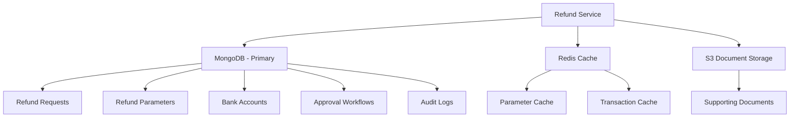
```mermaid
graph TD
    A[Refund Service] --> B[MongoDB - Primary]
    A --> C[Redis Cache]
    A --> D[S3 Document Storage]
    B --> E[Refund Requests]
    B --> F[Refund Parameters]
    B --> G[Bank Accounts]
    B --> H[Approval Workflows]
    B --> I[Audit Logs]
    C --> J[Parameter Cache]
    C --> K[Transaction Cache]
    D --> L[Supporting Documents]
```

### 3.4 THIRD-PARTY SERVICES

ServicePurposeIntegration MethodJustificationStripe APIPayment processingREST APIDirect integration required for ORIGINAL_PAYMENT refund method on Stripe transactions.Fiserv APIPayment processingREST APIDirect integration required for ORIGINAL_PAYMENT refund method on Fiserv transactions.Auth0AuthenticationOAuth 2.0Secure authentication for both Barracuda and Pike interfaces, supporting the diverse user roles specified.AWS SQSMessage queuingSDKReliable message delivery for asynchronous refund processing and notifications.DataDogMonitoring & alertingAgent & APIComprehensive monitoring for tracking refund performance metrics and ensuring 99.9% uptime requirement.SentryError trackingSDKReal-time error reporting crucial for rapid identification of refund processing issues.

#### Service Integration Diagram

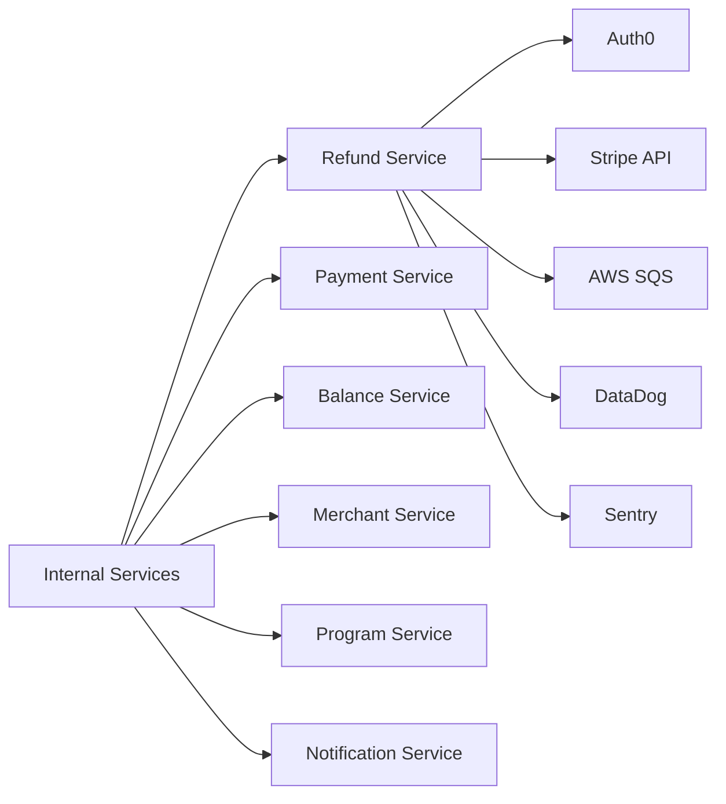
```mermaid
graph LR
    A[Refund Service] --> B[Auth0]
    A --> C[Stripe API]
    A --> F[AWS SQS]
    A --> G[DataDog]
    A --> H[Sentry]
    I[Internal Services] --> A
    I --> J[Payment Service]
    I --> K[Balance Service]
    I --> L[Merchant Service]
    I --> M[Program Service]
    I --> N[Notification Service]
```

### 3.5 DATABASES & STORAGE

#### Data Flow Architecture

Data StoreData TypeRetention PolicyBackup StrategyPostgresql - Refund TransactionsCore refund data7+ yearsDaily backups, point-in-time recoveryPostgresql - ConfigurationParameter settingsIndefinite with versioningDaily backups, change trackingRedisCached dataConfigurable TTL (minutes to hours)Persistence enabled, cluster replicationS3Document storage7+ yearsCross-region replication, versioning

### 3.6 DEVELOPMENT & DEPLOYMENT

Tool/PlatformVersionPurposeJustificationDocker24.0+ContainerizationConsistent runtime environment across development and production.AWS ECSN/AContainer orchestrationManaged container service that balances control and operational efficiency.Terraform1.5+Infrastructure as codeEnsures consistent environment setup across regions and enables disaster recovery.GitHub ActionsN/ACI/CD pipelineAutomated testing, validation, and deployment, supporting zero-downtime requirement.AWS CloudWatchN/ALogging & monitoringCentralized logging crucial for debugging complex refund flows.AWS CloudFrontN/ACDNFast delivery of frontend assets for Pike and Barracuda interfaces.

#### Deployment Architecture

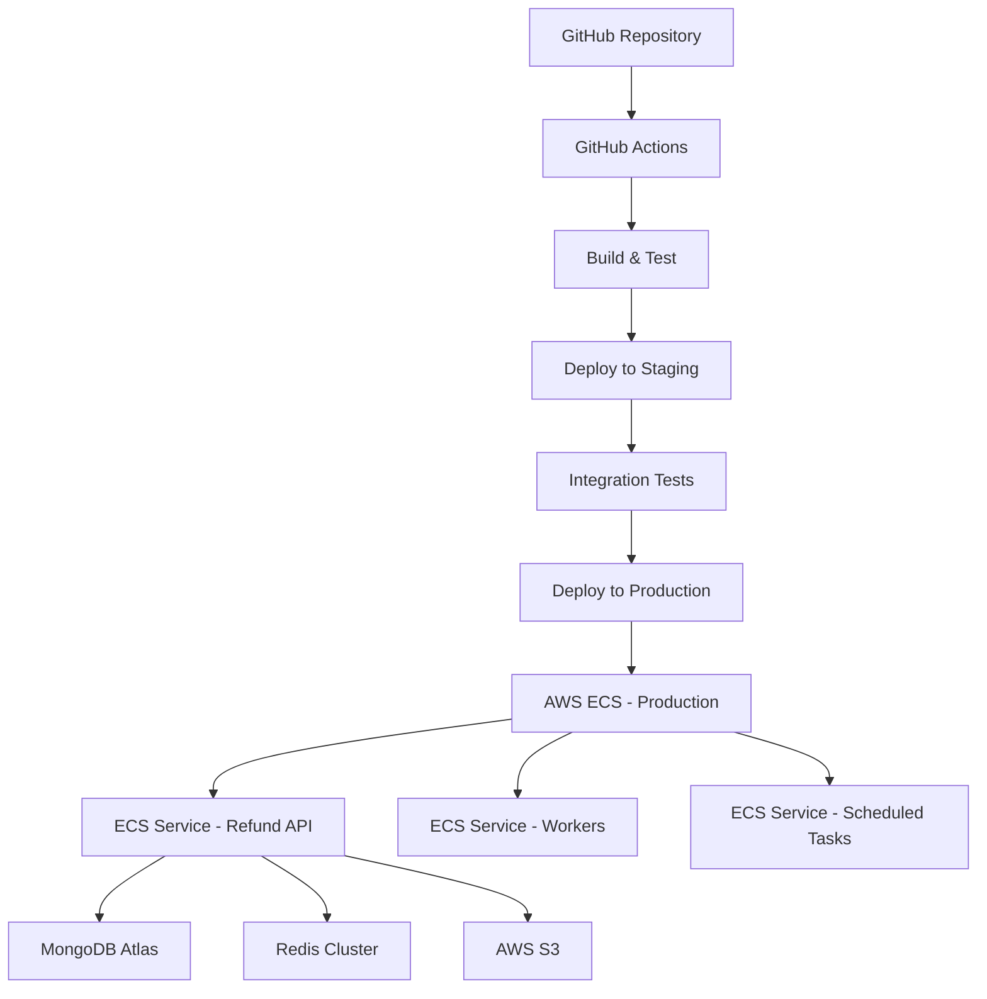
```mermaid
graph TD
    A[GitHub Repository] --> B[GitHub Actions]
    B --> C[Build & Test]
    C --> D[Deploy to Staging]
    D --> E[Integration Tests]
    E --> F[Deploy to Production]
    F --> G[AWS ECS - Production]
    G --> H[ECS Service - Refund API]
    G --> I[ECS Service - Workers]
    G --> J[ECS Service - Scheduled Tasks]
    H --> K[MongoDB Atlas]
    H --> L[Redis Cluster]
    H --> M[AWS S3]
```

### 3.7 SECURITY INFRASTRUCTURE

ComponentPurposeImplementationJustificationAWS KMSEncryption key managementAPI integrationSecure management of encryption keys for PCI DSS compliance.AWS WAFWeb application firewallCloudFront integrationProtection against common web vulnerabilities and attacks.Auth0 RBACRole-based access controlSDK integrationEnforces granular permissions model for different user roles.AWS CloudTrailAPI auditingAWS integrationProvides comprehensive audit trail of all API interactions.MongoDB Field-Level EncryptionData protectionApplication-levelEncrypts sensitive payment data at rest to meet PCI requirements.

The technology stack has been designed to support the high reliability (99.9% uptime), performance (processing 1000 refund requests per minute), and security (PCI DSS compliance) requirements of the Refunds Service while maintaining alignment with the organization's existing technology standards.

## 4. PROCESS FLOWCHART

### 4.1 SYSTEM WORKFLOWS

#### 4.1.1 Core Business Processes

##### Refund Request Lifecycle

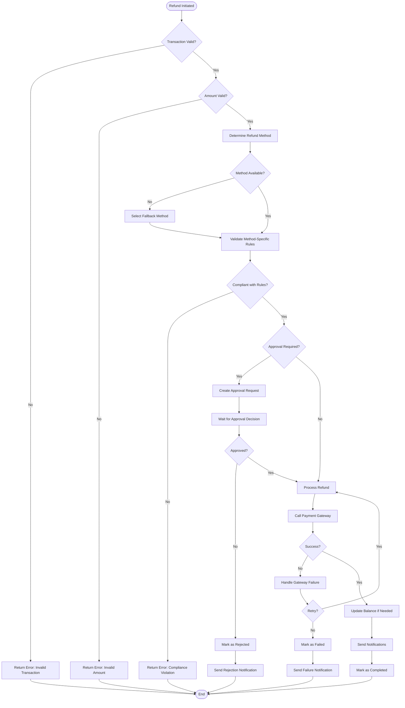
```mermaid
flowchart TD
    Start([Refund Initiated]) --> ValidateTransaction{Transaction Valid?}
    ValidateTransaction -->|No| InvalidTransaction[Return Error: Invalid Transaction]
    ValidateTransaction -->|Yes| ValidateAmount{Amount Valid?}
    ValidateAmount -->|No| InvalidAmount[Return Error: Invalid Amount]
    ValidateAmount -->|Yes| DetermineRefundMethod[Determine Refund Method]
    DetermineRefundMethod --> CheckMethodAvailable{Method Available?}
    CheckMethodAvailable -->|No| FallbackMethod[Select Fallback Method]
    CheckMethodAvailable -->|Yes| ValidateMethod[Validate Method-Specific Rules]
    FallbackMethod --> ValidateMethod
    ValidateMethod --> CheckCompliance{Compliant with Rules?}
    CheckCompliance -->|No| ComplianceError[Return Error: Compliance Violation]
    CheckCompliance -->|Yes| CheckApprovalNeeded{Approval Required?}
    CheckApprovalNeeded -->|Yes| CreateApprovalRequest[Create Approval Request]
    CreateApprovalRequest --> WaitForApproval[Wait for Approval Decision]
    WaitForApproval --> CheckApprovalStatus{Approved?}
    CheckApprovalStatus -->|No| RefundRejected[Mark as Rejected]
    CheckApprovalStatus -->|Yes| ProcessRefund[Process Refund]
    CheckApprovalNeeded -->|No| ProcessRefund
    ProcessRefund --> IntegrateWithGateway[Call Payment Gateway]
    IntegrateWithGateway --> CheckGatewayResponse{Success?}
    CheckGatewayResponse -->|No| HandleFailure[Handle Gateway Failure]
    HandleFailure --> RetryPolicy{Retry?}
    RetryPolicy -->|Yes| ProcessRefund
    RetryPolicy -->|No| MarkFailed[Mark as Failed]
    CheckGatewayResponse -->|Yes| UpdateBalance[Update Balance if Needed]
    UpdateBalance --> NotifyUser[Send Notifications]
    NotifyUser --> UpdateRefundStatus[Mark as Completed]
    UpdateRefundStatus --> End([End])
    MarkFailed --> NotifyFailure[Send Failure Notification] --> End
    RefundRejected --> NotifyRejection[Send Rejection Notification] --> End
    InvalidTransaction --> End
    InvalidAmount --> End
    ComplianceError --> End
```

##### Approval Workflow Process

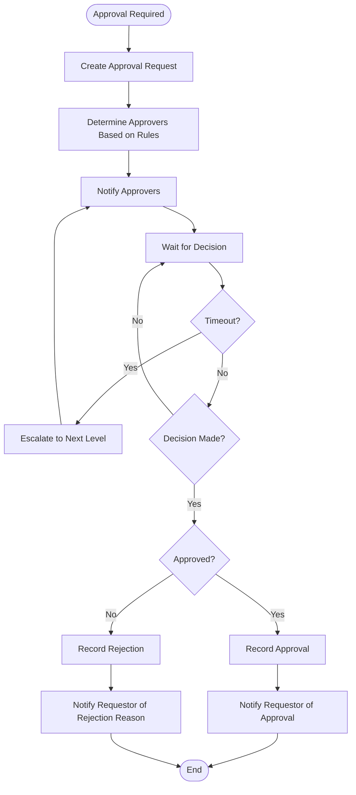
```mermaid
flowchart TD
    Start([Approval Required]) --> CreateRequest[Create Approval Request]
    CreateRequest --> DetermineApprovers[Determine Approvers Based on Rules]
    DetermineApprovers --> NotifyApprovers[Notify Approvers]
    NotifyApprovers --> WaitForDecision[Wait for Decision]
    WaitForDecision --> CheckTimeout{Timeout?}
    CheckTimeout -->|Yes| EscalateRequest[Escalate to Next Level]
    EscalateRequest --> NotifyApprovers
    CheckTimeout -->|No| CheckDecision{Decision Made?}
    CheckDecision -->|No| WaitForDecision
    CheckDecision -->|Yes| ProcessDecision{Approved?}
    ProcessDecision -->|Yes| RecordApproval[Record Approval]
    ProcessDecision -->|No| RecordRejection[Record Rejection]
    RecordApproval --> NotifyRequestor[Notify Requestor of Approval]
    RecordRejection --> NotifyRejectionReason[Notify Requestor of Rejection Reason]
    NotifyRequestor --> End([End])
    NotifyRejectionReason --> End
```

##### User Refund Request Journey

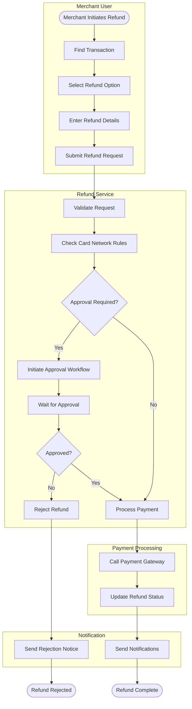
```mermaid
flowchart TD
    subgraph Merchant User
        Start([Merchant Initiates Refund]) --> FindTransaction[Find Transaction]
        FindTransaction --> SelectRefund[Select Refund Option]
        SelectRefund --> EnterDetails[Enter Refund Details]
        EnterDetails --> SubmitRequest[Submit Refund Request]
    end
    
    subgraph Refund Service
        SubmitRequest --> ValidateRequest[Validate Request]
        ValidateRequest --> CheckCompliance[Check Card Network Rules]
        CheckCompliance --> ApprovalCheck{Approval Required?}
        ApprovalCheck -->|Yes| ApprovalWorkflow[Initiate Approval Workflow]
        ApprovalWorkflow --> WaitForApproval[Wait for Approval]
        WaitForApproval --> CheckApproval{Approved?}
        CheckApproval -->|No| RejectRefund[Reject Refund]
        CheckApproval -->|Yes| ProcessPayment[Process Payment]
        ApprovalCheck -->|No| ProcessPayment
    end
    
    subgraph Payment Processing
        ProcessPayment --> GatewayIntegration[Call Payment Gateway]
        GatewayIntegration --> StatusUpdate[Update Refund Status]
    end
    
    subgraph Notification
        StatusUpdate --> SendNotification[Send Notifications]
        RejectRefund --> SendRejectionNotice[Send Rejection Notice]
    end
    
    SendNotification --> End([Refund Complete])
    SendRejectionNotice --> End2([Refund Rejected])
```

#### 4.1.2 Integration Workflows

##### Payment Gateway Integration Flow

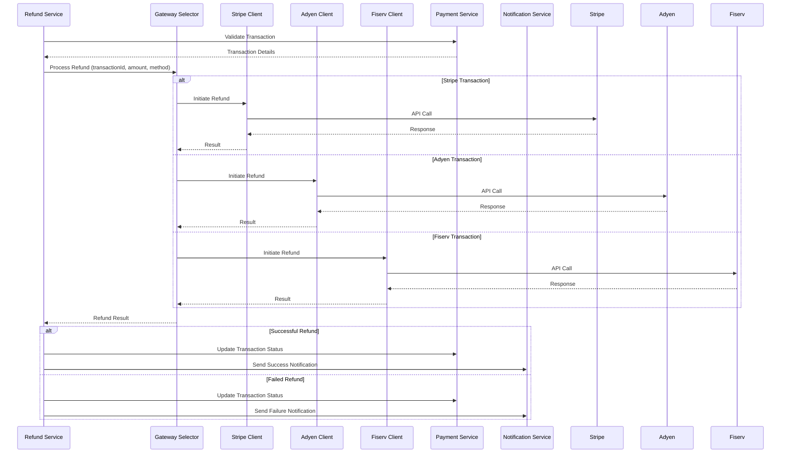
```mermaid
sequenceDiagram
    participant RS as Refund Service
    participant GS as Gateway Selector
    participant SC as Stripe Client
    participant AC as Adyen Client
    participant FC as Fiserv Client
    participant PS as Payment Service
    participant NS as Notification Service
    
    RS->>PS: Validate Transaction
    PS-->>RS: Transaction Details
    
    RS->>GS: Process Refund (transactionId, amount, method)
    
    alt Stripe Transaction
        GS->>SC: Initiate Refund
        SC->>Stripe: API Call
        Stripe-->>SC: Response
        SC-->>GS: Result
    else Adyen Transaction
        GS->>AC: Initiate Refund
        AC->>Adyen: API Call
        Adyen-->>AC: Response
        AC-->>GS: Result
    else Fiserv Transaction
        GS->>FC: Initiate Refund
        FC->>Fiserv: API Call
        Fiserv-->>FC: Response
        FC-->>GS: Result
    end
    
    GS-->>RS: Refund Result
    
    alt Successful Refund
        RS->>PS: Update Transaction Status
        RS->>NS: Send Success Notification
    else Failed Refund
        RS->>PS: Update Transaction Status
        RS->>NS: Send Failure Notification
    end
```

##### Event Processing Flow

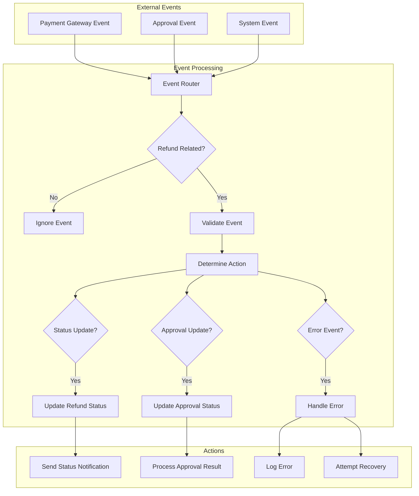
```mermaid
flowchart TD
    subgraph External Events
        PaymentGatewayEvent[Payment Gateway Event]
        ApprovalEvent[Approval Event]
        SystemEvent[System Event]
    end
    
    subgraph Event Processing
        PaymentGatewayEvent --> EventRouter[Event Router]
        ApprovalEvent --> EventRouter
        SystemEvent --> EventRouter
        
        EventRouter --> IsRefundEvent{Refund Related?}
        IsRefundEvent -->|No| IgnoreEvent[Ignore Event]
        IsRefundEvent -->|Yes| ValidateEvent[Validate Event]
        ValidateEvent --> DetermineAction[Determine Action]
        
        DetermineAction --> StatusUpdate{Status Update?}
        StatusUpdate -->|Yes| UpdateRefundStatus[Update Refund Status]
        
        DetermineAction --> ApprovalUpdate{Approval Update?}
        ApprovalUpdate -->|Yes| UpdateApprovalStatus[Update Approval Status]
        
        DetermineAction --> ErrorEvent{Error Event?}
        ErrorEvent -->|Yes| HandleError[Handle Error]
    end
    
    subgraph Actions
        UpdateRefundStatus --> NotifyStatus[Send Status Notification]
        UpdateApprovalStatus --> ProcessApprovalResult[Process Approval Result]
        HandleError --> LogError[Log Error]
        HandleError --> AttemptRecovery[Attempt Recovery]
    end
```

##### Batch Processing Sequence

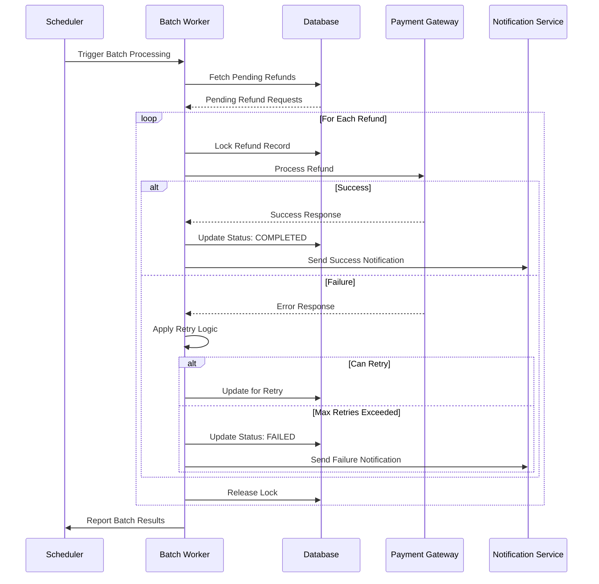
```mermaid
sequenceDiagram
    participant Scheduler as Scheduler
    participant Worker as Batch Worker
    participant DB as Database
    participant Gateway as Payment Gateway
    participant NS as Notification Service
    
    Scheduler->>Worker: Trigger Batch Processing
    Worker->>DB: Fetch Pending Refunds
    DB-->>Worker: Pending Refund Requests
    
    loop For Each Refund
        Worker->>DB: Lock Refund Record
        Worker->>Gateway: Process Refund
        
        alt Success
            Gateway-->>Worker: Success Response
            Worker->>DB: Update Status: COMPLETED
            Worker->>NS: Send Success Notification
        else Failure
            Gateway-->>Worker: Error Response
            Worker->>Worker: Apply Retry Logic
            
            alt Can Retry
                Worker->>DB: Update for Retry
            else Max Retries Exceeded
                Worker->>DB: Update Status: FAILED
                Worker->>NS: Send Failure Notification
            end
        end
        
        Worker->>DB: Release Lock
    end
    
    Worker->>Scheduler: Report Batch Results
```

### 4.2 FLOWCHART REQUIREMENTS

#### 4.2.1 Refund Method Selection Flow

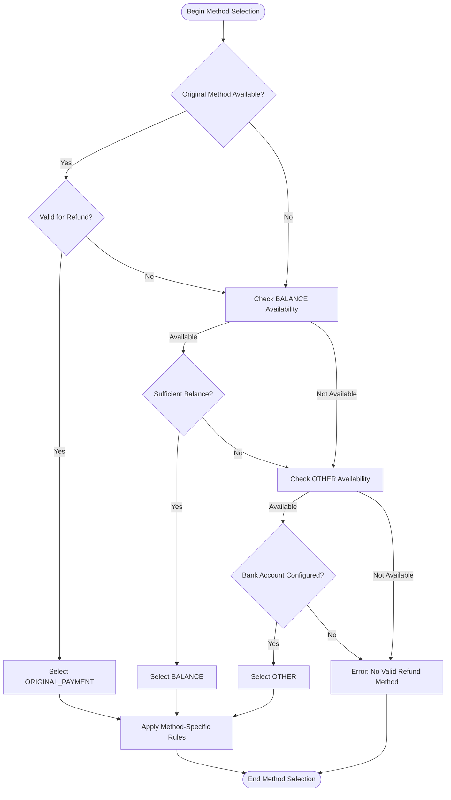
```mermaid
flowchart TD
    Start([Begin Method Selection]) --> CheckOriginal{Original Method Available?}
    
    CheckOriginal -->|Yes| ValidateOriginal{Valid for Refund?}
    ValidateOriginal -->|Yes| SelectOriginal[Select ORIGINAL_PAYMENT]
    ValidateOriginal -->|No| CheckBalance[Check BALANCE Availability]
    
    CheckOriginal -->|No| CheckBalance
    
    CheckBalance -->|Available| ValidateBalance{Sufficient Balance?}
    ValidateBalance -->|Yes| SelectBalance[Select BALANCE]
    ValidateBalance -->|No| CheckOther[Check OTHER Availability]
    
    CheckBalance -->|Not Available| CheckOther
    
    CheckOther -->|Available| ValidateOther{Bank Account Configured?}
    ValidateOther -->|Yes| SelectOther[Select OTHER]
    ValidateOther -->|No| ErrorState[Error: No Valid Refund Method]
    
    CheckOther -->|Not Available| ErrorState
    
    SelectOriginal --> ApplyMethodRules[Apply Method-Specific Rules]
    SelectBalance --> ApplyMethodRules
    SelectOther --> ApplyMethodRules
    
    ApplyMethodRules --> End([End Method Selection])
    ErrorState --> End
```

#### 4.2.2 Validation Rules Flow

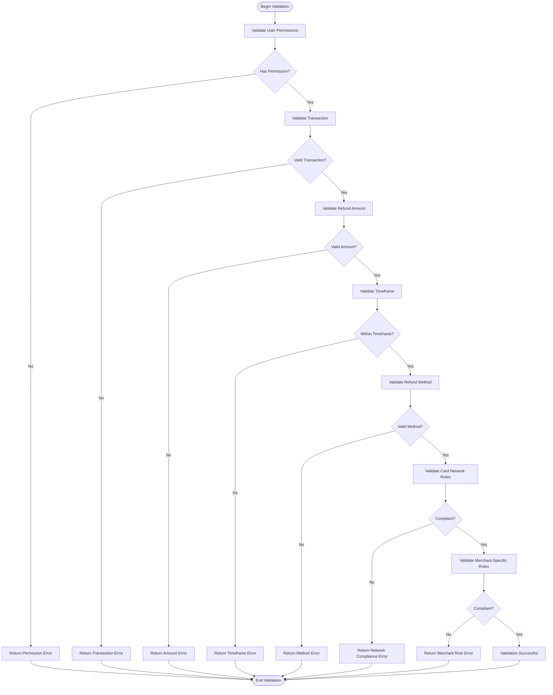
```mermaid
flowchart TD
    Start([Begin Validation]) --> ValidateUser[Validate User Permissions]
    
    ValidateUser --> Permission{Has Permission?}
    Permission -->|No| PermissionError[Return Permission Error]
    Permission -->|Yes| ValidateTransaction[Validate Transaction]
    
    ValidateTransaction --> Transaction{Valid Transaction?}
    Transaction -->|No| TransactionError[Return Transaction Error]
    Transaction -->|Yes| ValidateAmount[Validate Refund Amount]
    
    ValidateAmount --> Amount{Valid Amount?}
    Amount -->|No| AmountError[Return Amount Error]
    Amount -->|Yes| ValidateTimeframe[Validate Timeframe]
    
    ValidateTimeframe --> Timeframe{Within Timeframe?}
    Timeframe -->|No| TimeframeError[Return Timeframe Error]
    Timeframe -->|Yes| ValidateMethod[Validate Refund Method]
    
    ValidateMethod --> Method{Valid Method?}
    Method -->|No| MethodError[Return Method Error]
    Method -->|Yes| ValidateNetwork[Validate Card Network Rules]
    
    ValidateNetwork --> Network{Compliant?}
    Network -->|No| NetworkError[Return Network Compliance Error]
    Network -->|Yes| ValidateMerchant[Validate Merchant-Specific Rules]
    
    ValidateMerchant --> Merchant{Compliant?}
    Merchant -->|No| MerchantError[Return Merchant Rule Error]
    Merchant -->|Yes| ValidationSuccess[Validation Successful]
    
    ValidationSuccess --> End([End Validation])
    PermissionError --> End
    TransactionError --> End
    AmountError --> End
    TimeframeError --> End
    MethodError --> End
    NetworkError --> End
    MerchantError --> End
```

#### 4.2.3 Card Network Compliance Check

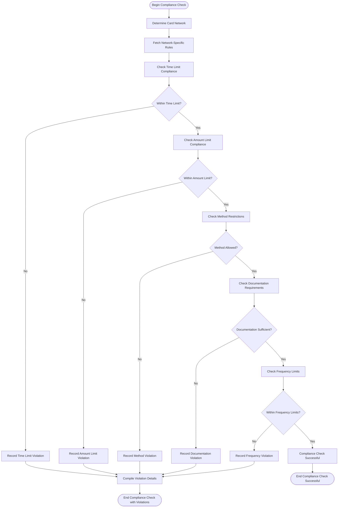
```mermaid
flowchart TD
    Start([Begin Compliance Check]) --> GetCardType[Determine Card Network]
    
    GetCardType --> FetchRules[Fetch Network-Specific Rules]
    FetchRules --> CheckTimeLimit[Check Time Limit Compliance]
    
    CheckTimeLimit --> TimeCompliant{Within Time Limit?}
    TimeCompliant -->|No| TimeViolation[Record Time Limit Violation]
    TimeCompliant -->|Yes| CheckAmountLimit[Check Amount Limit Compliance]
    
    CheckAmountLimit --> AmountCompliant{Within Amount Limit?}
    AmountCompliant -->|No| AmountViolation[Record Amount Limit Violation]
    AmountCompliant -->|Yes| CheckMethodRestriction[Check Method Restrictions]
    
    CheckMethodRestriction --> MethodCompliant{Method Allowed?}
    MethodCompliant -->|No| MethodViolation[Record Method Violation]
    MethodCompliant -->|Yes| CheckDocumentation[Check Documentation Requirements]
    
    CheckDocumentation --> DocCompliant{Documentation Sufficient?}
    DocCompliant -->|No| DocViolation[Record Documentation Violation]
    DocCompliant -->|Yes| CheckFrequency[Check Frequency Limits]
    
    CheckFrequency --> FreqCompliant{Within Frequency Limits?}
    FreqCompliant -->|No| FreqViolation[Record Frequency Violation]
    FreqCompliant -->|Yes| ComplianceSuccess[Compliance Check Successful]
    
    TimeViolation --> CompileViolations[Compile Violation Details]
    AmountViolation --> CompileViolations
    MethodViolation --> CompileViolations
    DocViolation --> CompileViolations
    FreqViolation --> CompileViolations
    
    CompileViolations --> End([End Compliance Check with Violations])
    ComplianceSuccess --> EndSuccess([End Compliance Check Successful])
```

### 4.3 TECHNICAL IMPLEMENTATION

#### 4.3.1 State Management

##### Refund Request State Transitions

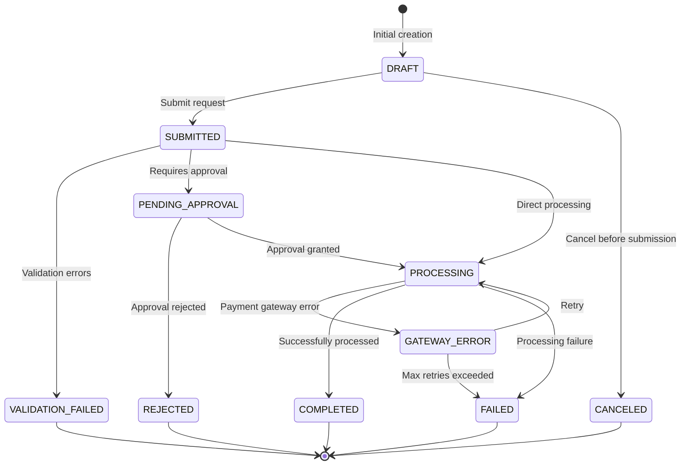
```mermaid
stateDiagram-v2
    [*] --> DRAFT: Initial creation
    
    DRAFT --> SUBMITTED: Submit request
    DRAFT --> CANCELED: Cancel before submission
    
    SUBMITTED --> VALIDATION_FAILED: Validation errors
    SUBMITTED --> PENDING_APPROVAL: Requires approval
    SUBMITTED --> PROCESSING: Direct processing
    
    PENDING_APPROVAL --> REJECTED: Approval rejected
    PENDING_APPROVAL --> PROCESSING: Approval granted
    
    PROCESSING --> GATEWAY_ERROR: Payment gateway error
    PROCESSING --> COMPLETED: Successfully processed
    PROCESSING --> FAILED: Processing failure
    
    GATEWAY_ERROR --> PROCESSING: Retry
    GATEWAY_ERROR --> FAILED: Max retries exceeded
    
    COMPLETED --> [*]
    CANCELED --> [*]
    REJECTED --> [*]
    FAILED --> [*]
    VALIDATION_FAILED --> [*]
```

##### Transaction Boundaries

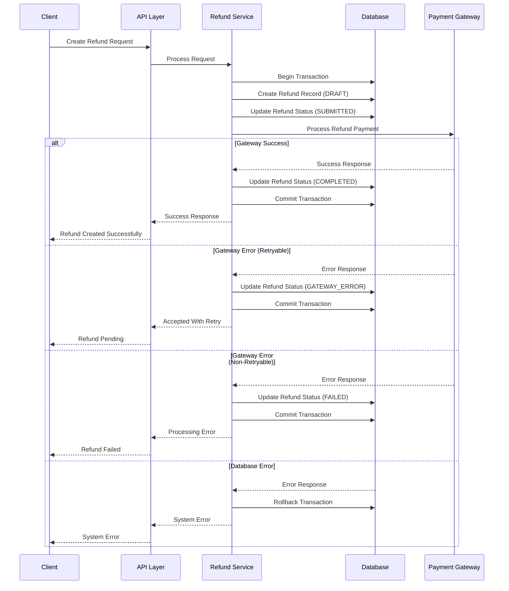
```mermaid
sequenceDiagram
    participant Client
    participant API as API Layer
    participant Service as Refund Service
    participant DB as Database
    participant Gateway as Payment Gateway
    
    Client->>API: Create Refund Request
    
    API->>Service: Process Request
    
    Service->>DB: Begin Transaction
    
    Service->>DB: Create Refund Record (DRAFT)
    
    Service->>DB: Update Refund Status (SUBMITTED)
    
    Service->>Gateway: Process Refund Payment
    
    alt Gateway Success
        Gateway-->>Service: Success Response
        Service->>DB: Update Refund Status (COMPLETED)
        Service->>DB: Commit Transaction
        Service-->>API: Success Response
        API-->>Client: Refund Created Successfully
    else Gateway Error (Retryable)
        Gateway-->>Service: Error Response
        Service->>DB: Update Refund Status (GATEWAY_ERROR)
        Service->>DB: Commit Transaction
        Service-->>API: Accepted With Retry
        API-->>Client: Refund Pending
    else Gateway Error (Non-Retryable)
        Gateway-->>Service: Error Response
        Service->>DB: Update Refund Status (FAILED)
        Service->>DB: Commit Transaction
        Service-->>API: Processing Error
        API-->>Client: Refund Failed
    else Database Error
        DB-->>Service: Error Response
        Service->>DB: Rollback Transaction
        Service-->>API: System Error
        API-->>Client: System Error
    end
```

#### 4.3.2 Error Handling

##### Error Handling and Recovery Flow

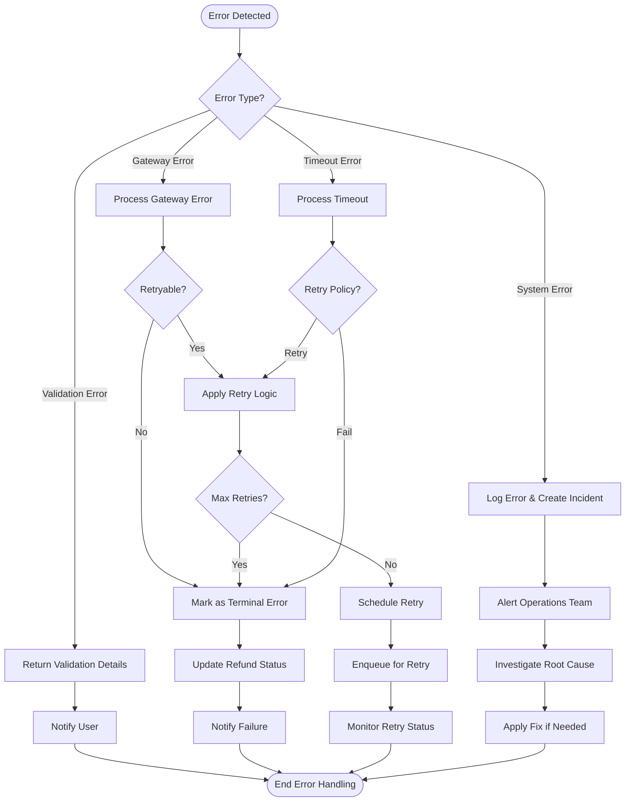
```mermaid
flowchart TD
    Start([Error Detected]) --> CategorizeError{Error Type?}
    
    CategorizeError -->|Validation Error| HandleValidation[Return Validation Details]
    CategorizeError -->|System Error| HandleSystem[Log Error & Create Incident]
    CategorizeError -->|Gateway Error| HandleGateway[Process Gateway Error]
    CategorizeError -->|Timeout Error| HandleTimeout[Process Timeout]
    
    HandleGateway --> IsRetryable{Retryable?}
    IsRetryable -->|Yes| RetryLogic[Apply Retry Logic]
    IsRetryable -->|No| TerminalError[Mark as Terminal Error]
    
    RetryLogic --> MaxRetries{Max Retries?}
    MaxRetries -->|No| ScheduleRetry[Schedule Retry]
    MaxRetries -->|Yes| TerminalError
    
    HandleTimeout --> TimeoutRetry{Retry Policy?}
    TimeoutRetry -->|Retry| RetryLogic
    TimeoutRetry -->|Fail| TerminalError
    
    HandleValidation --> NotifyUser[Notify User]
    HandleSystem --> AlertOperations[Alert Operations Team]
    TerminalError --> UpdateStatus[Update Refund Status]
    ScheduleRetry --> EnqueueRetry[Enqueue for Retry]
    
    NotifyUser --> End([End Error Handling])
    AlertOperations --> InvestigateRoot[Investigate Root Cause]
    UpdateStatus --> NotifyFailure[Notify Failure]
    EnqueueRetry --> MonitorRetry[Monitor Retry Status]
    
    InvestigateRoot --> ApplyFix[Apply Fix if Needed]
    NotifyFailure --> End
    MonitorRetry --> End
    ApplyFix --> End
```

##### Retry Strategy

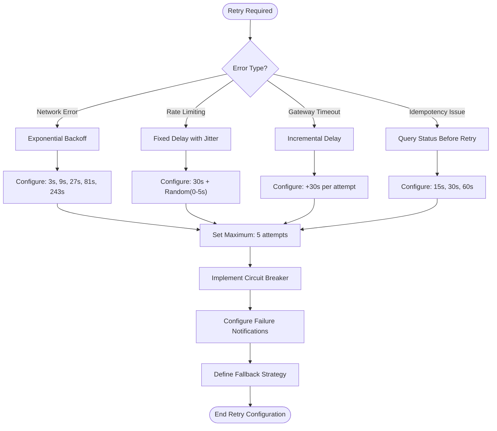
```mermaid
flowchart TD
    Start([Retry Required]) --> DetermineStrategy{Error Type?}

    DetermineStrategy -->|Network Error| NetworkRetry[Exponential Backoff]
    DetermineStrategy -->|Rate Limiting| RateLimitRetry[Fixed Delay with Jitter]
    DetermineStrategy -->|Gateway Timeout| TimeoutRetry[Incremental Delay]
    DetermineStrategy -->|Idempotency Issue| IdempotencyRetry[Query Status Before Retry]

    NetworkRetry --> ConfigureBackoff[Configure: 3s, 9s, 27s, 81s, 243s]
    RateLimitRetry --> ConfigureRateLimit["Configure: 30s + Random(0-5s)"]
    TimeoutRetry --> ConfigureTimeout[Configure: +30s per attempt]
    IdempotencyRetry --> ConfigureIdempotency[Configure: 15s, 30s, 60s]

    ConfigureBackoff --> SetMaxAttempts[Set Maximum: 5 attempts]
    ConfigureRateLimit --> SetMaxAttempts
    ConfigureTimeout --> SetMaxAttempts
    ConfigureIdempotency --> SetMaxAttempts

    SetMaxAttempts --> ImplementCircuitBreaker[Implement Circuit Breaker]
    ImplementCircuitBreaker --> ConfigureNotification[Configure Failure Notifications]
    ConfigureNotification --> DefineFallback[Define Fallback Strategy]
    DefineFallback --> End([End Retry Configuration])
```

### 4.4 INTEGRATION SEQUENCE DIAGRAMS

#### 4.4.1 Original Payment Method Refund Flow

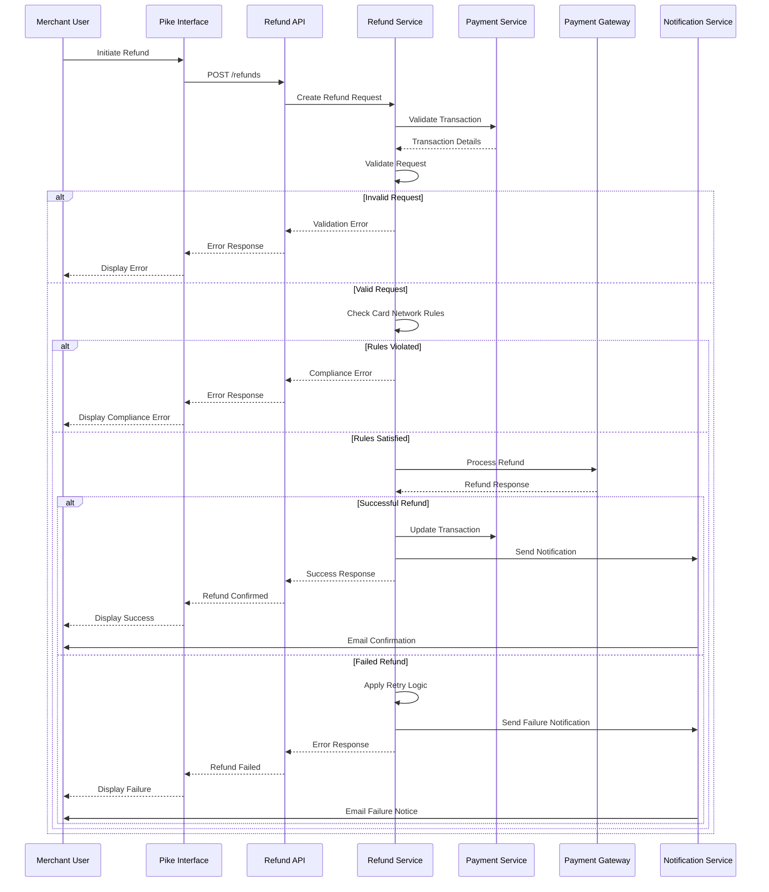
```mermaid
sequenceDiagram
    participant Merchant as Merchant User
    participant Pike as Pike Interface
    participant API as Refund API
    participant RS as Refund Service
    participant PS as Payment Service
    participant Gateway as Payment Gateway
    participant NS as Notification Service
    
    Merchant->>Pike: Initiate Refund
    Pike->>API: POST /refunds
    
    API->>RS: Create Refund Request
    RS->>PS: Validate Transaction
    PS-->>RS: Transaction Details
    
    RS->>RS: Validate Request
    
    alt Invalid Request
        RS-->>API: Validation Error
        API-->>Pike: Error Response
        Pike-->>Merchant: Display Error
    else Valid Request
        RS->>RS: Check Card Network Rules
        
        alt Rules Violated
            RS-->>API: Compliance Error
            API-->>Pike: Error Response
            Pike-->>Merchant: Display Compliance Error
        else Rules Satisfied
            RS->>Gateway: Process Refund
            Gateway-->>RS: Refund Response
            
            alt Successful Refund
                RS->>PS: Update Transaction
                RS->>NS: Send Notification
                RS-->>API: Success Response
                API-->>Pike: Refund Confirmed
                Pike-->>Merchant: Display Success
                NS->>Merchant: Email Confirmation
            else Failed Refund
                RS->>RS: Apply Retry Logic
                RS->>NS: Send Failure Notification
                RS-->>API: Error Response
                API-->>Pike: Refund Failed
                Pike-->>Merchant: Display Failure
                NS->>Merchant: Email Failure Notice
            end
        end
    end
```

#### 4.4.2 Refund Parameter Resolution Flow

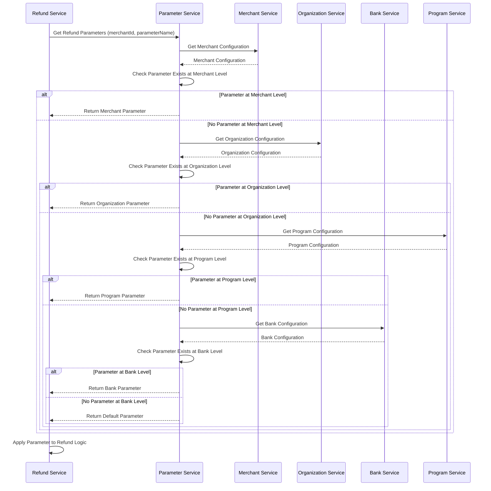
```mermaid
sequenceDiagram
    participant RS as Refund Service
    participant PS as Parameter Service
    participant MS as Merchant Service
    participant OS as Organization Service
    participant BS as Bank Service
    participant PGS as Program Service
    
    RS->>PS: Get Refund Parameters (merchantId, parameterName)
    
    PS->>MS: Get Merchant Configuration
    MS-->>PS: Merchant Configuration
    
    PS->>PS: Check Parameter Exists at Merchant Level
    
    alt Parameter at Merchant Level
        PS-->>RS: Return Merchant Parameter
    else No Parameter at Merchant Level
        PS->>OS: Get Organization Configuration
        OS-->>PS: Organization Configuration
        
        PS->>PS: Check Parameter Exists at Organization Level
        
        alt Parameter at Organization Level
            PS-->>RS: Return Organization Parameter
        else No Parameter at Organization Level
            PS->>PGS: Get Program Configuration
            PGS-->>PS: Program Configuration
            
            PS->>PS: Check Parameter Exists at Program Level
            
            alt Parameter at Program Level
                PS-->>RS: Return Program Parameter
            else No Parameter at Program Level
                PS->>BS: Get Bank Configuration
                BS-->>PS: Bank Configuration
                
                PS->>PS: Check Parameter Exists at Bank Level
                
                alt Parameter at Bank Level
                    PS-->>RS: Return Bank Parameter
                else No Parameter at Bank Level
                    PS-->>RS: Return Default Parameter
                end
            end
        end
    end
    
    RS->>RS: Apply Parameter to Refund Logic
```

#### 4.4.3 Approval Workflow Sequence

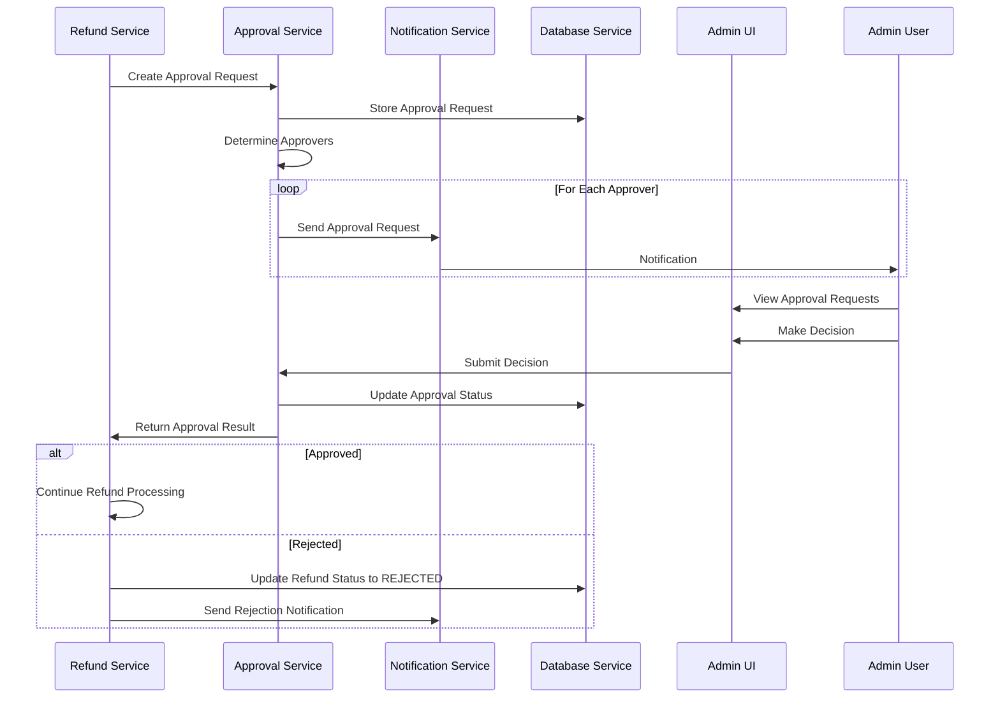
```mermaid
sequenceDiagram
    participant RS as Refund Service
    participant AS as Approval Service
    participant NS as Notification Service
    participant DBS as Database Service
    participant UI as Admin UI
    participant Admin as Admin User
    
    RS->>AS: Create Approval Request
    AS->>DBS: Store Approval Request
    AS->>AS: Determine Approvers
    
    loop For Each Approver
        AS->>NS: Send Approval Request
        NS->>Admin: Notification
    end
    
    Admin->>UI: View Approval Requests
    Admin->>UI: Make Decision
    UI->>AS: Submit Decision
    
    AS->>DBS: Update Approval Status
    AS->>RS: Return Approval Result
    
    alt Approved
        RS->>RS: Continue Refund Processing
    else Rejected
        RS->>DBS: Update Refund Status to REJECTED
        RS->>NS: Send Rejection Notification
    end
```

### 4.5 ERROR STATES AND RECOVERY

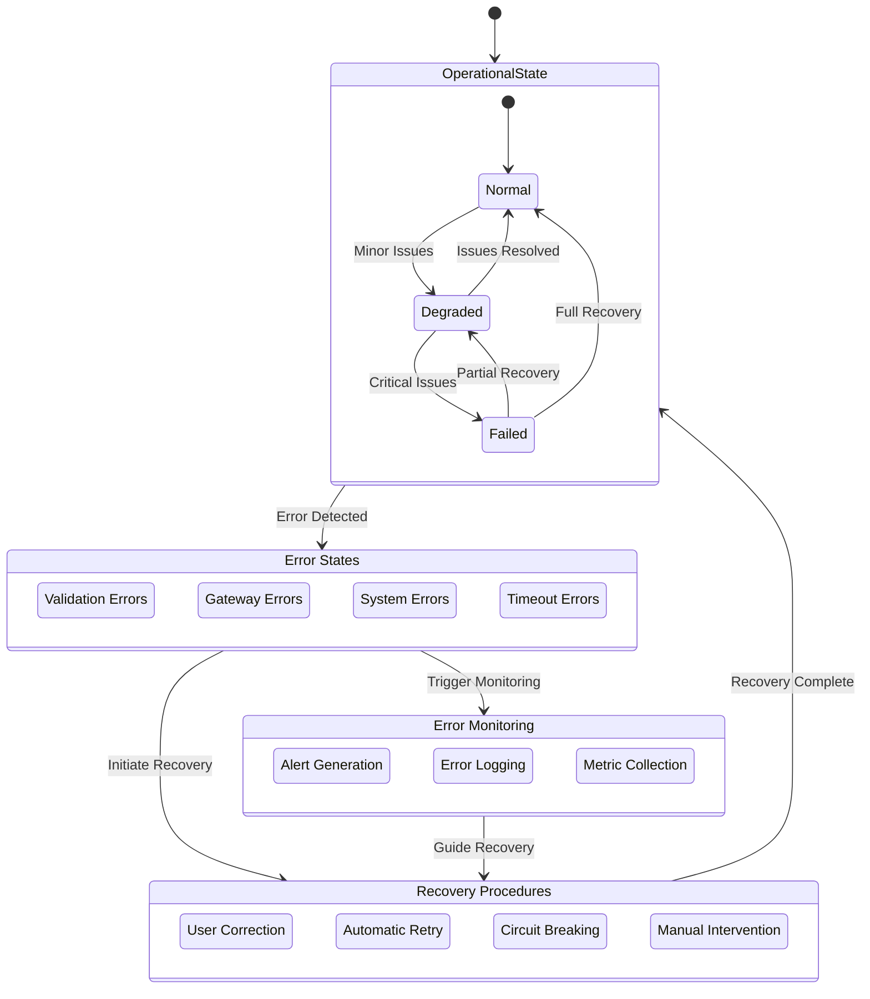
```mermaid
stateDiagram-v2
    [*] --> OperationalState
    
    state OperationalState {
        [*] --> Normal
        
        Normal --> Degraded: Minor Issues
        Degraded --> Normal: Issues Resolved
        Degraded --> Failed: Critical Issues
        Failed --> Degraded: Partial Recovery
        Failed --> Normal: Full Recovery
    }
    
    state "Error States" as ErrorStates {
        state "Validation Errors" as ValidationErrors
        state "Gateway Errors" as GatewayErrors
        state "System Errors" as SystemErrors
        state "Timeout Errors" as TimeoutErrors
    }
    
    OperationalState --> ErrorStates: Error Detected
    
    state "Recovery Procedures" as RecoveryProcedures {
        state "User Correction" as UserCorrection
        state "Automatic Retry" as AutomaticRetry
        state "Circuit Breaking" as CircuitBreaking
        state "Manual Intervention" as ManualIntervention
    }
    
    ErrorStates --> RecoveryProcedures: Initiate Recovery
    RecoveryProcedures --> OperationalState: Recovery Complete
    
    state "Error Monitoring" as ErrorMonitoring {
        state "Alert Generation" as AlertGeneration
        state "Error Logging" as ErrorLogging
        state "Metric Collection" as MetricCollection
    }
    
    ErrorStates --> ErrorMonitoring: Trigger Monitoring
    ErrorMonitoring --> RecoveryProcedures: Guide Recovery
```

### 4.6 TIMING AND SLA CONSIDERATIONS

```mermaid
gantt
    title Refund Processing SLAs
    dateFormat  YYYY-MM-DD
    axisFormat %d
    
    section Validation
    API Response Time (200ms)           :val, 2023-01-01, 1d
    
    section Approval
    Standard Approval (4h)              :std_appr, after val, 4d
    Expedited Approval (1h)             :exp_appr, after val, 1d
    
    section Processing
    Standard Processing (24h)           :std_proc, after std_appr, 24d
    High Priority Processing (4h)       :high_proc, after exp_appr, 4d
    
    section Gateway
    Gateway Communication (30s)         :gateway, 2023-01-02, 1d
    
    section Notification
    Status Update (5min)                :notification, after gateway, 5d
    
    section Retry Logic
    Initial Retry (5min)                :retry1, after gateway, 5d
    Secondary Retry (15min)             :retry2, after retry1, 15d
    Final Retry (30min)                 :retry3, after retry2, 30d
```

## 5. SYSTEM ARCHITECTURE

### 5.1 HIGH-LEVEL ARCHITECTURE

#### System Overview

The Refunds Service utilizes a microservices architecture to provide a robust, scalable, and maintainable solution for refund processing. This architectural approach was selected for its ability to handle the diverse refund workflows, multiple integration points, and complex business rules inherent in payment processing.

- **Architectural Style**: Domain-driven microservices architecture with event-driven components for asynchronous processes and RESTful interfaces for synchronous operations.

- **Key Architectural Principles**:

  - Separation of concerns between refund request management and payment processing
  - Configuration hierarchy allowing parameter inheritance across program, bank, organization, and merchant levels
  - Pluggable payment method handlers to support diverse refund workflows
  - Circuit breaker patterns for resilient external integrations
  - Event-driven notifications for refund status changes
  - CQRS (Command Query Responsibility Segregation) for refund operations vs. reporting

- **System Boundaries and Interfaces**:

  - Northbound: RESTful APIs for Pike (merchant) and Barracuda (admin) interfaces
  - Southbound: Payment gateway integrations (Stripe, Adyen, Fiserv)
  - East/West: Internal service integrations (Payment, Balance, Merchant, Program)

#### Core Components Table

Component NamePrimary ResponsibilityKey DependenciesCritical ConsiderationsRefund API ServiceExposes RESTful endpoints for refund operationsAuth Service, Request ValidatorAPI versioning, rate limiting, request validationRefund Request ManagerOrchestrates refund request lifecyclePayment Service, Approval ServiceTransaction integrity, state managementPayment Method HandlerProcesses method-specific refund logicGateway Integration ServiceExtensibility for new payment methodsApproval Workflow EngineManages approval flows based on configured rulesNotification Service, Parameter ServiceDynamic workflow configuration, SLA trackingCompliance EngineEnforces card network and merchant refund rulesParameter ServiceRule versioning, audit trailGateway Integration ServiceCommunicates with payment gatewaysExternal Payment GatewaysResilient connection handling, error recoveryParameter Resolution ServiceManages multi-level configuration hierarchyMerchant Service, Program ServiceEfficient parameter resolution, cachingReporting & Analytics EngineProvides refund insights and metricsData Warehouse, Refund RepositoryData aggregation, query performanceBank Account ManagerHandles bank account information for refundsBalance ServiceSecure credential storage, validationNotification ServiceManages alerts and status updatesEmail/SMS GatewaysDelivery guarantees, templating

#### Data Flow Description

The Refunds Service operates with several key data flows that enable end-to-end refund processing:

- **Refund Request Flow**: Begins with request creation through the API, validated against transaction data from the Payment Service. The request is then processed according to payment method requirements, potentially routed through approval workflows, and ultimately executed via the appropriate payment gateway.

- **Parameter Resolution Flow**: Configuration parameters are resolved hierarchically, starting from merchant-specific settings and falling back to organization, program, and bank defaults when not explicitly defined at a lower level.

- **Approval Workflow Flow**: When required by rules or thresholds, refund requests enter approval workflows where they are routed to appropriate approvers based on configuration. Approvals/rejections trigger state transitions in the refund request.

- **Event Publication Flow**: State changes in refund requests publish events that trigger notifications, status updates, and reporting data aggregation.

- **Data Storage Strategy**: The service utilizes specialized data stores:

  - MongoDB for refund request documents and configurations
  - Redis for caching frequently accessed parameters and session data
  - S3 for supporting documentation storage
  - Time-series database for metrics and analytics

#### External Integration Points

System NameIntegration TypeData Exchange PatternProtocol/FormatSLA RequirementsStripePayment GatewaySynchronous/WebhookREST/JSON99.9% uptime, \<500ms responseAdyenPayment GatewaySynchronous/WebhookREST/JSON99.9% uptime, \<500ms responsePayment ServiceInternal ServiceSynchronousREST/JSON99.99% uptime, \<200ms responseBalance ServiceInternal ServiceSynchronousREST/JSON99.9% uptime, \<300ms responseMerchant ServiceInternal ServiceSynchronous/EventREST/JSON, Events99.9% uptime, \<200ms responseProgram ServiceInternal ServiceSynchronousREST/JSON99.9% uptime, \<200ms responseNotification ServiceInternal ServiceAsynchronousEvent-driven99.5% uptime, \<5min deliveryFraud DetectionInternal ServiceSynchronousREST/JSON99.5% uptime, \<300ms response

### 5.2 COMPONENT DETAILS

#### Refund API Service

- **Purpose**: Provides RESTful endpoints for refund operations, serving as the entry point for both Pike and Barracuda interfaces.
- **Technologies**: Python/Flask, API Gateway, JWT authentication
- **Key Interfaces**:
  - `/refunds` (POST, GET) - Create and retrieve refund requests
  - `/refunds/{id}` (GET, PUT) - Manage specific refund requests
  - `/merchants/{id}/refund-parameters` - Manage merchant-specific refund configurations
- **Data Persistence**: Stateless, no direct persistence
- **Scaling Considerations**: Horizontally scalable, with auto-scaling based on request volume

#### Refund Request Manager

- **Purpose**: Orchestrates the complete lifecycle of refund requests, from creation through processing to completion.
- **Technologies**: Python, MongoDB, Redis, event bus integration
- **Key Interfaces**:
  - `createRefundRequest(transactionId, amount, reason, method)` - Creates a new refund request
  - `processRefundRequest(refundRequestId)` - Processes a validated refund request
  - `updateRefundStatus(refundRequestId, status, metadata)` - Updates request status
- **Data Persistence**: MongoDB for refund request documents
- **Scaling Considerations**: Sharded by merchant ID, with read replicas for high-volume merchants

```mermaid
stateDiagram-v2
    [*] --> DRAFT: Initial creation
    DRAFT --> SUBMITTED: Request validated
    SUBMITTED --> PENDING_APPROVAL: Requires approval
    SUBMITTED --> PROCESSING: No approval required
    PENDING_APPROVAL --> REJECTED: Approval denied
    PENDING_APPROVAL --> PROCESSING: Approval granted
    PROCESSING --> COMPLETED: Successfully processed
    PROCESSING --> FAILED: Processing error
    COMPLETED --> [*]
    REJECTED --> [*]
    FAILED --> [*]
```

#### Payment Method Handler

- **Purpose**: Implements payment method-specific logic for processing refunds (Credit Card, PayPal, etc.).
- **Technologies**: Python, Strategy design pattern, Factory pattern
- **Key Interfaces**:
  - `validateRefund(refundRequest, paymentMethodType)` - Validates method-specific rules
  - `processRefund(refundRequest, paymentMethodType, gateway)` - Executes method-specific refund
  - `registerHandler(paymentMethodType, handlerClass)` - Registers new payment method handlers
- **Data Persistence**: None (stateless)
- **Scaling Considerations**: Vertically scalable, with handler registry for extensibility

```mermaid
sequenceDiagram
    participant RRM as Refund Request Manager
    participant PMH as Payment Method Handler
    participant FH as Factory Handler
    participant CCH as Credit Card Handler
    participant PPH as PayPal Handler
    participant OTH as Other Handler
    participant GIS as Gateway Integration Service
    
    RRM->>PMH: processRefund(request)
    PMH->>FH: getHandler(request.paymentMethodType)
    
    alt Credit Card Transaction
        FH->>CCH: create()
        CCH->>CCH: validateCardRules(request)
        CCH->>GIS: processCardRefund(request)
    else PayPal Transaction
        FH->>PPH: create()
        PPH->>PPH: validatePayPalRules(request)
        PPH->>GIS: processPayPalRefund(request)
    else Other Payment Method
        FH->>OTH: create()
        OTH->>OTH: validateGenericRules(request)
        OTH->>GIS: processGenericRefund(request)
    end
    
    GIS-->>PMH: refundResult
    PMH-->>RRM: processingResult
```

#### Gateway Integration Service

- **Purpose**: Provides a unified interface for communicating with diverse payment gateways.
- **Technologies**: Python, Adapter pattern, Circuit breaker
- **Key Interfaces**:
  - `processRefund(gateway, refundRequest, credentials)` - Sends refund to gateway
  - `checkStatus(gateway, refundId)` - Checks status of refund
  - `registerGateway(gatewayName, adapterClass)` - Registers new gateway adapters
- **Data Persistence**: Redis for transaction status caching
- **Scaling Considerations**: Horizontally scalable, with rate limiting per gateway

```mermaid
sequenceDiagram
    participant PMH as Payment Method Handler
    participant GIS as Gateway Integration Service
    participant CB as Circuit Breaker
    participant SA as Stripe Adapter
    participant Stripe as Stripe API
    
    PMH->>GIS: processRefund(gateway, request)
    
    alt Stripe Gateway
        GIS->>CB: executeWithCircuitBreaker(stripeCall)
        CB->>SA: processRefund(request)
        SA->>Stripe: POST /refunds
        Stripe-->>SA: Response
        SA-->>CB: Result
        CB-->>GIS: Protected Result
    else Adyen Gateway
        GIS->>CB: executeWithCircuitBreaker(adyenCall)
        CB->>AA: processRefund(request)
        AA->>Adyen: POST /payments/{id}/refunds
        Adyen-->>AA: Response
        AA-->>CB: Result
        CB-->>GIS: Protected Result
    else Fiserv Gateway
        GIS->>CB: executeWithCircuitBreaker(fiservCall)
        CB->>FA: processRefund(request)
        FA->>Fiserv: POST /refunds
        Fiserv-->>FA: Response
        FA-->>CB: Result
        CB-->>GIS: Protected Result
    end
    
    GIS-->>PMH: Processing Result
```

#### Parameter Resolution Service

- **Purpose**: Manages the hierarchical configuration of refund parameters across different levels.
- **Technologies**: Python, MongoDB, Redis caching
- **Key Interfaces**:
  - `resolveParameter(merchantId, parameterName)` - Resolves parameter value
  - `setParameter(level, entityId, parameterName, value)` - Sets parameter value
  - `clearCache(pattern)` - Invalidates cached parameters
- **Data Persistence**: MongoDB for parameter storage, Redis for caching
- **Scaling Considerations**: Read-heavy workload, extensive caching, occasional cache invalidation

```mermaid
flowchart TD
    Start([Parameter Request]) --> CheckCache{In Cache?}
    CheckCache -->|Yes| ReturnCached[Return Cached Value]
    CheckCache -->|No| CheckMerchant{At Merchant?}
    
    CheckMerchant -->|Yes| ReturnMerchant[Return Merchant Value]
    CheckMerchant -->|No| CheckOrg{At Organization?}
    
    CheckOrg -->|Yes| ReturnOrg[Return Organization Value]
    CheckOrg -->|No| CheckProgram{At Program?}
    
    CheckProgram -->|Yes| ReturnProgram[Return Program Value]
    CheckProgram -->|No| CheckBank{At Bank?}
    
    CheckBank -->|Yes| ReturnBank[Return Bank Value]
    CheckBank -->|No| ReturnDefault[Return Default Value]
    
    ReturnMerchant --> UpdateCache[Update Cache]
    ReturnOrg --> UpdateCache
    ReturnProgram --> UpdateCache
    ReturnBank --> UpdateCache
    ReturnDefault --> UpdateCache
    
    UpdateCache --> End([End])
    ReturnCached --> End
```

#### Compliance Engine

- **Purpose**: Enforces card network rules and merchant-specific refund policies.
- **Technologies**: Python, Rules engine
- **Key Interfaces**:
  - `validateRefundCompliance(refundRequest)` - Validates against applicable rules
  - `registerRule(ruleType, ruleImplementation)` - Registers new compliance rules
  - `getRuleViolations(refundRequest)` - Returns any rule violations
- **Data Persistence**: MongoDB for rule configurations
- **Scaling Considerations**: Computation-intensive, potential for caching validation results

#### Reporting & Analytics Engine

- **Purpose**: Provides insights and metrics on refund activity.
- **Technologies**: Python, MongoDB aggregation, time-series database
- **Key Interfaces**:
  - `generateReport(reportType, parameters)` - Generates predefined reports
  - `queryMetrics(metricName, filters, timeRange)` - Retrieves specific metrics
  - `registerDashboard(dashboardConfig)` - Creates dashboard configurations
- **Data Persistence**: MongoDB for raw data, time-series DB for metrics
- **Scaling Considerations**: Read-heavy workload, data partitioning by time ranges

### 5.3 TECHNICAL DECISIONS

#### Architecture Style Decisions

DecisionOptions ConsideredSelected ApproachRationaleOverall ArchitectureMonolithic, MicroservicesMicroservicesEnables independent scaling of components, supports diverse technology needs, aligns with organizational strategyAPI DesignREST, GraphQL, gRPCRESTBetter tooling support, simpler integration with merchant systems, familiar pattern for developersEvent CommunicationPub/Sub, Message Queue, WebhookEvent Bus with Pub/SubEnables loose coupling between components, supports asynchronous processing, and allows for easy addition of new event consumersTransaction Handling2PC, Saga, Event SourcingSaga PatternMaintains data consistency across distributed services without tight coupling

#### Communication Pattern Choices

Communication ScenarioSelected PatternJustificationUser-Initiated OperationsSynchronous RESTful APIProvides immediate feedback to users, simplifies error handlingStatus UpdatesAsynchronous EventsAllows for decoupled processing, supports multiple subscribersBatch ProcessingMessage QueueEnables processing rate control, provides built-in retry mechanicsApproval NotificationsPush NotificationsProvides real-time alerts to approvers, improves response time

```mermaid
flowchart TD
    A[API Request] --> B{Response Time Critical?}
    B -->|Yes| C[Synchronous REST]
    B -->|No| D[Asynchronous Event]
    
    C --> E{Data Size?}
    E -->|Large| F[Paginated API]
    E -->|Small| G[Direct Response]
    
    D --> H{Ordering Required?}
    H -->|Yes| I[Ordered Queue]
    H -->|No| J[Topic Publication]
    
    I --> K[Message Consumer]
    J --> K
    
    K --> L{Processing Result?}
    L -->|Success| M[Success Event]
    L -->|Failure| N[Failure Event + Retry]
```

#### Data Storage Solution Rationale

Data CategorySelected StorageJustificationRefund RequestsMongoDBDocument structure accommodates varying payment method data, schema flexibility supports evolving requirementsConfiguration ParametersMongoDBHierarchical data model, supports complex queries for parameter resolutionSession DataRedisHigh-performance, supports TTL for automatic expiration, cluster supportAnalytics DataTime-Series DatabaseOptimized for time-based queries, efficient storage of metricsSupporting DocumentationS3Scalable object storage, versioning capabilities, cost-effective for large files

#### Caching Strategy Justification

Cache UsageImplementationJustificationParameter ResolutionRedis with hierarchical keysHigh read-to-write ratio, performance critical for all refund operationsAuthentication TokensRedis with short TTLSecurity requirement, high volume of API requestsTransaction StatusRedis with invalidation eventsReduces load on primary database, improves UI responsivenessAPI Response CachingAPI Gateway + CDNImproves performance for read-heavy endpoints, reduces backend load

#### Security Mechanism Selection

Security RequirementSelected MechanismJustificationAuthenticationJWT with OAuth 2.0Industry standard, supports role-based access control, integrates with existing auth systemsData EncryptionAES-256 for data at restMeets PCI-DSS requirements, industry-standard encryptionAPI SecurityTLS 1.3, API Rate LimitingPrevents MITM attacks, protects against DDoSSensitive DataField-level encryptionProvides defense in depth, protects PII even if database is compromised

### 5.4 CROSS-CUTTING CONCERNS

#### Monitoring and Observability Approach

The Refunds Service implements a comprehensive monitoring and observability strategy to ensure system health, performance, and security:

- **Infrastructure Monitoring**: AWS CloudWatch provides infrastructure-level metrics for compute, network, and storage resources.
- **Application Performance Monitoring**: DataDog APM tracks service performance, latency, and throughput across all components.
- **Business Metrics**: Custom dashboards track refund volumes, approval rates, processing times, and compliance violations.
- **Alerting Strategy**: Tiered alerting based on severity, with automated escalation for critical issues affecting refund processing.
- **Service Level Indicators (SLIs)**:
  - API Response Time: Target \<200ms for 95th percentile
  - Refund Processing Success Rate: Target \>99.9%
  - Gateway Integration Availability: Target \>99.9%
  - End-to-End Refund Completion: Target \<24h for 95% of refunds

#### Logging and Tracing Strategy

- **Log Aggregation**: Centralized logging using ELK stack (Elasticsearch, Logstash, Kibana)
- **Log Levels**: ERROR, WARN, INFO, DEBUG with configuration by environment
- **Structured Logging**: JSON-formatted logs with standardized fields:
  - timestamp, service, traceId, spanId, level, message
  - contextual data: merchantId, refundRequestId, transactionId, userId
- **Distributed Tracing**: OpenTelemetry implementation for cross-service request tracing
- **Retention Policy**: 30 days hot storage, 7 years cold storage for compliance
- **PII Handling**: Sensitive data is masked in logs using pattern recognition

#### Error Handling Patterns

- **API Error Responses**: Standardized error structure with code, message, details, and traceId
- **Retry Mechanism**: Exponential backoff with jitter for transient failures in gateway integrations
- **Circuit Breaker**: Applied to external service calls to prevent cascading failures
- **Dead Letter Queues**: For failed asynchronous events requiring manual intervention
- **Fallback Mechanisms**: Graceful degradation when dependent services are unavailable

```mermaid
flowchart TD
    A[Error Detected] --> B{Error Type?}
    
    B -->|Validation| C[Return 400 Validation Error]
    B -->|Authentication| D[Return 401 Unauthorized]
    B -->|Authorization| E[Return 403 Forbidden]
    B -->|Resource Not Found| F[Return 404 Not Found]
    B -->|Business Rule| G[Return 422 Unprocessable Entity]
    B -->|Gateway Error| H{Retryable?}
    B -->|System Error| I[Log Critical Error]
    
    H -->|Yes| J[Apply Retry Policy]
    H -->|No| K[Return 502 Bad Gateway]
    
    J --> L{Max Retries?}
    L -->|Yes| M[Return 503 Service Unavailable]
    L -->|No| N[Schedule Retry]
    
    I --> O[Alert Operations]
    I --> P[Return 500 Internal Error]
    
    C --> Q[Log Error]
    D --> Q
    E --> Q
    F --> Q
    G --> Q
    K --> Q
    M --> Q
    P --> Q
    
    Q --> R[Add to Error Metrics]
```

#### Authentication and Authorization Framework

- **Authentication Mechanism**: OAuth 2.0 with JWT tokens
- **Identity Provider**: Auth0 for centralized authentication
- **Authorization Model**: Role-Based Access Control (RBAC) with hierarchical permissions:
  - Role-based: Barracuda Admin, Bank Admin, Organization Admin, Merchant Admin
  - Resource-based: Ownership of merchant, organization, program, bank entities
  - Action-based: create, read, update, delete, approve
- **Permissions Validation**: API Gateway and service-level enforcement
- **Session Management**: Stateless authentication with configurable token expiration
- **Audit Trail**: All authentication and authorization events logged for compliance

#### Performance Requirements and SLAs

- **API Response Time**:
  - 95th percentile \< 300ms for read operations
  - 95th percentile \< 500ms for write operations
- **Throughput Capacity**:
  - 100 refund requests per second sustained
  - 500 refund requests per second peak
- **Availability Target**: 99.9% uptime
- **Data Consistency**: Eventually consistent, with synchronous confirmation for critical operations
- **Recovery Time Objective (RTO)**: \< 4 hours
- **Recovery Point Objective (RPO)**: \< 15 minutes
- **Scalability Requirements**: Horizontal scaling to handle 10x volume increases during peak seasons

#### Disaster Recovery Procedures

- **Backup Strategy**:
  - Database: Daily full backups with hourly incremental backups
  - Continuous replication to secondary region
  - 7-year retention for compliance requirements
- **Recovery Procedures**:
  - Database restoration from point-in-time backups
  - Infrastructure recreation through Terraform scripts
  - Application deployment from artifact repository
- **Regional Failover**:
  - Active-passive configuration with warm standby
  - DNS-based routing for regional failover
- **Disaster Scenarios Covered**:
  - Primary database failure
  - Availability zone outage
  - Region-wide outage
  - Malicious data corruption
- **Testing Protocol**: Quarterly disaster recovery drills with documented results

## 6. SYSTEM COMPONENTS DESIGN

### 6.1 REFUND API SERVICE

#### Component Overview

The Refund API Service acts as the primary entry point for all refund operations within the Brik platform. It exposes RESTful endpoints that allow both Pike (merchant) and Barracuda (admin) interfaces to interact with the refund system.

#### Key Responsibilities

- Accept and validate incoming refund API requests
- Enforce authentication and authorization
- Route requests to appropriate service components
- Transform responses to maintain consistent API contracts
- Handle API versioning and backward compatibility
- Implement rate limiting and request throttling
- Log API transactions for audit and debugging

#### Internal Design

```mermaid
classDiagram
    class RefundController {
        +createRefund(RefundRequestDTO)
        +getRefund(refundId)
        +updateRefund(refundId, RefundUpdateDTO)
        +cancelRefund(refundId)
        +getRefundStatus(refundId)
        +listRefunds(filters, pagination)
    }
    
    class ValidationService {
        +validateRequest(request, schema)
        +getValidationErrors(request)
    }
    
    class AuthorizationService {
        +checkPermission(userId, action, resource)
        +getEffectiveRoles(userId)
    }
    
    class RefundRequestMapper {
        +toModel(RefundRequestDTO)
        +toDTO(RefundRequest)
    }
    
    class APIExceptionHandler {
        +handleValidationException(exception)
        +handleAuthorizationException(exception)
        +handleResourceNotFoundException(exception)
        +handleSystemException(exception)
    }
    
    RefundController --> ValidationService
    RefundController --> AuthorizationService
    RefundController --> RefundRequestMapper
    RefundController --> APIExceptionHandler
```

#### Core API Endpoints

EndpointMethodDescriptionAuthorization/refundsPOSTCreate new refund requestMerchant Admin, Barracuda Admin/refundsGETList refund requests with filteringMerchant Admin, Barracuda Admin/refunds/{refundId}GETGet specific refund detailsMerchant Admin, Barracuda Admin/refunds/{refundId}PUTUpdate refund request (pre-processing)Merchant Admin, Barracuda Admin/refunds/{refundId}/cancelPUTCancel refund requestMerchant Admin, Barracuda Admin/refunds/{refundId}/statusGETGet simplified refund statusMerchant Admin, Barracuda Admin/merchants/{merchantId}/refund-parametersGETGet merchant refund parametersMerchant Admin, Barracuda Admin/merchants/{merchantId}/refund-parametersPUTUpdate merchant refund parametersBarracuda Admin/merchants/{merchantId}/bank-accountsGETList merchant bank accountsMerchant Admin, Barracuda Admin/banks/{bankId}/refund-parametersGETGet bank refund parametersBank Admin, Barracuda Admin/organizations/{orgId}/refund-parametersGETGet organization refund parametersOrganization Admin, Barracuda Admin

#### Data Structures

```typescript
// Core Request/Response Objects
interface RefundRequestDTO {
  transactionId: string;
  amount: number;
  reason: string;
  reasonCode: string;
  refundMethod: "ORIGINAL_PAYMENT" | "BALANCE" | "OTHER";
  bankAccountId?: string;  // Required for OTHER method
  metadata?: Record<string, any>;
  supportingDocuments?: DocumentReference[];
}

interface RefundResponseDTO {
  refundId: string;
  status: RefundStatus;
  createdAt: string;
  updatedAt: string;
  transactionId: string;
  amount: number;
  reason: string;
  reasonCode: string;
  refundMethod: string;
  estimatedCompletionDate?: string;
  processingErrors?: ErrorDetail[];
  approvalStatus?: ApprovalStatus;
  gatewayReference?: string;
}

// Parameter Configuration Objects
interface RefundParameterDTO {
  parameterName: string;
  parameterValue: any;
  level: "MERCHANT" | "ORGANIZATION" | "PROGRAM" | "BANK";
  entityId: string;
  effectiveDate: string;
  expirationDate?: string;
  description?: string;
  overridable: boolean;
}

// Pagination and Filtering
interface PaginationParams {
  page: number;
  pageSize: number;
}

interface RefundFilterParams {
  merchantId?: string;
  status?: RefundStatus[];
  dateRangeStart?: string;
  dateRangeEnd?: string;
  minAmount?: number;
  maxAmount?: number;
  refundMethod?: string[];
}
```

#### Implementation Approach

- **Request Validation**: Schema-based validation using Marshmallow with custom validators for business rules.
- **Authentication**: JWT tokens with OAuth 2.0, integrated with Auth0.
- **Authorization**: Fine-grained RBAC with hierarchical permission inheritance.
- **Error Handling**: Standardized error responses with error codes, messages, and details.
- **Versioning Strategy**: URL-based versioning (/v1/refunds) with deprecation notices.
- **Rate Limiting**: Token bucket algorithm with per-client rate limits.
- **Documentation**: OpenAPI/Swagger specification with interactive documentation.

#### Performance Considerations

- Implements response caching for frequently accessed, non-sensitive data
- Uses connection pooling for database connections
- Employs request batching for bulk operations
- Implements asynchronous processing for long-running operations
- Target response times: \<200ms for read operations, \<500ms for write operations

#### Security Implementations

- Input validation against injection attacks
- Request parameter sanitization
- HTTPS/TLS 1.3 for all communications
- CSRF protection for authenticated requests
- Content Security Policy headers
- Rate limiting to prevent brute force attacks
- PII data encryption in transit and at rest

### 6.2 REFUND REQUEST MANAGER

#### Component Overview

The Refund Request Manager orchestrates the complete lifecycle of refund requests, managing state transitions, validation rules, and workflow coordination across all dependent services.

#### Key Responsibilities

- Process refund requests through their complete lifecycle
- Maintain state and status of all refund requests
- Coordinate with dependent services (Payment, Approval, Gateway)
- Apply business rules and validation logic
- Manage idempotency for refund operations
- Handle retry logic for failed operations
- Publish events for status changes

#### Internal Design

```mermaid
classDiagram
    class RefundRequestManager {
        +createRefundRequest(RefundRequestDTO)
        +processRefundRequest(refundId)
        +updateRefundStatus(refundId, newStatus, metadata)
        +cancelRefundRequest(refundId)
        +getRefundRequest(refundId)
        +listRefundRequests(filters, pagination)
    }
    
    class RefundRequest {
        +refundId: string
        +transactionId: string
        +merchantId: string
        +amount: number
        +currency: string
        +reason: string
        +reasonCode: string
        +refundMethod: RefundMethod
        +status: RefundStatus
        +createdAt: DateTime
        +updatedAt: DateTime
        +processedAt: DateTime
        +gatewayReference: string
        +metadata: Map
        +approve()
        +reject(reason)
        +process()
        +complete(gatewayRef)
        +fail(reason)
        +cancel()
    }
    
    class RefundStateManager {
        +validateStateTransition(currentState, newState)
        +applyStateTransition(refund, newState, metadata)
        +getAvailableTransitions(currentState)
    }
    
    class RefundEventPublisher {
        +publishStatusChangeEvent(refund, oldStatus, newStatus)
        +publishCreationEvent(refund)
        +publishCompletionEvent(refund)
        +publishErrorEvent(refund, error)
    }
    
    class RefundRepository {
        +save(refund)
        +findById(refundId)
        +findByFilters(filters, pagination)
        +update(refund)
    }
    
    RefundRequestManager --> RefundRequest
    RefundRequestManager --> RefundStateManager
    RefundRequestManager --> RefundEventPublisher
    RefundRequestManager --> RefundRepository
```

#### Refund State Machine

```mermaid
stateDiagram-v2
    [*] --> DRAFT: createRefundRequest
    DRAFT --> SUBMITTED: validateRequest
    SUBMITTED --> PENDING_APPROVAL: requiresApproval
    SUBMITTED --> PROCESSING: noApprovalRequired
    PENDING_APPROVAL --> REJECTED: rejectRefund
    PENDING_APPROVAL --> PROCESSING: approveRefund
    PROCESSING --> GATEWAY_PENDING: initiateGatewayRefund
    GATEWAY_PENDING --> COMPLETED: gatewaySuccess
    GATEWAY_PENDING --> GATEWAY_ERROR: gatewayError
    GATEWAY_ERROR --> GATEWAY_PENDING: retryGateway
    GATEWAY_ERROR --> FAILED: maxRetriesExceeded
    
    DRAFT --> CANCELED: cancelRequest
    SUBMITTED --> CANCELED: cancelRequest
    PENDING_APPROVAL --> CANCELED: cancelRequest
    
    COMPLETED --> [*]
    REJECTED --> [*]
    FAILED --> [*]
    CANCELED --> [*]
```

#### Database Schema

```sql
CREATE TABLE refund_requests (
    refund_id VARCHAR(36) PRIMARY KEY,
    transaction_id VARCHAR(36) NOT NULL,
    merchant_id VARCHAR(36) NOT NULL,
    amount DECIMAL(20, 2) NOT NULL,
    currency VARCHAR(3) NOT NULL,
    reason TEXT NOT NULL,
    reason_code VARCHAR(50) NOT NULL,
    refund_method VARCHAR(20) NOT NULL,
    bank_account_id VARCHAR(36),
    status VARCHAR(20) NOT NULL,
    created_at TIMESTAMP NOT NULL,
    updated_at TIMESTAMP NOT NULL,
    processed_at TIMESTAMP,
    completed_at TIMESTAMP,
    gateway_reference VARCHAR(100),
    approval_id VARCHAR(36),
    requestor_id VARCHAR(36) NOT NULL,
    metadata JSONB,
    version INTEGER NOT NULL DEFAULT 0,
    CONSTRAINT fk_transaction FOREIGN KEY (transaction_id) REFERENCES transactions(transaction_id),
    CONSTRAINT fk_merchant FOREIGN KEY (merchant_id) REFERENCES merchants(merchant_id),
    CONSTRAINT fk_bank_account FOREIGN KEY (bank_account_id) REFERENCES bank_accounts(bank_account_id)
);

CREATE TABLE refund_status_history (
    history_id VARCHAR(36) PRIMARY KEY,
    refund_id VARCHAR(36) NOT NULL,
    previous_status VARCHAR(20) NOT NULL,
    new_status VARCHAR(20) NOT NULL,
    changed_at TIMESTAMP NOT NULL,
    changed_by VARCHAR(36) NOT NULL,
    reason TEXT,
    CONSTRAINT fk_refund FOREIGN KEY (refund_id) REFERENCES refund_requests(refund_id)
);

CREATE TABLE refund_processing_errors (
    error_id VARCHAR(36) PRIMARY KEY,
    refund_id VARCHAR(36) NOT NULL,
    error_code VARCHAR(50) NOT NULL,
    error_message TEXT NOT NULL,
    error_details JSONB,
    occurred_at TIMESTAMP NOT NULL,
    resolved BOOLEAN NOT NULL DEFAULT FALSE,
    resolution_notes TEXT,
    CONSTRAINT fk_refund FOREIGN KEY (refund_id) REFERENCES refund_requests(refund_id)
);
```

#### Core Algorithms

**Refund Method Selection Algorithm:**

```python
def select_refund_method(transaction, requested_method=None):
    # Start with requested method if provided
    if requested_method and is_method_available(transaction, requested_method):
        return requested_method
        
    # Try ORIGINAL_PAYMENT first (default behavior)
    if is_method_available(transaction, "ORIGINAL_PAYMENT"):
        return "ORIGINAL_PAYMENT"
        
    # Fall back to BALANCE if available
    if is_method_available(transaction, "BALANCE"):
        return "BALANCE"
        
    # Last resort is OTHER if bank account is configured
    if is_method_available(transaction, "OTHER"):
        return "OTHER"
        
    # No valid method available
    raise RefundMethodUnavailableError("No valid refund method available for this transaction")

def is_method_available(transaction, method):
    if method == "ORIGINAL_PAYMENT":
        return (transaction.payment_method_valid_for_refund and 
                transaction.status == "COMPLETED" and
                not transaction.expired_for_original_refund)
    elif method == "BALANCE":
        return merchant_has_sufficient_balance(transaction.merchant_id, transaction.amount)
    elif method == "OTHER":
        return merchant_has_valid_bank_account(transaction.merchant_id)
    return False
```

**Idempotency Implementation:**

```python
def create_refund_with_idempotency(refund_request, idempotency_key):
    # Check for existing request with this idempotency key
    existing_refund = refund_repository.find_by_idempotency_key(idempotency_key)
    
    if existing_refund:
        return existing_refund
    
    # Create new refund request with idempotency lock
    try:
        # Acquire distributed lock on idempotency key
        with acquire_distributed_lock(f"refund:idempotency:{idempotency_key}"):
            # Double check after acquiring lock
            existing_refund = refund_repository.find_by_idempotency_key(idempotency_key)
            if existing_refund:
                return existing_refund
                
            # Create new refund request
            new_refund = create_new_refund(refund_request)
            # Associate with idempotency key
            store_idempotency_key(new_refund.refund_id, idempotency_key)
            return new_refund
    except LockAcquisitionError:
        # Handle lock acquisition failure
        raise ConcurrentOperationError("Another operation with same idempotency key is in progress")
```

#### Service Integration Points

ServiceIntegration PurposeInteraction PatternPayment ServiceValidate transaction detailsSynchronous request/responsePayment Method HandlerProcess method-specific refund logicInternal component callApproval Workflow EngineProcess approval requirementsAsynchronous event-basedGateway Integration ServiceProcess refund with payment gatewayAsynchronous with callbackParameter Resolution ServiceRetrieve refund configuration parametersSynchronous request/responseNotification ServiceSend refund status notificationsAsynchronous event publishingBalance ServiceCheck/update merchant balanceSynchronous with transaction boundaries

#### Error Handling Strategy

- **Validation Errors**: Immediate response with detailed error information
- **Processing Errors**: State tracking with retry capability
- **Gateway Errors**: Categorized by retryable/non-retryable with exponential backoff
- **Deadline Errors**: Timeout handling with configurable thresholds
- **System Errors**: Fallback strategies with error logging and alerting
- **Concurrency Errors**: Optimistic locking with version control

#### Performance Considerations

- Database read optimization through caching of immutable refund data
- Event sourcing pattern for high-volume status updates
- Batch processing capabilities for bulk refund operations
- Asynchronous processing for long-running gateway interactions
- Horizontal scaling based on merchant ID partitioning

### 6.3 PAYMENT METHOD HANDLER

#### Component Overview

The Payment Method Handler implements specialized processing logic for different payment methods, providing a unified interface while accommodating method-specific validation rules, gateway interactions, and compliance requirements.

#### Key Responsibilities

- Implement payment method-specific refund validation
- Execute method-appropriate refund processing
- Handle payment method-specific error conditions
- Support pluggable architecture for new payment methods
- Maintain method-specific configuration and parameters
- Enforce method-specific compliance rules

#### Internal Design

```mermaid
classDiagram
    class PaymentMethodHandler {
        <<interface>>
        +validateRefund(refundRequest)
        +processRefund(refundRequest)
        +handleError(refundRequest, error)
        +getMethodCapabilities()
    }
    
    class PaymentMethodRegistry {
        -handlers: Map~String, PaymentMethodHandler~
        +registerHandler(methodType, handler)
        +getHandler(methodType)
        +hasHandler(methodType)
        +listSupportedMethods()
    }
    
    class CreditCardHandler {
        +validateRefund(refundRequest)
        +processRefund(refundRequest)
        +handleError(refundRequest, error)
        +getMethodCapabilities()
    }
    
    class ACHHandler {
        +validateRefund(refundRequest)
        +processRefund(refundRequest)
        +handleError(refundRequest, error)
        +getMethodCapabilities()
    }
    
    class WalletHandler {
        +validateRefund(refundRequest)
        +processRefund(refundRequest)
        +handleError(refundRequest, error)
        +getMethodCapabilities()
    }
    
    class AlternativePaymentHandler {
        +validateRefund(refundRequest)
        +processRefund(refundRequest)
        +handleError(refundRequest, error)
        +getMethodCapabilities()
    }
    
    PaymentMethodHandler <|.. CreditCardHandler
    PaymentMethodHandler <|.. ACHHandler
    PaymentMethodHandler <|.. WalletHandler
    PaymentMethodHandler <|.. AlternativePaymentHandler
    PaymentMethodRegistry --> PaymentMethodHandler
```

#### Supported Payment Methods

Payment MethodRefund CapabilitiesSpecific RulesValidation RequirementsCredit CardFull/PartialTime limits by card network, Original amount limitCard number, Expiration date, Transaction IDDebit CardFull/PartialTime limits, Daily/weekly limitsCard number, Transaction IDACH/Bank TransferFull onlyLonger processing time, Business day limitationsRouting number, Account numberPayPalFull/Partial180-day limit, API-specific requirementsPayPal transaction IDApple PayFull/PartialToken-based processingOriginal device dataGoogle PayFull/PartialToken-based processingOriginal payment credentialsPlatform BalanceFull/PartialSufficient balance requiredNoneCryptocurrencyFull onlyBlockchain-specific rulesWallet address, Network specifics

#### Plugin Architecture

The Payment Method Handler implements a plugin architecture allowing new payment methods to be dynamically registered without modifying core code:

```python
class PaymentMethodRegistry:
    def __init__(self):
        self.handlers = {}
        
    def register_handler(self, payment_method_type, handler_class):
        """Register a new payment method handler"""
        if not issubclass(handler_class, PaymentMethodHandler):
            raise InvalidHandlerError("Handler must implement PaymentMethodHandler interface")
        
        self.handlers[payment_method_type] = handler_class()
        logger.info(f"Registered handler for payment method: {payment_method_type}")
        
    def get_handler(self, payment_method_type):
        """Get the appropriate handler for a payment method"""
        if payment_method_type not in self.handlers:
            raise UnsupportedPaymentMethodError(f"No handler registered for {payment_method_type}")
        
        return self.handlers[payment_method_type]
        
    def list_supported_methods(self):
        """Return a list of all supported payment methods"""
        return list(self.handlers.keys())
```

#### Method-Specific Validation Rules

**Credit Card Refund Validation:**

```python
def validate_credit_card_refund(refund_request, transaction):
    # Get card network
    card_network = transaction.card_network
    
    # Get network-specific rules
    network_rules = parameter_service.get_card_network_rules(card_network)
    
    # Check time limits
    transaction_date = transaction.processed_at
    current_date = datetime.now()
    days_elapsed = (current_date - transaction_date).days
    
    if days_elapsed > network_rules.refund_time_limit_days:
        return ValidationResult(
            valid=False,
            error_code="REFUND_TIME_EXCEEDED",
            error_message=f"Refund time limit of {network_rules.refund_time_limit_days} days exceeded"
        )
    
    # Check amount limits
    if refund_request.amount > transaction.amount:
        return ValidationResult(
            valid=False,
            error_code="REFUND_AMOUNT_EXCEEDED",
            error_message="Refund amount cannot exceed original transaction amount"
        )
    
    # Check if card is still valid
    if transaction.card_expiry and transaction.card_expiry < current_date:
        # May still be valid for refund, but flag for special handling
        logger.info(f"Refunding to expired card: {transaction.card_last_four}")
    
    # All validation passed
    return ValidationResult(valid=True)
```

#### Gateway Integration Strategy

The Payment Method Handler interfaces with the Gateway Integration Service using a strategy pattern to select the appropriate gateway processing logic:

```python
def process_refund(refund_request, transaction):
    # Get payment method handler
    payment_method = transaction.payment_method
    handler = payment_method_registry.get_handler(payment_method)
    
    # Get gateway to use
    gateway = transaction.gateway
    
    # Prepare gateway-specific refund data
    gateway_request = handler.prepare_gateway_request(refund_request, transaction)
    
    # Process through gateway
    gateway_result = gateway_integration_service.process_refund(
        gateway=gateway,
        refund_data=gateway_request,
        idempotency_key=refund_request.refund_id
    )
    
    # Handle gateway response
    if gateway_result.success:
        return RefundResult(
            success=True,
            gateway_reference=gateway_result.reference_id,
            status="COMPLETED"
        )
    else:
        # Check if error is handler-specific
        if handler.can_handle_error(gateway_result.error):
            return handler.handle_error(refund_request, gateway_result.error)
        else:
            # Generic error handling
            return RefundResult(
                success=False,
                error=gateway_result.error,
                status="FAILED"
            )
```

#### Error Handling and Recovery

Each payment method handler implements custom error recovery strategies:

```python
class ACHHandler(PaymentMethodHandler):
    def handle_error(self, refund_request, error):
        if error.code in ["INSUFFICIENT_FUNDS", "ACCOUNT_CLOSED"]:
            # These errors require merchant intervention
            return RefundResult(
                success=False,
                status="FAILED",
                error=error,
                recommended_action="MERCHANT_ACTION_REQUIRED",
                action_details="Customer's bank account has issues that prevent refund"
            )
        elif error.code in ["BANK_PROCESSING_DELAY", "GATEWAY_TIMEOUT"]:
            # Retryable errors
            return RefundResult(
                success=False,
                status="GATEWAY_ERROR",
                error=error,
                recommended_action="RETRY",
                retry_after=timedelta(hours=2)
            )
        else:
            # Default error handling
            return RefundResult(
                success=False,
                status="FAILED",
                error=error
            )
```

#### Performance Considerations

- Caching of payment method validation rules
- Pre-compilation of validation logic
- Asynchronous processing for slow payment methods
- Parallel processing for batch refunds across methods
- Monitoring of method-specific performance metrics

#### Configuration and Extensibility

- Dynamic registration of new payment method handlers
- Method-specific configuration parameters
- Configurable validation rules by payment method
- Custom error handling strategies
- Integration with multiple gateway providers per method

### 6.4 APPROVAL WORKFLOW ENGINE

#### Component Overview

The Approval Workflow Engine manages the approval process for refund requests, implementing configurable workflows based on business rules, amount thresholds, user roles, and other criteria.

#### Key Responsibilities

- Determine if refund requests require approval
- Route approval requests to appropriate approvers
- Track approval status and history
- Enforce time-based escalation rules
- Manage approval notifications
- Process approval decisions
- Provide audit trail of approval activities

#### Internal Design

```mermaid
classDiagram
    class ApprovalWorkflowEngine {
        +checkApprovalRequired(refundRequest)
        +createApprovalRequest(refundRequest)
        +getApprovalStatus(refundId)
        +recordApprovalDecision(approvalId, decision, approver, notes)
        +handleEscalations()
        +getApprovalHistory(refundId)
    }
    
    class ApprovalRequest {
        +approvalId: string
        +refundId: string
        +status: ApprovalStatus
        +requestDate: DateTime
        +approvers: Approver[]
        +decisions: ApprovalDecision[]
        +escalationLevel: int
        +escalationDue: DateTime
        +approve(approverId, notes)
        +reject(approverId, reason)
        +escalate()
        +isApproved()
        +isRejected()
        +isPending()
    }
    
    class ApprovalRule {
        +ruleId: string
        +entityType: string
        +entityId: string
        +conditions: ApprovalCondition[]
        +approverRoles: string[]
        +escalationRules: EscalationRule[]
        +priority: int
        +matchesRefund(refundRequest)
        +getRequiredApprovers(refundRequest)
    }
    
    class ApprovalRuleEngine {
        +evaluateRules(refundRequest)
        +getApplicableRules(refundRequest)
        +determineApprovers(refundRequest)
        +calculateEscalationDeadline(rule, escalationLevel)
    }
    
    class ApprovalRepository {
        +saveApprovalRequest(approvalRequest)
        +findById(approvalId)
        +findByRefundId(refundId)
        +findPendingEscalations()
        +updateApprovalRequest(approvalRequest)
    }
    
    class ApprovalStatus {
    }
    
    class DateTime {
    }
    
    class Approver {
    }
    
    class ApprovalDecision {
    }
    
    class ApprovalCondition {
    }
    
    class EscalationRule {
    }
    
    ApprovalWorkflowEngine --> ApprovalRequest
    ApprovalWorkflowEngine --> ApprovalRule
    ApprovalWorkflowEngine --> ApprovalRuleEngine
    ApprovalWorkflowEngine --> ApprovalRepository
```

#### Database Schema

```sql
CREATE TABLE approval_rules (
    rule_id VARCHAR(36) PRIMARY KEY,
    entity_type VARCHAR(20) NOT NULL, -- MERCHANT, ORGANIZATION, PROGRAM, BANK
    entity_id VARCHAR(36) NOT NULL,
    rule_name VARCHAR(100) NOT NULL,
    description TEXT,
    conditions JSONB NOT NULL,
    approver_roles JSONB NOT NULL,
    escalation_rules JSONB,
    priority INTEGER NOT NULL,
    active BOOLEAN NOT NULL DEFAULT TRUE,
    created_at TIMESTAMP NOT NULL,
    updated_at TIMESTAMP NOT NULL
);

CREATE TABLE approval_requests (
    approval_id VARCHAR(36) PRIMARY KEY,
    refund_id VARCHAR(36) NOT NULL UNIQUE,
    request_date TIMESTAMP NOT NULL,
    status VARCHAR(20) NOT NULL, -- PENDING, APPROVED, REJECTED, ESCALATED
    escalation_level INTEGER NOT NULL DEFAULT 0,
    escalation_due TIMESTAMP,
    created_at TIMESTAMP NOT NULL,
    updated_at TIMESTAMP NOT NULL,
    CONSTRAINT fk_refund FOREIGN KEY (refund_id) REFERENCES refund_requests(refund_id)
);

CREATE TABLE approval_approvers (
    id VARCHAR(36) PRIMARY KEY,
    approval_id VARCHAR(36) NOT NULL,
    approver_role VARCHAR(50) NOT NULL,
    approver_id VARCHAR(36),
    escalation_level INTEGER NOT NULL,
    assigned_at TIMESTAMP NOT NULL,
    notified_at TIMESTAMP,
    CONSTRAINT fk_approval FOREIGN KEY (approval_id) REFERENCES approval_requests(approval_id)
);

CREATE TABLE approval_decisions (
    decision_id VARCHAR(36) PRIMARY KEY,
    approval_id VARCHAR(36) NOT NULL,
    approver_id VARCHAR(36) NOT NULL,
    decision VARCHAR(20) NOT NULL, -- APPROVED, REJECTED
    decision_notes TEXT,
    decided_at TIMESTAMP NOT NULL,
    CONSTRAINT fk_approval FOREIGN KEY (approval_id) REFERENCES approval_requests(approval_id)
);
```

#### Approval Rule Structure

Approval rules are defined using a flexible condition structure that can evaluate various aspects of a refund request:

```json
{
  "rule_id": "rule_01G6XT8JNWCDTKFYP52SRT5KQT",
  "entity_type": "MERCHANT",
  "entity_id": "merchant_01F7M4JNWCDTKFYP52SRT5KQT",
  "rule_name": "High Value Refund Approval",
  "description": "Requires approval for refunds above $500",
  "conditions": {
    "operator": "AND",
    "conditions": [
      {
        "field": "amount",
        "operator": "greaterThan",
        "value": 500
      },
      {
        "field": "refundMethod",
        "operator": "in",
        "value": ["ORIGINAL_PAYMENT", "BALANCE"]
      }
    ]
  },
  "approver_roles": [
    {
      "role": "MERCHANT_ADMIN",
      "escalation_level": 0
    },
    {
      "role": "ORGANIZATION_ADMIN",
      "escalation_level": 1
    }
  ],
  "escalation_rules": [
    {
      "escalation_level": 0,
      "escalation_time": 4,
      "time_unit": "HOURS"
    },
    {
      "escalation_level": 1,
      "escalation_time": 8,
      "time_unit": "HOURS"
    }
  ],
  "priority": 10,
  "active": true
}
```

#### Rule Evaluation Algorithm

```python
def evaluate_rule_conditions(conditions, refund_request):
    """Recursively evaluate rule conditions against a refund request"""
    # Handle leaf condition
    if "field" in conditions:
        field_value = get_field_value(refund_request, conditions["field"])
        return evaluate_condition(field_value, conditions["operator"], conditions["value"])
    
    # Handle logical operators (AND, OR)
    if conditions["operator"] == "AND":
        return all(evaluate_rule_conditions(condition, refund_request) 
                  for condition in conditions["conditions"])
    
    if conditions["operator"] == "OR":
        return any(evaluate_rule_conditions(condition, refund_request) 
                  for condition in conditions["conditions"])
    
    # Handle NOT operator
    if conditions["operator"] == "NOT":
        return not evaluate_rule_conditions(conditions["condition"], refund_request)
    
    raise ValueError(f"Unknown operator: {conditions['operator']}")

def evaluate_condition(field_value, operator, expected_value):
    """Evaluate a single condition"""
    if operator == "equals":
        return field_value == expected_value
    elif operator == "notEquals":
        return field_value != expected_value
    elif operator == "greaterThan":
        return field_value > expected_value
    elif operator == "lessThan":
        return field_value < expected_value
    elif operator == "greaterThanOrEqual":
        return field_value >= expected_value
    elif operator == "lessThanOrEqual":
        return field_value <= expected_value
    elif operator == "in":
        return field_value in expected_value
    elif operator == "notIn":
        return field_value not in expected_value
    elif operator == "contains":
        return expected_value in field_value
    elif operator == "startsWith":
        return field_value.startswith(expected_value)
    elif operator == "endsWith":
        return field_value.endswith(expected_value)
    
    raise ValueError(f"Unknown operator: {operator}")
```

#### Escalation Handling

```python
def handle_escalations():
    """Process due escalations for approval requests"""
    # Find approval requests that need escalation
    due_approvals = approval_repository.find_due_escalations(datetime.now())
    
    for approval in due_approvals:
        # Get current escalation level
        current_level = approval.escalation_level
        
        # Get applicable rule
        rule = approval_rule_repository.find_rule_for_approval(approval.approval_id)
        
        # Check if further escalation is possible
        max_level = get_max_escalation_level(rule)
        
        if current_level >= max_level:
            # No further escalation possible, handle according to policy
            handle_max_escalation_reached(approval)
            continue
        
        # Perform escalation
        new_level = current_level + 1
        approval.escalate(new_level)
        
        # Get new approvers for this level
        new_approvers = get_approvers_for_level(rule, new_level)
        
        # Add new approvers
        add_approvers_to_approval(approval, new_approvers, new_level)
        
        # Calculate next escalation deadline
        next_deadline = calculate_escalation_deadline(rule, new_level)
        approval.escalation_due = next_deadline
        
        # Send notifications to new approvers
        notify_approvers(approval, new_approvers)
        
        # Update approval request
        approval_repository.update(approval)
        
        # Log escalation event
        log_escalation_event(approval, current_level, new_level)
```

#### Notification Integration

The Approval Workflow Engine integrates with the Notification Service to alert approvers:

```python
def notify_approvers(approval, approvers):
    """Send notifications to approvers"""
    refund = refund_repository.find_by_id(approval.refund_id)
    merchant = merchant_service.get_merchant(refund.merchant_id)
    
    for approver in approvers:
        # Create notification context
        context = {
            "approver": approver,
            "approval": approval,
            "refund": refund,
            "merchant": merchant,
            "deadline": approval.escalation_due,
            "approval_url": generate_approval_url(approval.approval_id, approver.id)
        }
        
        # Send email notification
        notification_service.send_notification(
            notification_type="APPROVAL_REQUIRED",
            recipient=approver,
            channel="EMAIL",
            template="approval_request",
            context=context
        )
        
        # Send in-app notification
        notification_service.send_notification(
            notification_type="APPROVAL_REQUIRED",
            recipient=approver,
            channel="IN_APP",
            template="approval_request_card",
            context=context
        )
        
        # Mark approver as notified
        mark_approver_notified(approval.approval_id, approver.id)
```

#### UI Integration

The Approval Workflow Engine exposes interfaces for UI components:

```typescript
// Approval dashboard data structure
interface ApprovalDashboardData {
  pendingApprovals: ApprovalSummary[];
  approvalHistory: ApprovalHistoryItem[];
  escalatingApprovals: ApprovalSummary[];
}

interface ApprovalSummary {
  approvalId: string;
  refundId: string;
  merchantName: string;
  amount: number;
  currency: string;
  requestDate: string;
  deadline: string;
  escalationLevel: number;
  requestorName: string;
}

// Approval detail view
interface ApprovalDetail {
  approvalId: string;
  refundDetails: RefundSummary;
  merchantDetails: MerchantSummary;
  approvalStatus: string;
  approvalHistory: ApprovalDecision[];
  currentApprovers: Approver[];
  deadlineTimestamp: string;
  canApprove: boolean;
  canReject: boolean;
}

// Approval action interface
interface ApprovalAction {
  approvalId: string;
  decision: "APPROVE" | "REJECT";
  notes: string;
  approverId: string;
}
```

#### Performance Considerations

- Optimized rule evaluation with early termination
- Caching of frequently used rule evaluations
- Batch processing for escalations
- Parallel notification processing
- Denormalized approval status for quick retrieval

### 6.5 COMPLIANCE ENGINE

#### Component Overview

The Compliance Engine enforces card network rules, regulatory requirements, and merchant-specific refund policies, ensuring all refund operations adhere to the appropriate compliance frameworks.

#### Key Responsibilities

- Enforce card network-specific refund rules
- Apply timeframe restrictions for different payment methods
- Validate refund amount limits and restrictions
- Ensure compliance with regulatory requirements
- Support merchant-specific refund policies
- Maintain audit trail of compliance checks
- Provide clear violation explanations

#### Internal Design

```mermaid
classDiagram
    class ComplianceEngine {
        +validateCompliance(refundRequest, context)
        +getViolations(refundRequest, context)
        +explainViolation(violationCode)
        +registerRuleProvider(provider)
        +evaluateRules(refundRequest, ruleSet)
    }
    
    class RuleProvider {
        <<interface>>
        +getRules(context)
        +evaluate(refundRequest, rules)
        +getViolations(refundRequest, rules)
    }
    
    class CardNetworkRuleProvider {
        +getRules(context)
        +evaluate(refundRequest, rules)
        +getViolations(refundRequest, rules)
    }
    
    class RegulatoryRuleProvider {
        +getRules(context)
        +evaluate(refundRequest, rules)
        +getViolations(refundRequest, rules)
    }
    
    class MerchantPolicyProvider {
        +getRules(context)
        +evaluate(refundRequest, rules)
        +getViolations(refundRequest, rules)
    }
    
    class ComplianceViolation {
        +violationCode: string
        +violationMessage: string
        +severity: string
        +remediation: string
        +details: Map
        +isBlocker(): boolean
    }
    
    class ComplianceContext {
        +merchantId: string
        +transactionDetails: Transaction
        +paymentMethodType: string
        +cardNetwork: string
        +merchantConfiguration: Map
        +programId: string
    }
    
    ComplianceEngine --> RuleProvider
    RuleProvider <|.. CardNetworkRuleProvider
    RuleProvider <|.. RegulatoryRuleProvider
    RuleProvider <|.. MerchantPolicyProvider
    ComplianceEngine --> ComplianceViolation
    ComplianceEngine --> ComplianceContext
```

#### Card Network Rules

The Compliance Engine maintains a database of card network rules that are regularly updated to ensure currency:

```json
{
  "network": "VISA",
  "rules": [
    {
      "rule_id": "VISA_TIME_LIMIT",
      "rule_name": "Refund Time Limit",
      "description": "Refunds must be processed within 180 days of the original transaction",
      "evaluation": {
        "type": "timeframe",
        "field": "transaction.processedDate",
        "operator": "withinDays",
        "value": 180
      },
      "violation_code": "VISA_REFUND_TIME_EXCEEDED",
      "violation_message": "Visa refunds must be processed within 180 days of the original transaction",
      "severity": "ERROR",
      "remediation": "Use alternative refund method such as BALANCE or OTHER"
    },
    {
      "rule_id": "VISA_AMOUNT_LIMIT",
      "rule_name": "Refund Amount Limit",
      "description": "Refund amount cannot exceed the original transaction amount",
      "evaluation": {
        "type": "comparison",
        "field": "refund.amount",
        "operator": "lessThanOrEqual",
        "value": "transaction.amount"
      },
      "violation_code": "VISA_REFUND_AMOUNT_EXCEEDED",
      "violation_message": "Refund amount cannot exceed the original transaction amount",
      "severity": "ERROR",
      "remediation": "Adjust refund amount to be less than or equal to the original transaction amount"
    }
  ]
}
```

#### Key Rule Categories

Rule CategoryDescriptionExample RulesTimeframe RulesEnforce time limits for refund processingCard network refund windows, seasonal return policiesAmount RulesRestrict refund amounts based on various factorsMaximum refund amount, partial refund limitationsMethod RulesControl which refund methods can be usedOriginal payment method requirements, alternative method restrictionsDocumentation RulesRequire specific documentation for certain refundsHigh-value refund documentation, chargeback-related evidenceFrequency RulesLimit refund frequencyMaximum refunds per customer, merchant velocity limitsGeographic RulesApply region-specific restrictionsCountry-specific refund regulations, cross-border limitations

#### Rule Evaluation Algorithm

```python
def evaluate_compliance(refund_request, context):
    """Evaluate compliance rules for a refund request"""
    violations = []
    
    # Get all applicable rule providers
    rule_providers = get_applicable_rule_providers(context)
    
    # Evaluate rules from each provider
    for provider in rule_providers:
        # Get rules from provider
        rules = provider.get_rules(context)
        
        # Evaluate rules
        provider_violations = provider.get_violations(refund_request, rules)
        
        # Add any violations
        violations.extend(provider_violations)
    
    # Return compliance result
    return ComplianceResult(
        compliant=len(violations) == 0,
        violations=violations,
        blocking_violations=[v for v in violations if v.is_blocker()],
        warning_violations=[v for v in violations if not v.is_blocker()]
    )

def get_applicable_rule_providers(context):
    """Get applicable rule providers based on context"""
    providers = []
    
    # Always include regulatory rules
    providers.append(regulatory_rule_provider)
    
    # Add card network rules if applicable
    if context.card_network:
        providers.append(card_network_rule_provider)
    
    # Add merchant policy rules
    providers.append(merchant_policy_provider)
    
    # Add program-specific rules if applicable
    if context.program_id:
        providers.append(program_rule_provider)
    
    return providers
```

#### Time-Based Rule Implementation

```python
def evaluate_timeframe_rule(rule, refund_request, context):
    """Evaluate a timeframe-based rule"""
    # Get field value from context
    field_path = rule["evaluation"]["field"]
    field_value = get_field_value(context, field_path)
    
    if not field_value:
        # Field not available, cannot evaluate
        return ComplianceViolation(
            violation_code="FIELD_NOT_AVAILABLE",
            violation_message=f"Required field {field_path} not available for evaluation",
            severity="ERROR"
        )
    
    # Convert to datetime if needed
    if isinstance(field_value, str):
        field_value = datetime.fromisoformat(field_value)
    
    current_time = datetime.now()
    operator = rule["evaluation"]["operator"]
    value = rule["evaluation"]["value"]
    
    if operator == "withinDays":
        # Check if within days
        days_difference = (current_time - field_value).days
        if days_difference > value:
            return ComplianceViolation(
                violation_code=rule["violation_code"],
                violation_message=rule["violation_message"],
                severity=rule["severity"],
                remediation=rule["remediation"],
                details={
                    "limit_days": value,
                    "actual_days": days_difference,
                    "original_date": field_value.isoformat()
                }
            )
    # Additional timeframe operators can be implemented here
    
    # No violation if we reach here
    return None
```

#### Violation Explanation System

```python
def explain_violation(violation):
    """Generate a human-readable explanation of a compliance violation"""
    base_explanation = violation.violation_message
    
    # Add detail-specific explanation
    if violation.violation_code == "VISA_REFUND_TIME_EXCEEDED":
        days = violation.details.get("actual_days")
        limit = violation.details.get("limit_days")
        original_date = violation.details.get("original_date")
        
        return f"{base_explanation}. This transaction was processed {days} days ago " \
               f"({original_date}), which exceeds the {limit}-day limit. " \
               f"Recommendation: {violation.remediation}"
               
    elif violation.violation_code == "REFUND_FREQUENCY_EXCEEDED":
        count = violation.details.get("refund_count")
        limit = violation.details.get("frequency_limit")
        period = violation.details.get("time_period")
        
        return f"{base_explanation}. This customer has already received {count} " \
               f"refunds in the past {period}, exceeding the limit of {limit}. " \
               f"Recommendation: {violation.remediation}"
    
    # Default explanation
    return f"{base_explanation}. Recommendation: {violation.remediation}"
```

#### Database Schema

```sql
CREATE TABLE compliance_rules (
    rule_id VARCHAR(36) PRIMARY KEY,
    provider_type VARCHAR(50) NOT NULL,
    rule_type VARCHAR(50) NOT NULL,
    rule_name VARCHAR(100) NOT NULL,
    description TEXT,
    evaluation JSONB NOT NULL,
    violation_code VARCHAR(50) NOT NULL,
    violation_message TEXT NOT NULL,
    severity VARCHAR(20) NOT NULL,
    remediation TEXT,
    active BOOLEAN NOT NULL DEFAULT TRUE,
    created_at TIMESTAMP NOT NULL,
    updated_at TIMESTAMP NOT NULL
);

CREATE TABLE card_network_rules (
    rule_id VARCHAR(36) PRIMARY KEY,
    card_network VARCHAR(20) NOT NULL,
    rule_details JSONB NOT NULL,
    effective_date TIMESTAMP NOT NULL,
    expiration_date TIMESTAMP,
    CONSTRAINT fk_rule FOREIGN KEY (rule_id) REFERENCES compliance_rules(rule_id)
);

CREATE TABLE merchant_policy_rules (
    rule_id VARCHAR(36) PRIMARY KEY,
    merchant_id VARCHAR(36) NOT NULL,
    rule_details JSONB NOT NULL,
    effective_date TIMESTAMP NOT NULL,
    expiration_date TIMESTAMP,
    CONSTRAINT fk_rule FOREIGN KEY (rule_id) REFERENCES compliance_rules(rule_id)
);

CREATE TABLE compliance_checks (
    check_id VARCHAR(36) PRIMARY KEY,
    refund_id VARCHAR(36) NOT NULL,
    check_timestamp TIMESTAMP NOT NULL,
    compliant BOOLEAN NOT NULL,
    violations JSONB,
    check_version VARCHAR(10) NOT NULL,
    CONSTRAINT fk_refund FOREIGN KEY (refund_id) REFERENCES refund_requests(refund_id)
);
```

#### Service Integration

The Compliance Engine integrates with several services:

ServiceIntegration PurposeParameter Resolution ServiceRetrieve compliance rules and configurationsPayment ServiceAccess transaction details for rule evaluationMerchant ServiceRetrieve merchant-specific policiesProgram ServiceGet program-level compliance requirements

#### Performance Considerations

- Rule caching with versioning for fast retrieval
- Optimized rule evaluation with early termination
- Bulk rule evaluation for batch processing
- Asynchronous rule updates with version tracking
- Denormalized compliance results for quick access

#### Regulatory Adaptability

The Compliance Engine is designed to adapt to changing regulatory requirements:

- Rule versioning with effective dates
- Support for geographic rule variations
- Configurable rule precedence
- Audit trail of compliance checks
- Regular rule update mechanism

### 6.6 GATEWAY INTEGRATION SERVICE

#### Component Overview

The Gateway Integration Service provides a unified interface for communicating with different payment gateways, abstracting away gateway-specific implementation details and ensuring reliable, consistent interaction patterns.

#### Key Responsibilities

- Abstract gateway-specific integration details
- Handle communication with payment processors
- Manage gateway credentials securely
- Implement retry and error handling logic
- Track gateway transaction status
- Provide idempotent request handling
- Support multiple gateway versions

#### Internal Design

```mermaid
classDiagram
    class GatewayIntegrationService {
        +processRefund(gatewayType, refundRequest, credentials)
        +checkRefundStatus(gatewayType, refundId, credentials)
        +registerGatewayAdapter(gatewayType, adapter)
        +handleGatewayCallback(gatewayType, payload)
    }
    
    class GatewayAdapter {
        <<interface>>
        +processRefund(refundRequest, credentials)
        +checkRefundStatus(refundId, credentials)
        +validateCallback(payload)
        +parseCallbackPayload(payload)
    }
    
    class StripeAdapter {
        +processRefund(refundRequest, credentials)
        +checkRefundStatus(refundId, credentials)
        +validateCallback(payload)
        +parseCallbackPayload(payload)
    }
    
    class AdyenAdapter {
        +processRefund(refundRequest, credentials)
        +checkRefundStatus(refundId, credentials)
        +validateCallback(payload)
        +parseCallbackPayload(payload)
    }
    
    class FiservAdapter {
        +processRefund(refundRequest, credentials)
        +checkRefundStatus(refundId, credentials)
        +validateCallback(payload)
        +parseCallbackPayload(payload)
    }
    
    class CircuitBreaker {
        -failureThreshold: int
        -failureTimeout: Duration
        -resetTimeout: Duration
        -failureCount: int
        -state: CircuitState
        +executeCall(function, fallback)
        +recordSuccess()
        +recordFailure()
        +isOpen(): boolean
    }
    
    class GatewayCredentialManager {
        +getCredentials(merchantId, gatewayType)
        +rotateCredentials(merchantId, gatewayType)
        +validateCredentials(credentials, gatewayType)
    }
    
    GatewayIntegrationService --> GatewayAdapter
    GatewayAdapter <|.. StripeAdapter
    GatewayAdapter <|.. AdyenAdapter
    GatewayAdapter <|.. FiservAdapter
    GatewayIntegrationService --> CircuitBreaker
    GatewayIntegrationService --> GatewayCredentialManager
```

#### Supported Gateways

GatewayAPI VersionFeatures SupportedRefund CapabilitiesStripe2023-08-16Standard refunds, partial refunds, status checkingSynchronous processing with webhooks

#### Gateway Adapter Implementation

Each gateway requires a specific adapter implementation to handle its unique API characteristics:

```python
class StripeAdapter(GatewayAdapter):
    """Adapter for Stripe payment gateway"""
    
    def process_refund(self, refund_request, credentials):
        """Process a refund through Stripe"""
        try:
            # Configure Stripe client
            stripe.api_key = credentials.api_key
            
            # Create idempotency key
            idempotency_key = f"refund_{refund_request.refund_id}"
            
            # Create refund
            response = stripe.Refund.create(
                payment_intent=refund_request.transaction_id,
                amount=int(refund_request.amount * 100),  # Convert to cents
                reason=self._map_reason_code(refund_request.reason_code),
                metadata={
                    "refund_id": refund_request.refund_id,
                    "merchant_id": refund_request.merchant_id
                },
                # Ensure idempotency
                idempotency_key=idempotency_key
            )
            
            # Return result
            return GatewayResult(
                success=True,
                gateway_reference=response.id,
                status=self._map_status(response.status),
                response_code="200",
                raw_response=response
            )
            
        except stripe.error.StripeError as e:
            # Handle Stripe-specific errors
            return self._handle_stripe_error(e)
    
    def check_refund_status(self, refund_id, credentials):
        """Check status of a Stripe refund"""
        try:
            # Configure Stripe client
            stripe.api_key = credentials.api_key
            
            # Retrieve refund
            refund = stripe.Refund.retrieve(refund_id)
            
            # Return status
            return GatewayResult(
                success=True,
                gateway_reference=refund.id,
                status=self._map_status(refund.status),
                response_code="200",
                raw_response=refund
            )
            
        except stripe.error.StripeError as e:
            # Handle Stripe-specific errors
            return self._handle_stripe_error(e)
    
    def validate_callback(self, payload, signature, secret):
        """Validate Stripe webhook signature"""
        try:
            # Verify signature
            event = stripe.Webhook.construct_event(
                payload, signature, secret
            )
            return True
        except Exception:
            return False
    
    def parse_callback_payload(self, payload):
        """Parse Stripe webhook payload"""
        event = json.loads(payload)
        
        if event["type"] == "refund.updated":
            refund = event["data"]["object"]
            return GatewayCallback(
                event_type="REFUND_UPDATED",
                gateway_reference=refund["id"],
                status=self._map_status(refund["status"]),
                raw_payload=event
            )
        
        # Handle other event types
        return None
    
    def _map_status(self, stripe_status):
        """Map Stripe status to unified status"""
        status_map = {
            "pending": "PENDING",
            "succeeded": "COMPLETED",
            "failed": "FAILED",
            "canceled": "CANCELED"
        }
        return status_map.get(stripe_status, "UNKNOWN")
    
    def _handle_stripe_error(self, error):
        """Handle Stripe-specific errors"""
        if isinstance(error, stripe.error.CardError):
            return GatewayResult(
                success=False,
                error_code="CARD_ERROR",
                error_message=error.user_message,
                response_code=str(error.http_status),
                raw_response=error.json_body
            )
        elif isinstance(error, stripe.error.RateLimitError):
            return GatewayResult(
                success=False,
                error_code="RATE_LIMIT",
                error_message="Rate limit exceeded",
                response_code=str(error.http_status),
                raw_response=error.json_body,
                retryable=True
            )
        # Handle other error types
        return GatewayResult(
            success=False,
            error_code="GATEWAY_ERROR",
            error_message=str(error),
            response_code="500",
            raw_response=error.json_body if hasattr(error, "json_body") else str(error)
        )
```

#### Circuit Breaker Implementation

The Gateway Integration Service uses a circuit breaker pattern to handle gateway failures gracefully:

```python
class CircuitBreaker:
    """Circuit breaker implementation for gateway calls"""
    
    def __init__(self, failure_threshold, failure_timeout, reset_timeout):
        self.failure_threshold = failure_threshold
        self.failure_timeout = failure_timeout
        self.reset_timeout = reset_timeout
        self.failure_count = 0
        self.last_failure_time = None
        self.state = CircuitState.CLOSED
    
    def execute(self, function, fallback=None):
        """Execute function with circuit breaker protection"""
        # Check if circuit is open
        if self.state == CircuitState.OPEN:
            # Check if reset timeout has elapsed
            if (datetime.now() - self.last_failure_time) > self.reset_timeout:
                # Try half-open state
                self.state = CircuitState.HALF_OPEN
            else:
                # Circuit is open, use fallback
                return fallback() if fallback else None
        
        try:
            # Execute function
            result = function()
            
            # If in half-open state and successful, close circuit
            if self.state == CircuitState.HALF_OPEN:
                self.reset()
            
            return result
            
        except Exception as e:
            # Record failure
            self.record_failure()
            
            # Use fallback if provided
            if fallback:
                return fallback()
            
            # Re-raise exception
            raise
    
    def record_failure(self):
        """Record a failure and potentially open circuit"""
        self.failure_count += 1
        self.last_failure_time = datetime.now()
        
        # Check if threshold exceeded
        if self.failure_count >= self.failure_threshold:
            self.state = CircuitState.OPEN
    
    def reset(self):
        """Reset circuit breaker to closed state"""
        self.failure_count = 0
        self.last_failure_time = None
        self.state = CircuitState.CLOSED
```

#### Credentials Management

The Gateway Integration Service securely manages gateway credentials:

```python
class GatewayCredentialManager:
    """Manages secure access to gateway credentials"""
    
    def get_credentials(self, merchant_id, gateway_type):
        """Retrieve credentials for a specific gateway"""
        # Get encrypted credentials from storage
        encrypted_credentials = credential_repository.get_credentials(merchant_id, gateway_type)
        
        if not encrypted_credentials:
            raise CredentialsNotFoundError(f"No credentials found for {merchant_id} and {gateway_type}")
        
        # Decrypt credentials
        credentials = self._decrypt_credentials(encrypted_credentials)
        
        # Check if credentials need rotation
        if self._needs_rotation(encrypted_credentials):
            # Schedule credential rotation
            self._schedule_rotation(merchant_id, gateway_type)
        
        return credentials
    
    def validate_credentials(self, credentials, gateway_type):
        """Validate that credentials are properly formatted"""
        validator = credential_validators.get(gateway_type)
        if not validator:
            raise UnsupportedGatewayError(f"No validator for gateway type: {gateway_type}")
        
        return validator.validate(credentials)
    
    def _decrypt_credentials(self, encrypted_credentials):
        """Decrypt gateway credentials"""
        # Use KMS to decrypt
        plaintext = encryption_service.decrypt(
            encrypted_credentials.encrypted_data,
            encrypted_credentials.key_id
        )
        
        # Parse credentials
        return json.loads(plaintext)
    
    def _needs_rotation(self, encrypted_credentials):
        """Check if credentials need rotation"""
        # Check last rotation date
        last_rotation = encrypted_credentials.last_rotated
        rotation_interval = timedelta(days=90)  # 90-day rotation policy
        
        return (datetime.now() - last_rotation) > rotation_interval
    
    def _schedule_rotation(self, merchant_id, gateway_type):
        """Schedule credential rotation task"""
        task_scheduler.schedule_task(
            task_type="CREDENTIAL_ROTATION",
            parameters={
                "merchant_id": merchant_id,
                "gateway_type": gateway_type
            },
            priority="LOW",
            execution_time=datetime.now() + timedelta(hours=1)
        )
```

#### Webhook Handling

```python
def handle_gateway_webhook(gateway_type, headers, payload):
    """Process incoming gateway webhook"""
    # Get appropriate adapter
    adapter = gateway_adapters.get(gateway_type)
    if not adapter:
        log.error(f"No adapter for gateway type: {gateway_type}")
        return WebhookResponse(success=False, message="Unsupported gateway")
    
    # Get webhook secret
    webhook_secret = secret_manager.get_webhook_secret(gateway_type)
    
    # Validate webhook signature
    signature = headers.get("Signature") or headers.get("X-Signature")
    if not adapter.validate_callback(payload, signature, webhook_secret):
        log.warning(f"Invalid webhook signature for {gateway_type}")
        return WebhookResponse(success=False, message="Invalid signature")
    
    # Parse webhook payload
    callback = adapter.parse_callback_payload(payload)
    if not callback:
        log.info(f"Unhandled webhook event for {gateway_type}")
        return WebhookResponse(success=True, message="Unhandled event type")
    
    # Process callback
    process_gateway_callback(callback)
    
    return WebhookResponse(success=True, message="Webhook processed")
```

#### Retry Strategy

```python
def process_refund_with_retry(gateway_type, refund_request, credentials):
    """Process refund with retry logic"""
    adapter = gateway_adapters.get(gateway_type)
    if not adapter:
        raise UnsupportedGatewayError(f"No adapter for gateway type: {gateway_type}")
    
    # Configure retry strategy
    retry_strategy = RetryStrategy(
        max_attempts=3,
        initial_delay=2,  # seconds
        backoff_factor=2,
        jitter=0.5,
        retryable_errors=["RATE_LIMIT", "GATEWAY_TIMEOUT", "NETWORK_ERROR"]
    )
    
    # Get circuit breaker for this gateway
    circuit_breaker = circuit_breakers.get(gateway_type)
    
    # Define the operation to execute
    def execute_refund():
        return adapter.process_refund(refund_request, credentials)
    
    # Define fallback operation
    def fallback():
        return GatewayResult(
            success=False,
            error_code="CIRCUIT_OPEN",
            error_message=f"Circuit is open for {gateway_type} gateway",
            retryable=True
        )
    
    # Execute with retry and circuit breaker
    attempt = 1
    last_error = None
    
    while attempt <= retry_strategy.max_attempts:
        try:
            # Execute with circuit breaker
            result = circuit_breaker.execute(execute_refund, fallback)
            
            # If successful, return result
            if result.success:
                return result
            
            # If not retryable, return result
            if not result.retryable:
                return result
            
            # Store last error
            last_error = result
            
        except Exception as e:
            # Log exception
            log.exception(f"Error processing refund: {str(e)}")
            last_error = GatewayResult(
                success=False,
                error_code="UNEXPECTED_ERROR",
                error_message=str(e),
                retryable=True
            )
        
        # Calculate delay with jitter
        delay = retry_strategy.initial_delay * (retry_strategy.backoff_factor ** (attempt - 1))
        jitter_amount = random.uniform(-retry_strategy.jitter, retry_strategy.jitter)
        adjusted_delay = delay * (1 + jitter_amount)
        
        # Log retry attempt
        log.info(f"Retrying refund in {adjusted_delay:.2f}s (attempt {attempt}/{retry_strategy.max_attempts})")
        
        # Wait before retry
        time.sleep(adjusted_delay)
        
        # Increment attempt counter
        attempt += 1
    
    # Max retries exceeded
    return last_error or GatewayResult(
        success=False,
        error_code="MAX_RETRIES_EXCEEDED",
        error_message=f"Maximum retry attempts ({retry_strategy.max_attempts}) exceeded",
        retryable=False
    )
```

#### Performance Considerations

- Connection pooling for HTTP clients
- Request caching for idempotent operations
- Asynchronous processing for webhook handlers
- Rate limiting for gateway requests
- Circuit breaker pattern for gateway failures
- Monitoring of gateway response times

### 6.7 PARAMETER RESOLUTION SERVICE

#### Component Overview

The Parameter Resolution Service manages the hierarchical configuration of refund parameters at multiple levels, providing a unified interface for retrieving and updating configuration values with efficient inheritance resolution.

#### Key Responsibilities

- Manage parameter values across program, bank, organization, and merchant levels
- Resolve parameter values based on inheritance rules
- Cache frequently accessed parameters
- Support parameter value validation
- Maintain parameter version history
- Notify components of parameter changes
- Provide parameter metadata and documentation

#### Internal Design

```mermaid
classDiagram
    class ParameterResolutionService {
        +resolveParameter(entityType, entityId, parameterName)
        +setParameter(entityType, entityId, parameterName, value, metadata)
        +deleteParameter(entityType, entityId, parameterName)
        +getParameterMetadata(parameterName)
        +listParameters(entityType, entityId)
        +clearCache(pattern)
    }
    
    class ParameterDefinition {
        +String name
        +String description
        +String dataType
        +Object defaultValue
        +List~ValidationRule~ validationRules
        +Boolean overridable
        +String sensitivity
        +validate(value)
    }
    
    class ParameterValue {
        +String entityType
        +String entityId
        +String parameterName
        +Object value
        +DateTime effectiveDate
        +DateTime expirationDate
        +Boolean overridden
        +Number version
        +String createdBy
        +DateTime createdAt
        +Boolean isActive()
    }
    
    class ParameterCache {
        +get(cacheKey)
        +set(cacheKey, value, ttl)
        +invalidate(pattern)
        +getBulk(cacheKeys)
        +setBulk(keyValuePairs, ttl)
    }
    
    class ParameterRepository {
        +findParameter(entityType, entityId, parameterName)
        +saveParameter(parameterValue)
        +deleteParameter(entityType, entityId, parameterName)
        +findParameterHistory(entityType, entityId, parameterName)
        +listParameters(entityType, entityId, filter)
    }
    
    class ParameterInheritanceResolver {
        +resolveValue(parameterName, merchantId)
        +getInheritanceChain(merchantId)
        +calculateEffectiveParameters(merchantId)
    }
    
    ParameterResolutionService --> ParameterDefinition
    ParameterResolutionService --> ParameterValue
    ParameterResolutionService --> ParameterCache
    ParameterResolutionService --> ParameterRepository
    ParameterResolutionService --> ParameterInheritanceResolver
```

#### Parameter Definitions

The system maintains a catalog of parameter definitions:

```json
{
  "name": "maxRefundAmount",
  "description": "Maximum amount that can be refunded in a single transaction",
  "dataType": "decimal",
  "defaultValue": 10000.00,
  "validationRules": [
    {
      "type": "range",
      "min": 0.01,
      "max": 100000.00
    }
  ],
  "overridable": true,
  "category": "limits",
  "sensitivity": "internal",
  "auditRequired": true
}
```

#### Database Schema

```sql
CREATE TABLE parameter_definitions (
    parameter_name VARCHAR(100) PRIMARY KEY,
    description TEXT NOT NULL,
    data_type VARCHAR(20) NOT NULL,
    default_value JSONB,
    validation_rules JSONB,
    overridable BOOLEAN NOT NULL DEFAULT TRUE,
    category VARCHAR(50),
    sensitivity VARCHAR(20) NOT NULL DEFAULT 'internal',
    audit_required BOOLEAN NOT NULL DEFAULT FALSE,
    created_at TIMESTAMP NOT NULL,
    updated_at TIMESTAMP NOT NULL
);

CREATE TABLE parameter_values (
    id VARCHAR(36) PRIMARY KEY,
    entity_type VARCHAR(20) NOT NULL,
    entity_id VARCHAR(36) NOT NULL,
    parameter_name VARCHAR(100) NOT NULL,
    parameter_value JSONB NOT NULL,
    effective_date TIMESTAMP NOT NULL,
    expiration_date TIMESTAMP,
    version INTEGER NOT NULL,
    created_by VARCHAR(36) NOT NULL,
    created_at TIMESTAMP NOT NULL,
    updated_at TIMESTAMP NOT NULL,
    CONSTRAINT fk_parameter FOREIGN KEY (parameter_name) REFERENCES parameter_definitions(parameter_name),
    CONSTRAINT uk_parameter_entity UNIQUE (entity_type, entity_id, parameter_name, version)
);

CREATE TABLE parameter_audit_log (
    audit_id VARCHAR(36) PRIMARY KEY,
    entity_type VARCHAR(20) NOT NULL,
    entity_id VARCHAR(36) NOT NULL,
    parameter_name VARCHAR(100) NOT NULL,
    old_value JSONB,
    new_value JSONB NOT NULL,
    changed_by VARCHAR(36) NOT NULL,
    changed_at TIMESTAMP NOT NULL,
    change_reason TEXT
);
```

#### Parameter Resolution Algorithm

```python
def resolve_parameter(parameter_name, merchant_id):
    """
    Resolve parameter value using the inheritance hierarchy:
    Merchant > Organization > Program > Bank > Default
    """
    # Check cache first
    cache_key = f"parameter:{merchant_id}:{parameter_name}"
    cached_value = parameter_cache.get(cache_key)
    if cached_value is not None:
        return cached_value
    
    # Get parameter definition
    parameter_def = parameter_definitions.get(parameter_name)
    if not parameter_def:
        raise UnknownParameterError(f"Unknown parameter: {parameter_name}")
    
    # Get merchant details to determine inheritance chain
    merchant = merchant_service.get_merchant(merchant_id)
    if not merchant:
        raise InvalidMerchantError(f"Invalid merchant ID: {merchant_id}")
    
    # Build inheritance chain
    inheritance_chain = [
        ("MERCHANT", merchant_id),
        ("ORGANIZATION", merchant.organization_id),
        ("PROGRAM", merchant.program_id),
        ("BANK", merchant.bank_id)
    ]
    
    # Find parameter in inheritance chain
    for entity_type, entity_id in inheritance_chain:
        if not entity_id:
            continue
            
        parameter_value = parameter_repository.find_parameter(entity_type, entity_id, parameter_name)
        if parameter_value and parameter_value.is_active():
            # Store in cache
            parameter_cache.set(cache_key, parameter_value.value, ttl=300)  # 5-minute TTL
            return parameter_value.value
    
    # No specific value found, use default
    default_value = parameter_def.default_value
    
    # Cache default value as well
    parameter_cache.set(cache_key, default_value, ttl=300)
    
    return default_value
```

#### Parameter Validation

```python
def validate_parameter(parameter_name, value):
    """Validate a parameter value against its definition"""
    parameter_def = parameter_definitions.get(parameter_name)
    if not parameter_def:
        raise UnknownParameterError(f"Unknown parameter: {parameter_name}")
    
    # Check data type
    if parameter_def.data_type == "string" and not isinstance(value, str):
        return ValidationResult(
            valid=False,
            error="Type mismatch: expected string"
        )
    elif parameter_def.data_type == "integer" and not isinstance(value, int):
        return ValidationResult(
            valid=False,
            error="Type mismatch: expected integer"
        )
    elif parameter_def.data_type == "decimal" and not (isinstance(value, float) or isinstance(value, int)):
        return ValidationResult(
            valid=False,
            error="Type mismatch: expected decimal number"
        )
    elif parameter_def.data_type == "boolean" and not isinstance(value, bool):
        return ValidationResult(
            valid=False,
            error="Type mismatch: expected boolean"
        )
    elif parameter_def.data_type == "json" and not isinstance(value, dict):
        return ValidationResult(
            valid=False,
            error="Type mismatch: expected JSON object"
        )
    
    # Apply validation rules
    for rule in parameter_def.validation_rules:
        if rule["type"] == "range":
            if "min" in rule and value < rule["min"]:
                return ValidationResult(
                    valid=False,
                    error=f"Value below minimum: {rule['min']}"
                )
            if "max" in rule and value > rule["max"]:
                return ValidationResult(
                    valid=False,
                    error=f"Value above maximum: {rule['max']}"
                )
        elif rule["type"] == "pattern":
            if not re.match(rule["pattern"], str(value)):
                return ValidationResult(
                    valid=False,
                    error=f"Value does not match pattern: {rule['pattern']}"
                )
        elif rule["type"] == "enum":
            if value not in rule["values"]:
                return ValidationResult(
                    valid=False,
                    error=f"Value not in allowed values: {', '.join(map(str, rule['values']))}"
                )
    
    # All validation passed
    return ValidationResult(valid=True)
```

#### Bulk Parameter Resolution

For efficiency in retrieving multiple parameters:

```python
def resolve_parameters_bulk(parameter_names, merchant_id):
    """Resolve multiple parameters efficiently"""
    result = {}
    cache_hits = {}
    cache_misses = []
    
    # Generate cache keys
    cache_keys = [f"parameter:{merchant_id}:{name}" for name in parameter_names]
    
    # Try bulk cache retrieval
    cached_values = parameter_cache.get_bulk(cache_keys)
    
    # Process cache results
    for i, name in enumerate(parameter_names):
        cache_key = cache_keys[i]
        if cache_key in cached_values:
            cache_hits[name] = cached_values[cache_key]
        else:
            cache_misses.append(name)
    
    # For parameters not in cache, resolve individually
    if cache_misses:
        # Get merchant hierarchy info once
        merchant = merchant_service.get_merchant(merchant_id)
        inheritance_chain = [
            ("MERCHANT", merchant_id),
            ("ORGANIZATION", merchant.organization_id),
            ("PROGRAM", merchant.program_id),
            ("BANK", merchant.bank_id)
        ] if merchant else []
        
        # For each missing parameter
        for param_name in cache_misses:
            param_def = parameter_definitions.get(param_name)
            if not param_def:
                # Use None for unknown parameters
                result[param_name] = None
                continue
                
            # Find in inheritance chain
            value = None
            for entity_type, entity_id in inheritance_chain:
                if not entity_id:
                    continue
                    
                param_value = parameter_repository.find_parameter(entity_type, entity_id, param_name)
                if param_value and param_value.is_active():
                    value = param_value.value
                    break
            
            # Use default if not found
            if value is None:
                value = param_def.default_value
                
            # Store result
            result[param_name] = value
            
            # Update cache
            cache_key = f"parameter:{merchant_id}:{param_name}"
            parameter_cache.set(cache_key, value, ttl=300)
    
    # Combine cache hits and resolved values
    result.update(cache_hits)
    
    return result
```

#### Change Notification

```python
def set_parameter(entity_type, entity_id, parameter_name, value, metadata=None):
    """Set a parameter value and notify subscribers of the change"""
    # Validate parameter
    validation_result = validate_parameter(parameter_name, value)
    if not validation_result.valid:
        raise InvalidParameterValueError(
            f"Invalid value for {parameter_name}: {validation_result.error}"
        )
    
    # Get current value
    current_param = parameter_repository.find_parameter(entity_type, entity_id, parameter_name)
    
    # Create new parameter value
    new_param = ParameterValue(
        entity_type=entity_type,
        entity_id=entity_id,
        parameter_name=parameter_name,
        value=value,
        effective_date=metadata.get("effective_date", datetime.now()),
        expiration_date=metadata.get("expiration_date"),
        version=(current_param.version + 1) if current_param else 1,
        created_by=metadata.get("user_id", "system"),
        created_at=datetime.now()
    )
    
    # Save parameter
    parameter_repository.save_parameter(new_param)
    
    # Log audit entry
    parameter_audit_repository.log_change(
        entity_type=entity_type,
        entity_id=entity_id,
        parameter_name=parameter_name,
        old_value=current_param.value if current_param else None,
        new_value=value,
        changed_by=metadata.get("user_id", "system"),
        change_reason=metadata.get("reason")
    )
    
    # Invalidate cache
    invalidate_parameter_cache(entity_type, entity_id, parameter_name)
    
    # Publish change event
    event_publisher.publish_event(
        event_type="PARAMETER_CHANGED",
        payload={
            "entity_type": entity_type,
            "entity_id": entity_id,
            "parameter_name": parameter_name,
            "old_value": current_param.value if current_param else None,
            "new_value": value,
            "changed_by": metadata.get("user_id", "system"),
            "timestamp": datetime.now().isoformat()
        }
    )
    
    return new_param
```

#### Cache Management

```python
def invalidate_parameter_cache(entity_type, entity_id, parameter_name=None):
    """Invalidate parameter cache entries"""
    if entity_type == "MERCHANT":
        # Direct invalidation for merchant
        if parameter_name:
            parameter_cache.invalidate(f"parameter:{entity_id}:{parameter_name}")
        else:
            parameter_cache.invalidate(f"parameter:{entity_id}:*")
    elif entity_type in ["ORGANIZATION", "PROGRAM", "BANK"]:
        # For higher-level entities, need to invalidate all affected merchants
        if entity_type == "ORGANIZATION":
            merchants = merchant_service.get_merchants_by_organization(entity_id)
        elif entity_type == "PROGRAM":
            merchants = merchant_service.get_merchants_by_program(entity_id)
        elif entity_type == "BANK":
            merchants = merchant_service.get_merchants_by_bank(entity_id)
        
        # Invalidate for each merchant
        for merchant in merchants:
            if parameter_name:
                parameter_cache.invalidate(f"parameter:{merchant.id}:{parameter_name}")
            else:
                parameter_cache.invalidate(f"parameter:{merchant.id}:*")
```

#### Performance Considerations

- Multi-level caching strategy with Redis
- Batched parameter resolution
- Hierarchical cache invalidation
- Read-through cache pattern
- Optimistic concurrency control
- Parameter grouping for related parameters

### 6.8 REPORTING & ANALYTICS ENGINE

#### Component Overview

The Reporting & Analytics Engine provides comprehensive insights into refund operations, supporting both pre-defined reports and ad-hoc analytics across merchants, payment methods, and time periods.

#### Key Responsibilities

- Generate standard refund reports
- Support ad-hoc query capabilities
- Aggregate refund metrics and KPIs
- Provide data visualization components
- Implement data export functionality
- Schedule recurring reports
- Maintain historical reporting data
- Apply appropriate data access controls

#### Internal Design

```mermaid
classDiagram
class ReportingEngine {
    +generateReport(reportType, parameters)
    +getRefundMetrics(merchantId, timeRange, dimensions)
    +exportData(format, reportData)
    +scheduleReport(reportType, parameters, schedule)
    +getScheduledReports(userId)
    +cancelScheduledReport(reportId)
}

class ReportDefinition {
    +reportId: String
    +name: String
    +description: String
    +parameterDefinitions: List
    +dataSource: String
    +query: String
    +visualizations: List
    +permissions: List
    +validateParameters(parameters)
}

class ReportExecutor {
    +executeReport(reportDefinition, parameters)
    +executeAdHocQuery(query, parameters)
    +validateQuery(query)
    +applyDataFilters(result, filters)
}

class DataSourceConnector {
    <<interface>>
    +executeQuery(query, parameters)
    +getSchema()
    +testConnection()
}

class MongoDBConnector {
    +executeQuery(query, parameters)
    +getSchema()
    +testConnection()
}

class TimeSeriesConnector {
    +executeQuery(query, parameters)
    +getSchema()
    +testConnection()
}

class MetricsCalculator {
    +calculateRefundRate(merchantId, timeRange)
    +calculateAverageRefundTime(merchantId, timeRange)
    +calculateRefundVolume(merchantId, timeRange, groupBy)
    +calculateRefundsByMethod(merchantId, timeRange)
}

class ReportScheduler {
    +scheduleReport(reportDef, parameters, schedule, userId)
    +runScheduledReports()
    +notifyReportReady(report, recipients)
}

ReportingEngine --> ReportDefinition
ReportingEngine --> ReportExecutor
ReportExecutor --> DataSourceConnector
DataSourceConnector <|.. MongoDBConnector
DataSourceConnector <|.. TimeSeriesConnector
ReportingEngine --> MetricsCalculator
ReportingEngine --> ReportScheduler
```

#### Standard Reports

Report NameDescriptionKey MetricsAvailable FiltersRefund SummaryOverview of refund activityTotal refund count, total refund amount, average refund amountDate range, merchant, payment methodRefund TrendsTime-based trends in refund activityDaily/weekly/monthly refund volume, refund rateDate range, merchant, payment methodRefund StatusDistribution of refunds by statusCounts by status, average time in each statusDate range, merchant, statusPayment Method AnalysisRefund analysis by payment methodRefund count and amount by method, average processing time by methodDate range, merchant, payment methodApproval Workflow AnalysisAnalysis of approval workflowsApproval rate, average approval time, escalation rateDate range, merchant, approver roleCompliance ReportSummary of compliance rule violationsViolation counts by rule, merchant compliance scoreDate range, merchant, rule type

#### Database Schema

```sql
CREATE TABLE report_definitions (
    report_id VARCHAR(36) PRIMARY KEY,
    name VARCHAR(100) NOT NULL,
    description TEXT,
    parameter_definitions JSONB NOT NULL,
    data_source VARCHAR(50) NOT NULL,
    query JSONB NOT NULL,
    visualizations JSONB,
    permissions JSONB NOT NULL,
    created_at TIMESTAMP NOT NULL,
    updated_at TIMESTAMP NOT NULL
);

CREATE TABLE scheduled_reports (
    schedule_id VARCHAR(36) PRIMARY KEY,
    report_id VARCHAR(36) NOT NULL,
    user_id VARCHAR(36) NOT NULL,
    parameters JSONB NOT NULL,
    schedule_expression VARCHAR(100) NOT NULL,
    output_format VARCHAR(20) NOT NULL,
    recipients JSONB,
    enabled BOOLEAN NOT NULL DEFAULT TRUE,
    last_run_time TIMESTAMP,
    next_run_time TIMESTAMP,
    created_at TIMESTAMP NOT NULL,
    updated_at TIMESTAMP NOT NULL,
    CONSTRAINT fk_report FOREIGN KEY (report_id) REFERENCES report_definitions(report_id)
);

CREATE TABLE report_executions (
    execution_id VARCHAR(36) PRIMARY KEY,
    report_id VARCHAR(36) NOT NULL,
    schedule_id VARCHAR(36),
    user_id VARCHAR(36) NOT NULL,
    parameters JSONB NOT NULL,
    status VARCHAR(20) NOT NULL,
    start_time TIMESTAMP NOT NULL,
    end_time TIMESTAMP,
    row_count INTEGER,
    result_url VARCHAR(255),
    error_message TEXT,
    CONSTRAINT fk_report FOREIGN KEY (report_id) REFERENCES report_definitions(report_id),
    CONSTRAINT fk_schedule FOREIGN KEY (schedule_id) REFERENCES scheduled_reports(schedule_id)
);
```

#### Report Definition Structure

Reports are defined using a flexible structure that specifies data sources, parameters, and visualizations:

```json
{
  "report_id": "refund_summary_report",
  "name": "Refund Summary Report",
  "description": "Overview of refund activity across merchants and payment methods",
  "parameter_definitions": [
    {
      "name": "date_range",
      "type": "daterange",
      "required": true,
      "default": {
        "start": "{{ now - 30 days }}",
        "end": "{{ now }}"
      },
      "label": "Date Range"
    },
    {
      "name": "merchant_id",
      "type": "select",
      "required": false,
      "data_source": "merchant_list",
      "label": "Merchant"
    },
    {
      "name": "payment_method",
      "type": "multiselect",
      "required": false,
      "data_source": "payment_method_list",
      "label": "Payment Method"
    }
  ],
  "data_source": "refund_analytics",
  "query": {
    "collection": "refund_metrics",
    "pipeline": [
      {
        "$match": {
          "date": {
            "$gte": "{{ parameters.date_range.start }}",
            "$lte": "{{ parameters.date_range.end }}"
          },
          "{{ #if parameters.merchant_id }}merchant_id{{ else }}merchant_id{{ /if }}": "{{ #if parameters.merchant_id }}{{ parameters.merchant_id }}{{ else }}{ $exists: true }{{ /if }}",
          "{{ #if parameters.payment_method }}payment_method{{ else }}payment_method{{ /if }}": "{{ #if parameters.payment_method }}{ $in: {{ parameters.payment_method }} }{{ else }}{ $exists: true }{{ /if }}"
        }
      },
      {
        "$group": {
          "_id": null,
          "total_count": { "$sum": "$count" },
          "total_amount": { "$sum": "$amount" },
          "avg_amount": { "$avg": "$avg_amount" },
          "min_amount": { "$min": "$min_amount" },
          "max_amount": { "$max": "$max_amount" }
        }
      }
    ]
  },
  "visualizations": [
    {
      "type": "summary_metrics",
      "title": "Refund Summary",
      "metrics": [
        {
          "label": "Total Refunds",
          "field": "total_count",
          "format": "number"
        },
        {
          "label": "Total Amount",
          "field": "total_amount",
          "format": "currency"
        },
        {
          "label": "Average Refund",
          "field": "avg_amount",
          "format": "currency"
        }
      ]
    }
  ],
  "permissions": [
    {
      "role": "MERCHANT_ADMIN",
      "access": "OWN_MERCHANT"
    },
    {
      "role": "ORGANIZATION_ADMIN",
      "access": "ORGANIZATION_MERCHANTS"
    },
    {
      "role": "BANK_ADMIN",
      "access": "BANK_MERCHANTS"
    },
    {
      "role": "BARRACUDA_ADMIN",
      "access": "ALL_MERCHANTS"
    }
  ]
}
```

#### Metrics Calculation

```python
def calculate_refund_metrics(merchant_id, time_range, dimensions=None):
    """Calculate refund metrics for a merchant"""
    dimensions = dimensions or []
    
    # Build aggregation pipeline
    pipeline = [
        # Match stage
        {
            "$match": {
                "merchant_id": merchant_id,
                "created_at": {
                    "$gte": time_range["start"],
                    "$lte": time_range["end"]
                }
            }
        }
    ]
    
    # Group stage
    group_stage = {
        "$group": {
            "_id": {},
            "count": { "$sum": 1 },
            "total_amount": { "$sum": "$amount" },
            "avg_amount": { "$avg": "$amount" },
            "min_amount": { "$min": "$amount" },
            "max_amount": { "$max": "$amount" }
        }
    }
    
    # Add dimensions to grouping
    for dimension in dimensions:
        group_stage["$group"]["_id"][dimension] = f"${dimension}"
    
    pipeline.append(group_stage)
    
    # If dimensions are present, sort by them
    if dimensions:
        sort_stage = { "$sort": {} }
        for dimension in dimensions:
            sort_stage["$sort"][f"_id.{dimension}"] = 1
        pipeline.append(sort_stage)
    
    # Execute aggregation
    results = refund_repository.aggregate(pipeline)
    
    # Transform results
    transformed_results = []
    for result in results:
        item = {
            "count": result["count"],
            "total_amount": result["total_amount"],
            "avg_amount": result["avg_amount"],
            "min_amount": result["min_amount"],
            "max_amount": result["max_amount"]
        }
        
        # Add dimensions
        for dimension in dimensions:
            item[dimension] = result["_id"].get(dimension)
        
        transformed_results.append(item)
    
    return transformed_results
```

#### Report Generation

```python
def generate_report(report_id, parameters, user_id):
    """Generate a report based on its definition and parameters"""
    # Get report definition
    report_def = report_repository.get_report_definition(report_id)
    if not report_def:
        raise ReportNotFoundError(f"Report not found: {report_id}")
    
    # Validate parameters
    validation_result = validate_report_parameters(report_def, parameters)
    if not validation_result.valid:
        raise InvalidReportParametersError(f"Invalid parameters: {validation_result.errors}")
    
    # Check permissions
    if not check_report_permissions(report_def, user_id, parameters):
        raise ReportPermissionError("User does not have permission to run this report")
    
    # Create execution record
    execution = create_report_execution(report_id, parameters, user_id)
    
    try:
        # Get data source connector
        data_source = data_source_registry.get_connector(report_def.data_source)
        
        # Prepare query
        processed_query = process_template(report_def.query, parameters)
        
        # Execute query
        result = data_source.execute_query(processed_query, parameters)
        
        # Apply data filters based on user permissions
        filtered_result = apply_data_filters(result, user_id, report_def.permissions)
        
        # Generate visualizations
        visualizations = generate_visualizations(filtered_result, report_def.visualizations)
        
        # Update execution record
        update_execution_success(execution.execution_id, len(filtered_result))
        
        return {
            "execution_id": execution.execution_id,
            "report_name": report_def.name,
            "parameters": parameters,
            "data": filtered_result,
            "visualizations": visualizations,
            "row_count": len(filtered_result),
            "generated_at": datetime.now().isoformat()
        }
    except Exception as e:
        # Update execution record with error
        update_execution_failure(execution.execution_id, str(e))
        raise
```

#### Data Export

```python
def export_report_data(report_result, format_type):
    """Export report data in the specified format"""
    if format_type == "CSV":
        return export_to_csv(report_result["data"])
    elif format_type == "EXCEL":
        return export_to_excel(report_result["data"], report_result["report_name"])
    elif format_type == "PDF":
        return export_to_pdf(report_result)
    elif format_type == "JSON":
        return json.dumps(report_result["data"])
    else:
        raise UnsupportedExportFormatError(f"Unsupported export format: {format_type}")

def export_to_csv(data):
    """Export data to CSV format"""
    if not data:
        return ""
        
    # Get headers from first row
    headers = list(data[0].keys())
    
    output = io.StringIO()
    writer = csv.DictWriter(output, fieldnames=headers)
    
    writer.writeheader()
    for row in data:
        writer.writerow(row)
    
    return output.getvalue()
```

#### Report Scheduling

```python
def schedule_report(report_id, parameters, schedule, user_id, recipients=None):
    """Schedule a report for recurring execution"""
    # Validate report exists
    report_def = report_repository.get_report_definition(report_id)
    if not report_def:
        raise ReportNotFoundError(f"Report not found: {report_id}")
    
    # Validate parameters
    validation_result = validate_report_parameters(report_def, parameters)
    if not validation_result.valid:
        raise InvalidReportParametersError(f"Invalid parameters: {validation_result.errors}")
    
    # Validate schedule expression
    if not is_valid_schedule_expression(schedule.expression):
        raise InvalidScheduleError(f"Invalid schedule expression: {schedule.expression}")
    
    # Check permissions
    if not check_report_permissions(report_def, user_id, parameters):
        raise ReportPermissionError("User does not have permission to schedule this report")
    
    # Calculate next run time
    next_run_time = calculate_next_run_time(schedule.expression)
    
    # Create schedule
    scheduled_report = ScheduledReport(
        report_id=report_id,
        user_id=user_id,
        parameters=parameters,
        schedule_expression=schedule.expression,
        output_format=schedule.output_format,
        recipients=recipients,
        enabled=True,
        next_run_time=next_run_time
    )
    
    # Save schedule
    return scheduled_report_repository.save(scheduled_report)
```

#### Access Control

```python
def apply_data_filters(result, user_id, permissions):
    """Apply data filters based on user permissions"""
    user = user_service.get_user(user_id)
    
    # Admin users can see all data
    if "BARRACUDA_ADMIN" in user.roles:
        return result
    
    # Apply filters based on roles
    if "BANK_ADMIN" in user.roles:
        # Bank admins can see data for merchants in their bank
        bank_id = user.bank_id
        merchant_ids = merchant_service.get_merchant_ids_by_bank(bank_id)
        return [r for r in result if r.get("merchant_id") in merchant_ids]
    
    elif "ORGANIZATION_ADMIN" in user.roles:
        # Organization admins can see data for merchants in their organization
        org_id = user.organization_id
        merchant_ids = merchant_service.get_merchant_ids_by_organization(org_id)
        return [r for r in result if r.get("merchant_id") in merchant_ids]
    
    elif "MERCHANT_ADMIN" in user.roles:
        # Merchant admins can only see their own merchant data
        merchant_id = user.merchant_id
        return [r for r in result if r.get("merchant_id") == merchant_id]
    
    # Default: no data access
    return []
```

#### Performance Considerations

- Pre-aggregated data for common metrics
- Time-series database for efficient time-based analytics
- Caching of report results with time-based invalidation
- Background processing for large reports
- Pagination for large result sets
- Resource limits for ad-hoc queries
- Query optimization for common report patterns

### 6.9 BANK ACCOUNT MANAGER

#### Component Overview

The Bank Account Manager handles the secure storage, validation, and retrieval of bank account information used for refund processing with the "OTHER" refund method.

#### Key Responsibilities

- Securely store bank account information
- Validate bank account details
- Manage bank account verification
- Enforce access controls for account data
- Link accounts to merchants
- Support multiple accounts per merchant
- Track account usage for refunds
- Maintain audit trail of account changes

#### Internal Design

```mermaid
classDiagram
    class BankAccountManager {
        +createBankAccount(accountDetails, merchantId)
        +updateBankAccount(accountId, updates)
        +getBankAccount(accountId)
        +listBankAccounts(merchantId)
        +deleteBankAccount(accountId)
        +verifyBankAccount(accountId, verificationData)
        +getAccountStatus(accountId)
    }
    
    class BankAccount {
        +accountId: string
        +merchantId: string
        +accountHolderName: string
        +accountType: string
        +routingNumber: string
        +accountNumberHash: string
        +accountNumberLast4: string
        +status: string
        +verificationStatus: string
        +verificationMethod: string
        +createdAt: DateTime
        +updatedAt: DateTime
        +isVerified(): boolean
        +canReceiveRefunds(): boolean
    }
    
    class BankAccountRepository {
        +save(bankAccount)
        +findById(accountId)
        +findByMerchant(merchantId)
        +delete(accountId)
        +update(bankAccount)
    }
    
    class BankAccountValidator {
        +validateRoutingNumber(routingNumber)
        +validateAccountNumber(accountNumber)
        +validateAccountType(accountType)
        +validateHolderName(name)
    }
    
    class BankAccountVerifier {
        +initiateVerification(accountId, method)
        +completeVerification(accountId, verificationData)
        +checkVerificationStatus(accountId)
        +resendVerification(accountId)
    }
    
    class BankAccountEncryption {
        +encryptAccountNumber(accountNumber)
        +decryptAccountNumber(encryptedNumber, keyId)
        +hashAccountNumber(accountNumber)
        +getLastFour(accountNumber)
    }
    
    BankAccountManager --> BankAccount
    BankAccountManager --> BankAccountRepository
    BankAccountManager --> BankAccountValidator
    BankAccountManager --> BankAccountVerifier
    BankAccountManager --> BankAccountEncryption
```

#### Database Schema

```sql
CREATE TABLE bank_accounts (
    account_id VARCHAR(36) PRIMARY KEY,
    merchant_id VARCHAR(36) NOT NULL,
    account_holder_name VARCHAR(100) NOT NULL,
    account_type VARCHAR(20) NOT NULL,
    routing_number VARCHAR(9) NOT NULL,
    account_number_hash VARCHAR(64) NOT NULL,
    account_number_encrypted TEXT NOT NULL,
    account_number_last4 VARCHAR(4) NOT NULL,
    encryption_key_id VARCHAR(36) NOT NULL,
    status VARCHAR(20) NOT NULL,
    verification_status VARCHAR(20) NOT NULL DEFAULT 'UNVERIFIED',
    verification_method VARCHAR(20),
    is_default BOOLEAN NOT NULL DEFAULT FALSE,
    created_at TIMESTAMP NOT NULL,
    updated_at TIMESTAMP NOT NULL,
    CONSTRAINT fk_merchant FOREIGN KEY (merchant_id) REFERENCES merchants(merchant_id)
);

CREATE TABLE bank_account_verifications (
    verification_id VARCHAR(36) PRIMARY KEY,
    account_id VARCHAR(36) NOT NULL,
    verification_method VARCHAR(20) NOT NULL,
    verification_data JSONB,
    status VARCHAR(20) NOT NULL,
    initiated_at TIMESTAMP NOT NULL,
    completed_at TIMESTAMP,
    expiration_time TIMESTAMP,
    attempt_count INTEGER NOT NULL DEFAULT 0,
    CONSTRAINT fk_account FOREIGN KEY (account_id) REFERENCES bank_accounts(account_id)
);

CREATE TABLE bank_account_history (
    history_id VARCHAR(36) PRIMARY KEY,
    account_id VARCHAR(36) NOT NULL,
    action VARCHAR(20) NOT NULL,
    changed_by VARCHAR(36) NOT NULL,
    changed_at TIMESTAMP NOT NULL,
    previous_state JSONB,
    new_state JSONB,
    CONSTRAINT fk_account FOREIGN KEY (account_id) REFERENCES bank_accounts(account_id)
);
```

#### Account Creation

```python
def create_bank_account(account_details, merchant_id, user_id):
    """Create a new bank account for a merchant"""
    # Validate merchant exists
    merchant = merchant_service.get_merchant(merchant_id)
    if not merchant:
        raise InvalidMerchantError(f"Invalid merchant ID: {merchant_id}")
    
    # Check authorization
    if not authorization_service.can_manage_bank_accounts(user_id, merchant_id):
        raise UnauthorizedError("User not authorized to manage bank accounts for this merchant")
    
    # Validate account details
    validation_result = bank_account_validator.validate_account(account_details)
    if not validation_result.valid:
        raise InvalidBankAccountError(f"Invalid bank account: {validation_result.errors}")
    
    # Encrypt and hash account number
    account_number = account_details.account_number
    encrypted_number, key_id = bank_account_encryption.encrypt_account_number(account_number)
    account_number_hash = bank_account_encryption.hash_account_number(account_number)
    account_number_last4 = bank_account_encryption.get_last_four(account_number)
    
    # Create bank account record
    bank_account = BankAccount(
        account_id=generate_id(),
        merchant_id=merchant_id,
        account_holder_name=account_details.account_holder_name,
        account_type=account_details.account_type,
        routing_number=account_details.routing_number,
        account_number_hash=account_number_hash,
        account_number_encrypted=encrypted_number,
        account_number_last4=account_number_last4,
        encryption_key_id=key_id,
        status="ACTIVE",
        verification_status="UNVERIFIED",
        is_default=account_details.is_default
    )
    
    # If setting as default, unset any existing default
    if bank_account.is_default:
        bank_account_repository.unset_default_for_merchant(merchant_id)
    
    # Save bank account
    saved_account = bank_account_repository.save(bank_account)
    
    # Log creation
    bank_account_history_repository.log_action(
        account_id=saved_account.account_id,
        action="CREATE",
        changed_by=user_id,
        new_state=mask_sensitive_data(saved_account)
    )
    
    # Initiate verification if requested
    if account_details.initiate_verification:
        bank_account_verifier.initiate_verification(
            saved_account.account_id,
            account_details.verification_method or "MICRO_DEPOSIT"
        )
    
    return mask_sensitive_data(saved_account)
```

#### Account Verification

```python
def initiate_verification(account_id, method="MICRO_DEPOSIT"):
    """Initiate bank account verification"""
    # Get account
    account = bank_account_repository.find_by_id(account_id)
    if not account:
        raise BankAccountNotFoundError(f"Bank account not found: {account_id}")
    
    # Check if verification already in progress
    existing_verification = bank_account_verification_repository.find_active_verification(account_id)
    if existing_verification:
        raise VerificationInProgressError(
            f"Verification already in progress for account {account_id}"
        )
    
    # Check supported verification methods
    if method not in ["MICRO_DEPOSIT", "INSTANT_VERIFICATION"]:
        raise UnsupportedVerificationMethodError(f"Unsupported verification method: {method}")
    
    # Create verification record
    verification = BankAccountVerification(
        verification_id=generate_id(),
        account_id=account_id,
        verification_method=method,
        status="PENDING",
        initiated_at=datetime.now(),
        expiration_time=datetime.now() + timedelta(days=7)  # 7-day expiration
    )
    
    # Initiate verification process
    if method == "MICRO_DEPOSIT":
        # Process micro-deposit verification
        verification_data = initiate_micro_deposit_verification(account)
        verification.verification_data = verification_data
    elif method == "INSTANT_VERIFICATION":
        # Process instant verification
        verification_data = initiate_instant_verification(account)
        verification.verification_data = verification_data
    
    # Save verification record
    saved_verification = bank_account_verification_repository.save(verification)
    
    # Update account verification status
    account.verification_status = "PENDING"
    account.verification_method = method
    bank_account_repository.update(account)
    
    return {
        "verification_id": saved_verification.verification_id,
        "status": saved_verification.status,
        "method": saved_verification.verification_method,
        "initiated_at": saved_verification.initiated_at.isoformat(),
        "expiration_time": saved_verification.expiration_time.isoformat(),
        "instructions": get_verification_instructions(saved_verification)
    }
```

#### Account Security

```python
class BankAccountEncryption:
    """Handles secure encryption of bank account information"""
    
    def encrypt_account_number(self, account_number):
        """Encrypt account number using KMS"""
        # Generate data key
        data_key_response = kms_client.generate_data_key(
            KeyId=config.BANK_ACCOUNT_KMS_KEY_ID,
            KeySpec="AES_256"
        )
        
        # Get plain text key and encrypted key
        plaintext_key = data_key_response["Plaintext"]
        encrypted_key = data_key_response["CiphertextBlob"]
        
        # Create cipher
        cipher = Cipher(
            algorithms.AES(plaintext_key),
            modes.GCM(os.urandom(12)),
            backend=default_backend()
        )
        encryptor = cipher.encryptor()
        
        # Encrypt data
        account_number_bytes = account_number.encode('utf-8')
        ciphertext = encryptor.update(account_number_bytes) + encryptor.finalize()
        
        # Prepare encrypted data
        encrypted_data = {
            "key_id": config.BANK_ACCOUNT_KMS_KEY_ID,
            "encrypted_key": base64.b64encode(encrypted_key).decode('utf-8'),
            "iv": base64.b64encode(encryptor.tag).decode('utf-8'),
            "ciphertext": base64.b64encode(ciphertext).decode('utf-8')
        }
        
        # Return encrypted data and key ID
        return json.dumps(encrypted_data), config.BANK_ACCOUNT_KMS_KEY_ID
    
    def decrypt_account_number(self, encrypted_data_str, key_id):
        """Decrypt account number using KMS"""
        # Parse encrypted data
        encrypted_data = json.loads(encrypted_data_str)
        
        # Decode components
        encrypted_key = base64.b64decode(encrypted_data["encrypted_key"])
        iv = base64.b64decode(encrypted_data["iv"])
        ciphertext = base64.b64decode(encrypted_data["ciphertext"])
        
        # Decrypt data key
        decrypted_key_response = kms_client.decrypt(
            CiphertextBlob=encrypted_key,
            KeyId=key_id
        )
        plaintext_key = decrypted_key_response["Plaintext"]
        
        # Create cipher
        cipher = Cipher(
            algorithms.AES(plaintext_key),
            modes.GCM(iv),
            backend=default_backend()
        )
        decryptor = cipher.decryptor()
        
        # Decrypt data
        plaintext = decryptor.update(ciphertext) + decryptor.finalize()
        
        return plaintext.decode('utf-8')
    
    def hash_account_number(self, account_number):
        """Create secure hash of account number for lookups"""
        salt = os.urandom(16)
        hash_obj = hashlib.sha256()
        hash_obj.update(salt)
        hash_obj.update(account_number.encode('utf-8'))
        
        return base64.b64encode(salt + hash_obj.digest()).decode('utf-8')
    
    def get_last_four(self, account_number):
        """Return last 4 digits of account number"""
        return account_number[-4:] if len(account_number) >= 4 else account_number
```

#### Account Validation

```python
def validate_account(account_details):
    """Validate bank account details"""
    errors = []
    
    # Validate account holder name
    if not account_details.account_holder_name:
        errors.append("Account holder name is required")
    elif len(account_details.account_holder_name) < 2:
        errors.append("Account holder name is too short")
    elif len(account_details.account_holder_name) > 100:
        errors.append("Account holder name is too long")
    
    # Validate routing number
    if not account_details.routing_number:
        errors.append("Routing number is required")
    elif not re.match(r'^\d{9}$', account_details.routing_number):
        errors.append("Routing number must be 9 digits")
    elif not is_valid_routing_number(account_details.routing_number):
        errors.append("Invalid routing number")
    
    # Validate account number
    if not account_details.account_number:
        errors.append("Account number is required")
    elif not re.match(r'^\d{4,17}$', account_details.account_number):
        errors.append("Account number must be between 4 and 17 digits")
    
    # Validate account type
    if not account_details.account_type:
        errors.append("Account type is required")
    elif account_details.account_type not in ["CHECKING", "SAVINGS"]:
        errors.append("Account type must be CHECKING or SAVINGS")
    
    return ValidationResult(
        valid=len(errors) == 0,
        errors=errors
    )

def is_valid_routing_number(routing_number):
    """Validate routing number using checksum algorithm"""
    if len(routing_number) != 9:
        return False
    
    try:
        digits = [int(d) for d in routing_number]
    except ValueError:
        return False
    
    checksum = (
        3 * (digits[0] + digits[3] + digits[6]) +
        7 * (digits[1] + digits[4] + digits[7]) +
        (digits[2] + digits[5] + digits[8])
    ) % 10
    
    return checksum == 0
```

#### Access Control

```python
def can_access_bank_account(user_id, account_id):
    """Check if user can access bank account"""
    # Get the bank account
    account = bank_account_repository.find_by_id(account_id)
    if not account:
        return False
    
    # Get user information
    user = user_service.get_user(user_id)
    
    # Barracuda admins can access all accounts
    if "BARRACUDA_ADMIN" in user.roles:
        return True
    
    # Bank admins can access accounts for merchants in their bank
    if "BANK_ADMIN" in user.roles:
        merchant = merchant_service.get_merchant(account.merchant_id)
        return merchant and merchant.bank_id == user.bank_id
    
    # Organization admins can access accounts for merchants in their organization
    if "ORGANIZATION_ADMIN" in user.roles:
        merchant = merchant_service.get_merchant(account.merchant_id)
        return merchant and merchant.organization_id == user.organization_id
    
    # Merchant admins can only access their own merchant's accounts
    if "MERCHANT_ADMIN" in user.roles:
        return account.merchant_id == user.merchant_id
    
    # By default, no access
    return False
```

#### Refund Integration

```python
def get_bank_account_for_refund(merchant_id, refund_request):
    """Get appropriate bank account for a refund"""
    # Check if specific account requested
    if refund_request.bank_account_id:
        account = bank_account_repository.find_by_id(refund_request.bank_account_id)
        
        # Verify account belongs to merchant
        if not account or account.merchant_id != merchant_id:
            raise InvalidBankAccountError("Invalid bank account specified")
        
        # Verify account is active and verified
        if not account.status == "ACTIVE":
            raise InactiveBankAccountError("Bank account is not active")
        
        if not account.verification_status == "VERIFIED":
            raise UnverifiedBankAccountError("Bank account is not verified")
        
        return account
    
    # No specific account - use default
    account = bank_account_repository.find_default_for_merchant(merchant_id)
    
    if not account:
        # No default account
        raise NoBankAccountError("No default bank account configured for merchant")
    
    # Verify account is active and verified
    if not account.status == "ACTIVE":
        raise InactiveBankAccountError("Default bank account is not active")
    
    if not account.verification_status == "VERIFIED":
        raise UnverifiedBankAccountError("Default bank account is not verified")
    
    return account
```

#### Performance Considerations

- Caching of active/verified account status
- Batch verification processing
- Secure but efficient encryption/decryption
- Index optimization for account lookups
- Controlled access to decryption operations

### 6.10 NOTIFICATION SERVICE

#### Component Overview

The Notification Service provides a unified system for sending notifications related to refund events, approval requests, and status updates across multiple channels including email, SMS, and in-app notifications.

#### Key Responsibilities

- Send notifications for refund events
- Manage notification templates
- Support multiple notification channels
- Track notification delivery status
- Handle notification preferences
- Provide real-time alerts for critical events
- Maintain notification history
- Implement rate limiting for notifications

#### Internal Design

```mermaid
classDiagram
class NotificationService {
    +sendNotification(notificationType, recipient, channel, context)
    +sendBulkNotifications(notifications)
    +scheduleNotification(notificationType, recipient, channel, scheduledTime, context)
    +getNotificationHistory(userId, filters)
    +cancelScheduledNotification(notificationId)
}

class NotificationTemplate {
    +templateId: string
    +name: string
    +type: string
    +channels: string[]
    +subject: string
    +bodyTemplate: string
    +variables: string[]
    +render(context)
}

class NotificationChannel {
    <<interface>>
    +sendNotification(recipient, message)
    +validateRecipient(recipient)
    +getDeliveryStatus(messageId)
}

class EmailNotificationChannel {
    +sendNotification(recipient, message)
    +validateRecipient(recipient)
    +getDeliveryStatus(messageId)
}

class SMSNotificationChannel {
    +sendNotification(recipient, message)
    +validateRecipient(recipient)
    +getDeliveryStatus(messageId)
}

class InAppNotificationChannel {
    +sendNotification(recipient, message)
    +validateRecipient(recipient)
    +getDeliveryStatus(messageId)
}

class NotificationPreferenceManager {
    +getPreferences(userId)
    +updatePreference(userId, notificationType, channel, enabled)
    +isNotificationEnabled(userId, notificationType, channel)
}

class NotificationRepository {
    +saveNotification(notification)
    +findById(notificationId)
    +findByUser(userId, filters)
    +updateStatus(notificationId, status, details)
}

NotificationService --> NotificationTemplate
NotificationService --> NotificationChannel
NotificationChannel <|.. EmailNotificationChannel
NotificationChannel <|.. SMSNotificationChannel
NotificationChannel <|.. InAppNotificationChannel
NotificationService --> NotificationPreferenceManager
NotificationService --> NotificationRepository
```

#### Database Schema

```sql
CREATE TABLE notification_templates (
    template_id VARCHAR(36) PRIMARY KEY,
    name VARCHAR(100) NOT NULL,
    notification_type VARCHAR(50) NOT NULL,
    channels JSONB NOT NULL,
    subject_template TEXT,
    body_template TEXT NOT NULL,
    html_template TEXT,
    variables JSONB,
    created_at TIMESTAMP NOT NULL,
    updated_at TIMESTAMP NOT NULL
);

CREATE TABLE notifications (
    notification_id VARCHAR(36) PRIMARY KEY,
    user_id VARCHAR(36) NOT NULL,
    notification_type VARCHAR(50) NOT NULL,
    channel VARCHAR(20) NOT NULL,
    status VARCHAR(20) NOT NULL,
    subject TEXT,
    body TEXT NOT NULL,
    scheduled_time TIMESTAMP,
    sent_time TIMESTAMP,
    delivery_status VARCHAR(20),
    delivery_details JSONB,
    context JSONB,
    read_at TIMESTAMP,
    reference_id VARCHAR(36),
    reference_type VARCHAR(50),
    created_at TIMESTAMP NOT NULL
);

CREATE TABLE notification_preferences (
    preference_id VARCHAR(36) PRIMARY KEY,
    user_id VARCHAR(36) NOT NULL,
    notification_type VARCHAR(50) NOT NULL,
    channel VARCHAR(20) NOT NULL,
    enabled BOOLEAN NOT NULL DEFAULT TRUE,
    updated_at TIMESTAMP NOT NULL,
    CONSTRAINT uk_notification_preference UNIQUE (user_id, notification_type, channel)
);
```

#### Notification Types

Notification TypeDescriptionDefault ChannelsContext VariablesREFUND_CREATEDSent when a refund request is createdEmail, In-AppmerchantName, refundId, transactionId, amount, currency, reasonREFUND_COMPLETEDSent when a refund is successfully processedEmail, SMS, In-AppmerchantName, refundId, transactionId, amount, currency, completionTimeREFUND_FAILEDSent when a refund failsEmail, SMS, In-AppmerchantName, refundId, transactionId, amount, currency, errorReasonAPPROVAL_REQUESTEDSent when a refund requires approvalEmail, SMS, In-AppmerchantName, refundId, transactionId, amount, currency, approvalDeadlineAPPROVAL_REMINDERSent as a reminder for pending approvalsEmail, In-AppmerchantName, refundId, transactionId, amount, currency, approvalDeadlineAPPROVAL_ESCALATEDSent when an approval is escalatedEmail, SMS, In-AppmerchantName, refundId, originalApprover, newApprover, escalationReasonVERIFICATION_REQUESTEDSent for bank account verificationEmail, SMSmerchantName, accountId, verificationType, verificationInstructionsCOMPLIANCE_VIOLATIONSent when a compliance rule is violatedEmail, In-AppmerchantName, refundId, violationType, violationDetails, remediationSteps

#### Template Rendering

```python
def render_template(template, context):
    """Render a notification template with the provided context"""
    if not template:
        raise InvalidTemplateError("Template is required")
    
    if not context:
        context = {}
    
    try:
        # Create Jinja2 environment
        env = jinja2.Environment(
            loader=jinja2.BaseLoader(),
            autoescape=True
        )
        
        # Add custom filters
        env.filters['currency'] = format_currency
        env.filters['date'] = format_date
        
        # Compile template
        template_obj = env.from_string(template)
        
        # Render template with context
        rendered = template_obj.render(**context)
        
        return rendered
    except jinja2.exceptions.TemplateError as e:
        raise TemplateRenderingError(f"Error rendering template: {str(e)}")
```

#### Notification Sending

```python
def send_notification(notification_type, recipient, channel, context=None):
    """Send a notification to a recipient"""
    context = context or {}
    
    # Get user ID from recipient
    user_id = get_user_id_from_recipient(recipient)
    
    # Check notification preferences
    if not notification_preference_manager.is_notification_enabled(user_id, notification_type, channel):
        logger.info(f"Notification {notification_type} disabled for user {user_id} on channel {channel}")
        return None
    
    # Get notification template
    template = notification_template_repository.find_by_type_and_channel(notification_type, channel)
    if not template:
        raise TemplateNotFoundError(f"No template found for {notification_type} on {channel}")
    
    # Render template
    subject = render_template(template.subject_template, context) if template.subject_template else None
    body = render_template(template.body_template, context)
    html_body = render_template(template.html_template, context) if template.html_template else None
    
    # Create notification record
    notification = Notification(
        notification_id=generate_id(),
        user_id=user_id,
        notification_type=notification_type,
        channel=channel,
        status="PENDING",
        subject=subject,
        body=body,
        context=context,
        reference_id=context.get("refundId") or context.get("approvalId"),
        reference_type=get_reference_type(notification_type),
        created_at=datetime.now()
    )
    
    # Save notification
    saved_notification = notification_repository.save(notification)
    
    # Get channel handler
    channel_handler = notification_channels.get(channel)
    if not channel_handler:
        raise UnsupportedChannelError(f"Unsupported notification channel: {channel}")
    
    try:
        # Prepare message
        message = NotificationMessage(
            recipient=recipient,
            subject=subject,
            body=body,
            html_body=html_body,
            notification_id=saved_notification.notification_id
        )
        
        # Send notification
        result = channel_handler.send_notification(message)
        
        # Update notification status
        notification_repository.update_status(
            saved_notification.notification_id,
            "SENT",
            {
                "sent_time": datetime.now().isoformat(),
                "delivery_status": result.delivery_status,
                "provider_message_id": result.provider_message_id
            }
        )
        
        return saved_notification.notification_id
    except Exception as e:
        # Update notification status with error
        notification_repository.update_status(
            saved_notification.notification_id,
            "FAILED",
            {
                "error": str(e),
                "error_time": datetime.now().isoformat()
            }
        )
        
        # Log error
        logger.error(f"Failed to send notification {saved_notification.notification_id}: {str(e)}")
        
        # Re-raise error
        raise
```

#### Email Channel Implementation

```python
class EmailNotificationChannel(NotificationChannel):
    """Email implementation of notification channel"""
    
    def __init__(self, config):
        self.config = config
        self.ses_client = boto3.client(
            'ses',
            region_name=config.aws_region,
            aws_access_key_id=config.aws_access_key,
            aws_secret_access_key=config.aws_secret_key
        )
    
    def send_notification(self, message):
        """Send an email notification"""
        # Validate recipient
        if not self.validate_recipient(message.recipient):
            raise InvalidRecipientError(f"Invalid email recipient: {message.recipient}")
        
        try:
            # Prepare email
            email_message = {
                'Subject': {
                    'Data': message.subject,
                    'Charset': 'UTF-8'
                },
                'Body': {}
            }
            
            # Add plain text body
            if message.body:
                email_message['Body']['Text'] = {
                    'Data': message.body,
                    'Charset': 'UTF-8'
                }
            
            # Add HTML body if available
            if message.html_body:
                email_message['Body']['Html'] = {
                    'Data': message.html_body,
                    'Charset': 'UTF-8'
                }
            
            # Send email
            response = self.ses_client.send_email(
                Source=self.config.email_sender,
                Destination={
                    'ToAddresses': [message.recipient]
                },
                Message=email_message,
                ConfigurationSetName=self.config.ses_configuration_set
            )
            
            # Return result
            return NotificationResult(
                success=True,
                delivery_status="SENT",
                provider_message_id=response.get('MessageId')
            )
            
        except Exception as e:
            logger.error(f"Error sending email to {message.recipient}: {str(e)}")
            return NotificationResult(
                success=False,
                delivery_status="FAILED",
                error=str(e)
            )
    
    def validate_recipient(self, recipient):
        """Validate email recipient"""
        email_regex = r'^[a-zA-Z0-9._%+-]+@[a-zA-Z0-9.-]+\.[a-zA-Z]{2,}$'
        return re.match(email_regex, recipient) is not None
    
    def get_delivery_status(self, message_id):
        """Get delivery status for a message"""
        # SES notifications would be handled by a separate webhook endpoint
        # This method would query cached status information
        return "UNKNOWN"
```

#### In-App Notification Handling

```python
class InAppNotificationChannel(NotificationChannel):
    """In-app implementation of notification channel"""
    
    def __init__(self, config):
        self.config = config
        self.websocket_service = WebsocketService(config.websocket_url)
    
    def send_notification(self, message):
        """Send an in-app notification"""
        try:
            # Create in-app notification payload
            notification_payload = {
                "id": message.notification_id,
                "type": "notification",
                "notificationType": message.notification_type,
                "title": message.subject,
                "body": message.body,
                "timestamp": datetime.now().isoformat(),
                "icon": get_notification_icon(message.notification_type),
                "data": message.context
            }
            
            # Store notification for retrieval via API
            in_app_notification_repository.save({
                "id": message.notification_id,
                "user_id": message.recipient,
                "payload": notification_payload,
                "read": False,
                "created_at": datetime.now()
            })
            
            # Send via websocket if user is connected
            connected = self.websocket_service.send_to_user(
                user_id=message.recipient,
                event_type="notification",
                payload=notification_payload
            )
            
            return NotificationResult(
                success=True,
                delivery_status="DELIVERED" if connected else "STORED",
                provider_message_id=message.notification_id
            )
            
        except Exception as e:
            logger.error(f"Error sending in-app notification to {message.recipient}: {str(e)}")
            return NotificationResult(
                success=False,
                delivery_status="FAILED",
                error=str(e)
            )
    
    def validate_recipient(self, recipient):
        """Validate in-app notification recipient (user ID)"""
        # User ID format validation
        return re.match(r'^[a-zA-Z0-9_-]{1,36}$', recipient) is not None
    
    def get_delivery_status(self, message_id):
        """Get delivery status for a message"""
        notification = in_app_notification_repository.find_by_id(message_id)
        if not notification:
            return "UNKNOWN"
        
        if notification.get("read"):
            return "READ"
        
        return "DELIVERED"
```

#### Notification Preferences

```python
def update_notification_preferences(user_id, preferences):
    """Update notification preferences for a user"""
    # Validate user
    user = user_service.get_user(user_id)
    if not user:
        raise UserNotFoundError(f"User not found: {user_id}")
    
    # Validate preferences format
    if not isinstance(preferences, list):
        raise InvalidPreferencesError("Preferences must be a list")
    
    results = []
    
    for pref in preferences:
        # Validate preference fields
        if not all(k in pref for k in ["notificationType", "channel", "enabled"]):
            raise InvalidPreferencesError("Preference missing required fields")
        
        notification_type = pref["notificationType"]
        channel = pref["channel"]
        enabled = pref["enabled"]
        
        # Validate notification type
        if not notification_type_exists(notification_type):
            raise InvalidNotificationTypeError(f"Invalid notification type: {notification_type}")
        
        # Validate channel
        if channel not in ["EMAIL", "SMS", "IN_APP"]:
            raise InvalidChannelError(f"Invalid channel: {channel}")
        
        # Update preference
        preference = notification_preference_repository.find_preference(
            user_id=user_id,
            notification_type=notification_type,
            channel=channel
        )
        
        if preference:
            # Update existing preference
            preference.enabled = enabled
            preference.updated_at = datetime.now()
            updated_preference = notification_preference_repository.update(preference)
        else:
            # Create new preference
            new_preference = NotificationPreference(
                preference_id=generate_id(),
                user_id=user_id,
                notification_type=notification_type,
                channel=channel,
                enabled=enabled,
                updated_at=datetime.now()
            )
            updated_preference = notification_preference_repository.save(new_preference)
        
        results.append({
            "notificationType": updated_preference.notification_type,
            "channel": updated_preference.channel,
            "enabled": updated_preference.enabled
        })
    
    return results
```

#### Notification History

```python
def get_notification_history(user_id, filters=None):
    """Get notification history for a user"""
    # Set default filters
    filters = filters or {}
    
    # Default limit and offset
    limit = min(int(filters.get("limit", 20)), 100)  # Max 100 items per page
    offset = int(filters.get("offset", 0))
    
    # Build query filters
    query_filters = {"user_id": user_id}
    
    # Add notification type filter if provided
    if "notification_type" in filters:
        query_filters["notification_type"] = filters["notification_type"]
    
    # Add channel filter if provided
    if "channel" in filters:
        query_filters["channel"] = filters["channel"]
    
    # Add date range filters if provided
    if "start_date" in filters:
        try:
            start_date = datetime.fromisoformat(filters["start_date"])
            query_filters["created_at"] = {"$gte": start_date}
        except ValueError:
            raise InvalidFilterError(f"Invalid start_date format: {filters['start_date']}")
    
    if "end_date" in filters:
        try:
            end_date = datetime.fromisoformat(filters["end_date"])
            if "created_at" in query_filters:
                query_filters["created_at"]["$lte"] = end_date
            else:
                query_filters["created_at"] = {"$lte": end_date}
        except ValueError:
            raise InvalidFilterError(f"Invalid end_date format: {filters['end_date']}")
    
    # Get total count
    total_count = notification_repository.count(query_filters)
    
    # Get notifications
    notifications = notification_repository.find_by_filters(
        filters=query_filters,
        limit=limit,
        offset=offset,
        sort={"created_at": -1}  # Most recent first
    )
    
    # Transform to response format
    result = {
        "total": total_count,
        "limit": limit,
        "offset": offset,
        "notifications": []
    }
    
    for notification in notifications:
        result["notifications"].append({
            "id": notification.notification_id,
            "type": notification.notification_type,
            "channel": notification.channel,
            "status": notification.status,
            "subject": notification.subject,
            "body": notification.body,
            "sentAt": notification.sent_time.isoformat() if notification.sent_time else None,
            "readAt": notification.read_at.isoformat() if notification.read_at else None,
            "referenceId": notification.reference_id,
            "referenceType": notification.reference_type,
            "createdAt": notification.created_at.isoformat()
        })
    
    return result
```

#### Bulk Notification Processing

```python
def send_bulk_notifications(notifications):
    """Send multiple notifications in bulk"""
    if not notifications:
        return []
    
    results = []
    
    # Group notifications by channel for efficiency
    notifications_by_channel = {}
    for notification in notifications:
        channel = notification.get("channel")
        if channel not in notifications_by_channel:
            notifications_by_channel[channel] = []
        notifications_by_channel[channel].append(notification)
    
    # Process each channel in parallel
    with concurrent.futures.ThreadPoolExecutor(max_workers=3) as executor:
        future_to_channel = {}
        
        for channel, channel_notifications in notifications_by_channel.items():
            future = executor.submit(
                send_channel_notifications,
                channel,
                channel_notifications
            )
            future_to_channel[future] = channel
        
        for future in concurrent.futures.as_completed(future_to_channel):
            channel = future_to_channel[future]
            try:
                channel_results = future.result()
                results.extend(channel_results)
            except Exception as e:
                logger.error(f"Error processing bulk notifications for channel {channel}: {str(e)}")
                # Add failure results for this channel
                results.extend([{
                    "success": False,
                    "notification_id": n.get("notification_id"),
                    "error": str(e)
                } for n in notifications_by_channel[channel]])
    
    return results
```

#### Performance Considerations

- Batch processing for bulk notifications
- Asynchronous delivery for non-critical notifications
- Template pre-compilation and caching
- Rate limiting for notifications per user
- Priority queuing for critical notifications
- Scheduled notification processing
- Channel-specific optimizations

## 6.1 CORE SERVICES ARCHITECTURE

### SERVICE COMPONENTS

#### Service Boundaries and Responsibilities

The Refunds Service is architected as a collection of microservices, each with well-defined boundaries and responsibilities:

ServicePrimary ResponsibilityKey Integration PointsRefund API ServiceExposes RESTful endpoints for client applications, handles authentication, validation, and routingPike UI, Barracuda UI, Authentication ServiceRefund Request ManagerOrchestrates the refund lifecycle, manages state transitions, and coordinates workflowsPayment Service, Approval Service, Compliance EnginePayment Method HandlerProvides method-specific refund processing logic with pluggable adapters for each payment methodGateway Integration Service, Parameter ServiceApproval Workflow EngineManages configurable approval flows based on refund criteriaNotification Service, User ServiceCompliance EngineEnforces card network rules and merchant-specific policiesParameter Service, Transaction ServiceGateway Integration ServiceManages communication with external payment gateways with resilient retriesStripe, Adyen, Fiserv gatewaysParameter Resolution ServiceResolves configuration parameters across hierarchical levelsMerchant Service, Program Service, Bank ServiceReporting & Analytics EngineAggregates and processes refund data for reportingData Warehouse, Metrics ServiceBank Account ManagerManages secure storage and verification of bank account detailsKMS, Bank Verification ServiceNotification ServiceDelivers notifications across multiple channelsEmail Service, SMS Service, WebSocket Service

#### Inter-service Communication Patterns

```mermaid
graph TD
    API[Refund API Service] --> RM[Refund Request Manager]
    API --> Params[Parameter Resolution Service]
    API --> BA[Bank Account Manager]
    API --> Report[Reporting & Analytics Engine]
    
    RM --> PMH[Payment Method Handler]
    RM --> AWE[Approval Workflow Engine]
    RM --> CE[Compliance Engine]
    RM --> NS[Notification Service]
    
    PMH --> GIS[Gateway Integration Service]
    PMH --> Params
    
    AWE --> NS
    AWE --> Params
    
    CE --> Params
    
    GIS --> External[External Payment Gateways]
    
    BA --> NS
    
    subgraph Communication Patterns
        Sync[Synchronous - REST] --- Event[Event-driven - Pub/Sub]
        Event --- Async[Asynchronous - Message Queue]
    end
```

Two primary communication patterns are employed:

1. **Synchronous (REST):**

   - Used for client-facing API requests
   - Service-to-service calls requiring immediate responses
   - Examples: API calls between Refund API Service and Refund Request Manager

2. **Asynchronous (Event-driven):**

   - **Event Pub/Sub:** Used for status changes, notifications, and loosely coupled service interactions
     - Example: Refund status changes published as events for interested services
   - **Message Queues:** Used for reliable, ordered processing of tasks
     - Example: Gateway processing requests queued for guaranteed delivery

#### Service Discovery and Load Balancing

ComponentImplementationPurposeService RegistryAWS Cloud MapCentral registry for service instance discoveryAPI GatewayAWS API GatewayEntry point for external requests with routing capabilitiesLoad BalancerAWS Application Load BalancerDistributes traffic across service instancesService MeshAWS App MeshManages service-to-service communication with traffic control

The service discovery process follows a consistent pattern:

1. Services register themselves with Cloud Map on startup
2. Service clients query Cloud Map to locate target services
3. Load balancers distribute requests across healthy instances
4. Health checks remove unhealthy instances from load balancing rotation

#### Circuit Breaker and Retry Mechanisms

```mermaid
stateDiagram-v2
    [*] --> Closed
    Closed --> Open: Failure Threshold Exceeded
    Open --> HalfOpen: Timeout Period Elapsed
    HalfOpen --> Closed: Success Threshold Met
    HalfOpen --> Open: Failures Continue
    
    state Closed {
        [*] --> Normal
        Normal --> Degraded: Increasing Failures
        Degraded --> Normal: Failures Reset
    }
```

Circuit breaker patterns are implemented for all external dependencies and critical internal service calls:

ServiceCircuit Breaker ConfigurationRetry StrategyGateway Integration Service5 failures / 10 sec window, 30 sec resetExponential backoff: 1s, 2s, 4s, 8s, 16s with jitterParameter Resolution Service10 failures / 5 sec window, 15 sec resetFixed interval: 250ms, 3 attemptsApproval Workflow Engine3 failures / 5 sec window, 10 sec resetIncremental backoff: 500ms, 1s, 2sExternal Payment Gateways3 failures / 30 sec window, 60 sec resetExponential backoff: 2s, 4s, 8s, 16s, 32s with jitter

Fallback mechanisms are provided for critical operations:

1. **Gateway Processing:** Falls back to async processing with manual review
2. **Parameter Resolution:** Falls back to cached values, then default values
3. **Approval Workflow:** Falls back to configurable default decision (approve/deny)

### SCALABILITY DESIGN

#### Horizontal and Vertical Scaling Approach

The Refunds Service employs a hybrid scaling approach:

```mermaid
graph TD
    subgraph "Horizontal Scaling"
        API1[API Instance 1] --- API2[API Instance 2] --- API3[API Instance 3]
        RM1[Request Manager 1] --- RM2[Request Manager 2] --- RM3[Request Manager 3]
        GW1[Gateway Service 1] --- GW2[Gateway Service 2]
    end
    
    subgraph "Vertical Scaling"
        BA[Bank Account Manager] --- Vertical1[Increase CPU/Memory]
        CE[Compliance Engine] --- Vertical2[Increase CPU/Memory]
    end
    
    subgraph "Data Tier Scaling"
        Shard1[(Shard 1)] --- Shard2[(Shard 2)]
        Replica1[(Read Replica 1)] --- Replica2[(Read Replica 2)]
    end
```

ServiceScaling ApproachRationaleRefund API ServiceHorizontalHigh request volume, stateless operationsRefund Request ManagerHorizontalVaries with transaction volumeGateway Integration ServiceHorizontalGateway throughput limitationsParameter Resolution ServiceHorizontalRead-heavy workloadBank Account ManagerVerticalLower volume, security-sensitiveCompliance EngineVerticalComputation-intensive rules processingNotification ServiceHorizontalScales with notification volumeReporting EngineHorizontal (read) / Vertical (compute)Read-heavy with intensive calculations

#### Auto-scaling Triggers and Rules

ServicePrimary Scaling MetricThresholdCooldown PeriodRefund API ServiceCPU UtilizationScale out at \>70%, in at \<30%3 minutesRefund Request ManagerSQS Queue DepthScale out at \>1000 messages, in at \<1005 minutesGateway Integration ServiceRequest RateScale out at \>50 req/sec, in at \<10 req/sec5 minutesParameter Resolution ServiceCache Miss RateScale out at \>20%, in at \<5%2 minutes

Additional scaling policies:

1. **Predictive Scaling:** Applied to API and Request Manager services based on historical patterns
2. **Scheduled Scaling:** Increased capacity during known high-volume periods (e.g., holiday seasons)
3. **Manual Scaling:** Emergency scale-out capability for unexpected volume spikes

#### Resource Allocation and Performance Optimization

Key resource allocation strategies:

1. **Container Sizing:** Right-sized containers based on workload profiles:

   - API Services: CPU-optimized, medium memory
   - Data Processing Services: High memory, medium CPU
   - Worker Services: Balanced CPU/memory allocation

2. **Performance Optimization Techniques:**

   - Data caching at multiple levels (in-memory, Redis, CDN)
   - Database query optimization with materialized views
   - Asynchronous processing for non-critical operations
   - Response compression for bandwidth optimization
   - Connection pooling for database connections
   - Batch processing for high-volume operations

3. **Capacity Planning Guidelines:**

   - Base capacity to handle 2x average load
   - Burst capacity to handle 5x average load
   - Reserve capacity for 30% growth per quarter
   - Regular load testing to validate scaling assumptions

### RESILIENCE PATTERNS

#### Fault Tolerance and Recovery Mechanisms

```mermaid
graph TD
    subgraph "Fault Detection"
        HC[Health Checks] --> AM[Anomaly Monitoring]
        AM --> FD[Failure Detection]
    end
    
    subgraph "Isolation Mechanisms"
        FD --> CB[Circuit Breakers]
        FD --> BH[Bulkheads]
        FD --> TO[Timeouts]
    end
    
    subgraph "Recovery Actions"
        CB --> FR[Fast Retries]
        BH --> FB[Fallbacks]
        TO --> SD[Service Degradation]
        SD --> SC[Self-Healing]
    end
```

The system implements a multi-layered approach to fault tolerance:

1. **Isolation Mechanisms:**

   - **Circuit Breakers:** Prevent cascading failures by stopping calls to failing services
   - **Bulkheads:** Isolate critical components from failures in non-critical ones
   - **Timeouts:** Prevent resources being tied up by slow responses

2. **Redundancy:**

   - **Service Redundancy:** Multiple instances of each service across availability zones
   - **Data Redundancy:** Multi-region replication for critical data
   - **Gateway Redundancy:** Support for multiple payment gateways with fallback paths

3. **Recovery Mechanisms:**

   - **Self-healing:** Automatic replacement of failed instances
   - **Graceful Degradation:** Fallback to limited functionality during partial failures
   - **Retry Policies:** Intelligent retry mechanisms with exponential backoff

#### Disaster Recovery and Data Redundancy

ComponentRecovery StrategyRPORTOMongoDB DataCross-region replication with point-in-time recovery15 minutes1 hourRedis CacheCross-AZ replication with failoverMinimal (seconds)5 minutesEvent StreamsMulti-AZ with replicationZero data loss10 minutesConfigurationVersion-controlled, backed up hourly1 hour30 minutes

**Disaster Recovery Procedures:**

1. **Regional Failure:**

   - Traffic automatically routed to secondary region
   - Read replicas promoted to primary in secondary region
   - Operations team notified for manual verification

2. **Service-Level Failure:**

   - Failed service instances automatically replaced
   - Circuit breakers prevent cascading failures
   - Fallback mechanisms maintain core functionality

3. **Data Corruption:**

   - Point-in-time recovery from database backups
   - Event sourcing enables rebuilding state from event logs
   - Immutable audit trails for compliance verification

#### Service Degradation Policies

The system implements graceful degradation when resources are constrained:

1. **Criticality Tiers:**

   - **Tier 1 (Critical):** Refund creation, gateway integration, compliance checks
   - **Tier 2 (Important):** Approval workflows, notifications, parameter resolution
   - **Tier 3 (Non-critical):** Reporting, analytics, non-essential features

2. **Degradation Policies:**

   - Under severe load, Tier 3 services are temporarily disabled
   - Under moderate load, Tier 3 services throttled, Tier 2 may use cached data
   - Rate limiting applied progressively based on load conditions

3. **Back-Pressure Mechanisms:**

   - Queue length monitoring triggers temporary rejection of non-critical requests
   - Adaptive rate limiting based on system health metrics
   - Priority queuing ensures critical operations processed first

### SERVICE INTERACTION DIAGRAMS

#### Core Refund Processing Flow

```mermaid
sequenceDiagram
    participant C as Client
    participant API as Refund API Service
    participant RM as Refund Request Manager
    participant PMH as Payment Method Handler
    participant AWE as Approval Workflow Engine
    participant CE as Compliance Engine
    participant GIS as Gateway Integration Service
    participant EG as External Gateway
    
    C->>API: Create Refund Request
    API->>RM: Process Refund
    
    RM->>CE: Validate Compliance
    CE-->>RM: Compliance Result
    
    alt Compliance Violation
        RM-->>API: Reject Request
        API-->>C: Compliance Error
    else Compliant
        RM->>AWE: Check Approval Required
        
        alt Approval Required
            AWE-->>RM: Approval Required
            RM-->>API: Pending Approval
            API-->>C: Refund Pending
            
            Note over AWE: Async Approval Flow
            AWE->>AWE: Approval Workflow
            AWE-->>RM: Approval Decision
            
            alt Approved
                RM->>PMH: Process Approved Refund
            else Rejected
                RM-->>API: Refund Rejected
                API-->>C: Rejection Notification
            end
        else No Approval Required
            AWE-->>RM: No Approval Required
            RM->>PMH: Process Refund
        end
        
        PMH->>GIS: Execute Gateway Refund
        GIS->>EG: Process Refund
        
        alt Success
            EG-->>GIS: Success Response
            GIS-->>PMH: Refund Processed
            PMH-->>RM: Refund Complete
            RM-->>API: Refund Success
            API-->>C: Success Notification
        else Failure
            EG-->>GIS: Error Response
            GIS-->>PMH: Refund Failed
            PMH-->>RM: Failure Details
            RM-->>API: Refund Failed
            API-->>C: Failure Notification
        end
    end
```

#### Scalability Architecture

```mermaid
graph TD
    subgraph "Client Layer"
        Pike[Pike UI]
        Barracuda[Barracuda UI]
        API_Clients[API Clients]
    end
    
    subgraph "API Gateway Layer"
        ALB[Application Load Balancer]
        APIGateway[API Gateway]
    end
    
    subgraph "Service Layer"
        API1[API Service 1]
        API2[API Service 2]
        API3[API Service 3]
        
        RM1[Request Manager 1]
        RM2[Request Manager 2]
        
        GW1[Gateway Service 1]
        GW2[Gateway Service 2]
        
        CE[Compliance Engine]
        PS[Parameter Service]
    end
    
    subgraph "Data Layer"
        MongoDB[(MongoDB Cluster)]
        Redis[(Redis Cache)]
        SQS[(SQS Queues)]
        S3[(S3 Storage)]
    end
    
    Pike --> APIGateway
    Barracuda --> APIGateway
    API_Clients --> APIGateway
    
    APIGateway --> ALB
    
    ALB --> API1
    ALB --> API2
    ALB --> API3
    
    API1 --> RM1
    API2 --> RM1
    API3 --> RM2
    
    RM1 --> GW1
    RM2 --> GW1
    RM2 --> GW2
    
    API1 --> PS
    API2 --> PS
    API3 --> PS
    
    RM1 --> CE
    RM2 --> CE
    
    API1 --> Redis
    API2 --> Redis
    API3 --> Redis
    
    RM1 --> MongoDB
    RM2 --> MongoDB
    
    RM1 --> SQS
    RM2 --> SQS
    
    GW1 --> SQS
    GW2 --> SQS
    
    GW1 --> MongoDB
    GW2 --> MongoDB
```

#### Resilience Pattern Implementation

```mermaid
graph TD
    subgraph "Regional Deployment"
        subgraph "Primary Region"
            ALB1[Load Balancer]
            API1[API Cluster]
            RM1[Request Manager Cluster]
            DB1[(Primary Database)]
            Cache1[(Primary Cache)]
        end
        
        subgraph "Secondary Region"
            ALB2[Load Balancer]
            API2[API Cluster]
            RM2[Request Manager Cluster]
            DB2[(Replica Database)]
            Cache2[(Replica Cache)]
        end
    end
    
    subgraph "Resilience Mechanisms"
        ALB1 <--> ALB2
        DB1 -- "Replication" --> DB2
        Cache1 -- "Replication" --> Cache2
        
        CB[Circuit Breakers]
        Retry[Retry Mechanisms]
        Fallback[Fallback Paths]
        DLQ[Dead Letter Queues]
    end
    
    API1 -- "Uses" --> CB
    API1 -- "Uses" --> Retry
    RM1 -- "Uses" --> Fallback
    RM1 -- "Uses" --> DLQ
    
    API2 -- "Uses" --> CB
    API2 -- "Uses" --> Retry
    RM2 -- "Uses" --> Fallback
    RM2 -- "Uses" --> DLQ
    
    Route53[DNS Routing] --> ALB1
    Route53 --> ALB2
    
    Client[Clients] --> Route53
```

### PERFORMANCE AND CAPACITY GUIDELINES

Resource TypeBase CapacityBurst CapacityScaling TriggerAPI Instances3 per AZUp to 10 per AZ\>70% CPU utilizationRequest Manager Workers5 per AZUp to 20 per AZSQS Queue Depth \>1000Gateway Workers3 per AZUp to 12 per AZ\>50 transactions/secDatabase IOPS5000 provisionedAuto-scaling to 10000\>80% consumptionCache Nodes3-node clusterAuto-scaling to 6 nodes\>60% memory utilization

Performance targets for key operations:

1. **Refund Creation:** P95 response time \<500ms
2. **Refund Status Check:** P95 response time \<200ms
3. **Gateway Processing:** P95 processing time \<2s
4. **Approval Workflows:** P95 completion time \<4h
5. **Parameter Resolution:** P95 resolution time \<100ms

By implementing this microservices architecture with robust scalability and resilience patterns, the Refunds Service can maintain 99.9% availability while handling peak loads of 1000 refund requests per minute and supporting the diverse refund workflows required by the business.

## 6.2 DATABASE DESIGN

### SCHEMA DESIGN

#### Entity Relationships

The Refunds Service utilizes MongoDB as its primary database, leveraging its document model for flexible schema evolution and query capabilities. The core entities and their relationships are organized as follows:

```mermaid
erDiagram
    RefundRequest ||--o| Refund : "results in"
    RefundRequest ||--o| ApprovalRequest : "may require"
    RefundRequest }|--|| Transaction : "references"
    RefundRequest }|--|| Merchant : "belongs to"
    RefundRequest }o--o{ BankAccount : "may use"
    Refund }|--|| PaymentGateway : "processed by"
    ApprovalRequest }o--o{ User : "approved by"
    BankAccount }|--|| Merchant : "owned by"
    RefundParameter }|--|| ParameterDefinition : "based on"
    RefundParameter }o--|| Merchant : "may apply to"
    RefundParameter }o--|| Organization : "may apply to"
    RefundParameter }o--|| Program : "may apply to"
    RefundParameter }o--|| Bank : "may apply to"
    ComplianceRule }o--o{ RefundRequest : "validates"
    AuditLog }|--|| RefundRequest : "tracks changes to"
    AuditLog }|--|| BankAccount : "tracks changes to"
    AuditLog }|--|| RefundParameter : "tracks changes to"
```

#### Data Models and Structures

##### Core Collections

Collection NamePurposeKey Fieldsrefund_requestsStores refund request datarefundRequestId, transactionId, merchantId, amount, statusrefundsStores completed refund datarefundId, refundRequestId, gatewayReference, settledAmountbank_accountsStores merchant bank account informationbankAccountId, merchantId, routingNumber (encrypted), statusapproval_requestsManages approval workflowsapprovalId, refundRequestId, status, escalationLevel

##### Configuration and Rules Collections

Collection NamePurposeKey Fieldsrefund_parametersHierarchical configuration parametersparameterId, level, entityId, parameterName, parameterValueparameter_definitionsDefines available parametersparameterName, dataType, defaultValue, validationRulescompliance_rulesStores card network and other rulesruleId, ruleType, entityType, entityId, conditions, actionsaudit_logsComprehensive change trackingauditLogId, entityType, entityId, action, performedBy, timestamp

#### RefundRequest Document Structure

```json
{
  "refundRequestId": "req_5f8a942e12ab34cd56ef7890",
  "transactionId": "txn_1234567890abcdef",
  "merchantId": "mer_a1b2c3d4e5f6",
  "customerId": "cus_9876543210fedcba",
  "amount": 99.95,
  "currency": "USD",
  "refundMethod": "ORIGINAL_PAYMENT",
  "reasonCode": "CUSTOMER_REQUEST",
  "reason": "Customer no longer wants the item",
  "bankAccountId": null,
  "status": "PENDING_APPROVAL",
  "createdBy": "user_abcdef123456",
  "createdAt": "2023-05-15T10:30:45Z",
  "updatedAt": "2023-05-15T10:35:12Z",
  "processedAt": null,
  "gatewayReference": null,
  "approvalId": "apr_1a2b3c4d5e6f",
  "metadata": {
    "originalOrderId": "ord_12345",
    "customerIpAddress": "192.168.1.1"
  },
  "supportingDocuments": [
    {
      "documentId": "doc_12345",
      "documentType": "CUSTOMER_EMAIL",
      "uploadedAt": "2023-05-15T10:32:20Z",
      "url": "https://storage.example.com/documents/doc_12345"
    }
  ],
  "statusHistory": [
    {
      "status": "DRAFT",
      "timestamp": "2023-05-15T10:30:45Z",
      "changedBy": "user_abcdef123456"
    },
    {
      "status": "SUBMITTED",
      "timestamp": "2023-05-15T10:31:22Z",
      "changedBy": "user_abcdef123456"
    },
    {
      "status": "PENDING_APPROVAL",
      "timestamp": "2023-05-15T10:35:12Z",
      "changedBy": "system"
    }
  ]
}
```

#### Indexing Strategy

CollectionIndexTypePurposerefund_requestsrefundRequestIdPrimaryDocument identifierrefund_requestsmerchantId_createdAtCompoundMerchant-specific queriesrefund_requeststransactionIdSimpleRefund lookup by transactionrefund_requestsstatus_createdAtCompoundStatus-based filteringbank_accountsmerchantId_isDefaultCompoundFind default accountsbank_accountsaccountNumberHashSimpleUniqueness validationrefund_parameterslevel_entityId_parameterNameCompoundParameter resolutioncompliance_rulesruleType_entityType_entityIdCompoundRule evaluation

#### Partitioning Approach

The database employs a hybrid partitioning strategy:

1. **Time-Based Partitioning**

   - Refund data partitioned by month using MongoDB's time-series collections
   - Automatic archiving of older data to optimize active dataset size

2. **Merchant-Based Sharding**

   - Data sharded by merchantId for multi-tenant isolation
   - Ensures scaling for large merchants without affecting performance

```mermaid
graph TD
    subgraph "Database Sharding"
        Client[Application] --> Router[MongoDB Router]
        Router --> Shard1[Shard 1: merchantId range A-F]
        Router --> Shard2[Shard 2: merchantId range G-M]
        Router --> Shard3[Shard 3: merchantId range N-S]
        Router --> Shard4[Shard 4: merchantId range T-Z]
    end
    
    subgraph "Time-Based Partitions"
        Shard1 --> TS1[Current Month]
        Shard1 --> TS2[Previous Month]
        Shard1 --> TS3[Older Months]
    end
```

#### Replication Configuration

High availability is ensured through multi-region replication:

1. **Primary Cluster Configuration**

   - 3-node replica set per shard
   - Automatic failover for node failures
   - Distributed across multiple availability zones

2. **Cross-Region Replication**

   - Secondary cluster in separate geographic region
   - Asynchronous replication for disaster recovery
   - Regional failover capability

```mermaid
graph TD
    subgraph "Primary Region"
        Primary[Primary Node] --> Secondary1[Secondary Node 1]
        Primary --> Secondary2[Secondary Node 2]
        Primary --> Arbiter[Arbiter]
    end
    
    subgraph "Secondary Region"
        Primary -.-> DR1[DR Node 1]
        Primary -.-> DR2[DR Node 2]
        Primary -.-> DR3[DR Node 3]
    end
    
    Client[Application] --> LoadBalancer[Load Balancer]
    LoadBalancer --> Primary
    LoadBalancer --> Secondary1
    LoadBalancer --> Secondary2
```

#### Backup Architecture

The backup strategy ensures data durability and compliance:

1. **Regular Backups**

   - Daily full backups during off-peak hours
   - Point-in-time recovery through oplog tailing
   - Backup verification through automated restore testing

2. **Retention Policy**

   - Daily backups retained for 30 days
   - Weekly backups retained for 3 months
   - Monthly backups retained for 7 years (compliance requirement)

3. **Geo-Redundancy**

   - Backups stored in multiple regions
   - End-to-end encryption for backup files
   - Independent access controls for backup systems

### DATA MANAGEMENT

#### Migration Procedures

Database migrations follow a structured approach:

1. **Schema Evolution Process**

   - Version-controlled schema changes using MongoDB's flexible document model
   - Blue-green deployment approach for major schema changes
   - Backward compatibility maintained when possible

2. **Migration Execution**

   - Automated migration scripts with rollback capability
   - Background processing for large-scale migrations
   - Progress tracking and resumability for long-running migrations

3. **Validation and Testing**

   - Pre-migration data validation to identify potential issues
   - Post-migration validation to ensure data integrity
   - Performance impact analysis before production deployment

#### Versioning Strategy

Versioning AspectImplementation ApproachPurposeSchema VersioningSemantic versioning in metadata collectionTrack schema compatibilityDocument VersioningVersion field with optimistic concurrencyPrevent conflicting updatesHistorical VersioningSeparate history collections for critical dataMaintain audit trailsSchema RegistryCentralized schema definitions with versioningEnsure consistent validation

#### Archival Policies

Data archival implements a tiered approach based on age and access patterns:

1. **Archival Criteria**

   - Completed refunds older than 90 days
   - Refund requests with no activity for 30 days
   - Audit logs older than 12 months

2. **Storage Tiers**

   - Hot storage: Recent and active data (SSD-backed)
   - Warm storage: Older completed data (HDD-backed)
   - Cold storage: Archived historical data (object storage)

3. **Retrieval Process**

   - Transparent access to warm storage data
   - Background retrieval jobs for cold storage data
   - Data rehydration processes for analytical workloads

#### Data Flow Architecture

The following diagram illustrates the data flow through the system:

```mermaid
graph TD
    Client[Application Services] --> WriteOps[Write Operations]
    Client --> ReadOps[Read Operations]
    
    WriteOps --> Primary[Primary Node]
    Primary --> Oplog[Operation Log]
    Primary --> Secondary1[Secondary Node 1]
    Primary --> Secondary2[Secondary Node 2]
    
    ReadOps --> ReadRouter[Read Router]
    ReadRouter --> Primary
    ReadRouter --> Secondary1
    ReadRouter --> Secondary2
    
    Oplog --> Backup[Backup System]
    Oplog --> Archive[Archival System]
    
    Backup --> S3[S3 Storage]
    Archive --> Glacier[Glacier Storage]
    
    Client --> Cache[Redis Cache]
    Cache --> ReadRouter
```

#### Caching Policies

A multi-layer caching strategy optimizes performance:

1. **Cache Levels**

   - L1: Application-level cache (in-memory)
   - L2: Distributed cache (Redis)
   - L3: Database query cache

2. **Cache Entities and TTLs**

Entity TypeCache LocationTTLInvalidation StrategyRefundParametersRedis10 minutesEvent-based + TTLMerchant ConfigsRedis30 minutesEvent-based + TTLReference DataLocal + Redis1 hourVersion-basedUser PermissionsRedis5 minutesEvent-based

### COMPLIANCE CONSIDERATIONS

#### Data Retention Rules

Data CategoryRetention PeriodJustificationImplementationRefund Transactions7 yearsFinancial regulationsTime-based archivingCustomer PIIConfigurablePrivacy regulationsSelective field purgingAudit Logs7 yearsCompliance requirementsImmutable storageOperational Logs90 daysTroubleshooting needsAutomatic expiration

#### Privacy Controls

1. **PII Protection**

   - Field-level encryption for sensitive data
   - Data masking for non-privileged access
   - Automatic PII detection and classification

2. **Access Controls**

   - Row-level security based on merchant ID
   - Field-level security for sensitive attributes
   - Purpose-based access restrictions

3. **Regulatory Compliance**

   - GDPR-compliant data handling
   - PCI-DSS compliant card data storage
   - Configurable retention policies by data type and region

#### Audit Mechanisms

Comprehensive audit capability is built into the database design:

1. **Change Data Capture**

   - All modifications captured with before/after state
   - User context recorded for all changes
   - System actions logged with source identification

2. **Audit Storage**

   - Immutable audit records with tamper protection
   - Separate storage from operational data
   - Optimized for long-term retention and quick retrieval

3. **Audit Access**

   - Read-only access for compliance teams
   - Searchable by entity, time period, and user
   - Exportable for external audits

### PERFORMANCE OPTIMIZATION

#### Query Optimization Patterns

1. **Index Optimization**

   - Covering indexes for frequent query patterns
   - Compound indexes for multi-field filtering
   - TTL indexes for expiration management

2. **Query Strategies**

   - Projection to limit returned fields
   - Aggregation pipeline optimization
   - Cursor-based pagination for large result sets

3. **Data Access Patterns**

   - Denormalization for read-heavy operations
   - Materialized views for complex aggregations
   - Pre-computed fields for frequent calculations

#### Caching Strategy

The system implements a comprehensive caching approach:

```mermaid
graph TD
    App[Application] --> L1[L1: Memory Cache]
    L1 --> L2[L2: Redis Cache]
    L2 --> DB[MongoDB]
    
    subgraph "Cache Types"
        Config[Configuration Cache]
        User[User Data Cache]
        Merchant[Merchant Data Cache]
        Reference[Reference Data Cache]
    end
    
    Config --> L2
    User --> L1
    Merchant --> L2
    Reference --> L1
```

Key caching implementations include:

1. **Parameter Resolution Caching**

   - Hierarchical parameter values cached in Redis
   - Multi-level invalidation on parameter updates
   - Default values cached separately from overrides

2. **Reference Data Caching**

   - Payment method configurations
   - Card network rules
   - Reason codes and status mappings

3. **Results Caching**

   - Report results cached with version tags
   - Merchant summaries cached with short TTLs
   - Compliance rule evaluations cached by context

#### Connection Pooling

Pool TypeMin SizeMax SizeIdle TimeoutPurposeWrite Pool52060 secondsPrimary write operationsRead Pool1050120 secondsSecondary read operationsAnalytics Pool210300 secondsReporting queries

Connection pools are dynamically sized based on:

- Current system load
- Request patterns
- Database response times
- Instance capacity

#### Read/Write Splitting

```mermaid
graph TD
    Client[Application] --> Router[MongoDB Driver]
    
    Router --> WriteOps[Write Operations]
    Router --> StrongReads[Strong Consistency Reads]
    Router --> EventualReads[Eventual Consistency Reads]
    
    WriteOps --> Primary[Primary Node]
    StrongReads --> Primary
    EventualReads --> ReadPreference[Read Preference]
    
    ReadPreference --> Secondary1[Secondary 1]
    ReadPreference --> Secondary2[Secondary 2]
```

Read operations are routed based on consistency requirements:

1. **Strong Consistency Reads**

   - Refund status checks
   - Balance verification
   - Configuration parameter resolution

2. **Eventual Consistency Reads**

   - Reporting and analytics
   - Historical transaction lookups
   - Non-critical reference data

#### Batch Processing Approach

The system implements efficient batch processing for high-volume operations:

1. **Batch Operation Types**

   - Refund status updates
   - Compliance rule evaluation
   - Archival operations
   - Notification processing

2. **Processing Strategies**

   - Chunk-based processing with configurable size
   - Cursor-based iteration for large datasets
   - Multi-threaded processing within service boundaries
   - Idempotent operations for retry safety

3. **Resource Management**

   - Rate limiting to prevent database overload
   - Scheduled execution during off-peak hours
   - Resource isolation for long-running batches
   - Monitoring and alerting on batch performance

Through these comprehensive database design patterns, the Refunds Service achieves the scalability, reliability, and performance needed to process high volumes of refund transactions while maintaining compliance with regulatory requirements and ensuring data integrity.

# 6.3 INTEGRATION ARCHITECTURE

The Refunds Service requires comprehensive integration architecture to connect with various internal services and external payment systems while maintaining security, reliability, and performance.

## API DESIGN

### Protocol Specifications

ProtocolUse CaseImplementation DetailsRESTPrimary API protocolJSON payloads, HTTP/HTTPS, standard HTTP methodsWebhooksPayment gateway notificationsAsynchronous event delivery for status updatesgRPCHigh-throughput internal communicationUsed for critical service-to-service callsGraphQLComplex data queriesLimited implementation for reporting endpoints

```mermaid
graph TD
    Client[Client Applications] --> APIGateway[API Gateway]
    APIGateway --> RESTEndpoints[REST Endpoints]
    APIGateway --> GraphQLEndpoints[GraphQL Endpoints]
    RESTEndpoints --> RefundService[Refund Service]
    GraphQLEndpoints --> RefundService
    RefundService --> InternalServices[Internal Services]
    
    subgraph "External Systems"
        PaymentGateways[Payment Gateways] --> WebhookProcessor[Webhook Processor]
    end
    
    WebhookProcessor --> RefundService
```

### Authentication Methods

The Refunds Service employs a multi-layered authentication strategy to secure different types of integrations:

Authentication TypeImplementationUse CaseOAuth 2.0 with JWTAuth0 integrationUser authentication for UI interfacesAPI KeysStatic keys with rotation policyService-to-service authenticationMutual TLSCertificate-based authenticationSecure gateway integrationsHMAC SignaturesRequest signingWebhook verification

```mermaid
sequenceDiagram
    participant Client as Client
    participant Gateway as API Gateway
    participant Auth as Auth Service
    participant RefundAPI as Refund API

    Client->>Gateway: Request with JWT
    Gateway->>Auth: Validate Token
    Auth-->>Gateway: Token Valid/Invalid
    alt Valid Token
        Gateway->>RefundAPI: Forward Request with Claims
        RefundAPI-->>Gateway: Response
        Gateway-->>Client: API Response
    else Invalid Token
        Gateway-->>Client: 401 Unauthorized
    end
```

### Authorization Framework

The Refunds Service implements a granular RBAC (Role-Based Access Control) model with hierarchical permissions:

RolePermissionsImplementationBarracuda AdminFull system accessRole-based with resource-level permissionsBank AdminBank-scoped accessHierarchical permission inheritanceOrganization AdminOrganization-scoped accessMulti-tenant isolation with role mappingMerchant AdminMerchant-scoped accessResource-based authorization

Permission evaluation follows this sequence:

1. Authentication token validation
2. Role mapping and extraction
3. Permission resolution by combining role-based and resource-based rules
4. Context-aware authorization decision

### Rate Limiting Strategy

To protect the API from abuse and ensure fair usage, the following rate limiting strategy is implemented:

Client TypeRate LimitBurst AllowanceImplementationPike UI100 req/min150 req/minToken bucket algorithmBarracuda UI200 req/min300 req/minToken bucket with larger capacityAPI ClientsTiered limitsConfigurableUsage plan with API key trackingInternal ServicesHigher limitsConfigurableService mesh rate limiting

Rate limits are enforced at multiple levels:

- API Gateway for external requests
- Service mesh for internal traffic
- Database connection pooling for resource protection

### Versioning Approach

```mermaid
graph TD
    Client[Client] --> GW[API Gateway]
    GW --> V1[/v1/refunds]
    GW --> V2[/v2/refunds]
    
    V1 --> V1Service[V1 Service Logic]
    V2 --> V2Service[V2 Service Logic]
    
    V1Service --> Core[Core Refund Logic]
    V2Service --> Core
```

The API versioning strategy follows these principles:

Versioning AspectApproachImplementation DetailsURL Path Versioning/v{n}/resourcePrimary versioning mechanismDeprecation Policy12-month minimum supportCommunicated via headers and documentationCompatibility LayerVersion adaptersTransforms requests between versionsBreaking vs. Non-breakingSemantic versioningMinor version updates for backward compatible changes

### Documentation Standards

Documentation AssetStandardImplementationAPI SpecificationOpenAPI 3.0Generated from code annotationsAPI ReferenceSwaggerUIInteractive documentation portalIntegration GuidesMarkdown + ExamplesContextual integration documentationPostman CollectionsExported API definitionsReady-to-use request collections

## MESSAGE PROCESSING

### Event Processing Patterns

The Refunds Service uses event-driven architecture for asynchronous processing:

```mermaid
graph LR
    RefundCreated[Refund Created] --> EventBus[Event Bus]
    RefundApproved[Refund Approved] --> EventBus
    RefundCompleted[Refund Completed] --> EventBus
    RefundFailed[Refund Failed] --> EventBus
    
    EventBus --> NotificationProcessor[Notification Processor]
    EventBus --> ReportingProcessor[Reporting Processor]
    EventBus --> AuditProcessor[Audit Processor]
    EventBus --> ComplianceProcessor[Compliance Processor]
```

Event TypeExamplesProcessing PatternStatus Change EventsRefund created, approved, completedPublish-subscribe modelGateway NotificationsPayment confirmation, failuresWebhook to event transformationAdmin ActionsManual approvals, cancellationsCommand pattern with event sourcingSystem EventsParameter changes, rule updatesConfiguration change propagation

### Message Queue Architecture

The system utilizes AWS SQS with the following queue design:

Queue NamePurposeProcessing CharacteristicsRefundRequestQueueNew refund requestsStandard queue with high throughputGatewayProcessingQueueGateway operationsFIFO queue for processing orderDeadLetterQueueFailed processingError investigation and retryNotificationQueueUser notificationsStandard queue with batching

```mermaid
graph TD
    API[API Service] --> RequestQueue[Refund Request Queue]
    RequestQueue --> Processor[Request Processor]
    Processor --> GatewayQueue[Gateway Processing Queue]
    GatewayQueue --> GatewayWorker[Gateway Worker]
    
    RequestQueue -.-> DLQ1[Dead Letter Queue]
    GatewayQueue -.-> DLQ2[Dead Letter Queue]
    
    GatewayWorker --> NotificationQueue[Notification Queue]
    NotificationQueue --> NotificationWorker[Notification Worker]
    
    subgraph "Retry Flow"
        DLQ1 & DLQ2 --> RetryProcessor[Retry Processor]
        RetryProcessor --> RequestQueue
        RetryProcessor --> GatewayQueue
    end
```

### Stream Processing Design

For real-time event processing and analytics, the system implements:

StreamPurposeProcessing ModelRefundEventStreamReal-time refund eventsEvent sourcing with projectionsGatewayWebhookStreamPayment gateway callbacksCommand transformationAuditEventStreamCompliance and audit recordsImmutable event log

### Batch Processing Flows

```mermaid
sequenceDiagram
    participant Scheduler as Scheduler
    participant Processor as Batch Processor
    participant GatewayService as Gateway Service
    participant NotificationService as Notification Service
    
    Scheduler->>Processor: Initiate batch processing
    Processor->>Processor: Fetch eligible refunds
    
    loop For each refund
        Processor->>GatewayService: Process refund
        GatewayService-->>Processor: Processing result
        
        alt Success
            Processor->>Processor: Update status
            Processor->>NotificationService: Send notification
        else Failure
            Processor->>Processor: Record error
            Processor->>Processor: Schedule retry if applicable
        end
    end
    
    Processor-->>Scheduler: Batch completion report
```

The Refunds Service supports several batch processing operations:

Batch OperationFrequencyProcessing ApproachBulk Refund ProcessingOn-demandChunked processing with transactionsStatus ReconciliationHourlyIdempotent updates based on gateway stateReporting GenerationDailyMap-reduce with materialized viewsData ArchivalMonthlyTime-based partitioning and migration

### Error Handling Strategy

The system implements a robust error handling strategy:

Error CategoryHandling ApproachRecovery MechanismValidation ErrorsImmediate response with detailsClient-side correctionTransient ErrorsAutomatic retry with backoffExponential backoff algorithmGateway FailuresCircuit breaker patternFallback processing pathsSystem ErrorsGraceful degradationAutomated alerting and recovery

```mermaid
flowchart TD
    Start[Request Received] --> Validate{Validate Request}
    Validate -->|Valid| Process[Process Request]
    Validate -->|Invalid| ReturnError[Return Validation Error]
    
    Process --> ExternalCall{Call External System}
    ExternalCall -->|Success| Complete[Complete Processing]
    ExternalCall -->|Failure| Categorize{Categorize Error}
    
    Categorize -->|Transient| Retry{Retry?}
    Categorize -->|Permanent| HandlePermanent[Log and Alert]
    
    Retry -->|Yes| DelayedRetry[Retry with Backoff]
    Retry -->|No| HandleFinal[Record Failure]
    
    DelayedRetry --> ExternalCall
    
    Complete --> End[Return Success]
    ReturnError --> End
    HandlePermanent --> End
    HandleFinal --> End
```

## EXTERNAL SYSTEMS

### Third-party Integration Patterns

The Refunds Service integrates with several external payment processors:

Integration PartnerIntegration PatternImplementation ApproachStripeREST API + WebhooksAdapter pattern with Circuit BreakerAdyenREST API + NotificationsDedicated client with retry logicFiservREST APIRequest-response with timeoutsPayPalREST API + WebhooksAdapter with idempotency keys

```mermaid
graph TD
    RefundService[Refund Service] --> GatewayFacade[Gateway Integration Facade]
    
    GatewayFacade --> StripeAdapter[Stripe Adapter]
    GatewayFacade --> AdyenAdapter[Adyen Adapter]
    GatewayFacade --> FiservAdapter[Fiserv Adapter]
    GatewayFacade --> PayPalAdapter[PayPal Adapter]
    
    StripeAdapter --> StripeAPI[Stripe API]
    AdyenAdapter --> AdyenAPI[Adyen API]
    FiservAdapter --> FiservAPI[Fiserv API]
    PayPalAdapter --> PayPalAPI[PayPal API]
    
    subgraph "Webhook Processing"
        WebhookEndpoint[Webhook Endpoint] --> WebhookProcessor[Webhook Processor]
        WebhookProcessor --> GatewayFacade
    end
```

### Legacy System Interfaces

For integrating with internal legacy systems, the following approaches are used:

Legacy SystemIntegration MethodData Exchange PatternLegacy Payment SystemsAdapter servicesBatch file exchange + APIsLegacy ReportingData extraction APIsScheduled data synchronizationLegacy Customer SystemsEvent-based integrationChange data capture

### API Gateway Configuration

```mermaid
graph TD
    Internet[Internet] --> WAF[Web Application Firewall]
    WAF --> APIGateway[API Gateway]
    
    APIGateway --> RefundAPI[Refund API Service]
    APIGateway --> ReportingAPI[Reporting API Service]
    APIGateway --> AdminAPI[Admin API Service]
    
    subgraph "API Gateway Features"
        RateLimit[Rate Limiting]
        Auth[Authentication]
        Logging[Request Logging]
        Caching[Response Caching]
        Transformation[Payload Transformation]
    end
```

The API Gateway is configured with the following capabilities:

CapabilityImplementationPurposeRequest RoutingPath-based + header-basedDirect traffic to appropriate servicesAuthenticationJWT validation, API keysSecure API accessRequest TransformationRequest/response mappingClient-specific adaptationsCachingResponse cachingImprove performance for read operationsMonitoringDetailed request loggingObservability and troubleshooting

### External Service Contracts

The Refunds Service maintains formal contracts with external services:

External ServiceContract TypeSLA RequirementsStripeREST API + Webhooks99.95% availability, \<500ms response timeAdyenREST API + Notifications99.9% availability, \<800ms response timeFiservREST API99.5% availability, \<1000ms response timeAuth0OAuth 2.099.99% availability, \<300ms response time

Each external service contract includes:

1. API specifications and expected behavior
2. Error handling and recovery procedures
3. Rate limiting and throttling expectations
4. Data format and validation requirements
5. Security and compliance requirements

### Internal Service Integration

```mermaid
sequenceDiagram
    participant RS as Refund Service
    participant PS as Payment Service
    participant BS as Balance Service
    participant MS as Merchant Service
    participant AS as Approval Service
    participant NS as Notification Service
    
    RS->>PS: Validate transaction
    PS-->>RS: Transaction details
    
    RS->>MS: Get merchant configuration
    MS-->>RS: Merchant parameters
    
    RS->>BS: Check available balance
    BS-->>RS: Balance confirmation
    
    alt Approval Required
        RS->>AS: Create approval request
        AS-->>RS: Approval reference
        
        Note over AS: Async approval workflow
        
        AS->>NS: Send approval notification
        AS-->>RS: Approval decision
    end
    
    RS->>BS: Update merchant balance
    RS->>NS: Send refund notification
```

The Refunds Service integrates with the following internal services:

Internal ServiceIntegration MethodData ExchangePayment ServiceREST API + EventsTransaction validation, updatesBalance ServiceREST API + EventsBalance checks, adjustmentsMerchant ServiceREST APIConfiguration retrievalProgram ServiceREST APIProgram parametersApproval ServiceREST API + EventsApproval workflowNotification ServiceEvent-drivenStatus notificationsFraud DetectionSynchronous APIRisk assessment

### Integration Testing Strategy

Test TypeScopeImplementationContract TestingService boundariesPact for consumer-driven contractsIntegration TestingService pairsTargeted API tests with mocked dependenciesEnd-to-End TestingCritical flowsFull stack tests in staging environmentPerformance TestingAPI endpointsLoad testing with realistic traffic patterns

Integration test environments include:

1. Mocked external services for unit and service tests
2. Sandbox environments for gateway integration testing
3. Full integration environment with real service dependencies
4. Production-like staging for end-to-end validation

## 6.4 SECURITY ARCHITECTURE

The Refunds Service handles sensitive financial data and transaction processing, requiring a comprehensive security framework that addresses authentication, authorization, data protection, and compliance requirements.

### AUTHENTICATION FRAMEWORK

#### Identity Management

```mermaid
flowchart TD
    User[User] --> LoginPage[Login Page]
    LoginPage --> Auth0[Auth0 Identity Provider]
    Auth0 --> MFA{Multi-Factor Required?}
    MFA -->|Yes| MFAChallenge[MFA Challenge]
    MFA -->|No| TokenIssue[Issue JWT Token]
    MFAChallenge --> ValidateMFA{Validate MFA}
    ValidateMFA -->|Success| TokenIssue
    ValidateMFA -->|Failure| LoginFailed[Login Failed]
    TokenIssue --> ValidateSession[Session Validation]
    ValidateSession --> AuthorizedAccess[Authorized Access]
```

ComponentImplementationPurposeIdentity ProviderAuth0Centralized identity management with enterprise federationUser DirectoryAuth0 User StoreStorage of user identities and credentialsService AuthenticationJWT with OAuth 2.0Secure service-to-service communicationAPI AuthenticationAPI Keys + JWTAuthentication for external API integrations

#### Multi-Factor Authentication

User RoleMFA RequirementImplementation MethodBarracuda AdminRequiredTOTP App + Email BackupBank AdminRequiredTOTP App + Email BackupOrganization AdminRequiredTOTP App or SMSMerchant AdminOptional (configurable)TOTP App or SMSSupport StaffRequiredTOTP App

Multi-factor authentication is implemented as a conditional flow based on:

- User role and access level
- Risk assessment of the operation being performed
- Unusual access patterns or locations
- High-value refund operations exceeding configured thresholds

#### Session Management and Token Handling

AspectPolicyImplementationSession Duration8 hours max for standard sessionsExpiring JWT tokensIdle Timeout30 minutesClient and server-side enforcementToken StorageSecure HTTP-only cookiesXSS protectionToken RenewalSilent refresh with sliding expirationBackground token renewalRevocationOn-demand token revocationCentral blocklist with Redis

JWT tokens incorporate:

- Standard claims (iss, sub, exp, iat)
- Custom claims for role-based access control
- Digital signature using RS256 algorithm
- Token rotation for enhanced security

#### Password Policies

PolicyRequirementImplementationMinimum Length12 charactersAuth0 password policyComplexityUpper/lower/number/specialAuth0 password policyHistoryNo reuse of last 24 passwordsCustom password historyMaximum Age90 daysEnforced password rotationFailed AttemptsAccount lockout after 5 failuresProgressive delays with lockout

### AUTHORIZATION SYSTEM

#### Role-Based Access Control

```mermaid
flowchart TD
    Request[API Request] --> AuthN[Authentication]
    AuthN --> ExtractClaims[Extract JWT Claims]
    ExtractClaims --> RoleCheck{Check User Role}
    RoleCheck --> PermissionCheck{Check Permissions}
    PermissionCheck --> ResourceCheck{Check Resource Access}
    ResourceCheck -->|Authorized| GrantAccess[Grant Access]
    ResourceCheck -->|Denied| AccessDenied[Access Denied]
    
    subgraph "Permission Hierarchy"
        Bank[Bank Level] --> Organization[Organization Level]
        Organization --> Program[Program Level]
        Program --> Merchant[Merchant Level]
    end
```

The Refunds Service implements a hierarchical role-based access control system with:

RoleAccess ScopeExample PermissionsBarracuda AdminSystem-wideCreate/modify all configurations, view all merchantsBank AdminBank-levelConfigure bank-level parameters, view bank's merchantsOrganization AdminOrganization-levelManage org configurations, view org's merchantsPlatform AdminPlatform-levelConfigure platform settings, view platform merchantsMerchant AdminMerchant-levelProcess refunds, configure merchant settingsSupport StaffLimited-scopeView transactions, limited configuration access

#### Permission Management

The system implements a granular permission model organized into functional domains:

DomainPermission ExamplesImplementationRefund Processingcreate:refund, cancel:refundDomain-specific permissionsConfigurationread:params, write:paramsResource-level permissionsBank Accountsmanage:bankaccounts, read:bankaccountsEntity-level permissionsReportingview:reports, create:reportsAction-based permissions

Permissions are evaluated using multiple factors:

1. User's assigned roles and explicit permissions
2. Hierarchical relationship to the resource (owns merchant, part of organization)
3. Resource-specific access controls
4. Dynamic conditions (time of day, operation value, etc.)

#### Policy Enforcement

Authorization is enforced at multiple tiers:

Enforcement LayerImplementationPurposeAPI GatewayJWT validation, basic role checkingCoarse-grained access controlService LayerDetailed permission validationFine-grained access controlData LayerRow-level security, data filteringData access control

Policy enforcement utilizes:

- Centralized policy definition in a permissions service
- Distributed enforcement at service boundaries
- Cached permission evaluation for performance
- Attribute-based access control for complex rules

#### Audit Logging

```mermaid
flowchart LR
    Event[Security Event] --> Logger[Security Logger]
    Logger --> Storage[Immutable Log Storage]
    Storage --> Monitor[Real-time Monitoring]
    Storage --> Alerts[Security Alerts]
    Storage --> Reports[Compliance Reports]
    
    subgraph "Log Classification"
        Authentication[Authentication Events]
        Authorization[Authorization Events]
        DataAccess[Data Access Events]
        Configuration[Configuration Changes]
    end
```

Event CategoryLogged EventsRetention PeriodAuthenticationLogin attempts, MFA events, password changes2 yearsAuthorizationAccess denials, permission changes, role assignments2 yearsData AccessPII access, high-value transactions, bulk operations7 yearsAdministrativeConfiguration changes, parameter updates, policy modifications7 years

Security logging includes:

- User identity and session information
- Resource being accessed
- Action being performed
- Timestamp and source IP address
- Success/failure outcome
- Reason for denial if applicable

### DATA PROTECTION

#### Encryption Standards

Data CategoryEncryption ApproachImplementationPII at RestAES-256 field-level encryptionMongoDB Field Level EncryptionFinancial DataAES-256 with key rotationAWS KMS for key managementData in TransitTLS 1.3HTTPS for all communicationsSensitive ConfigEnvelope encryptionAWS Secrets Manager

#### Key Management

```mermaid
flowchart TD
    subgraph "Key Management"
        CMK[Customer Master Key - AWS KMS]
        DEK[Data Encryption Keys]
        KeyRotation[Automatic Key Rotation]
    end
    
    CMK --> DEK
    KeyRotation --> CMK
    
    DEK --> EncryptData[Encrypt Sensitive Data]
    EncryptData --> Store[Store in Database]
    
    RetrieveData[Retrieve Data] --> DecryptDEK[Decrypt DEK using CMK]
    DecryptDEK --> DecryptData[Decrypt Data using DEK]
```

The key management system incorporates:

- Separation of duties for key access
- Automated key rotation (90-day cycle)
- Key usage auditing and monitoring
- Emergency key revocation procedures
- Hardware security modules for root keys

#### Data Masking Rules

Data ElementMasking RuleImplementationCredit Card NumbersDisplay last 4 digits onlyField transformationBank Account NumbersDisplay last 4 digits onlyField transformationCustomer PIIContext-sensitive maskingRole-based data filtersRefund AmountsRole-based visibility thresholdsDynamic data masking

Data masking is applied at:

- API response level for all external communications
- UI presentation layer for displayed information
- Report generation for exported data
- Logging systems for security events

#### Security Zones

```mermaid
graph TD
    subgraph "External Zone"
        Client[Client Applications]
        APIs[External APIs]
    end
    
    subgraph "DMZ"
        WAF[Web Application Firewall]
        APIGateway[API Gateway]
        DDoS[DDoS Protection]
    end
    
    subgraph "Application Zone"
        Services[Refund Services]
        Cache[Redis Cache]
    end
    
    subgraph "Data Zone"
        Database[MongoDB Cluster]
        Backup[Backup Systems]
        KeyStore[Key Management]
    end
    
    Client --> WAF
    APIs --> WAF
    WAF --> APIGateway
    APIGateway --> Services
    Services --> Cache
    Services --> Database
    Services --> KeyStore
    Database --> Backup
```

Communication between zones is strictly controlled with:

- Network-level segmentation (VPCs, subnets, security groups)
- Traffic filtering at zone boundaries
- Encryption of all cross-zone communications
- Principle of least privilege for all connections

#### Compliance Controls

RegulationKey ControlsImplementationPCI DSSEncryption of cardholder data, access controlField-level encryption, strict RBACGDPRData minimization, purpose limitationConfigurable retention policiesSOC 2Access controls, change managementComprehensive audit logging

PCI DSS specific controls include:

- Cardholder data environment isolation
- Network segmentation and security controls
- Vulnerability management program
- Regular security testing and scanning
- Strict access control implementation

### THREAT MITIGATION

Threat CategoryProtection MeasuresImplementationAPI AbuseRate limiting, request validationAPI Gateway controlsSQL InjectionParameterized queries, ORMMongoDB security featuresXSS AttacksOutput encoding, CSPReact security practicesCSRFAnti-forgery tokensCross-site request forgery protectionInsider ThreatsLeast privilege, activity monitoringAnomaly detection, access reviews

The system incorporates the following security measures:

- Regular vulnerability scanning and penetration testing
- Automated security testing in CI/CD pipeline
- Third-party security assessments
- Bug bounty program for external security research
- Security incident response plan with defined procedures

### SECURITY MONITORING AND INCIDENT RESPONSE

CapabilityImplementationPurposeReal-time MonitoringCloudWatch + DataDogDetect security anomaliesIntrusion DetectionNetwork IDS/IPSIdentify attack patternsAnomaly DetectionML-based behavior analysisFlag unusual activitiesIncident ResponseDefined playbooksStandardized response procedures

Security monitoring incorporates:

- 24/7 monitoring of security events
- Automated alerting for suspicious activities
- Defined escalation paths for security incidents
- Regular testing of incident response procedures
- Post-incident analysis and improvement

This comprehensive security architecture ensures the Refunds Service maintains the highest standards of security while processing sensitive financial transactions, complying with regulatory requirements, and protecting customer data.

## 6.5 MONITORING AND OBSERVABILITY

### 6.5.1 MONITORING INFRASTRUCTURE

The Refunds Service requires comprehensive monitoring to ensure reliable operations of this mission-critical financial system. The monitoring architecture employs multiple layers of visibility to provide complete coverage of the system's health and performance.

#### Metrics Collection

```mermaid
graph TD
    Services[Refund Services] -->|Metrics| Collectors[Metrics Collectors]
    Databases[Databases] -->|Metrics| Collectors
    Gateways[Payment Gateways] -->|Metrics| Collectors
    
    Collectors -->|Push| DD[DataDog]
    Collectors -->|Push| CW[CloudWatch]
    
    DD --> Dashboards[Operational Dashboards]
    DD --> Alerting[Alert System]
    CW --> Alerting
    
    Dashboards --> Engineers[Engineering Team]
    Dashboards --> Ops[Operations Team]
    Alerting --> OnCall[On-Call Rotation]
```

Metric CategoryCollection MethodRetentionSampling RateSystem MetricsDataDog Agent15 months10 secondsApplication MetricsStatsD + Custom15 months5 secondsBusiness MetricsEvent-based7 yearsReal-timeSLA MetricsSynthetic Tests3 years1 minute

Each service component exposes metrics via:

- JMX endpoints for JVM-based services
- Prometheus endpoints for containerized services
- Custom StatsD metrics for business-critical flows
- CloudWatch metrics for AWS infrastructure

#### Log Aggregation

```mermaid
graph TD
    Services[Refund Services] -->|Logs| Forwarder[Log Forwarder]
    Gateways[Payment Gateways] -->|Webhook Logs| Forwarder
    APIs[API Gateway] -->|Access Logs| Forwarder
    
    Forwarder -->|Ship| ES[Elasticsearch Cluster]
    ES --> Kibana[Kibana Dashboards]
    
    ES --> LogRetention[Log Retention Policies]
    LogRetention --> HotStorage[Hot Storage: 30 days]
    LogRetention --> WarmStorage[Warm Storage: 90 days]
    LogRetention --> ColdStorage[Cold Storage: 7 years]
    
    Kibana --> LogSearch[Search & Analysis]
    Kibana --> LogDashboards[Log Dashboards]
    Kibana --> LogAlerts[Log-Based Alerts]
```

The logging strategy employs structured JSON logging with standardized fields:

Log LevelUsageRetentionExamplesERRORSystem failures7 yearsGateway failures, data inconsistenciesWARNPotential issues1 yearSlow responses, retries, validation issuesINFONormal operations90 daysRefund creation, status changes, approvalsDEBUGTroubleshooting30 daysRequest/response details, calculation steps

Key logging practices:

- Correlation IDs for tracing requests across services
- PII redaction in all logs
- Contextual metadata (merchant, refund ID, transaction ID)
- Structured format for automated parsing and alerting

#### Distributed Tracing

```mermaid
graph LR
    Client[Client] -->|Request| APIGateway[API Gateway]
    APIGateway -->|Trace| RefundAPI[Refund API]
    RefundAPI -->|Trace| RefundManager[Refund Manager]
    RefundManager -->|Trace| PaymentMethod[Payment Method Handler]
    PaymentManager -->|Trace| Gateway[Gateway Integration]
    
    subgraph "Trace Collectors"
        OpenTelemetry[OpenTelemetry Collector]
    end
    
    RefundAPI -.->|Export| OpenTelemetry
    RefundManager -.->|Export| OpenTelemetry
    PaymentMethod -.->|Export| OpenTelemetry
    Gateway -.->|Export| OpenTelemetry
    
    OpenTelemetry -->|Ingest| DD[DataDog APM]
    DD --> TraceViewer[Trace Viewer]
    DD --> ServiceMap[Service Map]
    DD --> PerformanceAnalysis[Performance Analysis]
```

Distributed tracing is implemented using OpenTelemetry with integration to DataDog APM:

- Every service component instruments key operations
- Propagation headers ensure trace continuity across service boundaries
- Gateway integrations include trace IDs in logs
- Automatic instrumentation for common frameworks
- Custom instrumentation for critical business logic

Tracing captures:

- End-to-end latency for refund operations
- Service dependencies and communication patterns
- Error propagation across service boundaries
- Resource utilization during request processing

#### Alert Management

Alert CategorySeverityNotification ChannelsResponse TimeCritical Service OutageP1PagerDuty, SMS, Phone15 minutesPayment Gateway FailuresP1PagerDuty, SMS15 minutesDegraded PerformanceP2PagerDuty, Email30 minutesElevated Error RatesP2PagerDuty, Email30 minutesSLA ViolationsP2PagerDuty, Email30 minutesCapacity WarningsP3Email, Slack4 hoursNon-critical IssuesP4Email, SlackNext business day

```mermaid
flowchart TD
    Alert[Alert Triggered] --> Severity{Severity Level}
    
    Severity -->|P1| Immediate[Immediate Response]
    Severity -->|P2| Urgent[Urgent Response]
    Severity -->|P3| Standard[Standard Response]
    Severity -->|P4| Scheduled[Scheduled Response]
    
    Immediate --> PagerDuty[PagerDuty]
    PagerDuty --> SMS[SMS]
    PagerDuty --> Call[Phone Call]
    
    Urgent --> PagerDuty2[PagerDuty]
    PagerDuty2 --> SMS2[SMS]
    
    Standard --> Email[Email]
    Standard --> Slack[Slack Channel]
    
    Scheduled --> Ticket[Jira Ticket]
    Scheduled --> Email2[Email Digest]
    
    subgraph "Escalation Path"
        L1[L1 Support: 15min] --> L2[L2 Support: +15min]
        L2 --> L3[L3 Support: +30min]
        L3 --> Management[Management: +1hr]
    end
```

#### Dashboard Design

The monitoring solution includes purpose-built dashboards for different stakeholders:

1. **Operations Dashboard**

   - Service health status
   - Gateway connectivity status
   - Error rate trends
   - SLA compliance metrics
   - Active incidents

2. **Engineering Dashboard**

   - Resource utilization
   - Performance metrics
   - Error breakdowns
   - Deployment markers
   - Database performance

3. **Business Dashboard**

   - Refund volumes and amounts
   - Processing time averages
   - Approval workflow metrics
   - Success/failure rates by payment method
   - Compliance violations

4. **Executive Dashboard**

   - SLA compliance summary
   - Key business metrics
   - System reliability trends
   - Incident summary
   - Cost efficiency metrics

### 6.5.2 OBSERVABILITY PATTERNS

#### Health Checks

ComponentHealth Check TypeFrequencyFailure ThresholdRefund API ServiceHTTP endpoint check30 seconds3 consecutive failuresPayment Method HandlerDependency check60 seconds3 consecutive failuresGateway IntegrationConnectivity check60 seconds5 consecutive failuresDatabaseConnection pool check30 seconds3 consecutive failuresRedis CacheCommand execution check30 seconds3 consecutive failures

Each service implements a `/health` endpoint that provides:

- Overall service status (UP, DOWN, DEGRADED)
- Dependency health status
- Resource utilization metrics
- Version information
- Instance metadata

Deep health checks assess:

- Database connectivity and response time
- Cache availability and performance
- Payment gateway connectivity
- Message queue status
- Dependent service availability

#### Performance Metrics

```mermaid
graph TD
    subgraph "Key Performance Indicators"
        Latency[API Response Time]
        Throughput[Request Throughput]
        ErrorRate[Error Rate]
        ResourceUtilization[Resource Utilization]
    end
    
    subgraph "Critical Paths"
        RefundCreation[Refund Creation]
        RefundProcessing[Refund Processing]
        ApprovalWorkflow[Approval Workflow]
        GatewayIntegration[Gateway Integration]
    end
    
    Latency --> RefundCreation
    Latency --> RefundProcessing
    Latency --> ApprovalWorkflow
    Latency --> GatewayIntegration
    
    Throughput --> RefundCreation
    Throughput --> RefundProcessing
    
    ErrorRate --> RefundCreation
    ErrorRate --> RefundProcessing
    ErrorRate --> GatewayIntegration
    
    ResourceUtilization --> Database[(Database)]
    ResourceUtilization --> Cache[(Cache)]
    ResourceUtilization --> Services[Service Instances]
```

Performance MetricTargetWarning ThresholdCritical ThresholdAPI Response Time (P95)\< 300ms\> 500ms\> 1000msRefund Creation Time (P95)\< 500ms\> 800ms\> 1500msGateway Processing Time (P95)\< 2s\> 3s\> 5sDatabase Query Time (P95)\< 100ms\> 200ms\> 500msError Rate\< 0.1%\> 0.5%\> 1%

Performance metrics are collected at multiple levels:

- Infrastructure metrics (CPU, memory, disk, network)
- Platform metrics (JVM, container, runtime)
- Application metrics (method timing, queue depth, thread pools)
- Business operation metrics (refund processing steps)

#### Business Metrics

Business MetricDescriptionAggregationAlert ThresholdRefund VolumeCount of refund requestsHourly, Daily\> 200% baselineRefund AmountSum of refund amountsHourly, Daily\> 200% baselineApproval Rate% of refunds approvedHourly, Daily\< 80%Gateway Success Rate% of successful gateway calls5 min, Hourly\< 98%Processing TimeTime to complete refundsHourly, Daily\> 24 hours

Business metrics are tracked with multiple dimensions:

- Merchant
- Payment method type
- Refund method
- Gateway provider
- Approval workflow type

These metrics feed into:

- Operational dashboards
- Business intelligence reports
- Anomaly detection systems
- Capacity planning models

#### SLA Monitoring

```mermaid
graph TD
    SyntheticMonitors[Synthetic Monitors] -->|Test| APIs[API Endpoints]
    RealUserMonitoring[Real User Monitoring] -->|Measure| UXPerformance[User Experience]
    
    APIs --> AvailabilityCalc[Availability Calculation]
    UXPerformance --> PerformanceCalc[Performance Calculation]
    
    AvailabilityCalc --> SLO[SLO Tracking]
    PerformanceCalc --> SLO
    
    SLO --> ComplianceDashboard[Compliance Dashboard]
    SLO --> ErrorBudget[Error Budget]
    
    ComplianceDashboard --> Stakeholders[Stakeholders]
    ErrorBudget --> ReleaseDecisions[Release Decisions]
```

The system is monitored against the following Service Level Objectives (SLOs):

Service Level ObjectiveTargetMeasurement MethodReporting FrequencyAPI Availability99.9%Synthetic monitoringReal-time, DailyRefund Processing Success99.5%Transaction analyticsHourly, DailyGateway Integration Availability99.9%Health checks + transactionsReal-time, DailyP95 Refund Creation Time\< 500msAPM metricsHourly, DailyP95 End-to-End Refund Time\< 24 hoursBusiness metricsDaily

SLA monitoring includes:

- Error budget tracking and consumption rate
- SLO compliance trends over time
- Incident impact on SLA metrics
- Service dependency mapping to SLA components
- Automated reporting to stakeholders

#### Capacity Tracking

ResourceCurrent UtilizationWarning ThresholdCritical ThresholdGrowth ForecastDatabase IOPS40%70%90%10% monthlyDatabase Storage60%80%90%5% monthlyAPI Request Rate30%70%90%15% monthlyContainer Instances50%75%90%Variable

Capacity tracking employs:

- Trend analysis with seasonality detection
- Predictive modeling for capacity planning
- Automated scaling policy adjustments
- Bottleneck identification and remediation
- Cost optimization recommendations

### 6.5.3 INCIDENT RESPONSE

#### Alert Routing

```mermaid
graph TD
    Alert[Alert Generated] --> Categorize{Categorize Alert}
    
    Categorize -->|Infrastructure| InfraTeam[Infrastructure Team]
    Categorize -->|Application| AppTeam[Application Team]
    Categorize -->|Data| DataTeam[Data Team]
    Categorize -->|Security| SecTeam[Security Team]
    Categorize -->|Business Impact| BizTeam[Business Team]
    
    subgraph "Alert Channels"
        PagerDuty[PagerDuty]
        Slack[Slack Channels]
        Email[Email Distribution]
        SMS[SMS Notifications]
        Dashboard[Alert Dashboard]
    end
    
    InfraTeam --> PagerDuty
    InfraTeam --> Slack
    AppTeam --> PagerDuty
    AppTeam --> Slack
    DataTeam --> PagerDuty
    DataTeam --> Slack
    SecTeam --> PagerDuty
    SecTeam --> SMS
    BizTeam --> Email
    BizTeam --> Dashboard
```

Alert routing follows these principles:

- Alert severity determines notification urgency
- Team assignment based on component ownership
- Business hours vs. off-hours routing policies
- Escalation paths for unacknowledged alerts
- Cross-functional notification for critical incidents

#### Escalation Procedures

Incident LevelInitial ResponseEscalation TimeSecondary EscalationFinal EscalationP1 (Critical)On-call Engineer15 minutesEngineering ManagerVP EngineeringP2 (High)On-call Engineer30 minutesEngineering ManagerDirectorP3 (Medium)On-call Engineer2 hoursTeam LeadManagerP4 (Low)Support Team8 hoursOn-call EngineerTeam Lead

The escalation process includes:

1. Initial alert notification to primary responders
2. Acknowledgment within SLA timeframe
3. Status updates at defined intervals
4. Time-based escalation for unresolved incidents
5. Stakeholder communication for extended incidents

#### Runbooks

Runbooks are maintained for common incident scenarios:

1. **Gateway Integration Failures**

   - Diagnostic steps to identify failure point
   - Circuit breaker status verification
   - Gateway health verification procedures
   - Recovery actions and fallback options
   - Communication templates

2. **Performance Degradation**

   - Load analysis procedures
   - Resource utilization analysis
   - Scaling procedures (manual and automated)
   - Database performance troubleshooting
   - Cache efficiency verification

3. **Data Inconsistency**

   - Verification queries for data state
   - Reconciliation procedures
   - Recovery options based on scenario
   - Impact assessment templates
   - Stakeholder communication guidelines

4. **Service Outages**

   - Service dependency mapping
   - Recovery sequence
   - Failover procedures
   - Data integrity verification
   - Status communication templates

Runbooks are stored in a centralized knowledge base, regularly reviewed, and integrated with the alerting system for quick access during incidents.

#### Post-Mortem Processes

```mermaid
graph LR
    Incident[Incident Resolved] --> PostMortem[Schedule Post-Mortem]
    PostMortem --> MeetingPrep[Prepare Timeline & Data]
    MeetingPrep --> Meeting[Conduct Blameless Post-Mortem]
    Meeting --> RCA[Document Root Cause Analysis]
    RCA --> ActionItems[Define Action Items]
    ActionItems --> Track[Track Implementation]
    Track --> Verify[Verify Effectiveness]
    Verify --> Share[Share Learnings]
    Share --> KnowledgeBase[Update Knowledge Base]
    Share --> Runbooks[Update Runbooks]
```

The post-mortem process follows a structured approach:

1. Schedule post-mortem within 2 business days of incident resolution
2. Prepare incident timeline with key events and actions
3. Conduct blameless post-mortem with all stakeholders
4. Document root causes and contributing factors
5. Identify preventative and detective actions
6. Assign and track action items to completion
7. Verify effectiveness of implemented changes
8. Share learnings across the organization

#### Improvement Tracking

Improvement CategoryTracking MethodReview FrequencySuccess MetricIncident ReductionsTrend analysisMonthly% decrease in incidentsMTTR ImprovementsTime measurementMonthly% reduction in resolution timeAlert QualitySignal/noise ratioBi-weekly% reduction in false positivesRunbook EffectivenessUsage analyticsQuarterly% reduction in resolution time

Improvement tracking follows a continuous cycle:

1. Collect metrics on incident handling effectiveness
2. Identify trends and recurring issues
3. Prioritize improvements based on impact
4. Implement changes to tools, processes, or systems
5. Measure effectiveness of improvements
6. Share results and repeat the cycle

### 6.5.4 MONITORING BEST PRACTICES

The Refunds Service implements the following monitoring best practices:

1. **Instrumentation First**

   - Services are designed with observability in mind
   - Core business operations are explicitly instrumented
   - Custom metrics for domain-specific monitoring
   - Correlation IDs flow through all system components

2. **Data-Driven Alerting**

   - Alerts based on impact, not symptoms
   - Statistical anomaly detection for baselines
   - Composite alerts for complex conditions
   - Alert suppression during maintenance windows

3. **Contextual Information**

   - Rich context in alerts and dashboards
   - Links between related metrics and logs
   - Historical comparisons for trend analysis
   - Service topology visualization

4. **Continuous Refinement**

   - Regular review of alert effectiveness
   - Monitoring gap analysis
   - False positive reduction initiatives
   - Dashboard usage analytics

By implementing this comprehensive monitoring and observability strategy, the Refunds Service can maintain its 99.9% availability target while providing the visibility needed to quickly identify, diagnose, and resolve issues across the entire system.

# 6.6 TESTING STRATEGY

## 6.6.1 TESTING APPROACH

The Refunds Service requires a comprehensive testing strategy to ensure reliability, security, and compliance of this financial system. The strategy employs multiple testing layers with specific objectives and coverage areas.

### Unit Testing

AspectImplementationDescriptionTesting Frameworkpytest 7.4+Primary testing framework for Python components with plugins for coverage and mockingSupporting ToolsJest 29.5+For JavaScript/TypeScript components in frontend applicationsTest OrganizationComponent-alignedTests organized mirroring service structure with dedicated test files per componentTest IsolationDependency injectionService components designed for testability through DI patterns

#### Mocking Strategy

```mermaid
graph TD
    TestCase[Test Case] --> MockFramework[Mock Framework]
    MockFramework --> ExternalDependencies[External Dependencies]
    MockFramework --> InternalDependencies[Internal Dependencies]
    
    subgraph "Mocking Approach"
        ExternalAPIs[External APIs]
        Databases[Databases]
        MessageQueues[Message Queues]
        InternalServices[Internal Services]
    end
    
    ExternalDependencies --> ExternalAPIs
    ExternalDependencies --> Databases
    ExternalDependencies --> MessageQueues
    InternalDependencies --> InternalServices
```

External dependencies will be mocked using:

- pytest-mock for general mocking
- moto for AWS services
- mongomock for MongoDB operations
- responses for HTTP interactions
- pytest-asyncio for asynchronous code testing

#### Code Coverage Requirements

Component TypeCoverage TargetCritical AreasCore Business Logic95%+Refund request validation, state transitions, compliance rulesAPI Controllers90%+Input validation, error handling, authenticationData Access Layer85%+CRUD operations, query construction, error handlingUtility Classes80%+Helper functions, formatters, calculators

Coverage will be measured using pytest-cov with enforcement in CI/CD pipelines.

#### Test Naming and Organization

```
tests/
├── unit/
│   ├── api/
│   │   ├── test_refund_api.py
│   │   └── test_bank_account_api.py
│   ├── services/
│   │   ├── test_refund_request_manager.py
│   │   ├── test_payment_method_handler.py
│   │   └── test_compliance_engine.py
│   ├── models/
│   └── utils/
├── integration/
└── e2e/
```

Test naming convention: `test_<function_name>_<scenario>_<expected_outcome>`

Example: `test_create_refund_invalid_amount_returns_error`

#### Test Data Management

Unit tests will use:

- Fixtures defined in conftest.py files at appropriate levels
- Factory classes for complex object creation
- Parameterized tests for multiple test cases
- Environment-independent test data

Example fixture pattern:

```python
@pytest.fixture
def valid_refund_request():
    return RefundRequest(
        transaction_id="txn_12345",
        amount=Decimal("50.00"),
        reason="CUSTOMER_REQUEST",
        refund_method="ORIGINAL_PAYMENT",
        merchant_id="mer_abcdef"
    )
```

### Integration Testing

Integration LevelTesting ApproachToolsService-to-ServiceContract testingPact for consumer-driven contractsAPI EndpointsBlack-box API testingPostman collections, pytest-httpxDatabase IntegrationTransaction-safe testingpytest-mongodb with transactionsMessage ProcessingQueue interaction testingLocalStack for AWS services

#### Service Integration Test Approach

```mermaid
graph TD
    TestDriver[Test Driver] --> ServiceA[Service Under Test]
    ServiceA --> MockServiceB[Mocked Dependent Service]
    ServiceA --> MockServiceC[Mocked Dependent Service]
    ServiceA --> RealDB[(Real Database)]
    
    subgraph "Integration Test Boundary"
        ServiceA
        MockServiceB
        MockServiceC
        RealDB
    end
```

Integration tests will:

- Use real database instances in test containers
- Mock external services (payment gateways)
- Exercise full API contracts
- Validate error handling across components
- Test asynchronous workflows

#### API Testing Strategy

API tests will cover:

1. **Request Validation Testing**

   - Required fields validation
   - Data type validation
   - Business rule validation
   - Authentication and authorization

2. **Response Validation Testing**

   - Status code verification
   - Response structure validation
   - Data integrity checks
   - Error response format validation

3. **API Contract Testing**

   - OpenAPI specification compliance
   - Backward compatibility verification
   - Response schema validation

4. **Authorization Testing**

   - Role-based access verification
   - Resource ownership validation
   - Permission boundary testing

API tests will be organized by resource type and maintained as both code (pytest) and shareable collections (Postman).

#### External Service Mocking

External SystemMocking ApproachImplementationPayment GatewaysMock responses + simulatorsGateway-provided test environments, response mocksAuth SystemJWT token providerTest auth server with predefined users/rolesOther Internal ServicesVirtualized servicesWiremock for service virtualization

Mocked services will:

- Provide configurable response scenarios
- Simulate error conditions and latency
- Log received requests for verification
- Support test-specific control APIs

#### Test Environment Management

```mermaid
graph TD
    subgraph "Environment Types"
        Local[Local Development] --> Dev[Development]
        Dev --> Test[Test]
        Test --> Staging[Staging]
        Staging --> Prod[Production]
    end
    
    subgraph "Environment Components"
        TestDB[(Test Databases)]
        TestQueues[Test Message Queues]
        MockServices[Mock External Services]
        TestConfig[Environment Configuration]
    end
    
    Test --> TestDB
    Test --> TestQueues
    Test --> MockServices
    Test --> TestConfig
```

Integration test environments will be:

- Self-contained using Docker Compose
- Created on-demand for CI pipelines
- Destroyed after test completion
- Seeded with known test data states

### End-to-End Testing

#### Key E2E Test Scenarios

CategoryScenario ExamplesTesting FocusRefund LifecycleComplete refund flow from request through processingEnd-to-end process verificationApproval WorkflowsMulti-level approval processes with escalationsWorkflow rule enforcementPayment Gateway IntegrationReal payment method refunds with sandbox accountsExternal system interactionError HandlingSystem recovery from failures and partial processingResilience and error handling

Each E2E test will:

- Be independent and self-contained
- Create its own test data
- Clean up after execution
- Have clear pass/fail criteria

#### UI Automation Approach

```mermaid
graph TD
    TestScenarios[Test Scenarios] --> PageObjects[Page Object Model]
    PageObjects --> UIComponents[UI Components]
    UIComponents --> APICalls[API Interactions]
    
    subgraph "Automation Framework"
        Cypress[Cypress]
        TestAPI[Test Helper APIs]
        DataGenerators[Test Data Generators]
    end
    
    TestScenarios --> Cypress
    TestScenarios --> TestAPI
    TestScenarios --> DataGenerators
```

UI automation will employ:

- Cypress for UI testing
- Page Object Model for maintainability
- API calls for test setup and verification
- Custom commands for common operations
- Visual regression testing for UI components

#### Performance Testing Requirements

Performance Test TypeMetricsThresholdsLoad TestingResponse time under loadP95 \< 500ms for API callsStress TestingMaximum throughput100 refund requests/secondEndurance TestingSystem stability over timeNo degradation over 24 hoursSpike TestingBehavior under sudden loadGraceful handling of 5x normal load

Performance tests will:

- Use JMeter and/or Locust for test scripting
- Employ realistic usage patterns
- Target specific KPIs for each component
- Include dashboard monitoring
- Generate detailed performance reports

#### Security Testing Strategy

Security Test TypeImplementationFocus AreasStatic AnalysisSonarQube, BanditCode vulnerabilities, secure coding practicesDependency ScanningOWASP Dependency CheckVulnerable dependenciesDynamic AnalysisOWASP ZAPAPI security, injection vulnerabilitiesPenetration TestingManual testingCritical vulnerabilities, business logic flaws

## 6.6.2 TEST AUTOMATION

### CI/CD Integration

```mermaid
flowchart TD
    PR[Pull Request] --> StaticAnalysis[Static Analysis]
    StaticAnalysis --> UnitTests[Unit Tests]
    UnitTests --> IntegrationTests[Integration Tests]
    
    IntegrationTests --> Build[Build & Package]
    Build --> DeployTest[Deploy to Test]
    DeployTest --> E2ETests[E2E Tests]
    
    E2ETests --> SecurityScans[Security Scans]
    SecurityScans --> PerformanceTests[Performance Tests]
    PerformanceTests --> DeployStaging[Deploy to Staging]
    
    DeployStaging --> SmokeTests[Smoke Tests]
    SmokeTests --> ApprovalGate{Approval}
    ApprovalGate -->|Approved| DeployProduction[Deploy to Production]
```

### Automated Test Triggers

Test LevelTrigger EventsScopeEnvironmentUnit TestsPull requests, CommitsChanged code + related componentsCI environmentIntegration TestsPull requests, Merges to mainAffected servicesCI environmentE2E TestsMerges to main, Scheduled runsCritical pathsTest environmentPerformance TestsSignificant changes, ScheduledKey scenariosStaging environment

### Parallel Test Execution

The testing infrastructure will support:

- Parallel execution of independent test suites
- Distributed test execution across worker nodes
- Resource-based test sharding
- Test result aggregation
- Intelligent test ordering based on historical data

### Test Reporting Requirements

Report TypeContentDistributionCI/CD Test ResultsPass/fail status, coverage reportsCI/CD dashboard, PR commentsTest Execution DashboardTrends, current status, failure analysisDevelopment team portalQuality Metrics DashboardCoverage, bug rates, technical debtEngineering managementRelease Quality ReportTest summary, issue counts, quality metricsProduct stakeholders

Test reporting will include:

- Detailed failure information with context
- Test execution time and performance
- Historical comparison data
- Links to related artifacts and logs
- Automatically generated screenshots/videos for UI test failures

### Failed Test Handling

```mermaid
flowchart TD
    TestFailure[Test Failure] --> Categorize{Categorize Failure}
    
    Categorize -->|Product Bug| CreateIssue[Create Issue]
    Categorize -->|Test Bug| FixTest[Fix Test]
    Categorize -->|Infrastructure| InfraIssue[Infrastructure Issue]
    Categorize -->|Flaky| FlakyTest[Flaky Test]
    
    CreateIssue --> AssignPriority[Assign Priority]
    FixTest --> TestPR[Test Fix PR]
    InfraIssue --> NotifyDevOps[Notify DevOps]
    FlakyTest --> Quarantine[Quarantine Test]
    
    Quarantine --> Investigate[Investigate Root Cause]
    Investigate --> ResolveFlakyTest[Resolve Flaky Test]
```

### Flaky Test Management

Flaky tests will be managed through:

- Automatic detection based on inconsistent results
- Quarantine system for identified flaky tests
- Required investigation and resolution for quarantined tests
- Maximum quarantine time policy (2 weeks)
- Tracking of flaky test metrics and trends

## 6.6.3 QUALITY METRICS

### Code Quality Metrics

MetricTargetEnforcementUnit Test Coverage≥90% overall, ≥95% for critical componentsCI/CD quality gateIntegration Test Coverage≥85% of service contractsWeekly reviewCode Duplication\<3%CI/CD quality gateCognitive Complexity≤15 per methodCI/CD quality gateDocumentation Coverage100% for public APIsCI/CD quality gate

### Test Quality Metrics

MetricTargetMonitoringTest Pass Rate≥99.5% for non-flaky testsCI/CD dashboardTest Execution TimeUnit: \<5 minutes, Integration: \<20 minutes, E2E: \<60 minutesCI/CD metricsTest Flakiness Rate\<1% of all testsFlaky test dashboardBug Escape Rate\<5% bugs found in productionRelease metrics

### Performance Test Thresholds

Transaction TypeResponse Time (P95)ThroughputError RateRefund Request Creation\<500ms\>50 TPS\<0.1%Refund Status Check\<200ms\>100 TPS\<0.1%Refund Processing\<2s\>20 TPS\<0.1%Approval Workflow\<1s\>30 TPS\<0.1%

## 6.6.4 TEST ENVIRONMENT ARCHITECTURE

```mermaid
graph TD
    subgraph "Test Environments"
        Dev[Development]
        Test[Test]
        Staging[Staging]
        Prod[Production]
    end
    
    subgraph "Infrastructure Components"
        DB[(Databases)]
        MQ[Message Queues]
        Cache[Redis Cache]
        MockGateways[Mock Payment Gateways]
    end
    
    subgraph "Test Data Management"
        Generators[Data Generators]
        TestDataAPI[Test Data API]
        SeedData[Seed Data Scripts]
    end
    
    subgraph "Monitoring"
        Logs[Log Aggregation]
        Metrics[Performance Metrics]
        Traces[Distributed Tracing]
    end
    
    Dev --> DB
    Dev --> MQ
    Dev --> Cache
    Dev --> MockGateways
    
    Test --> DB
    Test --> MQ
    Test --> Cache
    Test --> MockGateways
    
    SeedData --> Dev
    SeedData --> Test
    
    Generators --> TestDataAPI
    TestDataAPI --> Dev
    TestDataAPI --> Test
    
    Dev --> Logs
    Dev --> Metrics
    Dev --> Traces
    
    Test --> Logs
    Test --> Metrics
    Test --> Traces
```

### Test Data Flow

```mermaid
flowchart TD
    TestScenario[Test Scenario] --> DataRequirements[Data Requirements]
    DataRequirements --> ExistingData{Existing Data?}
    
    ExistingData -->|Yes| ReuseData[Reuse Test Data]
    ExistingData -->|No| GenerateData[Generate Test Data]
    
    GenerateData --> DirectDB[Direct DB Insertion]
    GenerateData --> APICreation[API-Based Creation]
    GenerateData --> SeedScripts[Seed Scripts]
    
    ReuseData --> ExecuteTest[Execute Test]
    DirectDB --> ExecuteTest
    APICreation --> ExecuteTest
    SeedScripts --> ExecuteTest
    
    ExecuteTest --> CleanupData[Cleanup Test Data]
    CleanupData --> TestCompletion[Test Completion]
```

## 6.6.5 SPECIALIZED TESTING APPROACHES

### Compliance Testing

Test AreaApproachValidationCard Network RulesScenario-based testingVerify rule enforcement for each card networkPCI ComplianceSpecialized security testingValidate data protection measuresAudit RequirementsComprehensive log verificationEnsure all required events are logged

### Chaos Testing

For this financial system, controlled chaos testing will be implemented:

- Simulated service outages
- Database connection failures
- Network latency injection
- Error response simulation from dependencies
- Resource exhaustion scenarios

### Data Migration Testing

AspectTest ApproachVerificationData IntegrityBefore/after comparisonValidate data consistency after migrationPerformanceVolume-based testingMeasure migration times for data volumesRollbackDisaster recovery testingVerify ability to rollback migrations

## 6.6.6 TEST MANAGEMENT

### Test Planning and Execution

ActivityResponsibilityTimingTest Plan CreationQA Lead with EngineeringSprint planningTest Case DevelopmentQA Engineers, DevelopersThroughout sprintTest ExecutionAutomated in CI/CDContinuousTest Results ReviewEngineering TeamDaily

### Defect Management Process

```mermaid
flowchart TD
    BugFound[Bug Found] --> Reproduce[Reproduce & Document]
    Reproduce --> Triage{Triage}
    
    Triage -->|Critical| Escalate[Escalate]
    Triage -->|High| NextSprint[Prioritize for Next Sprint]
    Triage -->|Medium| Backlog[Add to Backlog]
    Triage -->|Low| Future[Future Consideration]
    
    Escalate --> Fix[Fix Immediately]
    Fix --> Verify[Verify Fix]
    NextSprint --> PlanFix[Plan Fix]
    PlanFix --> Implement[Implement Fix]
    Implement --> Verify
    
    Verify --> UpdateTests[Update Tests]
    UpdateTests --> Close[Close Bug]
```

This comprehensive testing strategy ensures that the Refunds Service maintains high quality, reliability, and security standards through a multi-layered approach to testing across all system components.

## 7. USER INTERFACE DESIGN

The Refunds Service requires intuitive and efficient user interfaces for both merchant users (Pike) and administrative users (Barracuda). The following wireframes illustrate the key UI components and workflows for managing refunds across both interfaces.

### 7.1. UI OVERVIEW AND DESIGN PRINCIPLES

#### 7.1.1. Platform Interfaces

The Refunds Service is accessible through two primary interfaces:

1. **Pike (Merchant-facing)** - Enables merchants to initiate refunds, view refund history, manage bank accounts, and track refund status
2. **Barracuda (Admin-facing)** - Provides administrators with tools to configure refund parameters, monitor refund activity, and manage approval workflows

#### 7.1.2. Design Principles

- **Consistency**: Maintain consistent patterns across all refund-related screens
- **Clarity**: Present complex refund rules and statuses in an understandable format
- **Efficiency**: Minimize clicks for common refund operations
- **Hierarchy**: Clearly indicate parent-child relationships in configuration screens
- **Feedback**: Provide clear status updates throughout the refund lifecycle

#### 7.1.3. Legend for Wireframes

```
UI Component Legend:
[Button]        - Button element
[......]        - Text input field
[v]             - Dropdown menu
[ ]             - Checkbox (unchecked)
[x]             - Checkbox (checked)
( )             - Radio button (unselected)
(•)             - Radio button (selected)
[====]          - Progress bar/status indicator
[^]             - Upload control
[@]             - User/profile related
[$]             - Financial/payment related
[i]             - Information/help
[!]             - Alert/warning
[+]             - Add/create action
[#]             - Menu/dashboard navigation
[=]             - Settings/configuration
[<] [>]         - Navigation controls
```

### 7.2. PIKE INTERFACE (MERCHANT USERS)

#### 7.2.1. Refund Creation Screen

```
+------------------------------------------------------------------+
|                        Pike Dashboard                     [@] [=] |
+------------------------------------------------------------------+
| [#] Dashboard   [#] Transactions   [#] Refunds   [#] Settings    |
+------------------------------------------------------------------+
|                                                                  |
|  CREATE REFUND                                                   |
|  --------------------------------------------------------        |
|                                                                  |
|  Original Transaction                                            |
|  Transaction ID: TXN123456789                                    |
|  Date: 2023-05-15                 Amount: $129.99               |
|  Customer: John Smith              Payment Method: Visa ****4242 |
|                                                                  |
|  Refund Details                                                  |
|  --------------------------------------------------------        |
|                                                                  |
|  Refund Amount: [$] [129.99........] [x] Full Refund            |
|                                                                  |
|  Refund Method:  [v] ORIGINAL_PAYMENT                           |
|                      ORIGINAL_PAYMENT                            |
|                      BALANCE                                     |
|                      OTHER                                       |
|                                                                  |
|  Reason:         [v] CUSTOMER_REQUEST                           |
|                                                                  |
|  Description:    [................................................]
|                  [................................................]
|                                                                  |
|  Supporting Documents: [^ Upload] (Optional)                     |
|                                                                  |
|  [i] Refunds to original payment method typically process        |
|      within 5-7 business days depending on the customer's bank.  |
|                                                                  |
|  [Cancel]                                    [Process Refund]    |
|                                                                  |
+------------------------------------------------------------------+
```

**Notes:**

- The full refund checkbox automatically populates the refund amount field with the original transaction amount
- Refund method dropdown defaults to ORIGINAL_PAYMENT but shows available options based on merchant configuration
- Supporting documents upload is optional but may be required for certain refund scenarios
- Contextual help provides information about processing times specific to the selected refund method
- Validation prevents refund amounts greater than the original transaction

#### 7.2.2. Refund Status Dashboard

```
+------------------------------------------------------------------+
|                        Pike Dashboard                     [@] [=] |
+------------------------------------------------------------------+
| [#] Dashboard   [#] Transactions   [#] Refunds   [#] Settings    |
+------------------------------------------------------------------+
|                                                                  |
|  REFUNDS                                     [+ Create Refund]   |
|  --------------------------------------------------------        |
|                                                                  |
|  Filter: [......] [v] Status: All    [v] Date Range: Last 30 Days|
|                                                                  |
|  +--------------------------------------------------------------+|
|  | Refund ID   | Transaction | Amount  | Status      | Date     ||
|  |-------------|-------------|---------|-------------|----------||
|  | REF10012    | TXN9876543  | $45.00  | COMPLETED   | 05/17/23 ||
|  |             |             |         | [========]  |          ||
|  |-------------|-------------|---------|-------------|----------||
|  | REF10011    | TXN9876540  | $129.99 | PROCESSING  | 05/16/23 ||
|  |             |             |         | [======  ]  |          ||
|  |-------------|-------------|---------|-------------|----------||
|  | REF10010    | TXN9876534  | $79.99  | PENDING_    | 05/15/23 ||
|  |             |             |         | APPROVAL    |          ||
|  |             |             |         | [====    ]  |          ||
|  |-------------|-------------|---------|-------------|----------||
|  | REF10009    | TXN9876523  | $24.50  | FAILED      | 05/14/23 ||
|  |             |             |         | [!]         |          ||
|  +--------------------------------------------------------------+|
|                                                                  |
|  Showing 4 of 24 refunds    [<] [1] [2] [3] [>]                 |
|                                                                  |
+------------------------------------------------------------------+
```

**Notes:**

- Status column uses visual indicators: completed (full bar), processing (partial bar), pending (shorter bar), and failed (warning icon)
- Filter allows searching by various criteria including refund ID, transaction ID, or customer information
- Date range selector provides quick access to common ranges (today, last 7 days, last 30 days, custom)
- Pagination controls for navigating through refund history
- Create Refund button provides direct access to refund creation

#### 7.2.3. Refund Detail View

```
+------------------------------------------------------------------+
|                        Pike Dashboard                     [@] [=] |
+------------------------------------------------------------------+
| [#] Dashboard   [#] Transactions   [#] Refunds   [#] Settings    |
+------------------------------------------------------------------+
|                                                                  |
|  REFUND DETAILS                              [< Back to Refunds] |
|  --------------------------------------------------------        |
|                                                                  |
|  Refund ID: REF10011                        Status: PROCESSING   |
|                                             [======  ]           |
|                                                                  |
|  Transaction Information                                         |
|  --------------------------------------------------------        |
|  Transaction ID: TXN9876540                                      |
|  Date: 2023-05-15                 Amount: $129.99               |
|  Customer: John Smith              Payment Method: Visa ****4242 |
|                                                                  |
|  Refund Details                                                  |
|  --------------------------------------------------------        |
|  Refund Amount: $129.99            Refund Method: ORIGINAL_PAYMENT|
|  Reason: CUSTOMER_REQUEST                                        |
|  Description: Customer received damaged product and requested     |
|               full refund.                                       |
|                                                                  |
|  Processing Timeline                                             |
|  --------------------------------------------------------        |
|  Created:    05/16/23 10:15 AM     By: Alice Johnson           |
|  Submitted:  05/16/23 10:15 AM                                 |
|  Processing: 05/16/23 10:18 AM                                 |
|  Estimated Completion: 05/18/23 - 05/20/23                     |
|                                                                  |
|  [i] This refund is currently being processed by the payment     |
|      gateway. No action is required.                             |
|                                                                  |
|  [Cancel Refund]                                                 |
|                                                                  |
+------------------------------------------------------------------+
```

**Notes:**

- Status indicator provides visual feedback on refund progress
- Processing timeline shows each step in the refund lifecycle with timestamps
- Estimated completion date range is provided based on payment method
- Cancel Refund button is only available for refunds that haven't been completed
- Contextual information explains current status and any required actions

#### 7.2.4. Bank Account Management

```
+------------------------------------------------------------------+
|                        Pike Dashboard                     [@] [=] |
+------------------------------------------------------------------+
| [#] Dashboard   [#] Transactions   [#] Refunds   [#] Settings    |
+------------------------------------------------------------------+
|                                                                  |
|  BANK ACCOUNTS                          [+ Add Bank Account]     |
|  --------------------------------------------------------        |
|                                                                  |
|  These accounts can be used for "OTHER" refund method when       |
|  original payment method is unavailable.                         |
|                                                                  |
|  +--------------------------------------------------------------+|
|  | Account Name   | Account Type | Last 4 | Status    | Default ||
|  |----------------|--------------|--------|-----------|--------||
|  | Business Check | CHECKING     | 4567   | VERIFIED  | (•)    ||
|  |----------------|--------------|--------|-----------|--------||
|  | Savings        | SAVINGS      | 7890   | VERIFIED  | ( )    ||
|  |----------------|--------------|--------|-----------|--------||
|  | Expense Acct   | CHECKING     | 2345   | PENDING   | ( )    ||
|  |                |              |        | VERIFY    |        ||
|  +--------------------------------------------------------------+|
|                                                                  |
|  [i] Verification ensures bank accounts are properly connected   |
|      and ready to receive refund payouts.                        |
|                                                                  |
+------------------------------------------------------------------+
```

**Notes:**

- Default radio buttons allow selecting one account as the default for refunds
- Status column shows verification status of each account
- Add Bank Account button opens a form to add a new account
- Only verified accounts can be used for refunds
- Contextual information explains the verification process

#### 7.2.5. Customer Refund History

```
+------------------------------------------------------------------+
|                        Pike Dashboard                     [@] [=] |
+------------------------------------------------------------------+
| [#] Dashboard   [#] Transactions   [#] Customers   [#] Settings  |
+------------------------------------------------------------------+
|                                                                  |
|  CUSTOMER PROFILE                          [< Back to Customers] |
|  --------------------------------------------------------        |
|                                                                  |
|  Customer: John Smith                    ID: CUST123456         |
|  Email: john.smith@example.com                                   |
|                                                                  |
|  [#] Information  [#] Transactions  [#] Refunds  [#] Notes       |
|  --------------------------------------------------------        |
|                                                                  |
|  REFUND HISTORY                                                  |
|                                                                  |
|  +--------------------------------------------------------------+|
|  | Refund ID   | Transaction | Amount  | Status      | Date     ||
|  |-------------|-------------|---------|-------------|----------||
|  | REF10012    | TXN9876543  | $45.00  | COMPLETED   | 05/17/23 ||
|  |-------------|-------------|---------|-------------|----------||
|  | REF10011    | TXN9876540  | $129.99 | PROCESSING  | 05/16/23 ||
|  |-------------|-------------|---------|-------------|----------||
|  | REF9823     | TXN9765432  | $19.99  | COMPLETED   | 04/03/23 ||
|  +--------------------------------------------------------------+|
|                                                                  |
|  Total Refunds: $194.98                                          |
|  Refund Rate: 8.2% (3 of 37 transactions)                        |
|                                                                  |
|  [i] This customer's refund rate is within normal range.         |
|                                                                  |
+------------------------------------------------------------------+
```

**Notes:**

- Tab navigation provides access to different sections of the customer profile
- Refund history shows all refunds for this specific customer
- Summary metrics provide insights on customer refund behavior
- Contextual information flags if refund rate is unusual

### 7.3. BARRACUDA INTERFACE (ADMIN USERS)

#### 7.3.1. Refund Dashboard (Admin)

```
+------------------------------------------------------------------+
|                      Barracuda Dashboard                  [@] [=] |
+------------------------------------------------------------------+
| [#] Dashboard  [#] Merchants  [#] Transactions  [#] Refunds      |
+------------------------------------------------------------------+
|                                                                  |
|  REFUND MANAGEMENT                                               |
|  --------------------------------------------------------        |
|                                                                  |
|  Summary Metrics                                                 |
|  +-------------+   +-------------+   +-------------+             |
|  | Processing  |   | Completed   |   | Failed      |             |
|  | 124         |   | 2,543       |   | 18          |             |
|  | This Week   |   | This Month  |   | This Month  |             |
|  +-------------+   +-------------+   +-------------+             |
|                                                                  |
|  +-------------+   +-------------+   +-------------+             |
|  | Pending     |   | Total       |   | Avg Time    |             |
|  | Approval    |   | Amount      |   | to Complete |             |
|  | 36          |   | $124,532    |   | 2.4 days    |             |
|  +-------------+   +-------------+   +-------------+             |
|                                                                  |
|  Recent Refunds Requiring Attention                              |
|  --------------------------------------------------------        |
|                                                                  |
|  +--------------------------------------------------------------+|
|  | Refund ID   | Merchant   | Amount  | Issue       | Date     ||
|  |-------------|------------|---------|-------------|----------||
|  | REF8762     | GameStop   | $299.99 | RULE        | 05/17/23 ||
|  |             |            |         | VIOLATION   |          ||
|  |-------------|------------|---------|-------------|----------||
|  | REF8745     | TechWorld  | $1,299  | HIGH        | 05/16/23 ||
|  |             |            |         | AMOUNT      |          ||
|  |-------------|------------|---------|-------------|----------||
|  | REF8735     | HomeGoods  | $89.99  | GATEWAY     | 05/16/23 ||
|  |             |            |         | ERROR       |          ||
|  +--------------------------------------------------------------+|
|                                                                  |
|  [See All Issues]                                                |
|                                                                  |
+------------------------------------------------------------------+
```

**Notes:**

- Summary metrics provide an overview of current refund status across the platform
- Issues requiring attention are highlighted for admin intervention
- Each issue is categorized by type (rule violation, high amount, gateway error)
- See All Issues button leads to a detailed list of problems requiring resolution

#### 7.3.2. Refund Parameter Configuration

```
+------------------------------------------------------------------+
|                      Barracuda Dashboard                  [@] [=] |
+------------------------------------------------------------------+
| [#] Configuration  [#] Parameters  [#] Rules  [#] Workflows      |
+------------------------------------------------------------------+
|                                                                  |
|  REFUND PARAMETERS                                               |
|  --------------------------------------------------------        |
|                                                                  |
|  Entity Type: [v] MERCHANT     Entity: [v] TechWorld             |
|                                                                  |
|  Parameter Inheritance                                           |
|  --------------------------------------------------------        |
|  Merchant: TechWorld                                             |
|  +-- Organization: TechCorp                                      |
|      +-- Program: Enterprise Retail                              |
|          +-- Bank: First National                                |
|                                                                  |
|  Parameter List                                                  |
|  --------------------------------------------------------        |
|                                                                  |
|  +--------------------------------------------------------------+|
|  | Parameter Name        | Value               | Inherited From ||
|  |----------------------|---------------------|---------------||
|  | maxRefundAmount      | $5,000              | MERCHANT      ||
|  |----------------------|---------------------|---------------||
|  | refundTimeLimit      | 90 days             | ORGANIZATION  ||
|  |----------------------|---------------------|---------------||
|  | approvalThreshold    | $1,000              | MERCHANT      ||
|  |----------------------|---------------------|---------------||
|  | allowedMethods       | ORIGINAL_PAYMENT,   | PROGRAM       ||
|  |                      | BALANCE             |               ||
|  |----------------------|---------------------|---------------||
|  | requireDocumentation | >$500               | BANK          ||
|  +--------------------------------------------------------------+|
|                                                                  |
|  [Add Parameter]                    [Edit Selected]              |
|                                                                  |
+------------------------------------------------------------------+
```

**Notes:**

- Entity selector allows administrators to choose the configuration level
- Parameter inheritance visually shows the hierarchy of settings
- Inherited From column shows which level defines each parameter value
- Parameters can be added or edited with appropriate permissions
- Configuration changes are tracked through audit logs

#### 7.3.3. Approval Workflow Configuration

```
+------------------------------------------------------------------+
|                      Barracuda Dashboard                  [@] [=] |
+------------------------------------------------------------------+
| [#] Configuration  [#] Parameters  [#] Rules  [#] Workflows      |
+------------------------------------------------------------------+
|                                                                  |
|  APPROVAL WORKFLOW CONFIGURATION                                 |
|  --------------------------------------------------------        |
|                                                                  |
|  Entity: [v] ORGANIZATION: TechCorp                             |
|                                                                  |
|  Workflow: [v] HIGH_VALUE_REFUND                                |
|                                                                  |
|  Workflow Trigger                                                |
|  --------------------------------------------------------        |
|                                                                  |
|  Trigger Type: [v] AMOUNT                                       |
|  Threshold: [$] [1000.00..........]                              |
|  Additional Condition: [v] NONE                                 |
|                                                                  |
|  Approval Levels                                                 |
|  --------------------------------------------------------        |
|                                                                  |
|  Level 1:                                                        |
|  Role: [v] MERCHANT_ADMIN      Timeout: [4] hours               |
|                                                                  |
|  Level 2:                                                        |
|  Role: [v] ORGANIZATION_ADMIN  Timeout: [8] hours               |
|  [+] Add Level                                                   |
|                                                                  |
|  Escalation Settings                                             |
|  --------------------------------------------------------        |
|                                                                  |
|  On Timeout: [v] ESCALATE_TO_NEXT_LEVEL                         |
|  Final Escalation: [v] ORGANIZATION_ADMIN                       |
|                                                                  |
|  [Cancel]                                        [Save Workflow] |
|                                                                  |
+------------------------------------------------------------------+
```

**Notes:**

- Entity selector determines where this workflow applies
- Workflow triggers define conditions that start the approval process
- Multiple approval levels can be configured with specific roles
- Timeout settings determine when approvals escalate to the next level
- Final escalation specifies where approvals end if all levels time out

#### 7.3.4. Card Network Rule Configuration

```
+------------------------------------------------------------------+
|                      Barracuda Dashboard                  [@] [=] |
+------------------------------------------------------------------+
| [#] Configuration  [#] Parameters  [#] Rules  [#] Compliance     |
+------------------------------------------------------------------+
|                                                                  |
|  CARD NETWORK RULES                                              |
|  --------------------------------------------------------        |
|                                                                  |
|  Card Network: [v] VISA                    [+ Add Rule]          |
|                                                                  |
|  +--------------------------------------------------------------+|
|  | Rule Name          | Description        | Current Setting    ||
|  |--------------------|--------------------|--------------------|
|  | Time Limit         | Maximum time after | 120 days           ||
|  |                    | transaction for    |                    ||
|  |                    | refund processing  |                    ||
|  |--------------------|--------------------|--------------------|
|  | Method Restriction | Allowed refund     | ORIGINAL_PAYMENT   ||
|  |                    | methods for this   | only               ||
|  |                    | card network       |                    ||
|  |--------------------|--------------------|--------------------|
|  | Documentation      | Required documents | Proof of purchase  ||
|  | Requirements       | for refunds over   | for amounts        ||
|  |                    | specific amounts   | >$2,500            ||
|  +--------------------------------------------------------------+|
|                                                                  |
|  Network-Specific Information                                    |
|  --------------------------------------------------------        |
|                                                                  |
|  [i] VISA refunds must be processed within 120 days of the       |
|      original transaction. Refunds outside this window must use  |
|      alternative payment methods.                                |
|                                                                  |
+------------------------------------------------------------------+
```

**Notes:**

- Card network selector allows viewing rules for different networks
- Rule configuration provides detailed descriptions of each requirement
- Current settings show the implemented values
- Network-specific information provides additional context and explanations
- Add Rule button allows configuration of additional network-specific rules

#### 7.3.5. Refund Reports and Analytics

```
+------------------------------------------------------------------+
|                      Barracuda Dashboard                  [@] [=] |
+------------------------------------------------------------------+
| [#] Analytics  [#] Reports  [#] Dashboards  [#] Exports          |
+------------------------------------------------------------------+
|                                                                  |
|  REFUND ANALYTICS                                                |
|  --------------------------------------------------------        |
|                                                                  |
|  Time Period: [v] Last 30 Days    Compare To: [v] Previous Period|
|                                                                  |
|  +-----------------------------+  +-----------------------------+|
|  | Refund Volume               |  | Refund Method Distribution  ||
|  |                             |  |                             ||
|  | [$] $253,456   ↑ 12%        |  | ORIGINAL_PAYMENT: 78%       ||
|  |                             |  | BALANCE:          18%       ||
|  | [====|====|====|====|====]  |  | OTHER:            4%        ||
|  | Apr 18  Apr 25  May 02      |  |                             ||
|  +-----------------------------+  +-----------------------------+|
|                                                                  |
|  +-----------------------------+  +-----------------------------+|
|  | Average Processing Time     |  | Success Rate                ||
|  |                             |  |                             ||
|  | 2.4 days     ↓ 0.3 days     |  | 98.7%         ↑ 0.5%        ||
|  |                             |  |                             ||
|  | [====|====|====|====|====]  |  | [====|====|====|====|====]  ||
|  | Apr 18  Apr 25  May 02      |  | Apr 18  Apr 25  May 02      ||
|  +-----------------------------+  +-----------------------------+|
|                                                                  |
|  Top 5 Merchants by Refund Volume                                |
|  --------------------------------------------------------        |
|                                                                  |
|  +--------------------------------------------------------------+|
|  | Merchant       | Refund Volume | % Change | Refund Rate      ||
|  |----------------|---------------|----------|------------------||
|  | TechWorld      | $45,678       | ↑ 8%     | 4.5% (↓ 0.2%)    ||
|  | GameStop       | $32,456       | ↑ 15%    | 6.2% (↑ 0.5%)    ||
|  | HomeGoods      | $28,765       | ↓ 2%     | 3.8% (↓ 0.1%)    ||
|  | Fashion Plus   | $24,321       | ↑ 5%     | 7.2% (↑ 1.2%)    ||
|  | EcoMarket      | $22,109       | ↑ 3%     | 2.9% (↔ 0.0%)    ||
|  +--------------------------------------------------------------+|
|                                                                  |
|  [View Full Report]                       [Export Data]          |
|                                                                  |
+------------------------------------------------------------------+
```

**Notes:**

- Time period selector allows viewing different date ranges
- Comparison feature shows changes from previous periods
- Visual charts display key metrics with trends
- Merchant breakdown shows performance across the platform
- Export functionality allows downloading data for further analysis

### 7.4. SHARED COMPONENTS

#### 7.4.1. Notifications and Alerts

```
+------------------------------------------------------------------+
|                     Notification Center              [x] Close    |
+------------------------------------------------------------------+
|                                                                  |
|  NOTIFICATIONS                                                   |
|  --------------------------------------------------------        |
|                                                                  |
|  [!] HIGH PRIORITY                                               |
|  +--------------------------------------------------------------+|
|  | [!] Refund REF8745 requires your approval                    ||
|  |     Amount: $1,299   Merchant: TechWorld                     ||
|  |     Requested: 30 minutes ago      [View] [Approve] [Reject] ||
|  +--------------------------------------------------------------+|
|                                                                  |
|  [i] INFORMATION                                                 |
|  +--------------------------------------------------------------+|
|  | [i] 5 refunds were successfully processed today              ||
|  |     Total amount: $567.89                           [View]   ||
|  +--------------------------------------------------------------+|
|  | [i] Monthly refund report is now available                   ||
|  |     Period: Apr 1 - Apr 30                         [View]    ||
|  +--------------------------------------------------------------+|
|                                                                  |
|  [=] SETTINGS                                                    |
|  +--------------------------------------------------------------+|
|  | Notification Preferences:                                    ||
|  |                                                              ||
|  | [x] Refund approvals        [x] Processing updates           ||
|  | [x] Completed refunds       [ ] Monthly reports              ||
|  |                                                              ||
|  | Delivery Methods:                                            ||
|  | [x] In-app    [x] Email    [ ] SMS                          ||
|  +--------------------------------------------------------------+|
|                                                                  |
+------------------------------------------------------------------+
```

**Notes:**

- Notifications are categorized by priority and type
- Action buttons allow taking immediate action from notifications
- Preferences allow customization of notification delivery
- Delivery methods can be configured per user

#### 7.4.2. Error and Warning Messages

```
+------------------------------------------------------------------+
|                       Error Message                   [x] Close   |
+------------------------------------------------------------------+
|                                                                  |
|  [!] REFUND PROCESSING ERROR                                     |
|                                                                  |
|  We encountered an error while processing refund REF10023.       |
|                                                                  |
|  Error Details:                                                  |
|  --------------------------------------------------------        |
|                                                                  |
|  Error Type: CARD_NETWORK_REJECTION                              |
|  Message: The refund was rejected by the card network because    |
|           the transaction date exceeds the allowed time limit    |
|           for refunds (120 days).                                |
|                                                                  |
|  Recommended Action:                                             |
|  --------------------------------------------------------        |
|                                                                  |
|  Please use an alternative refund method such as BALANCE or      |
|  OTHER to process this refund.                                   |
|                                                                  |
|  [Try Different Method]                [Cancel Refund]           |
|                                                                  |
+------------------------------------------------------------------+
```

**Notes:**

- Error messages clearly explain the problem and cause
- Recommended actions guide users on how to resolve the issue
- Action buttons allow direct response to the error
- Error details provide technical information when needed

#### 7.4.3. Confirmation Dialogs

```
+------------------------------------------------------------------+
|                     Confirmation Dialog               [x] Close   |
+------------------------------------------------------------------+
|                                                                  |
|  [!] CONFIRM REFUND CANCELLATION                                 |
|                                                                  |
|  Are you sure you want to cancel this refund?                    |
|                                                                  |
|  Refund ID: REF10011                                             |
|  Amount: $129.99                                                 |
|  Customer: John Smith                                            |
|  Current Status: PROCESSING                                      |
|                                                                  |
|  [i] Cancelling a refund in PROCESSING status may still result   |
|      in the funds being returned to the customer if the payment  |
|      processor has already initiated the transfer.               |
|                                                                  |
|  Reason for Cancellation:                                        |
|  [................................................]              |
|                                                                  |
|  [Go Back]                              [Confirm Cancellation]   |
|                                                                  |
+------------------------------------------------------------------+
```

**Notes:**

- Confirmation dialogs prevent accidental actions
- Key information is summarized for verification
- Warning information explains potential consequences
- Reason field captures justification for the action
- Clear action buttons with destructive action highlighted

### 7.5. RESPONSIVE DESIGN CONSIDERATIONS

The UI will support responsive design to accommodate various device sizes:

1. **Desktop (Primary)**: Full-featured interface with comprehensive dashboards and controls
2. **Tablet**: Optimized layout with preserved functionality but streamlined navigation
3. **Mobile**: Essential functions maintained with focus on monitoring and approvals

For merchant users, critical operations like approval workflows will be fully supported on mobile devices to prevent processing delays.

### 7.6. ACCESSIBILITY REQUIREMENTS

The interface will comply with WCAG 2.1 AA standards, including:

1. Sufficient color contrast (minimum ratio of 4.5:1)
2. Keyboard navigation support for all interactive elements
3. Screen reader compatibility with proper ARIA attributes
4. Focus management for modals and dynamic content
5. Text alternatives for all non-text content
6. Resizable text without loss of functionality

### 7.7. IMPLEMENTATION GUIDELINES

The UI will be implemented using the following technical approach:

1. **Frontend Framework**: React 18+ with TypeScript
2. **UI Component Library**: Shadcn, Catalyst, Custom component library based on TailwindCSS
3. **State Management**: Redux for global state, React Query for data fetching
4. **Form Handling**: Formik with Yup schema validation
5. **Accessibility Testing**: Automated testing with axe-core

All UI components will follow the established design system with consistent patterns for:

- Form layouts and validation
- Table displays and pagination
- Status indicators and progress displays
- Navigation patterns and information hierarchy
- Error handling and user feedback

# 8. INFRASTRUCTURE

## 8.1 DEPLOYMENT ENVIRONMENT

### 8.1.1 Target Environment Assessment

The Refunds Service requires a robust, secure, and scalable infrastructure to support its mission-critical financial operations.

Environment AspectRequirementJustificationEnvironment TypeAWS Cloud (primary)Aligns with existing infrastructure, provides required services for compliance and scalabilityGeographic DistributionMulti-region deploymentEnsures disaster recovery capabilities and reduces latency for global merchantsHigh Availability99.9% uptime SLAFinancial transactions require high reliabilityData ResidencyRegion-specific storageComplies with data sovereignty requirements in different jurisdictions

#### Resource Requirements

Resource TypeBase RequirementsPeak RequirementsGrowth ProjectionCompute (ECS)20 task instances100 task instances15% annuallyMemory2GB per instance4GB per instance10% annuallyDatabase IOPS5,000 provisioned20,000 burst capacity20% annuallyStorage500GB initial5TB within 3 years25% annually

#### Compliance Requirements

The infrastructure must adhere to the following compliance standards:

- PCI DSS for handling payment card data
- SOC 2 Type II for security and availability
- GDPR and regional data privacy regulations
- Financial regulatory requirements per region

```mermaid
graph TD
    subgraph "Geographic Distribution"
        US[US Region - Primary]
        EU[EU Region - Secondary]
        APAC[APAC Region - Secondary]
    end
    
    subgraph "Availability Zones"
        US --> US-AZ1[US AZ1]
        US --> US-AZ2[US AZ2]
        US --> US-AZ3[US AZ3]
        
        EU --> EU-AZ1[EU AZ1]
        EU --> EU-AZ2[EU AZ2]
        
        APAC --> APAC-AZ1[APAC AZ1]
        APAC --> APAC-AZ2[APAC AZ2]
    end
    
    subgraph "Service Distribution"
        US-AZ1 --> US-Services1[Active Services]
        US-AZ2 --> US-Services2[Active Services]
        US-AZ3 --> US-Services3[Active Services]
        
        EU-AZ1 --> EU-Services1[Active Services]
        EU-AZ2 --> EU-Services2[Standby Services]
        
        APAC-AZ1 --> APAC-Services1[Active Services]
        APAC-AZ2 --> APAC-Services2[Standby Services]
    end
```

### 8.1.2 Environment Management

The Refunds Service employs infrastructure as code (IaC) principles to ensure consistent and repeatable environment creation and management.

#### Infrastructure as Code Approach

ToolPurposeScopeTerraform 1.5+Primary IaC toolAll cloud resources, networking, security groupsAWS CloudFormationSupplementary for AWS-specific resourcesECS task definitions, Auto Scaling configurationsAnsibleConfiguration managementApplication configurations, non-infrastructure setupGitHub ActionsCI/CD orchestrationBuild, test, and deployment automation

#### Environment Promotion Strategy

```mermaid
flowchart TD
    Develop[Development Environment] --> Build[Build & Test]
    Build --> DevDeploy[Deploy to Development]
    DevDeploy --> IntegrationTest[Integration Testing]
    IntegrationTest --> TestDeploy[Deploy to Test]
    TestDeploy --> UAT[User Acceptance Testing]
    UAT --> StagingDeploy[Deploy to Staging]
    StagingDeploy --> PreProdTest[Pre-Production Testing]
    PreProdTest --> ApprovalGate{Release Approval}
    ApprovalGate -->|Approved| ProdDeploy[Deploy to Production]
    ApprovalGate -->|Rejected| FixIssues[Fix Issues]
    FixIssues --> Build
    ProdDeploy --> Monitor[Production Monitoring]
```

#### Backup and Disaster Recovery

ComponentBackup MethodFrequencyRetentionRecovery TargetMongoDB DataPoint-in-time snapshotsHourly30 daysRPO: 1 hour, RTO: 1 hourTransaction RecordsContinuous replicationReal-time7 yearsRPO: \<1 minute, RTO: \<15 minutesConfiguration DataVersion-controlled + snapshotsDaily90 daysRPO: 24 hours, RTO: 1 hourLogs & Audit DataArchived to S3Real-time7 yearsRPO: \<5 minutes, RTO: 4 hours

The disaster recovery plan includes:

1. Multi-region active-passive deployment
2. Automated failover for critical components
3. Regular DR testing (quarterly)
4. Documented recovery procedures with assigned responsibilities
5. Infrastructure recovery runbooks
6. Scheduled DR drills with simulated failures

## 8.2 CLOUD SERVICES

The Refunds Service leverages AWS as its primary cloud provider, with the following core services:

### 8.2.1 Core AWS Services

Service CategoryAWS ServiceVersion/ConfigurationPurposeComputeECS FargateLatestContainer orchestration without server managementNetworkingApplication Load BalancerLatestHTTP/HTTPS load balancingNetworkingCloudFrontLatestContent delivery and API cachingNetworkingRoute53LatestDNS management and routing policiesStorageS3LatestDocument storage, logs, and backupsDatabaseMongoDB Atlas (AWS Marketplace)6.0+Primary document databaseCachingElastiCache (Redis)7.0+Parameter caching and distributed lockingMessagingSQSStandard & FIFOAsynchronous processing and job queuesMessagingEventBridgeLatestEvent routing between servicesSecurityKMSLatestEncryption key managementSecuritySecrets ManagerLatestSecure credential storageSecurityWAFLatestWeb application firewallMonitoringCloudWatchLatestInfrastructure and application monitoringMonitoringX-RayLatestDistributed tracing

### 8.2.2 High Availability Design

```mermaid
graph TD
    subgraph "Public Layer"
        R53[Route53] --> CF[CloudFront]
        CF --> WAF[AWS WAF]
        WAF --> ALB[Application Load Balancer]
    end

    subgraph "Application Layer"
        ALB --> ECS[ECS Fargate Cluster]
        ECS --> Services[Refund Microservices]
    end

    subgraph "Data Layer"
        Services --> MongoDB[(MongoDB Atlas)]
        Services --> Redis[(ElastiCache Redis)]
        Services --> S3[(S3 Bucket)]
        Services --> SQS[SQS Queues]
    end

    subgraph "Security Layer"
        Services --> KMS[KMS]
        Services --> Secrets[Secrets Manager]
    end

    subgraph "Monitoring Layer"
        Services --> CloudWatch[CloudWatch]
        Services --> XRay[X-Ray]
    end
```

### 8.2.3 Cost Optimization Strategy

StrategyImplementationEstimated SavingsRight-sizingRegular resource utilization review15-20%Spot InstancesFor non-critical batch processing60-70% on applicable workloadsReserved Instances1-year commitment for baseline capacity30-40%Auto-scalingScale down during off-peak hours20-25%Multi-AZ OptimizationSelective use of multi-AZ for non-critical components10-15%

### 8.2.4 Security and Compliance Considerations

Security ControlImplementationCompliance RequirementNetwork IsolationVPC with private subnetsPCI DSS 1.3Encryption at RestKMS-managed encryption for all data storesPCI DSS 3.4Encryption in TransitTLS 1.3 for all communicationsPCI DSS 4.1Access ControlIAM roles with least privilegePCI DSS 7.1Key RotationAutomatic key rotation (90 days)PCI DSS 3.6Audit LoggingCloudTrail with log integrity validationPCI DSS 10.2

## 8.3 CONTAINERIZATION

### 8.3.1 Container Strategy

AspectApproachJustificationContainer RuntimeDocker 24.0+Industry standard, strong ecosystem supportOrchestrationAWS ECS FargateServerless containers align with operational modelRegistryAmazon ECRIntegrated with AWS security and IAMBase ImagesDistroless/Python 3.11+Minimal attack surface, reduced vulnerabilities

### 8.3.2 Image Management

AspectStrategyImplementationImage VersioningSemantic versioning${service}-${semver}-${git_short_sha}Build OptimizationMulti-stage buildsReduces image size by \~40%Layer CachingOptimize Dockerfile orderImproves build time by \~25%Dependency ManagementPinned dependenciesEnsures reproducible builds

### 8.3.3 Container Security

Security MeasureTool/ApproachImplementation TimingVulnerability ScanningTrivyPre-build and scheduled scansImage SigningCosignPart of build pipelineSecret Detectiongit-secretsPre-commit and CI/CDRuntime ProtectionAWS CloudWatch Container InsightsContinuous monitoring

### 8.3.4 Resource Allocation

ServiceCPU AllocationMemory AllocationInstance CountRefund API Service1 vCPU2 GB3-10 (auto-scaled)Refund Request Manager2 vCPU4 GB2-8 (auto-scaled)Gateway Integration Service1 vCPU2 GB2-6 (auto-scaled)Parameter Resolution Service0.5 vCPU1 GB2-4 (auto-scaled)Reporting Engine2 vCPU4 GB1-3 (auto-scaled)

## 8.4 ORCHESTRATION

### 8.4.1 ECS Cluster Configuration

Cluster AspectConfigurationPurposeCapacity ProviderFargateServerless container managementTask PlacementSpread across AZsHigh availabilityNetworkingPrivate subnets with NATSecurity and controlled egressService DiscoveryAWS Cloud MapInter-service communication

### 8.4.2 Auto-scaling Configuration

```mermaid
graph TD
    subgraph "Auto-Scaling Triggers"
        CPU[CPU Utilization]
        MEM[Memory Utilization]
        SQS[SQS Queue Depth]
        REQ[Request Count]
    end
    
    subgraph "Auto-Scaling Policies"
        CPU --> Policy1[Scale on CPU: Target 70%]
        MEM --> Policy2[Scale on Memory: Target 70%]
        SQS --> Policy3[Scale on Queue: Target 1000 msgs]
        REQ --> Policy4[Scale on Request Rate: Target 50/min]
    end
    
    subgraph "Service Scaling"
        Policy1 & Policy2 & Policy3 & Policy4 --> ScaleOut[Scale Out]
        Policy1 & Policy2 & Policy3 & Policy4 --> ScaleIn[Scale In]
        
        ScaleOut --> Cooldown1[Cooldown: 60s]
        ScaleIn --> Cooldown2[Cooldown: 300s]
    end
```

ServicePrimary Scaling MetricScale Out ThresholdScale In ThresholdMin/Max InstancesRefund API ServiceCPU Utilization\>70%\<30%3/10Refund Request ManagerSQS Queue Depth\>1000 messages\<100 messages2/8Gateway IntegrationRequest Rate\>50 req/min\<10 req/min2/6Parameter ServiceCPU Utilization\>70%\<30%2/4

### 8.4.3 Deployment Strategy

AspectApproachConfigurationDeployment TypeBlue/GreenManaged by CodeDeployTraffic ShiftingLinear10% increments every 5 minutesHealth ChecksALB Path/health endpoint with 2xx responseRollback Trigger\>1% error rateAutomatic rollback to previous versionDeployment Circuit BreakerEnabledPrevents failed deployments from continuing

## 8.5 CI/CD PIPELINE

### 8.5.1 Build Pipeline

```mermaid
flowchart TD
    PR[Pull Request] --> StaticAnalysis[Static Analysis]
    StaticAnalysis --> UnitTests[Unit Tests]
    UnitTests --> SecurityScan[Security Scan]
    SecurityScan --> BuildArtifact[Build Artifact]
    BuildArtifact --> PushImages[Push Container Images]
    PushImages --> StoreTerraform[Store Terraform Plans]
```

StageToolConfigurationSLAsSource ControlGitHubBranch protection, required reviewsN/AStatic AnalysisSonarQube + PylintQuality gate: 90% minimum\<5 minutesUnit Testingpytest90% code coverage minimum\<10 minutesSecurity ScanningSnyk + OWASP Dependency CheckZero high/critical vulnerabilities\<5 minutesBuildGitHub ActionsContainerized build environment\<10 minutesArtifact StorageECR + Terraform CloudImmutable artifacts with versioning\<3 minutes

### 8.5.2 Deployment Pipeline

```mermaid
flowchart TD
    BuildComplete[Build Complete] --> DeployDev[Deploy to Development]
    DeployDev --> IntegrationTests[Integration Tests]
    IntegrationTests --> DeployTest[Deploy to Test]
    DeployTest --> SystemTests[System Tests]
    SystemTests --> DeployStaging[Deploy to Staging]
    DeployStaging --> UAT[User Acceptance Tests]
    UAT --> ApprovalGate{Approval Gate}
    ApprovalGate -->|Approved| DeployProd[Deploy to Production]
    ApprovalGate -->|Rejected| FailPipeline[Fail Pipeline]
    DeployProd --> ValidateDeployment[Validate Deployment]
```

StageDeployment ApproachValidationRollback CapabilityDevelopmentAutomaticAutomated smoke testsAutomatic rollback on failureTestAutomaticIntegration and API testsAutomatic rollback on failureStagingAutomaticFull test suite + performance testsAutomatic rollback on failureProductionManual approvalCanary testing, phased rolloutAutomatic + manual rollback

### 8.5.3 Rollback Procedures

TriggerActionNotificationPost-Rollback StepsFailed health checksAutomatic rollbackPagerDuty alert + SlackIncident reviewElevated error rateAutomatic rollbackPagerDuty alert + SlackRoot cause analysisPerformance degradationManual rollback optionWarning notificationPerformance analysisSecurity vulnerabilityEmergency rollbackCritical alert to security teamVulnerability assessment

## 8.6 INFRASTRUCTURE MONITORING

### 8.6.1 Monitoring Strategy

Monitoring LayerToolsKey MetricsAlert ThresholdsInfrastructureCloudWatch, Terraform CloudCPU, memory, disk usage\>80% utilizationApplicationDataDog APM, X-RayLatency, error rates, throughput\>500ms P95 latency, \>1% error rateBusinessCustom dashboardsRefund volume, processing time\>24 hours processing timeSecurityGuardDuty, CloudTrailUnauthorized access, policy violationsAny critical finding

### 8.6.2 Observability Implementation

```mermaid
graph TD
    subgraph "Data Collection"
        CloudWatch[CloudWatch]
        XRay[X-Ray]
        DataDogAgent[DataDog Agent]
        AppLogs[Application Logs]
    end
    
    subgraph "Processing & Storage"
        CloudWatch --> CloudWatchLogs[CloudWatch Logs]
        XRay --> XRayTraces[X-Ray Traces]
        DataDogAgent --> DataDogAPM[DataDog APM]
        AppLogs --> OpenSearch[OpenSearch]
    end
    
    subgraph "Visualization & Alerting"
        CloudWatchLogs --> CloudWatchDashboards[CloudWatch Dashboards]
        CloudWatchLogs --> CloudWatchAlarms[CloudWatch Alarms]
        XRayTraces --> XRayConsole[X-Ray Console]
        DataDogAPM --> DataDogDashboards[DataDog Dashboards]
        DataDogAPM --> DataDogAlerts[DataDog Alerts]
        OpenSearch --> Kibana[Kibana Dashboards]
    end
    
    subgraph "Notification"
        CloudWatchAlarms --> SNS[SNS]
        DataDogAlerts --> PagerDuty[PagerDuty]
        SNS --> PagerDuty
        SNS --> Slack[Slack]
        PagerDuty --> Slack
    end
```

### 8.6.3 Key Monitoring Metrics

Metric CategorySpecific MetricsCollection MethodVisualizationService HealthService availability, error ratesCustom health endpointsStatus dashboardAPI PerformanceLatency (P50, P95, P99), throughputX-Ray, DataDog APMPerformance dashboardDatabase PerformanceQuery latency, connection count, IOPSCloudWatch, database metricsDatabase dashboardGateway IntegrationSuccess rate, latency, error typesCustom metrics, logsIntegration dashboardBusiness MetricsRefund volume, approval time, processing timeApplication eventsBusiness dashboard

### 8.6.4 Cost Monitoring

AspectMonitoring ApproachControl MechanismsOverall CostAWS Cost Explorer, budgetsMonthly budget reviewsPer-Service CostCost allocation tagsService-level cost trackingAnomaly DetectionAWS Cost Anomaly DetectionAutomated alerts on unusual spendingOptimizationAWS Trusted AdvisorRegular review of recommendations

## 8.7 INFRASTRUCTURE SECURITY

### 8.7.1 Network Security Architecture

```mermaid
graph TD
    subgraph "Internet"
        Users[Users]
        Merchants[Merchants]
    end
    
    subgraph "Public Zone"
        Users --> WAF[AWS WAF]
        Merchants --> WAF
        WAF --> CloudFront[CloudFront]
        CloudFront --> ALB[Application Load Balancer]
    end
    
    subgraph "Application Zone"
        ALB --> ServiceMesh[Service Mesh]
        ServiceMesh --> APIs[API Services]
        ServiceMesh --> Workers[Worker Services]
    end
    
    subgraph "Data Zone"
        APIs --> DBProxy[Database Proxy]
        Workers --> DBProxy
        APIs --> Cache[Redis Cache]
        Workers --> Cache
        DBProxy --> DB[MongoDB]
    end
    
    subgraph "External Zone"
        APIs --> GatewayProxy[Gateway Proxy]
        GatewayProxy --> PaymentGateways[Payment Gateways]
    end
```

### 8.7.2 Security Controls Implementation

Security DomainControlImplementationNetwork SecurityTraffic segregationVPC with public/private subnetsNetwork SecurityIngress filteringSecurity groups, NACLsData ProtectionEncryption at restKMS-managed keys for all storageData ProtectionEncryption in transitTLS 1.3 for all communicationsIdentity ManagementService authenticationIAM roles with STSIdentity ManagementUser authenticationOIDC with MFARuntime SecurityContainer hardeningMinimal images, no shell accessRuntime SecurityVulnerability managementRegular scanning and patching

### 8.7.3 Compliance Monitoring

Compliance StandardMonitoring ApproachValidation FrequencyPCI DSSAWS Config Rules + Custom checksContinuous with quarterly reportsSOC 2Compliance monitoring toolsContinuous with annual auditGDPRData processing auditsQuarterly reviewsInternal SecuritySecurity posture dashboardWeekly review

## 8.8 DISASTER RECOVERY AND BUSINESS CONTINUITY

### 8.8.1 Disaster Recovery Plan

ScenarioRecovery ApproachRPORTOAvailability Zone failureAutomatic failover to other AZsZero data loss\<5 minutesRegion failureFailover to secondary region\<15 minutes\<1 hourDatabase corruptionPoint-in-time recovery\<1 hour\<4 hoursMalicious attackIsolation and clean deploymentDepends on attack\<24 hours

### 8.8.2 Business Continuity Testing

Test TypeFrequencyScopeSuccess CriteriaSimulated AZ failureMonthlyProduction environmentNo service disruptionRegional failoverQuarterlyFull infrastructure\<1 hour recoveryData recoveryQuarterlyDatabase restorationComplete data integrityFull DR testAnnuallyComplete systemMeet defined RPO/RTO

### 8.8.3 Infrastructure Recovery Runbooks

RunbookPurposePrimary ResponsibilitySecondary ResponsibilityAZ FailoverHandle AZ-level failuresAutomatedDevOps EngineerRegion FailoverHandle region-level failuresDevOps EngineerSystem ArchitectDatabase RecoveryRestore database integrityDatabase AdministratorDevOps EngineerFull System RecoveryEnd-to-end system restorationSystem ArchitectDevOps Team

## 8.9 INFRASTRUCTURE COST ESTIMATES

ComponentMonthly Cost EstimateAnnual Cost EstimateScaling FactorCompute (ECS Fargate)$5,000 - $8,000$60,000 - $96,000Transaction volumeDatabase (MongoDB Atlas)$2,500 - $4,000$30,000 - $48,000Data size, transaction volumeCaching (ElastiCache)$800 - $1,200$9,600 - $14,400Transaction volumeStorage (S3, EBS)$200 - $500$2,400 - $6,000Document storage, logsNetworking$1,000 - $2,000$12,000 - $24,000Data transfer volumeSecurity Services$500 - $800$6,000 - $9,600Environment sizeMonitoring & Management$800 - $1,500$9,600 - $18,000Environment complexityTotal Estimate$10,800 - $18,000$129,600 - $216,000

**Notes:**

- Estimates are based on typical usage patterns for a financial service of this scale
- Actual costs will vary based on transaction volume, data storage, and specific AWS region pricing
- Cost optimization strategies can reduce these estimates by 15-30%
- Development and test environments are estimated at 40% of production costs and are included in these figures

## APPENDICES

### ADDITIONAL TECHNICAL INFORMATION

#### External System Integration Details

SystemIntegration SpecificsPurposeStripeAPI Version: 2023-08-16, Webhook Events: charge.refunded, refund.updatedCredit card refund processing, primary payment gatewayAdyenAPI Version: v68, Notification Types: REFUND, REFUND_FAILEDAlternative payment processor with global capabilitiesFiservAPI Version: 2021-03, Endpoint: /transactions/{id}/refundLegacy payment processor integrationAuth0Protocol: OAuth 2.0, Endpoints: /authorize, /token, /userinfoIdentity management and authentication

#### Compliance Documentation Requirements

Document TypeRetention PeriodFormatAccess ControlRefund Records7 yearsJSON/PDFRole-based with encryptionAudit Logs7 yearsJSONLImmutable storage, admin accessCard Network Evidence180 daysPDF/JPEGMerchant and admin accessCustomer Communications3 yearsText/PDFCase-specific access

#### Encryption Implementation Details

```mermaid
flowchart TD
    subgraph "Encryption Architecture"
        Data[Sensitive Data] --> CMK[KMS Customer Master Key]
        CMK --> DEK[Data Encryption Key Generation]
        DEK --> Encrypt[Encrypt Data with DEK]
        DEK --> EncryptDEK[Encrypt DEK with CMK]
        Encrypt --> Store[Store Encrypted Data]
        EncryptDEK --> StoreDEK[Store Encrypted DEK with Data]
    end
    
    subgraph "Decryption Flow"
        RetrieveData[Retrieve Data] --> RetrieveDEK[Retrieve Encrypted DEK]
        RetrieveDEK --> DecryptDEK[Decrypt DEK using CMK]
        DecryptDEK --> GetPlaintextDEK[Plaintext DEK]
        GetPlaintextDEK --> DecryptData[Decrypt Data using DEK]
        DecryptData --> AccessData[Access Plaintext Data]
    end
```

#### Internationalization Support

FeatureImplementationSupported StandardsDate/Time FormattingMoment.js with timezoneISO 8601Currency DisplayCustom formattersISO 4217Language Supporti18next + ReactUnicode CLDRNumber FormattingIntl.NumberFormatLocale-specific

### GLOSSARY

TermDefinitionRefundThe process of returning money to a customer for a previous transaction, either partially or in full.Payment MethodThe means by which a customer completes a payment transaction (e.g., credit card, bank transfer, digital wallet).GatewayA payment processing service that facilitates transactions between merchants and financial networks.MerchantA business entity that accepts payments for goods or services through the Brik platform.Parameter ResolutionThe process of determining configuration values by navigating a hierarchy from most specific (merchant) to most general (default).Approval WorkflowA configurable process where refund requests must receive approval from designated individuals before processing.ComplianceAdherence to rules and regulations set by card networks, financial institutions, and regulatory bodies.Card NetworkOrganizations (like Visa, Mastercard) that facilitate payment card processing between financial institutions.Bank AccountA financial account used for refund disbursements when using the OTHER refund method.Original Payment MethodRefunding to the same payment method used in the original transaction.BalanceA Brik account holding merchant funds that can be used for refunds.IdempotencyA property ensuring that an operation produces the same result regardless of how many times it's performed.ChargebackA forced transaction reversal initiated by the customer's bank, distinct from a merchant-initiated refund.WebhookAn HTTP callback that delivers real-time notifications about events from external systems.TokenizationThe process of replacing sensitive payment data with non-sensitive tokens.

### ACRONYMS

AcronymFull FormAPIApplication Programming InterfaceRESTRepresentational State TransferJWTJSON Web TokenRBACRole-Based Access ControlPCI DSSPayment Card Industry Data Security StandardGDPRGeneral Data Protection RegulationSOCService Organization ControlKPIKey Performance IndicatorSLAService Level AgreementRPORecovery Point ObjectiveRTORecovery Time ObjectiveCI/CDContinuous Integration/Continuous DeploymentORMObject-Relational MappingUIUser InterfaceAPMApplication Performance MonitoringCQRSCommand Query Responsibility SegregationWAFWeb Application FirewallMFAMulti-Factor AuthenticationTTLTime To LiveSDKSoftware Development KitTPSTransactions Per SecondSQSSimple Queue ServiceACHAutomated Clearing HouseKMSKey Management ServiceIAMIdentity and Access ManagementDEKData Encryption KeyAZAvailability ZoneCMKCustomer Master KeyDLQDead Letter QueueFIFOFirst In, First OutIOPSInput/Output Operations Per SecondNATNetwork Address TranslationOIDCOpenID ConnectTLSTransport Layer SecurityVPCVirtual Private CloudWCAGWeb Content Accessibility GuidelinesXSSCross-Site ScriptingCSRFCross-Site Request ForgeryECSElastic Container ServiceECRElastic Container Registry