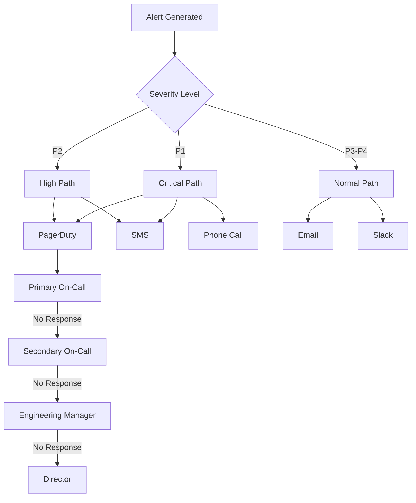

# Refunds Service Monitoring Infrastructure

## Table of Contents

- [Introduction](#introduction)
- [Monitoring Architecture](#monitoring-architecture)
- [CloudWatch Configuration](#cloudwatch-configuration)
- [DataDog Integration](#datadog-integration)
- [Metrics Collection](#metrics-collection)
- [Dashboards](#dashboards)
- [Alert Configuration](#alert-configuration)
- [Health Checks](#health-checks)
- [Log Management](#log-management)
- [Distributed Tracing](#distributed-tracing)
- [Incident Response](#incident-response)
- [SLA Monitoring](#sla-monitoring)
- [Best Practices](#best-practices)
- [Runbooks](#runbooks)

## Introduction

This document outlines the monitoring infrastructure for the Refunds Service, providing comprehensive visibility into service health, performance, and business metrics. The monitoring setup is designed to ensure 99.9% service availability through early detection of issues, efficient troubleshooting, and rapid incident resolution.

### Monitoring Goals

- **Proactive Detection**: Identify issues before they impact users
- **Performance Tracking**: Monitor system performance against SLAs
- **Business Insights**: Provide visibility into key business metrics
- **Rapid Troubleshooting**: Enable fast root cause analysis
- **Compliance**: Ensure auditability of all system events

## Monitoring Architecture

The Refunds Service employs a multi-layered monitoring approach combining AWS native services with third-party observability tools:


### Key Components

| Component | Tool | Purpose |
|-----------|------|---------|
| Infrastructure Monitoring | AWS CloudWatch | Core metrics for AWS resources |
| APM | DataDog APM | Application performance monitoring |
| Logging | CloudWatch Logs, OpenSearch | Centralized log aggregation |
| Metrics | CloudWatch Metrics, DataDog Metrics | Custom and standard metrics collection |
| Distributed Tracing | AWS X-Ray, DataDog APM | End-to-end transaction visibility |
| Alerting | CloudWatch Alarms, DataDog Monitors, PagerDuty | Alert notification and routing |
| Dashboards | CloudWatch Dashboards, DataDog Dashboards | Visualization and reporting |

## CloudWatch Configuration

### Resource Groups

All Refunds Service resources are organized into dedicated CloudWatch resource groups for focused monitoring:

- `RefundsService-Production`
- `RefundsService-Staging`
- `RefundsService-Test`
- `RefundsService-Development`

### Namespace Configuration

Custom metrics are published under the `/RefundsService` namespace with the following dimensions:

- `Environment` (prod, staging, test, dev)
- `ServiceComponent` (api, processor, gateway-integration, etc.)
- `Region` (us-east-1, eu-west-1, etc.)

### Dashboard Configuration

CloudWatch dashboards are organized hierarchically:

1. **Executive Dashboard**: High-level SLAs, business metrics
2. **Service Dashboard**: Component health, error rates, latency
3. **Operational Dashboard**: Detailed system metrics, resource utilization

### Log Groups

| Log Group | Retention Period | Subscription |
|-----------|------------------|-------------|
| `/refunds-service/api` | 30 days | Lambda logs processor, OpenSearch |
| `/refunds-service/processor` | 30 days | Lambda logs processor, OpenSearch |
| `/refunds-service/gateway-integration` | 30 days | Lambda logs processor, OpenSearch |
| `/refunds-service/parameter-service` | 30 days | Lambda logs processor, OpenSearch |
| `/refunds-service/approval-workflow` | 30 days | Lambda logs processor, OpenSearch |

### CloudWatch Metrics Configuration

```json
{
  "metrics": [
    {
      "namespace": "RefundsService",
      "name": "RefundRequestCreationLatency",
      "unit": "Milliseconds",
      "dimensions": ["Environment", "ServiceComponent", "Region"]
    },
    {
      "namespace": "RefundsService",
      "name": "RefundRequestCount",
      "unit": "Count",
      "dimensions": ["Environment", "ServiceComponent", "Region", "Status"]
    },
    {
      "namespace": "RefundsService",
      "name": "GatewayIntegrationLatency",
      "unit": "Milliseconds",
      "dimensions": ["Environment", "GatewayType", "Region"]
    },
    {
      "namespace": "RefundsService",
      "name": "ApprovalWorkflowDuration",
      "unit": "Seconds",
      "dimensions": ["Environment", "WorkflowType", "Region"]
    }
  ]
}
```

## DataDog Integration

DataDog provides comprehensive application performance monitoring and advanced analytics capabilities.

### Agent Installation

The DataDog Agent is deployed as a sidecar container in each ECS task with the following configurations:

```yaml
datadog-agent:
  image: datadog/agent:7.44.1
  environment:
    - DD_API_KEY: ${DD_API_KEY}
    - DD_SITE: datadoghq.com
    - DD_APM_ENABLED: true
    - DD_LOGS_ENABLED: true
    - DD_PROCESS_AGENT_ENABLED: true
    - DD_TAGS: "service:refunds-service,env:${ENVIRONMENT},version:${VERSION}"
  volumes:
    - /var/run/docker.sock:/var/run/docker.sock:ro
    - /proc/:/host/proc/:ro
    - /sys/fs/cgroup/:/host/sys/fs/cgroup:ro
```

### APM Configuration

Python services are instrumented with the DataDog tracing library:

```python
# Required at the entry point of each service
from ddtrace import patch_all
patch_all()

# Custom span tracking for business operations
from ddtrace import tracer

@tracer.wrap(service="refund-processor", resource="process_refund")
def process_refund(refund_request):
    # Processing logic
    pass
```

### DataDog Dashboard Configuration

DataDog dashboards are created through Terraform to ensure consistency and version control:

```hcl
resource "datadog_dashboard" "refunds_service" {
  title       = "Refunds Service - Overview"
  description = "Overview dashboard for the Refunds Service"
  layout_type = "ordered"

  widget {
    timeseries_definition {
      title = "Refund Requests per Minute"
      request {
        q = "sum:refunds_service.requests.count{*}.as_rate()"
        display_type = "line"
      }
    }
  }

  widget {
    timeseries_definition {
      title = "Average Response Time (P95)"
      request {
        q = "p95:refunds_service.request.duration{*}"
        display_type = "line"
      }
    }
  }

  # Additional widgets...
}
```

## Metrics Collection

### Infrastructure Metrics

| Metric Name | Description | Threshold | Alert Severity |
|------------|-------------|-----------|---------------|
| CPUUtilization | CPU usage percentage | > 80% for 5min | WARNING |
| MemoryUtilization | Memory usage percentage | > 80% for 5min | WARNING |
| DiskSpaceUtilization | Disk space usage percentage | > 85% for 15min | WARNING |
| NetworkIn/Out | Network traffic volume | > 80% of limit | INFO |

### Application Metrics

| Metric Name | Description | Threshold | Alert Severity |
|------------|-------------|-----------|---------------|
| RefundRequestRate | Number of refund requests per minute | > 200% baseline | WARNING |
| RefundProcessingLatency | Time to process a refund (p95) | > 2000ms | WARNING |
| ErrorRate | Percentage of requests resulting in errors | > 1% for 5min | CRITICAL |
| SLAComplianceRate | Percentage of requests meeting SLA | < 99.9% for 5min | CRITICAL |

### Business Metrics

| Metric Name | Description | Threshold | Alert Severity |
|------------|-------------|-----------|---------------|
| RefundVolume | Total monetary value of refunds | > 200% baseline | WARNING |
| RefundSuccessRate | Percentage of successful refunds | < 98% for 15min | WARNING |
| GatewayErrorRate | Percentage of gateway communication errors | > 2% for 5min | CRITICAL |
| ApprovalTime | Time for approval workflows to complete | > 12 hours | WARNING |

### Custom Metrics Collection

For business metrics and custom application metrics, the services publish metrics using a standardized middleware:

```python
class MetricsMiddleware:
    def __init__(self, app, service_name):
        self.app = app
        self.service_name = service_name
        
    def __call__(self, environ, start_response):
        start_time = time.time()
        
        def custom_start_response(status, headers, exc_info=None):
            status_code = int(status.split(' ')[0])
            duration = time.time() - start_time
            
            # Publish metrics
            publish_metric(
                "request.duration", 
                duration, 
                {"service": self.service_name, "status_code": status_code}
            )
            publish_metric(
                "request.count", 
                1, 
                {"service": self.service_name, "status_code": status_code}
            )
            
            return start_response(status, headers, exc_info)
        
        return self.app(environ, custom_start_response)
        
def publish_metric(name, value, tags=None):
    # Publication logic for both CloudWatch and DataDog
    # ...
```

## Dashboards

### Operational Dashboard

The operational dashboard provides real-time visibility into system performance, focused on service health and resource utilization:


Key components:
- Service health status
- Error rates by service
- API latency metrics
- Resource utilization (CPU, memory)
- Database performance
- SQS queue depths

### Business Dashboard

The business dashboard focuses on business outcomes and refund processing metrics:

Key components:
- Refund volume (count and amount)
- Success/failure rates
- Processing time averages
- Approval workflow metrics
- Gateway success rates
- Compliance metrics

### Custom Dashboard Creation

New dashboards can be created by submitting a PR with the appropriate Terraform configuration:

1. Create a new `.tf` file in the `infrastructure/monitoring/dashboards` directory
2. Define the dashboard using the standardized template
3. Submit a PR for review
4. Upon approval, the CI/CD pipeline will deploy the new dashboard

## Alert Configuration

### Alert Severity Levels

| Severity | Response Time | Notification Channels | Escalation |
|----------|---------------|----------------------|------------|
| P1 (Critical) | 15 minutes | PagerDuty, SMS, Phone Call | L1 → L2 → L3 |
| P2 (High) | 30 minutes | PagerDuty, Email | L1 → L2 |
| P3 (Medium) | 4 hours | Email, Slack | L1 only |
| P4 (Low) | Next business day | Email, Jira | None |

### CloudWatch Alarms

```json
{
  "alarms": [
    {
      "name": "RefundService-API-HighErrorRate",
      "description": "Error rate exceeds 1% for 5 minutes",
      "metric": "ErrorRate",
      "namespace": "RefundsService",
      "dimensions": {
        "ServiceComponent": "api",
        "Environment": "production"
      },
      "period": 300,
      "evaluationPeriods": 1,
      "threshold": 1,
      "comparisonOperator": "GreaterThanThreshold",
      "treatMissingData": "missing",
      "actions": ["arn:aws:sns:us-east-1:123456789012:RefundService-Critical-Alerts"]
    },
    {
      "name": "RefundService-GatewayIntegration-Latency",
      "description": "Gateway integration P95 latency exceeds 2 seconds",
      "metric": "GatewayIntegrationLatency",
      "namespace": "RefundsService",
      "dimensions": {
        "ServiceComponent": "gateway-integration",
        "Environment": "production"
      },
      "period": 300,
      "evaluationPeriods": 3,
      "threshold": 2000,
      "comparisonOperator": "GreaterThanThreshold",
      "treatMissingData": "missing",
      "actions": ["arn:aws:sns:us-east-1:123456789012:RefundService-Warning-Alerts"]
    }
  ]
}
```

### DataDog Monitors

DataDog monitors are defined in Terraform:

```hcl
resource "datadog_monitor" "refund_processing_time" {
  name               = "Refund Processing Time Too High"
  type               = "metric alert"
  message            = <<-EOT
    Refund processing time is too high (exceeding 2 seconds P95).
    
    This may indicate issues with payment gateways or internal processing.
    
    @pagerduty-RefundsService-Team @slack-refunds-alerts
  EOT
  query              = "p95:refunds_service.refund.processing_time{env:production} > 2"
  notify_no_data     = true
  no_data_timeframe  = 10
  notify_audit       = true
  timeout_h          = 0
  include_tags       = true
  
  thresholds = {
    critical = 2,
    warning  = 1.5
  }
  
  tags = ["service:refunds-service", "team:payments", "severity:2"]
}
```

### PagerDuty Integration

PagerDuty is configured with service-specific escalation policies:

```hcl
resource "pagerduty_service" "refunds_service" {
  name          = "Refunds Service"
  description   = "Critical alerts for the Refunds Service"
  escalation_policy_id = pagerduty_escalation_policy.refunds_team.id
  alert_creation   = "create_alerts_and_incidents"
  
  incident_urgency_rule {
    type    = "constant"
    urgency = "high"
  }
}

resource "pagerduty_escalation_policy" "refunds_team" {
  name        = "Refunds Team Escalation Policy"
  description = "Escalation policy for the Refunds Service team"
  
  rule {
    escalation_delay_in_minutes = 15
    target {
      type = "schedule_reference"
      id   = pagerduty_schedule.refunds_primary_oncall.id
    }
  }
  
  rule {
    escalation_delay_in_minutes = 15
    target {
      type = "schedule_reference"
      id   = pagerduty_schedule.refunds_secondary_oncall.id
    }
  }
  
  rule {
    escalation_delay_in_minutes = 30
    target {
      type = "user_reference"
      id   = pagerduty_user.refunds_manager.id
    }
  }
}
```

## Health Checks

### Service Health Check Endpoints

Each service component implements a `/health` endpoint that provides:

1. Overall service status
2. Dependency health
3. Resource utilization
4. Version information

Example response:

```json
{
  "status": "OK",
  "version": "1.2.3",
  "timestamp": "2023-05-15T10:30:45Z",
  "dependencies": {
    "database": {
      "status": "OK",
      "responseTime": 45
    },
    "redis": {
      "status": "OK",
      "responseTime": 12
    },
    "payment-gateway": {
      "status": "DEGRADED",
      "responseTime": 1250,
      "details": "Elevated latency detected"
    }
  },
  "metrics": {
    "requestRate": 42.5,
    "errorRate": 0.01,
    "cpuUsage": 0.65,
    "memoryUsage": 0.72
  }
}
```

### Health Check Configuration

Health checks are configured at multiple levels:

#### 1. Load Balancer Health Checks

```hcl
resource "aws_lb_target_group" "refund_api" {
  name        = "refund-api-tg"
  port        = 8080
  protocol    = "HTTP"
  vpc_id      = var.vpc_id
  target_type = "ip"
  
  health_check {
    enabled             = true
    interval            = 30
    path                = "/health"
    port                = "traffic-port"
    healthy_threshold   = 3
    unhealthy_threshold = 2
    timeout             = 5
    matcher             = "200"
  }
}
```

#### 2. Container Health Checks

```json
{
  "healthCheck": {
    "command": ["CMD-SHELL", "curl -f http://localhost:8080/health || exit 1"],
    "interval": 30,
    "timeout": 5,
    "retries": 3,
    "startPeriod": 60
  }
}
```

#### 3. Synthetic Monitoring

DataDog synthetic tests check key user journeys:

```hcl
resource "datadog_synthetics_test" "refund_api" {
  name      = "Refund API Health Check"
  type      = "api"
  subtype   = "http"
  status    = "live"
  locations = ["aws:us-east-1", "aws:eu-west-1"]
  
  request_definition {
    method = "GET"
    url    = "https://api.example.com/health"
    timeout = 10
  }
  
  assertion {
    type     = "statusCode"
    operator = "is"
    target   = "200"
  }
  
  assertion {
    type     = "responseTime"
    operator = "lessThan"
    target   = "1000"
  }
  
  assertion {
    type     = "jsonPath"
    operator = "is"
    target   = "OK"
    targetjsonpath = "$.status"
  }
  
  locations_allowed_values = ["aws:us-east-1", "aws:eu-west-1"]
  tick_every = 60
  
  options_list {
    tick_every = 60
    
    retry {
      count    = 2
      interval = 300
    }
    
    monitor_options {
      renotify_interval = 120
    }
  }
  
  tags = ["env:production", "service:refunds-api"]
}
```

## Log Management

### Log Format

All services use a standardized JSON log format:

```json
{
  "timestamp": "2023-05-15T10:30:45.123Z",
  "level": "INFO",
  "service": "refund-processor",
  "traceId": "abcdef123456789",
  "spanId": "0123456789abcdef",
  "requestId": "req-123-456-789",
  "userId": "user-123",
  "merchantId": "mer-456",
  "message": "Refund request processed successfully",
  "refundId": "ref-789",
  "transactionId": "txn-101112",
  "duration": 123.45,
  "metadata": {
    "amount": 99.95,
    "method": "ORIGINAL_PAYMENT",
    "gateway": "stripe"
  }
}
```

### Log Levels

| Level | Usage | Examples |
|-------|-------|----------|
| ERROR | System failures | Gateway unavailable, data corruption, critical failures |
| WARN | Potential issues | Performance degradation, retries, validation failures |
| INFO | Normal operations | Refund created, status changes, approvals |
| DEBUG | Troubleshooting | Request/response details, calculation steps, flow tracing |

### Log Processing Pipeline

Logs flow through a multi-stage pipeline:

1. Application writes structured logs to stdout/stderr
2. Container runtime captures logs
3. CloudWatch Logs Agent sends logs to CloudWatch Log Groups
4. Lambda subscription processes logs for:
   - PII masking
   - Enrichment
   - Pattern detection
5. Processed logs are sent to OpenSearch for indexing
6. Dashboards and alerting based on log patterns

### Log Retention and Archiving

| Log Type | Hot Storage | Warm Storage | Cold Storage |
|----------|-------------|-------------|-------------|
| Application Logs | 30 days | 90 days | 7 years |
| Security Audit Logs | 90 days | 1 year | 7 years |
| Performance Logs | 7 days | 30 days | 90 days |
| Debug Logs | 3 days | None | None |

Archival is managed through Lambda functions that:
1. Compress older logs
2. Encrypt for security
3. Transfer to S3 with appropriate lifecycle policies
4. Maintain indexing for searchability

## Distributed Tracing

### X-Ray Configuration

AWS X-Ray is configured with sampling rules that ensure:

1. 100% capture of error traces
2. 100% capture of slow transactions (>1 second)
3. 5% sampling of normal traffic

```json
{
  "version": 1,
  "rules": [
    {
      "description": "Error traces",
      "service_name": "*",
      "http_method": "*",
      "url_path": "*",
      "fixed_target": 1,
      "rate": 1.0,
      "attributes": {
        "http.status_code": "4xx"
      }
    },
    {
      "description": "Slow transactions",
      "service_name": "*",
      "http_method": "*",
      "url_path": "*",
      "fixed_target": 1,
      "rate": 1.0,
      "attributes": {
        "ResponseTime": ">1"
      }
    },
    {
      "description": "Default rule",
      "service_name": "*",
      "http_method": "*",
      "url_path": "*",
      "fixed_target": 5,
      "rate": 0.05
    }
  ],
  "default": {
    "fixed_target": 1,
    "rate": 0.01
  }
}
```

### DataDog APM Configuration

DataDog APM is configured to provide enhanced tracing with business context:

```python
# tracer initialization
from ddtrace import tracer, config

# Configure global tags
config.env = os.environ.get('ENVIRONMENT', 'production')
config.service = 'refunds-service'
config.version = '1.2.3'

# Configure specific integration
config.flask['service_name'] = 'refunds-api'
config.flask['analytics_enabled'] = True

# Add business context to spans
@tracer.wrap()
def process_refund(refund_request):
    span = tracer.current_span()
    if span:
        span.set_tag('refund.id', refund_request.id)
        span.set_tag('refund.amount', refund_request.amount)
        span.set_tag('refund.method', refund_request.method)
        span.set_tag('merchant.id', refund_request.merchant_id)
    
    # Processing logic
    result = perform_refund_processing(refund_request)
    
    if span:
        span.set_tag('refund.status', result.status)
        if not result.success:
            span.set_tag('error', True)
            span.set_tag('error.message', result.error_message)
    
    return result
```

### Trace Context Propagation

Trace context is propagated across service boundaries using HTTP headers:

```python
def make_service_call(url, payload, headers=None):
    headers = headers or {}
    
    # Get current trace context
    trace_id = get_current_trace_id()
    span_id = get_current_span_id()
    
    # Add trace context to headers
    headers.update({
        'X-Trace-Id': trace_id,
        'X-Span-Id': span_id,
        'X-B3-TraceId': trace_id,  # B3 format for compatibility
        'X-B3-SpanId': span_id     # B3 format for compatibility
    })
    
    # Make request with propagated context
    response = requests.post(url, json=payload, headers=headers)
    return response
```

## Incident Response

### Alert Routing

Alerts are routed based on:

1. Severity level
2. Component affected
3. Time of day
4. On-call schedule

The routing flow follows this pattern:



### Escalation Procedures

| Incident Level | Response Timeline | Communication Cadence | Stakeholder Updates |
|----------------|-------------------|----------------------|---------------------|
| P1 (Critical) | Acknowledge: 15min<br>Update: 30min<br>Resolve: ASAP | Status updates every 30min | Initial at 30min, then hourly |
| P2 (High) | Acknowledge: 30min<br>Update: 1hr<br>Resolve: Same day | Status updates every 1hr | Initial at 1hr, then at resolution |
| P3 (Medium) | Acknowledge: 4hr<br>Update: 8hr<br>Resolve: 1-2 days | Daily updates | At resolution |
| P4 (Low) | Acknowledge: 24hr<br>Resolve: When scheduled | Weekly updates | None required |

### Incident Management Workflow

1. **Alert Detection**
   - Automated alert triggered
   - Manual report from user
   
2. **Triage & Assessment**
   - Severity determination
   - Initial impact assessment
   - Team mobilization

3. **Investigation**
   - Root cause identification
   - Mitigation options analysis
   - Action plan development

4. **Resolution**
   - Implement fix
   - Verify resolution
   - Restore normal operations

5. **Post-Mortem**
   - Timeline documentation
   - Root cause analysis
   - Preventative measures
   - Action items tracking

### Post-Mortem Template

All P1 and P2 incidents require a post-mortem following this structure:

```markdown
# Incident Post-Mortem: [Incident Title]

## Overview
- **Incident ID**: INC-12345
- **Date**: YYYY-MM-DD
- **Duration**: X hours Y minutes
- **Severity**: P1/P2
- **Impact**: [Brief description of business impact]

## Timeline
- **HH:MM** - Initial alert triggered
- **HH:MM** - Investigation began
- **HH:MM** - Root cause identified
- **HH:MM** - Mitigation applied
- **HH:MM** - Service restored

## Root Cause
[Detailed technical explanation of what caused the incident]

## Impact
- **Users Affected**: [Number or percentage]
- **Transactions Affected**: [Number or percentage]
- **Financial Impact**: [If applicable]

## Resolution
[Description of how the incident was resolved]

## Lessons Learned
- [Key takeaway 1]
- [Key takeaway 2]

## Action Items
- [ ] [Action Item 1] - Assignee, Due Date
- [ ] [Action Item 2] - Assignee, Due Date
```

## SLA Monitoring

### Service Level Objectives (SLOs)

| Service | SLO | Measurement Method | Error Budget |
|---------|-----|-------------------|-------------|
| API Availability | 99.9% uptime | Synthetic monitoring | 43.8 minutes/month |
| Refund Creation Time | P95 < 500ms | APM metrics | 5% above threshold |
| Refund Processing Success | 99.5% success rate | Transaction analytics | 0.5% failure rate |
| Gateway Integration Availability | 99.9% uptime | Health checks + transactions | 43.8 minutes/month |
| End-to-End Refund Time | 99% < 24 hours | Business metrics | 1% over 24 hours |

### SLO Dashboards

The SLO dashboard provides real-time visibility into compliance with service level objectives:

Key components:
- Current SLO status (compliant/at risk/violated)
- Historical compliance trend
- Error budget consumption
- Time remaining in current window
- Incident impact on SLOs

### Error Budget Tracking

Error budgets are tracked using DataDog SLO monitors:

```hcl
resource "datadog_service_level_objective" "api_availability" {
  name        = "Refunds API Availability"
  type        = "monitor"
  description = "Refunds API availability SLO - 99.9% uptime"
  
  monitor_ids = [
    datadog_monitor.api_availability.id
  ]
  
  thresholds {
    timeframe = "30d"
    target    = 99.9
    warning   = 99.95
  }

  tags = ["service:refunds-api", "team:payments", "env:production"]
}
```

## Best Practices

### Metric Naming Conventions

All metrics should follow the naming convention:

```
[service].[entity].[measurement]
```

Examples:
- `refunds_service.api.request_latency`
- `refunds_service.gateway.success_rate`
- `refunds_service.approval.completion_time`

### Log Conventions

1. **Always use structured logging** - Log in JSON format with standardized fields
2. **Include correlation IDs** - Always log traceId and requestId
3. **Don't log PII** - Mask or exclude personally identifiable information
4. **Use appropriate log levels** - Reserve ERROR for actual errors
5. **Include context** - Add relevant business context to logs

### Alert Hygiene

1. **Reduce noise** - Regularly review and tune alert thresholds
2. **Prioritize effectively** - Use severity levels consistently
3. **Include actionable information** - All alerts should have clear next steps
4. **Consolidate related alerts** - Use composite alerts for related issues
5. **Test alerts** - Verify alert routing and content regularly

## Runbooks

### Gateway Integration Issue

**Symptoms:**
- Elevated error rates in gateway integration
- Increased latency for gateway operations
- Failed refunds due to gateway errors

**Diagnostic Steps:**
1. Check gateway status page for outages
2. Verify connectivity from application to gateway endpoints
3. Review recent logs for error patterns
4. Check for certificate expiration or API key issues
5. Verify request/response patterns for validity

**Resolution Steps:**
1. If gateway is down, activate gateway fallback mechanism
2. If connectivity issue, check VPC endpoints and security groups
3. If quota exceeded, contact gateway provider for increase
4. If authentication issue, rotate API keys
5. If request validation issue, fix and deploy application update

### Elevated API Latency

**Symptoms:**
- P95 latency exceeds 500ms for API endpoints
- Increased timeouts reported by clients
- Growing queue depth for asynchronous operations

**Diagnostic Steps:**
1. Check resource utilization (CPU, memory, connections)
2. Examine database query performance
3. Review recent code deployments
4. Check dependency response times
5. Analyze trace data for bottlenecks

**Resolution Steps:**
1. If resource constrained, scale out affected service
2. If database issue, optimize queries or indexes
3. If code regression, rollback recent deployment
4. If dependency slowdown, implement circuit breaking
5. If load-related, enable throttling to protect service

### Refund Processing Failures

**Symptoms:**
- Increased rate of failed refunds
- Transactions stuck in PROCESSING state
- Error notifications from payment gateways

**Diagnostic Steps:**
1. Identify common patterns in failed refunds
2. Check for specific error codes from gateways
3. Verify transaction data integrity
4. Check for account balance or limit issues
5. Review compliance rule changes

**Resolution Steps:**
1. If gateway-specific issue, contact provider
2. If data integrity issue, fix corrupted records
3. If balance issue, notify financial team
4. If compliance issue, update rules or documentation
5. For stuck transactions, execute recovery procedure

These runbooks should be regularly updated based on operational experience and post-mortem findings.